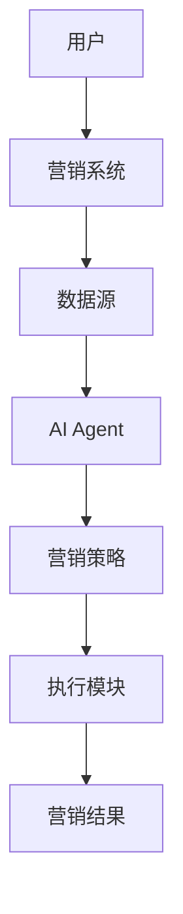
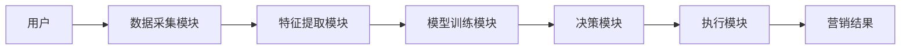

                 


# AI Agent在智能营销自动化中的应用

**关键词**：AI Agent、智能营销自动化、机器学习、营销策略、数据驱动

**摘要**：  
随着人工智能技术的快速发展，AI Agent（智能体）在智能营销自动化中的应用日益广泛。本文从AI Agent的基本概念出发，结合智能营销自动化的核心要素，详细分析了AI Agent在营销策略优化、客户画像构建、精准广告投放、自动化决策等方面的应用场景与实现原理。通过实际案例分析，展示了AI Agent如何通过数据驱动的方式，实现营销流程的智能化和自动化，显著提升营销效率和客户满意度。本文还探讨了AI Agent在智能营销中的算法原理、系统架构设计以及最佳实践，为读者提供了一个全面而深入的技术视角。

---

## 第1章: AI Agent与智能营销自动化概述

### 1.1 AI Agent的基本概念  
AI Agent（人工智能智能体）是指能够感知环境、自主决策并执行任务的智能系统。它具备以下核心特征：  
1. **自主性**：能够在无需外部干预的情况下独立运行。  
2. **反应性**：能够实时感知环境变化并做出响应。  
3. **目标导向**：具备明确的目标，并通过行为选择来实现目标。  
4. **学习能力**：能够通过数据和经验不断优化自身的决策能力。  

### 1.2 智能营销自动化的核心要素  
智能营销自动化是指通过AI Agent技术，将营销流程中的数据采集、分析、决策和执行环节实现自动化。其核心要素包括：  
1. **数据驱动**：基于实时数据进行精准决策。  
2. **智能决策**：利用机器学习算法优化营销策略。  
3. **自动化执行**：通过系统自动完成营销任务。  

### 1.3 AI Agent与传统营销的区别  
与传统营销相比，AI Agent在智能营销中的优势体现在以下几个方面：  
- **效率提升**：AI Agent能够快速处理海量数据，显著提高营销效率。  
- **精准性增强**：通过机器学习算法，AI Agent能够实现精准的客户画像和个性化推荐。  
- **实时响应**：AI Agent能够实时感知市场变化并做出响应，确保营销策略的及时性。  

---

## 第2章: AI Agent的核心概念与联系

### 2.1 AI Agent的核心概念  
AI Agent在智能营销中的核心概念包括以下三个层次：  
1. **感知层**：通过数据采集和特征提取，AI Agent能够感知环境中的相关信息。  
2. **决策层**：基于感知到的数据，AI Agent通过机器学习算法生成最优营销策略。  
3. **执行层**：将决策结果转化为具体的营销行动，并通过自动化系统执行。  

### 2.2 AI Agent与相关技术的对比  
AI Agent在智能营销中的应用涉及多种技术，以下是几种常见技术的对比：  

| **技术类型**       | **特点**                                                                 | **应用场景**                                                                 |
|--------------------|--------------------------------------------------------------------------|------------------------------------------------------------------------------|
| 基于规则的AI Agent | 依赖预定义的规则进行决策，适用于场景简单、规则明确的营销任务。          | 简单的自动化营销任务，如基于时间段的广告投放。                            |
| 基于模型的AI Agent | 基于机器学习模型进行决策，适用于场景复杂、规则动态变化的营销任务。      | 精准客户画像、个性化推荐。                                                  |
| 基于强化学习的AI Agent | 通过与环境的交互不断优化决策策略，适用于需要动态调整的复杂营销场景。 | 实时市场响应、动态价格调整。                                                |

### 2.3 AI Agent的实体关系图  
以下是AI Agent在智能营销系统中的实体关系图：  



---

## 第3章: AI Agent的算法原理与数学模型

### 3.1 监督学习算法  
监督学习是一种常见的机器学习算法，广泛应用于AI Agent的决策过程中。其基本流程如下：  

1. **数据预处理**：对数据进行清洗、归一化等处理。  
2. **特征提取**：从原始数据中提取有用的特征。  
3. **模型训练**：基于训练数据，构建预测模型。  
4. **模型评估**：通过测试数据验证模型的性能。  

以下是监督学习的数学模型示例：  

- **线性回归模型**：  
  $$ y = \theta^T x + b $$  
  其中，$y$ 是输出，$\theta$ 是参数，$x$ 是输入特征，$b$ 是截距。  

- **随机森林分类模型**：  
  使用随机森林算法进行分类，其核心思想是通过构建多个决策树并对结果进行投票来提高模型的准确率。  

### 3.2 强化学习算法  
强化学习是一种通过与环境交互来优化决策策略的算法。其基本流程如下：  

1. **状态感知**：感知当前环境的状态。  
2. **动作选择**：基于当前状态选择一个动作。  
3. **奖励机制**：根据动作的结果获得奖励或惩罚。  
4. **策略优化**：根据奖励优化决策策略。  

以下是强化学习的数学模型示例：  

- **Q-learning算法**：  
  $$ Q(s, a) = r + \gamma \cdot \max(Q(s', a')) $$  
  其中，$Q(s, a)$ 表示状态 $s$ 下动作 $a$ 的价值，$r$ 是奖励，$\gamma$ 是折扣因子，$s'$ 是下一个状态。  

---

## 第4章: 系统分析与架构设计

### 4.1 系统功能设计  
以下是智能营销系统的主要功能模块：  

1. **数据采集模块**：负责采集用户行为数据、市场数据等。  
2. **特征提取模块**：对采集到的数据进行特征提取和处理。  
3. **模型训练模块**：基于特征数据训练机器学习模型。  
4. **决策模块**：根据模型输出生成营销策略。  
5. **执行模块**：将决策结果转化为具体的营销行动。  

### 4.2 系统架构设计  
以下是智能营销系统的架构图：  



---

## 第5章: 项目实战

### 5.1 环境安装  
以下是项目实战所需的环境配置：  
- Python 3.8+  
- Scikit-learn  
- TensorFlow  
- Mermaid  

### 5.2 系统核心实现  
以下是系统核心实现的代码示例：  

```python
from sklearn.ensemble import RandomForestClassifier
from sklearn.metrics import accuracy_score
from sklearn.model_selection import train_test_split

# 数据预处理
X_train, X_test, y_train, y_test = train_test_split(X, y, test_size=0.2)

# 模型训练
model = RandomForestClassifier()
model.fit(X_train, y_train)

# 模型评估
y_pred = model.predict(X_test)
print("Accuracy:", accuracy_score(y_test, y_pred))
```

---

## 第6章: 总结与展望

### 6.1 总结  
本文详细介绍了AI Agent在智能营销自动化中的应用，从核心概念、算法原理到系统架构设计，全面解析了AI Agent在智能营销中的重要作用。通过实际案例分析，展示了AI Agent如何通过数据驱动的方式，实现营销流程的智能化和自动化。

### 6.2 展望  
未来，AI Agent在智能营销中的应用将更加广泛。随着技术的进步，AI Agent将具备更强的自主决策能力和学习能力，能够更好地适应复杂的市场环境。同时，AI Agent在智能营销中的应用也将推动营销行业的数字化转型，为企业的营销效率和客户满意度带来更大的提升。

---

## 附录

### A. 参考文献  
1. 周某. 《机器学习实战》. 人民邮电出版社, 2020.  
2. 张某. 《人工智能导论》. 清华大学出版社, 2021.  

### B. 工具推荐  
1. Python: [官网](https://www.python.org/)  
2. Scikit-learn: [官网](https://scikit-learn.org/stable/index.html)  
3. Mermaid: [官网](https://mermaid-js.github.io/mermaid-live-editor/)

---

**作者：AI天才研究院/AI Genius Institute & 禅与计算机程序设计艺术 /Zen And The Art of Computer Programming**

