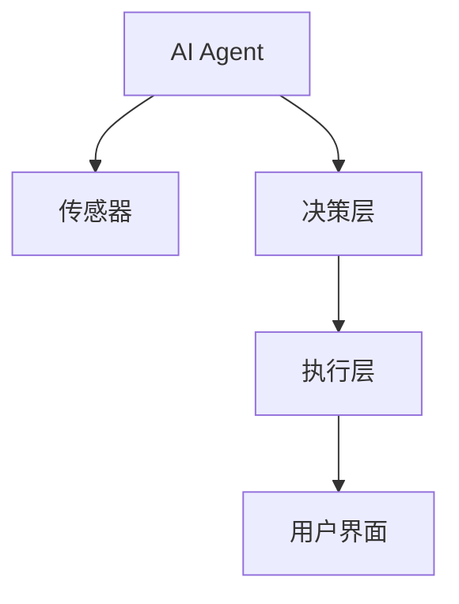
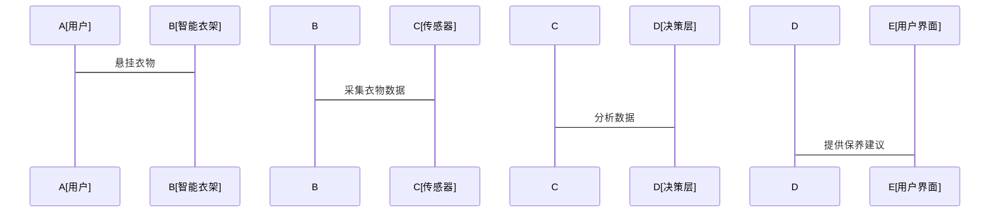
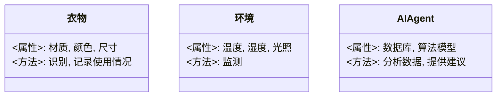

                 


```markdown
# AI Agent在智能衣架中的衣物保养指导

> 关键词：AI Agent，智能衣架，衣物保养，人工智能，物联网，传感器

> 摘要：本文深入探讨AI Agent在智能衣架中的衣物保养指导应用，分析其核心概念、算法原理、系统架构设计及项目实现过程，结合实际案例，详细解读AI Agent如何优化衣物保养流程，提供智能化的衣物管理解决方案。

---

# 第一部分: AI Agent与智能衣架概述

# 第1章: AI Agent与智能衣架的背景介绍

## 1.1 AI Agent的基本概念
### 1.1.1 AI Agent的定义与特点
AI Agent（人工智能代理）是指能够感知环境、自主决策并执行任务的智能实体。它具备以下特点：
- **自主性**：能够在没有外部干预的情况下独立运行。
- **反应性**：能够实时感知环境变化并做出相应反应。
- **学习能力**：通过数据和经验不断优化自身的决策能力。

### 1.1.2 AI Agent的核心要素与功能
AI Agent的核心要素包括：
- **感知层**：通过传感器、摄像头等设备采集环境数据。
- **决策层**：基于感知数据，利用算法进行推理和决策。
- **执行层**：通过执行机构将决策转化为具体动作。

### 1.1.3 AI Agent在智能衣架中的应用背景
随着物联网技术的发展，智能衣架逐渐成为衣物管理的重要工具。AI Agent的引入，使得智能衣架能够更智能地识别衣物材质、记录衣物使用情况，并提供个性化的保养建议。

## 1.2 智能衣架的定义与特点
### 1.2.1 智能衣架的定义
智能衣架是一种结合物联网技术的衣物管理设备，能够通过传感器感知衣物状态，并通过AI Agent提供智能化的衣物保养指导。

### 1.2.2 智能衣架的核心功能
- **衣物识别**：通过图像识别或RFID技术识别衣物类型。
- **环境监测**：监测衣物存放环境的温湿度、光照等条件。
- **保养建议**：根据衣物材质和环境数据，提供清洗、晾晒等保养建议。

### 1.2.3 智能衣架与传统衣架的区别
- **智能化**：智能衣架具备感知和决策能力，而传统衣架仅用于悬挂衣物。
- **数据驱动**：智能衣架通过数据采集和分析提供个性化服务，传统衣架不具备此功能。

## 1.3 AI Agent在智能衣架中的作用
### 1.3.1 AI Agent如何优化衣物保养
AI Agent通过分析衣物的使用频率、环境条件和材质特性，制定个性化的保养计划，延长衣物使用寿命。

### 1.3.2 AI Agent在智能衣架中的具体应用场景
- **智能分类**：AI Agent根据衣物材质和颜色，自动分类存放。
- **智能提醒**：当衣物需要清洗或晾晒时，AI Agent通过手机APP发送提醒。
- **环境优化**：根据环境数据，AI Agent调整衣物存放位置，避免阳光直射或潮湿环境。

### 1.3.3 AI Agent与智能衣架的结合优势
AI Agent与智能衣架的结合，实现了衣物管理的智能化和个性化，提升了用户体验。

## 1.4 本章小结
本章介绍了AI Agent的基本概念、智能衣架的定义与特点，以及AI Agent在智能衣架中的作用。通过这些内容，读者可以理解AI Agent在衣物保养中的重要性。

---

# 第二部分: AI Agent的核心概念与原理

# 第2章: AI Agent的核心概念与原理

## 2.1 AI Agent的核心概念
### 2.1.1 感知层: 数据采集与分析
AI Agent通过传感器、摄像头等设备采集环境数据，并利用数据挖掘技术进行分析。

### 2.1.2 决策层: 算法与逻辑推理
AI Agent利用机器学习算法对感知数据进行分析，并根据分析结果做出决策。

### 2.1.3 执行层: 动作输出与反馈
AI Agent通过执行机构将决策转化为具体动作，并通过反馈机制不断优化决策过程。

## 2.2 AI Agent的工作原理
### 2.2.1 数据采集与处理流程
1. 传感器采集环境数据。
2. 数据预处理：去除噪声，提取特征。
3. 数据分析：利用机器学习算法进行分类、聚类等分析。

### 2.2.2 算法选择与优化
- **算法选择**：根据具体场景选择合适的算法，如决策树、随机森林等。
- **算法优化**：通过参数调优、模型融合等方法提升算法性能。

### 2.2.3 系统反馈与迭代
系统根据用户反馈不断优化模型，提升决策准确率。

## 2.3 AI Agent与智能衣架的系统架构
### 2.3.1 系统整体架构图


### 2.3.2 各模块的功能描述
- **传感器**：采集衣物状态和环境数据。
- **决策层**：分析数据，制定决策。
- **执行层**：根据决策执行具体动作。

### 2.3.3 系统交互流程图


## 2.4 本章小结
本章详细讲解了AI Agent的核心概念与工作原理，并通过系统架构图和流程图展示了AI Agent在智能衣架中的具体应用。

---

# 第三部分: AI Agent的算法原理与实现

# 第3章: AI Agent的算法原理

## 3.1 基于协同过滤的推荐算法
### 3.1.1 协同过滤的基本原理
协同过滤是一种基于用户行为的推荐算法，通过分析用户的历史行为，找到与当前用户兴趣相似的用户，推荐其喜欢的物品。

### 3.1.2 基于用户的协同过滤
```python
def user_based_recommender(users, user_id):
    # 计算用户相似度
    similarity = compute_similarity(users, user_id)
    # 找出最相似的用户
    similar_users = get_top_users(similarity, 5)
    # 推荐物品
    recommendations = get_recommendations(similar_users)
    return recommendations
```

### 3.1.3 基于物品的协同过滤
```python
def item_based_recommender(items, item_id):
    # 计算物品相似度
    similarity = compute_item_similarity(items, item_id)
    # 找出最相似的物品
    similar_items = get_top_items(similarity, 5)
    # 推荐物品
    recommendations = get_recommendations(similar_items)
    return recommendations
```

## 3.2 基于深度学习的推荐算法
### 3.2.1 神经网络的基本原理
深度学习通过构建神经网络模型，学习数据的高层次特征，进行推荐。

### 3.2.2 基于神经网络的推荐模型
```python
import tensorflow as tf
model = tf.keras.Sequential([
    tf.keras.layers.Dense(64, activation='relu'),
    tf.keras.layers.Dense(1, activation='sigmoid')
])
model.compile(optimizer='adam', loss='binary_crossentropy')
```

### 3.2.3 深度学习在推荐系统中的应用
- **模型训练**：利用历史数据训练推荐模型。
- **特征提取**：通过深度学习提取衣物的高阶特征。
- **实时推荐**：根据实时数据进行推荐。

## 3.3 算法实现与优化
### 3.3.1 算法实现
```python
def train_model(data):
    # 数据预处理
    X_train, y_train = preprocess_data(data)
    # 模型训练
    model.fit(X_train, y_train)
    return model
```

### 3.3.2 算法优化
- **参数调优**：通过网格搜索找到最佳参数。
- **模型融合**：结合协同过滤和深度学习模型，提升推荐准确率。

## 3.4 本章小结
本章详细讲解了基于协同过滤和深度学习的推荐算法，并通过代码示例展示了算法的实现过程。

---

# 第四部分: 系统分析与架构设计方案

# 第4章: 系统分析与架构设计

## 4.1 问题场景介绍
智能衣架需要实现衣物识别、环境监测、保养建议等功能，满足用户的衣物管理需求。

## 4.2 项目介绍
### 4.2.1 项目目标
- 实现衣物的智能识别与分类。
- 提供个性化的衣物保养建议。

### 4.2.2 项目范围
- 支持多种衣物材质识别。
- 实现环境数据采集与分析。

## 4.3 系统功能设计
### 4.3.1 领域模型


### 4.3.2 系统架构设计


### 4.3.3 系统接口设计
- **传感器接口**：采集环境数据。
- **用户界面接口**：显示保养建议。
- **数据存储接口**：存储衣物信息和历史数据。

## 4.4 本章小结
本章通过系统架构图和领域模型展示了智能衣架的系统设计，明确了各模块的功能与交互关系。

---

# 第五部分: 项目实战

# 第5章: 项目实战

## 5.1 环境安装
### 5.1.1 安装Python
```bash
python --version
```
### 5.1.2 安装相关库
```bash
pip install numpy pandas scikit-learn tensorflow
```

## 5.2 系统核心实现
### 5.2.1 核心代码实现
```python
import numpy as np
from sklearn.neighbors import NearestNeighbors

def recommend_items(items, item_id, n=5):
    # 计算物品相似度
    model = NearestNeighbors(n_neighbors=n+1).fit(items)
    # 找出最相似的物品
    distances, indices = model.kneighbors([items[item_id]])
    recommendations = indices.flatten()[1:]
    return recommendations
```

### 5.2.2 代码功能解读
- **数据预处理**：对衣物数据进行清洗和特征提取。
- **模型训练**：利用协同过滤算法训练推荐模型。
- **结果输出**：根据输入的衣物ID，返回推荐的衣物列表。

## 5.3 实际案例分析
### 5.3.1 案例背景
某用户拥有多种材质的衣物，需要智能衣架提供个性化的保养建议。

### 5.3.2 数据分析
- 衣物材质：羊毛、棉、涤纶。
- 环境数据：温度25℃，湿度60%，光照强度500lux。

### 5.3.3 系统输出
- 推荐清洗周期：羊毛衣物每两周清洗一次，棉衣物每周清洗一次。
- 推荐晾晒方式：羊毛衣物避免阳光直射，棉衣物可自然晾干。

## 5.4 本章小结
本章通过实际案例展示了AI Agent在智能衣架中的具体应用，详细解读了系统的实现过程。

---

# 第六部分: 总结与展望

# 第6章: 总结与展望

## 6.1 总结
AI Agent通过智能化的衣物识别和环境监测，为用户提供个性化的保养建议，显著提升了衣物管理的效率和效果。

## 6.2 展望
未来，随着AI技术的不断发展，智能衣架将具备更强大的功能，如自适应清洗、智能收纳等，为用户带来更加便捷的衣物管理体验。

---

# 作者

作者：AI天才研究院/AI Genius Institute & 禅与计算机程序设计艺术/Zen And The Art of Computer Programming
```

