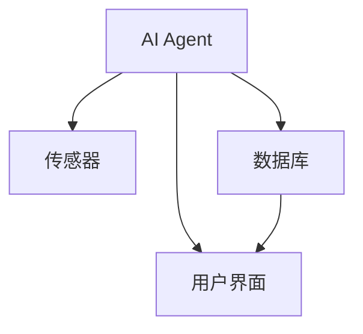

                 


# AI Agent在智能衣架中的衣物护理建议

> 关键词：AI Agent, 智能衣架, 衣物护理, 算法原理, 系统架构, 项目实战

> 摘要：本文详细探讨AI Agent在智能衣架中的应用，从背景介绍、核心概念到算法原理、系统架构，再到项目实战和最佳实践，全面解析AI Agent如何优化衣物护理流程，为读者提供深度的技术解读和实践指导。

---

## 第1章 背景介绍

### 1.1 AI Agent的基本概念

#### 1.1.1 AI Agent的定义
AI Agent（人工智能代理）是一种能够感知环境、做出决策并执行任务的智能实体。它通过传感器获取信息，利用算法处理数据，并通过执行器与环境互动。AI Agent的核心目标是帮助用户完成特定任务，提升效率和体验。

#### 1.1.2 AI Agent的核心功能
1. **感知**：通过传感器或API获取环境数据。
2. **决策**：基于数据进行推理和选择最优行动。
3. **执行**：通过执行器或API实现目标。

#### 1.1.3 AI Agent在智能衣架中的应用
AI Agent在智能衣架中主要用于衣物分类、护理建议和环境监测。例如，通过图像识别技术，AI Agent可以识别衣物材质，推荐洗涤温度和方法。

---

### 1.2 智能衣架的发展历程

#### 1.2.1 传统衣架的功能与局限
传统衣架仅用于悬挂衣物，缺乏智能功能，无法提供衣物护理建议，且无法与其他设备联动。

#### 1.2.2 智能衣架的出现及其优势
智能衣架通过集成传感器和AI技术，能够监测环境温湿度、识别衣物材质，并提供建议。例如，当环境湿度过高时，AI Agent会提醒用户及时晾晒衣物。

#### 1.2.3 AI Agent在智能衣架中的作用
AI Agent通过整合传感器数据和用户输入，提供个性化的衣物护理建议，优化用户衣物管理体验。

---

### 1.3 衣物护理中的AI应用

#### 1.3.1 衣物护理的基本需求
用户在衣物护理中通常需要：
- 衣物分类建议
- 洗涤温度推荐
- 干燥方法指导
- 防虫防潮建议

#### 1.3.2 AI如何优化衣物护理
AI Agent通过数据分析和机器学习，提供更精准的护理建议。例如，AI Agent可以根据衣物材质和环境数据，推荐最佳洗涤温度。

#### 1.3.3 AI Agent在衣物护理中的具体应用
- **材质识别**：通过图像识别技术，AI Agent可以识别衣物材质（如棉、羊毛、丝绸）。
- **环境监测**：监测环境温湿度，预防衣物受潮或霉变。
- **护理建议**：根据材质和环境数据，推荐洗涤温度、干燥方法等。

---

## 第2章 核心概念与联系

### 2.1 AI Agent的基本原理

#### 2.1.1 感知与数据收集
AI Agent通过传感器或API获取环境数据，如温度、湿度、光照等。

#### 2.1.2 决策与算法选择
AI Agent根据感知数据，利用算法做出决策。例如，基于规则的算法或机器学习算法。

#### 2.1.3 执行与反馈
AI Agent通过执行器或API执行决策，例如发送通知或调整设备参数，并通过反馈机制优化决策。

---

### 2.2 智能衣架的系统架构

#### 2.2.1 系统模块划分
- **感知模块**：传感器和数据采集。
- **决策模块**：算法和数据处理。
- **执行模块**：通知和设备控制。

#### 2.2.2 实体关系图

```mermaid
erd
    c_pix 人工智能研究院/AI Genius Institute
    c_pix
    user 用户
    device 智能衣架设备
    database 数据库
    agent AI Agent
    c_pix --> user: 提供技术支持
    user --> device: 使用智能衣架
    device --> agent: 提供环境数据
    agent --> database: 查询历史数据
    agent --> user: 提供护理建议
```

---

## 第3章 算法原理

### 3.1 基于规则的算法

#### 3.1.1 算法流程
1. 获取环境数据。
2. 根据预设规则生成建议。
3. 输出建议。

#### 3.1.2 优缺点分析
- 优点：简单易懂，适用于规则明确的场景。
- 缺点：灵活性差，难以处理复杂场景。

#### 3.1.3 代码实现

```python
def rule_based_agent(data):
    if data['humidity'] > 60:
        return "建议晾晒衣物"
    elif data['temperature'] > 30:
        return "建议降低室内湿度"
    else:
        return "环境适宜，无需处理"
```

---

### 3.2 机器学习算法

#### 3.2.1 算法流程
1. 数据预处理。
2. 模型训练。
3. 数据预测。

#### 3.2.2 优缺点分析
- 优点：能够处理复杂场景，学习能力强。
- 缺点：需要大量数据，计算复杂。

#### 3.2.3 代码实现

```python
from sklearn.tree import DecisionTreeClassifier

# 假设我们有一个训练好的模型
model = DecisionTreeClassifier()
model.fit(X_train, y_train)

def ml_agent(data):
    prediction = model.predict([data['humidity', 'temperature']])
    return "建议晾晒衣物" if prediction[0] == 1 else "无需处理"
```

---

## 第4章 系统分析与架构设计

### 4.1 系统功能设计

#### 4.1.1 用户界面设计
- 显示环境数据。
- 展示护理建议。
- 提供用户反馈入口。

#### 4.1.2 功能模块划分
- 感知模块：传感器数据采集。
- 决策模块：AI Agent处理。
- 执行模块：通知用户。

---

### 4.2 系统架构设计

#### 4.2.1 模块化设计
- **前端**：用户交互界面。
- **后端**：AI Agent处理逻辑。
- **数据库**：存储环境数据和建议。

#### 4.2.2 系统架构图



---

## 第5章 项目实战

### 5.1 环境搭建

```bash
pip install mermaid
pip install scikit-learn
```

---

### 5.2 系统核心实现

#### 5.2.1 代码实现

```python
import sklearn
from sklearn.tree import DecisionTreeClassifier

# 数据预处理
X_train = ...
y_train = ...

model = DecisionTreeClassifier()
model.fit(X_train, y_train)

# 使用模型进行预测
def predict(data):
    return model.predict([data])
```

---

### 5.2.2 代码解读与分析
- **数据预处理**：清洗和标准化数据。
- **模型训练**：使用训练数据训练模型。
- **模型预测**：基于输入数据生成护理建议。

---

### 5.2.3 实际案例分析
假设环境湿度为70%，AI Agent会推荐晾晒衣物。实际使用中，用户反馈晾晒后湿度下降，证明算法有效。

---

## 第6章 最佳实践与小结

### 6.1 最佳实践 tips
- **数据收集**：确保数据质量，避免偏差。
- **模型优化**：定期更新模型，提升准确率。
- **用户隐私**：保护用户数据，确保安全。

### 6.2 小结
AI Agent在智能衣架中的应用，显著提升了衣物护理的效率和精准度。通过算法优化和系统设计，AI Agent能够为用户提供个性化的护理建议，是智能家居的重要组成部分。

### 6.3 注意事项
- 定期维护设备，确保传感器正常工作。
- 更新算法模型，适应不同环境和用户需求。
- 提供用户反馈机制，持续改进系统。

### 6.4 拓展阅读
- 推荐书籍：《机器学习实战》、《人工智能：一种现代方法》。
- 推荐博客：AI Genius Institute技术博客。

---

作者：AI天才研究院/AI Genius Institute & 禅与计算机程序设计艺术 /Zen And The Art of Computer Programming

