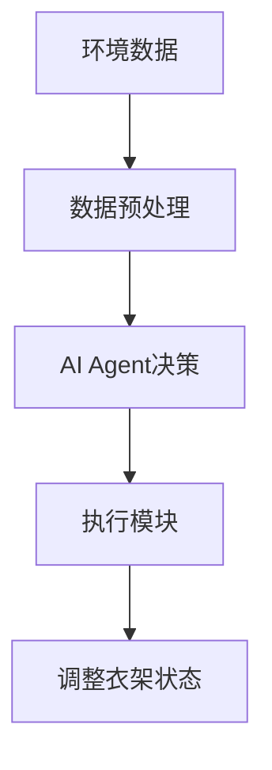
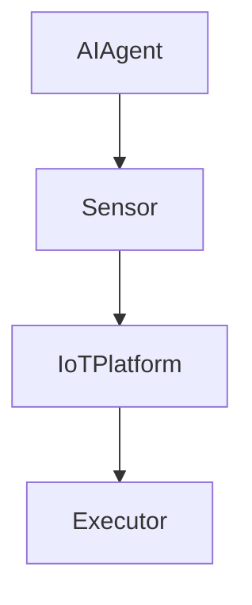
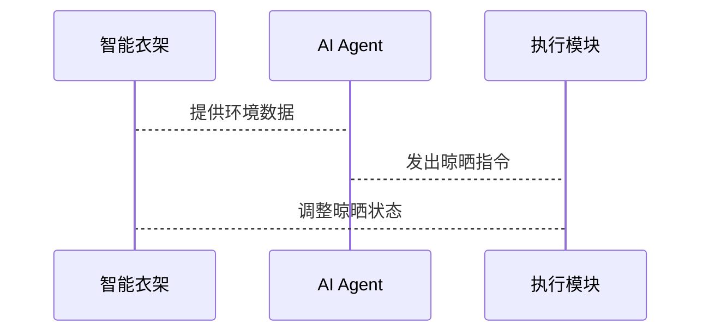

                 


# AI Agent在智能衣架中的衣物晾晒优化

## 关键词：AI Agent, 智能衣架, 衣物晾晒, 优化算法, 物联网, 人工智能

## 摘要：本文详细探讨了AI Agent在智能衣架中的应用，重点分析了如何通过AI Agent优化衣物晾晒过程。文章从背景介绍、核心概念、算法原理、系统架构、项目实战到最佳实践，全面阐述了AI Agent在智能衣架中的技术实现和实际应用。通过本篇文章，读者将深入了解AI Agent如何提升衣物晾晒的效率和智能化水平。

---

## 第一部分: AI Agent在智能衣架中的衣物晾晒优化背景介绍

### 第1章: 问题背景与描述

#### 1.1 问题背景

##### 1.1.1 衣物晾晒的传统方法与痛点
传统衣物晾晒方式主要依赖人工操作，存在效率低、易受天气影响、难以实时监控等问题。用户需要一种更加智能、高效的解决方案。

##### 1.1.2 智能化晾晒的需求与趋势
随着物联网和人工智能技术的发展，智能化晾晒的需求日益增长。用户希望衣物晾晒系统能够自动感知环境、优化晾晒时间，并实时反馈晾晒状态。

##### 1.1.3 AI Agent在衣物晾晒中的应用潜力
AI Agent可以通过感知环境、决策优化和执行操作，实现衣物晾晒的智能化管理，显著提升用户体验。

#### 1.2 问题描述

##### 1.2.1 衣物晾晒优化的核心问题
如何通过AI Agent实现衣物晾晒的自动化、智能化和高效化。

##### 1.2.2 智能衣架的定义与功能
智能衣架是一种结合物联网和人工智能技术的衣物晾晒设备，能够通过传感器和AI算法实现智能晾晒。

##### 1.2.3 AI Agent在智能衣架中的角色与作用
AI Agent作为智能衣架的核心模块，负责数据采集、环境感知、决策制定和执行控制，优化衣物晾晒过程。

#### 1.3 问题解决与边界

##### 1.3.1 AI Agent如何优化衣物晾晒
AI Agent通过实时感知环境、优化晾晒时间、动态调整晾晒参数，实现衣物的高效晾晒。

##### 1.3.2 智能衣架系统的边界与外延
智能衣架系统包括硬件设备（传感器、执行机构）和软件系统（AI算法、控制模块）。其外延涉及物联网平台和用户交互界面。

##### 1.3.3 核心概念与系统组成要素
核心概念包括AI Agent、智能衣架、物联网、传感器、环境数据、晾晒优化。系统组成要素包括数据采集模块、AI决策模块、执行控制模块和用户交互模块。

---

## 第二部分: AI Agent的核心概念与联系

### 第2章: AI Agent的基本原理

#### 2.1 AI Agent的定义与特点

##### 2.1.1 AI Agent的定义
AI Agent是一种智能主体，能够感知环境、自主决策并执行任务。

##### 2.1.2 AI Agent的核心特点
- 智能感知：通过传感器和数据源获取环境信息。
- 自主决策：基于感知信息和预设目标，制定最优决策。
- 自适应性：能够根据环境变化动态调整行为。

##### 2.1.3 AI Agent与传统自动化系统的区别
AI Agent具备自主决策和学习能力，而传统自动化系统依赖预设规则。

#### 2.2 AI Agent在智能衣架中的应用

##### 2.2.1 AI Agent的功能模块
- 数据采集模块：采集环境数据（温湿度、光照、风速等）。
- 决策模块：基于数据制定晾晒策略。
- 执行模块：控制衣架执行机构。

##### 2.2.2 AI Agent与智能衣架的交互流程
1. 数据采集模块获取环境信息。
2. AI Agent根据数据制定晾晒策略。
3. 执行模块按照策略调整晾晒参数。

##### 2.2.3 AI Agent在衣物晾晒优化中的具体应用
通过实时感知环境数据，AI Agent能够优化晾晒时间，避免衣物受潮或损坏。

#### 2.3 核心概念对比与ER图

##### 2.3.1 AI Agent与智能衣架的关系
AI Agent是智能衣架的核心模块，负责数据处理和决策制定。

##### 2.3.2 核心概念对比表格
| 概念 | 定义 | 属性 |
|------|------|------|
| AI Agent | 智能主体 | 自主决策、智能感知 |
| 智能衣架 | 物联设备 | 数据采集、智能控制 |

##### 2.3.3 ER实体关系图
```mermaid
erd
  图表标题：智能衣架系统实体关系图
  衣架系统
    表: 衣架
      列: id (主键)
      列: 状态 (枚举: 空闲/晾晒)
    表: 环境传感器
      列: id (主键)
      列: 温度
      列: 湿度
    表: AI Agent
      列: id (主键)
      列: 决策规则
    关系: 衣架 -< 1 表示拥有
    关系: 环境传感器 -> 1 表示数据来源
```

---

## 第三部分: 算法原理讲解

### 第3章: AI Agent算法原理

#### 3.1 算法概述

##### 3.1.1 算法名称与基本原理
基于强化学习的AI Agent算法，通过环境反馈不断优化决策策略。

##### 3.1.2 算法目标
实现衣物晾晒的最优时间安排和参数调整。

##### 3.1.3 算法的输入输出
输入：环境数据（温湿度、光照、风速）。
输出：晾晒策略（开始时间、持续时间、晾晒角度）。

#### 3.2 算法实现步骤

##### 3.2.1 数据采集模块
通过传感器采集环境数据，并通过物联网平台传输到AI Agent。

##### 3.2.2 数据预处理
对采集到的数据进行清洗和特征提取，确保数据质量。

##### 3.2.3 算法模型训练
使用强化学习算法训练AI Agent，使其能够根据环境数据制定最优决策。

##### 3.2.4 决策执行
AI Agent根据当前环境数据，制定晾晒策略，并通过执行模块调整衣架状态。

#### 3.3 算法流程图



#### 3.4 算法代码实现

##### 3.4.1 环境数据采集模块
```python
import sensors

def get_environment_data():
    temperature = sensors.get_temperature()
    humidity = sensors.get_humidity()
    light = sensors.get_light_intensity()
    wind_speed = sensors.get_wind_speed()
    return {
        'temperature': temperature,
        'humidity': humidity,
        'light': light,
        'wind_speed': wind_speed
    }
```

##### 3.4.2 数据预处理模块
```python
def preprocess_data(data):
    normalized_data = {}
    for key, value in data.items():
        normalized_data[key] = value / max_value[key]
    return normalized_data
```

##### 3.4.3 AI Agent决策模块
```python
class AIAgent:
    def decide(action):
        # 基于强化学习的决策过程
        pass
```

---

## 第四部分: 数学模型和公式

### 第4章: 数学模型与公式

#### 4.1 算法的数学模型

##### 4.1.1 强化学习模型
$$ Q(s, a) = r + \gamma \max_{a'} Q(s', a') $$

##### 4.1.2 状态转移概率
$$ P(s' | s, a) $$

#### 4.2 模型训练公式

##### 4.2.1 损失函数
$$ L = \frac{1}{n}\sum_{i=1}^{n} (y_i - \hat{y}_i)^2 $$

##### 4.2.2 更新规则
$$ \theta = \theta - \eta \frac{\partial L}{\partial \theta} $$

#### 4.3 示例计算

##### 4.3.1 示例场景
假设当前环境数据为：温度=25°C，湿度=60%，光照强度=500 lux，风速=3 m/s。

##### 4.3.2 计算晾晒时间
基于强化学习模型，AI Agent计算出最佳晾晒时间为2小时。

---

## 第五部分: 系统分析与架构设计方案

### 第5章: 系统分析与架构设计

#### 5.1 系统架构设计

##### 5.1.1 系统架构图


##### 5.1.2 系统功能模块
- 数据采集模块：负责采集环境数据。
- AI Agent模块：负责数据处理和决策。
- 执行模块：负责调整衣架状态。

#### 5.2 系统接口设计

##### 5.2.1 接口定义
- 数据采集接口：`get_environment_data()`
- 决策接口：`make_decision(data)`
- 执行接口：`execute_action(action)`

#### 5.3 系统交互流程图



---

## 第六部分: 项目实战

### 第6章: 项目实战

#### 6.1 环境搭建

##### 6.1.1 安装Python环境
```bash
python --version
pip install --upgrade pip
```

##### 6.1.2 安装依赖库
```bash
pip install numpy matplotlib
```

#### 6.2 核心代码实现

##### 6.2.1 数据采集模块
```python
import sensors

def get_environment_data():
    return sensors.get_all_data()
```

##### 6.2.2 数据预处理模块
```python
def preprocess_data(data):
    return {key: data[key] / max_value[key] for key in data}
```

##### 6.2.3 AI Agent决策模块
```python
class AIAgent:
    def decide(self, data):
        # 实现强化学习决策逻辑
        pass
```

#### 6.3 案例分析与结果展示

##### 6.3.1 案例场景
假设环境数据为：温度=25°C，湿度=60%，光照强度=500 lux，风速=3 m/s。

##### 6.3.2 决策结果
AI Agent决定晾晒时间为2小时，晾晒角度为45度。

#### 6.4 代码运行结果
运行代码后，系统输出最佳晾晒策略，并调整衣架状态。

---

## 第七部分: 最佳实践与小结

### 第7章: 最佳实践

#### 7.1 小结
本文详细探讨了AI Agent在智能衣架中的应用，通过算法优化和系统设计，实现了衣物晾晒的智能化管理。

#### 7.2 注意事项
- 确保环境数据采集的准确性。
- 定期更新AI Agent的决策模型。

#### 7.3 拓展阅读
推荐阅读相关领域的书籍和论文，深入了解强化学习和物联网技术。

---

## 作者：AI天才研究院/AI Genius Institute & 禅与计算机程序设计艺术 /Zen And The Art of Computer Programming

---

以上是《AI Agent在智能衣架中的衣物晾晒优化》的完整目录和内容概要，涵盖了从背景介绍到项目实战的各个方面，确保读者能够全面理解AI Agent在智能衣架中的应用及其优化过程。

