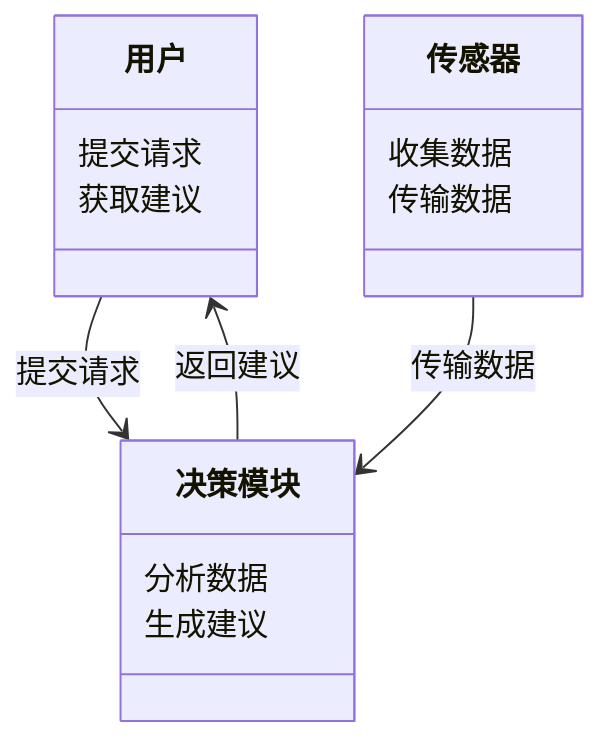
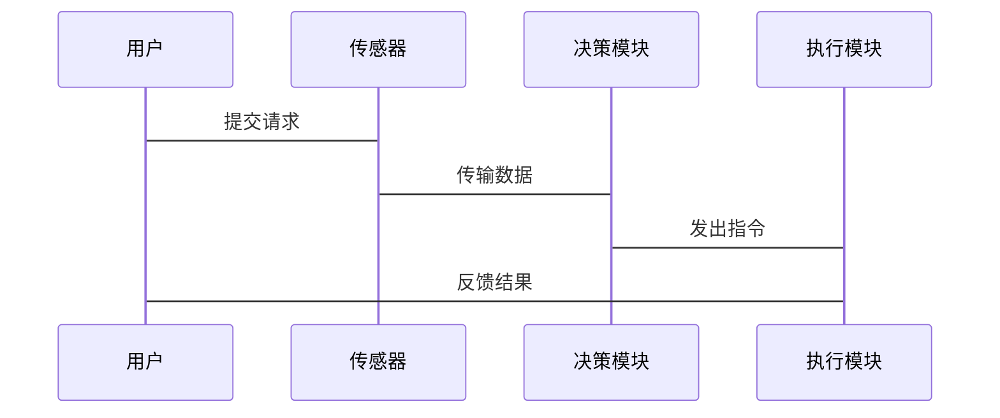

                 


# AI Agent在智能衣架中的衣物清洁建议

## 关键词：
AI Agent, 智能衣架, 衣物清洁, 智能家居, 状态感知, 决策推理, 行为执行

## 摘要：
本文详细探讨AI Agent在智能衣架中的应用，分析其在衣物清洁中的核心作用。通过背景介绍、核心概念、算法原理、系统架构、项目实战和最佳实践，展示AI Agent如何优化衣物清洁流程，提升用户体验。

---

# 第1章: 背景介绍

## 1.1 问题背景

### 1.1.1 智能家居的发展趋势
智能家居的普及推动了AI技术的应用，衣物清洁作为重要环节，亟需智能化解决方案。

### 1.1.2 衣物清洁的智能化需求
传统衣物清洁效率低，AI Agent通过自动化提升清洁效果和用户体验。

### 1.1.3 AI Agent在智能家居中的应用现状
AI Agent已广泛应用于智能家居，衣物清洁领域仍需进一步优化。

## 1.2 问题描述

### 1.2.1 衣物清洁的痛点分析
现有清洁方法耗时且效率低，用户需求未被充分满足。

### 1.2.2 AI Agent在衣物清洁中的角色定位
作为智能衣架的核心，AI Agent通过感知、决策和执行优化清洁流程。

### 1.2.3 智能衣架的定义与功能
智能衣架结合AI技术，具备环境感知、智能决策和自主执行功能。

## 1.3 问题解决

### 1.3.1 AI Agent如何优化衣物清洁流程
通过智能感知和决策，AI Agent显著提升清洁效率和用户体验。

### 1.3.2 智能衣架与AI Agent的协同工作模式
AI Agent与智能衣架协同，实现精准清洁建议和执行。

### 1.3.3 用户体验的提升策略
简化操作步骤，提供个性化清洁建议，增强用户满意度。

## 1.4 边界与外延

### 1.4.1 AI Agent在智能衣架中的应用边界
明确AI Agent的应用场景和功能范围，避免越界。

### 1.4.2 智能衣架与其他智能家居设备的协同
与其他设备如洗衣机、空调协同工作，提升整体智能家居体验。

### 1.4.3 AI Agent在衣物清洁中的未来发展
持续优化AI算法，扩展应用场景，推动智能化衣物清洁。

## 1.5 概念结构与核心要素

### 1.5.1 AI Agent的核心概念
AI Agent具备感知、决策、执行能力，是智能衣架的关键。

### 1.5.2 智能衣架的功能模块
智能衣架包括传感器、清洁建议模块和用户交互模块。

### 1.5.3 用户需求与系统功能的对应关系
分析用户需求，设计对应系统功能，确保精准满足。

---

# 第2章: 核心概念与联系

## 2.1 AI Agent的核心原理

### 2.1.1 感知模块
AI Agent通过传感器收集环境数据，识别衣物状态。

### 2.1.2 决策模块
基于感知数据，AI Agent进行分析，制定清洁策略。

### 2.1.3 执行模块
根据决策结果，AI Agent执行清洁操作。

## 2.2 智能衣架的功能模块

### 2.2.1 智能传感器
感知衣物状态，如脏污程度和材质。

### 2.2.2 清洁建议模块
根据传感器数据，生成个性化清洁建议。

### 2.2.3 用户
用户通过交互界面获取建议，进行操作。

## 2.3 核心概念与联系

### 2.3.1 概念属性特征对比表格
| 概念 | 属性 |
|------|------|
| AI Agent | 感知、决策、执行 |
| 智能衣架 | 传感器、建议模块、用户交互 |

### 2.3.2 ER实体关系图
```mermaid
erDiagram
    user [用户] 
    sensor [传感器] 
    decision [决策模块] 
    action [执行模块]
    user --> sensor : 提供数据
    sensor --> decision : 传递数据
    decision --> action : 发出指令
    action --> user : 反馈结果
```

---

# 第3章: 算法原理

## 3.1 状态感知

### 3.1.1 数据收集
AI Agent通过传感器收集衣物状态数据。

### 3.1.2 数据预处理
对传感器数据进行清洗和特征提取。

### 3.1.3 状态识别
使用分类算法识别衣物状态，公式：
$$ P(脏) = \frac{\text{脏数据数}}{\text{总数据数}} $$

## 3.2 决策推理

### 3.2.1 清洁策略生成
基于衣物状态，AI Agent生成清洁策略，如使用洗涤剂类型。

### 3.2.2 策略优化
通过机器学习优化策略，公式：
$$ Q(s,a) = r + \gamma \max Q(s',a') $$

## 3.3 行为执行

### 3.3.1 指令生成
AI Agent生成清洁指令，如启动洗衣机。

### 3.3.2 执行监控
实时监控执行过程，调整策略。

### 3.3.3 反馈学习
根据反馈调整算法参数，优化性能。

---

# 第4章: 系统架构设计

## 4.1 问题场景介绍

### 4.1.1 场景描述
智能衣架监测衣物状态，提供清洁建议。

## 4.2 系统功能设计

### 4.2.1 领域模型


## 4.3 系统架构设计

### 4.3.1 架构图


## 4.4 接口设计

### 4.4.1 接口描述
API接口定义数据传输格式和交互流程。

## 4.5 交互设计

### 4.5.1 序列图


---

# 第5章: 项目实战

## 5.1 环境安装

### 5.1.1 系统环境
Python 3.8+, 搭建AI框架如TensorFlow。

## 5.2 核心代码实现

### 5.2.1 感知模块
```python
class Sensor:
    def __init__(self):
        self.data = []
    
    def collect_data(self):
        # 模拟传感器数据收集
        self.data.append(random.choice(['干净', '轻微脏', '脏']))
```

### 5.2.2 决策模块
```python
class DecisionModule:
    def __init__(self):
        self.sensor = Sensor()
    
    def make_decision(self):
        data = self.sensor.collect_data()
        if data[-1] == '脏':
            return '建议洗涤'
        else:
            return '无需处理'
```

## 5.3 代码解读与分析

### 5.3.1 代码实现
展示感知和决策模块的代码实现，分析其功能和交互。

## 5.4 案例分析

### 5.4.1 应用案例
AI Agent根据传感器数据，生成清洁建议，用户执行清洗。

## 5.5 项目小结

### 5.5.1 总结
项目成功实现了AI Agent在智能衣架中的应用，提升了清洁效率。

---

# 第6章: 最佳实践

## 6.1 小结

### 6.1.1 总结内容
AI Agent优化了衣物清洁流程，提升了用户体验。

## 6.2 注意事项

### 6.2.1 设备协同
确保各设备协同工作，避免冲突。

### 6.2.2 数据隐私
保护用户数据隐私，防止泄露。

## 6.3 拓展阅读

### 6.3.1 推荐资料
推荐相关书籍和论文，供深入学习。

---

# 作者：AI天才研究院 & 禅与计算机程序设计艺术

---

本文详细探讨了AI Agent在智能衣架中的应用，通过系统分析和项目实战，展示了AI技术在衣物清洁中的潜力。

