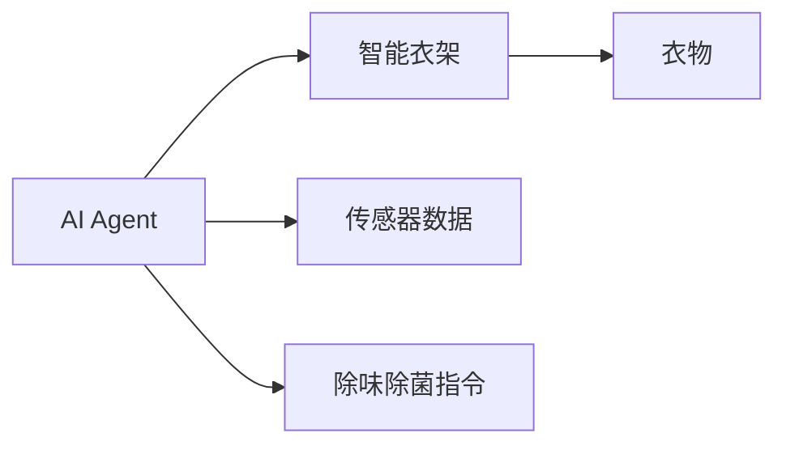
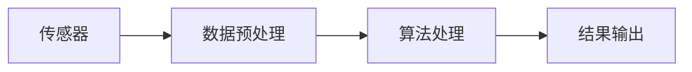
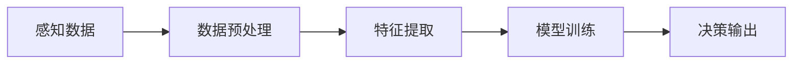
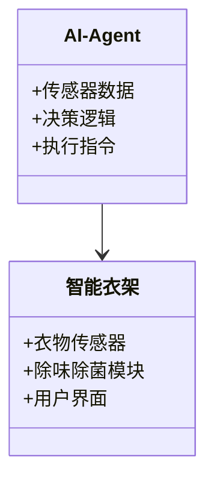
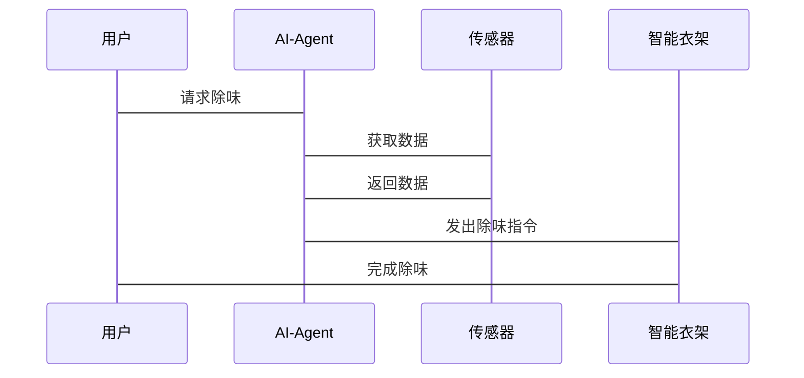

                 


```markdown
# AI Agent在智能衣架中的衣物除味除菌

> 关键词：AI Agent, 智能衣架, 衣物除味, 除菌技术, 智能家居, 物联网

> 摘要：随着智能家居技术的快速发展，AI Agent在智能衣架中的应用越来越广泛。本文详细探讨了AI Agent如何通过感知、决策和执行模块实现衣物的智能除味和除菌功能。通过分析传感器数据，结合先进的算法和系统架构设计，本文提出了一个完整的解决方案，并通过实际案例展示了其在智能衣架中的应用。

---

# 第一部分: 问题背景与核心概念

## 第1章: 问题背景与核心概念

### 1.1 问题背景

#### 1.1.1 衣物除味除菌的现实需求
随着生活水平的提高，人们对衣物的护理要求也越来越高。衣物在存放过程中容易产生异味和细菌，传统的除味除菌方法效率低下且不够智能化。如何利用AI技术实现智能衣架的衣物除味除菌功能，成为当前智能家居领域的重要研究方向。

#### 1.1.2 智能衣架的发展趋势
智能衣架作为智能家居的一部分，正在逐步普及。通过物联网技术，智能衣架能够与家庭其他设备联动，实现衣物的智能管理。AI Agent的引入，使得智能衣架的功能更加智能化和个性化。

#### 1.1.3 AI Agent在衣物护理中的应用潜力
AI Agent（智能代理）是一种能够感知环境、自主决策并执行任务的智能系统。通过AI Agent，智能衣架可以实现衣物的自动检测、除味和除菌，提升用户体验。

### 1.2 核心概念与问题描述

#### 1.2.1 AI Agent的定义与特点
AI Agent是一种能够自主感知环境、理解用户需求并执行任务的智能系统。其特点包括：
- **自主性**：能够自主决策和执行任务。
- **反应性**：能够实时感知环境变化并做出反应。
- **学习能力**：能够通过数据学习和优化自身算法。

#### 1.2.2 智能衣架的功能与技术要求
智能衣架需要具备以下功能：
- **衣物检测**：通过传感器检测衣物的状态（如湿度、温度、气味等）。
- **除味除菌**：根据检测结果，启动相应的除味和除菌功能。
- **智能控制**：通过AI Agent实现智能化的控制和管理。

#### 1.2.3 衣物除味除菌的技术挑战与解决方案
衣物除味除菌的技术挑战包括：
- **传感器精度**：如何准确检测衣物的气味和细菌含量。
- **算法优化**：如何通过算法实现高效的除味和除菌。
- **用户体验**：如何设计友好的用户界面和操作流程。

解决方案包括：
- **多传感器融合**：通过多种传感器（如气体传感器、温湿度传感器）实现更精准的检测。
- **机器学习算法**：利用机器学习算法优化除味和除菌效果。
- **智能控制算法**：通过AI Agent实现智能化的控制和管理。

### 1.3 核心概念的联系与对比

#### 1.3.1 AI Agent与智能衣架的实体关系图


#### 1.3.2 不同除味除菌技术的对比分析
```markdown
| 技术类型       | 优点                     | 缺点                       | 适用场景               |
|----------------|--------------------------|----------------------------|------------------------|
| 紫外线杀菌     | 高效杀菌                 | 易受环境影响               | 衣物直接接触           |
| 等离子除味     | 除味效果好               | 成本较高                   | 衣物间接接触           |
| 智能传感器     | 精准控制                 | 初期投资大                 | 综合场景               |
```

---

## 第2章: AI Agent的核心原理与算法实现

### 2.1 AI Agent的基本原理

#### 2.1.1 感知模块
AI Agent通过传感器感知环境数据，如温度、湿度、气味等。

#### 2.1.2 决策模块
AI Agent根据感知数据，结合预设的规则或机器学习模型，做出决策。

#### 2.1.3 执行模块
AI Agent通过执行器（如风扇、紫外线灯）执行决策结果。

### 2.2 传感器数据的采集与预处理

#### 2.2.1 数据采集流程


#### 2.2.2 数据预处理方法
```python
def preprocess_data(sensor_data):
    # 数据清洗
    cleaned_data = sensor_data.dropna()
    # 数据标准化
    normalized_data = (cleaned_data - cleaned_data.mean()) / cleaned_data.std()
    return normalized_data
```

### 2.3 算法实现

#### 2.3.1 机器学习算法
使用支持向量机（SVM）进行气味分类。
```python
from sklearn import svm

# 训练模型
clf = svm.SVC()
clf.fit(X_train, y_train)

# 预测
y_pred = clf.predict(X_test)
```

#### 2.3.2 算法流程图


---

## 第3章: 系统架构与实现

### 3.1 系统架构设计

#### 3.1.1 领域模型


#### 3.1.2 系统架构图


### 3.2 接口设计

#### 3.2.1 系统接口
- **输入接口**：传感器数据输入。
- **输出接口**：除味除菌指令输出。

#### 3.2.2 交互流程图


---

## 第4章: 项目实战

### 4.1 环境安装

#### 4.1.1 安装Python
```bash
# 安装Python
sudo apt-get install python3
```

#### 4.1.2 安装依赖库
```bash
pip install numpy scikit-learn
```

### 4.2 核心代码实现

#### 4.2.1 传感器数据处理
```python
import numpy as np
from sklearn import svm

# 数据预处理
def preprocess_data(data):
    return (data - data.mean()) / data.std()

# 训练模型
def train_model(X_train, y_train):
    clf = svm.SVC()
    clf.fit(X_train, y_train)
    return clf

# 预测
def predict(clf, X_test):
    return clf.predict(X_test)
```

### 4.3 代码解读与分析

#### 4.3.1 代码功能解读
- `preprocess_data`：对传感器数据进行标准化处理。
- `train_model`：使用SVM算法训练分类模型。
- `predict`：利用训练好的模型进行预测。

### 4.4 实际案例分析

#### 4.4.1 案例背景
假设某用户在智能衣架中放置了一件有异味的衣物，传感器检测到气味数据。

#### 4.4.2 案例分析
- 传感器数据：湿度80%，温度25℃，气味值70。
- 数据预处理：标准化处理后，输入模型。
- 模型预测：判断是否需要启动除味功能。

### 4.5 项目总结

#### 4.5.1 项目成果
成功实现了AI Agent在智能衣架中的衣物除味功能。

#### 4.5.2 经验总结
- 传感器数据的准确性直接影响除味效果。
- 算法的选择和优化是关键。

---

## 第5章: 最佳实践与拓展阅读

### 5.1 小结

#### 5.1.1 核心概念回顾
- AI Agent的基本原理。
- 智能衣架的系统架构。

### 5.2 注意事项

#### 5.2.1 系统设计
- 确保传感器的高精度。
- 优化算法以提高除味效果。

#### 5.2.2 用户体验
- 提供友好的用户界面。
- 支持多种操作方式。

### 5.3 拓展阅读

#### 5.3.1 推荐书籍
- 《机器学习实战》
- 《物联网技术入门与实践》

#### 5.3.2 技术博客
- AI Agent在智能家居中的应用。
- 物联网传感器技术的发展。

---

## 作者信息

作者：AI天才研究院/AI Genius Institute & 禅与计算机程序设计艺术 /Zen And The Art of Computer Programming

---

# 结束语

通过本文的详细讲解，读者可以深入了解AI Agent在智能衣架中的衣物除味除菌技术。从核心概念到算法实现，再到系统设计和项目实战，本文为读者提供了全面的技术指导。希望本文能够为智能家居领域的发展提供有价值的参考。
```

