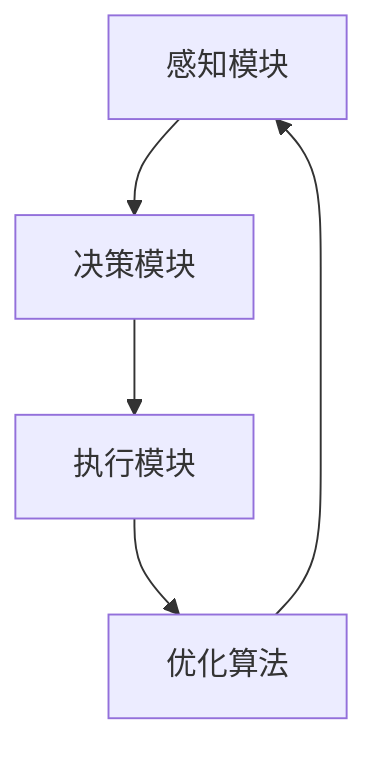
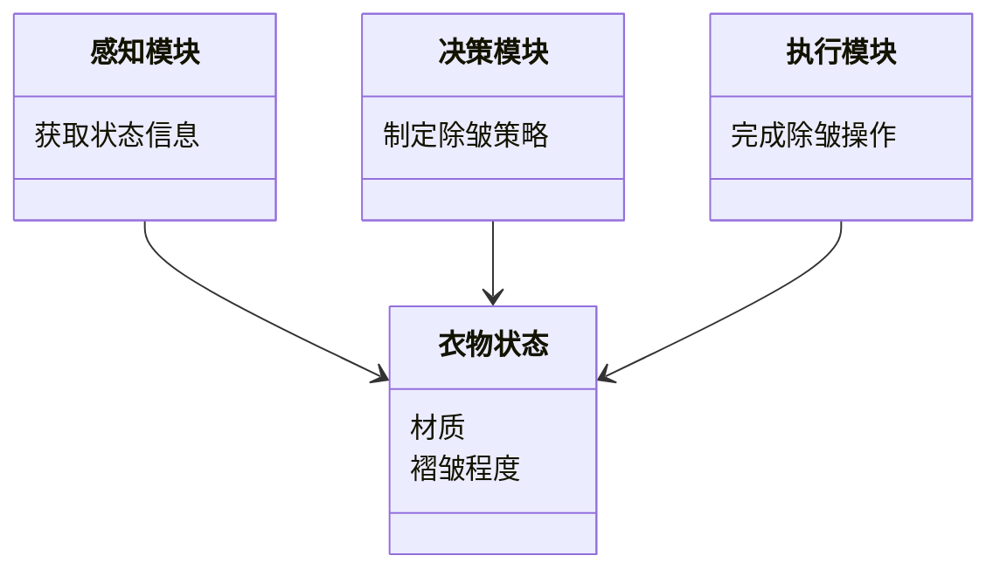

                 


# AI Agent在智能衣架中的衣物除皱功能

> 关键词：AI Agent, 智能衣架, 衣物除皱, 深度学习, 强化学习, 智能家居

> 摘要：本文详细探讨了AI Agent在智能衣架中的衣物除皱功能，从背景介绍、核心概念、算法原理、系统架构到项目实战，全面分析了AI Agent在智能衣架中的应用及其技术实现。

---

# 第一部分: AI Agent与智能衣架的背景与概念

# 第1章: AI Agent与智能衣架的背景介绍

## 1.1 AI Agent的基本概念

### 1.1.1 人工智能代理的定义

人工智能代理（AI Agent）是指能够感知环境、自主决策并执行任务的智能实体。它能够通过传感器获取信息，利用算法进行分析和推理，并通过执行器与环境交互。AI Agent的核心目标是通过智能化的方式解决问题，优化用户体验。

### 1.1.2 AI Agent的核心特点

- **自主性**：AI Agent能够在没有外部干预的情况下自主运行。
- **反应性**：能够实时感知环境变化并做出反应。
- **学习能力**：通过数据和反馈不断优化自身的算法和决策。
- **协作性**：能够与其他系统或设备协同工作。

### 1.1.3 AI Agent在智能家居中的应用

AI Agent在智能家居中的应用非常广泛，包括智能音箱、智能灯泡、智能门锁等。通过AI Agent，智能家居设备能够实现自主控制、智能交互和优化管理。

---

## 1.2 智能衣架的背景与现状

### 1.2.1 衣物除皱的现实需求

衣物褶皱是日常生活中的常见问题，尤其是对于忙碌的上班族和旅行者来说，衣物除皱的需求尤为强烈。传统的方法包括熨烫和手洗，但这些方法不仅费时费力，还可能对衣物造成损伤。

### 1.2.2 智能衣架的发展历程

智能衣架的概念起源于智能家居的发展，随着物联网和人工智能技术的进步，智能衣架逐渐从简单的衣物存储工具演变为具备智能感知、自动除皱等功能的智能家居设备。

### 1.2.3 当前智能衣架的技术瓶颈

尽管智能衣架的发展迅速，但目前仍存在一些技术瓶颈，例如如何高效地感知衣物状态、如何优化除皱算法以及如何实现多设备协同工作等。

---

## 1.3 AI Agent在智能衣架中的应用背景

### 1.3.1 衣物除皱问题的复杂性

衣物除皱不仅需要考虑衣物的材质、厚度，还需要考虑褶皱的类型和程度。不同材质的衣物需要不同的除皱方法，而不同的褶皱程度也需要不同的处理策略。

### 1.3.2 AI Agent在衣物除皱中的优势

AI Agent可以通过传感器实时感知衣物状态，利用深度学习算法分析衣物的褶皱情况，并通过优化算法选择最优的除皱策略。相比于传统方法，AI Agent能够实现更高效、更精准的衣物除皱。

### 1.3.3 本章小结

本章介绍了AI Agent的基本概念及其在智能衣架中的应用背景，重点分析了衣物除皱的现实需求和智能衣架的发展现状。

---

# 第2章: AI Agent与衣物除皱的核心概念

## 2.1 AI Agent的核心原理

### 2.1.1 AI Agent的基本工作原理

AI Agent的工作原理可以分为感知、决策和执行三个阶段。感知阶段通过传感器获取环境信息，决策阶段通过算法分析信息并制定策略，执行阶段通过执行器将策略转化为具体操作。

### 2.1.2 AI Agent的感知与决策机制

AI Agent的感知模块通过摄像头、触摸传感器等设备获取衣物的状态信息，决策模块通过深度学习算法分析这些信息并制定除皱策略，执行模块则通过机械臂或其他执行器完成除皱操作。

### 2.1.3 AI Agent的学习与优化能力

AI Agent能够通过强化学习算法不断优化自身的决策策略。通过与环境的交互，AI Agent能够从经验中学习，逐步提高除皱的效率和精度。

---

## 2.2 衣物除皱的核心问题

### 2.2.1 衣物褶皱的形成原因

衣物褶皱的形成主要与衣物的材质、湿度、温度以及外力等因素有关。不同材质的衣物在不同条件下会产生不同的褶皱。

### 2.2.2 衣物除皱的基本原理

衣物除皱的基本原理是通过机械力或热能消除衣物的褶皱。机械力包括拉伸、按压等，热能包括熨烫、烘干等。

### 2.2.3 衣物除皱的分类与挑战

衣物除皱可以分为干洗除皱和湿洗除皱两大类。干洗除皱主要通过机械力完成，湿洗除皱则需要结合热能和机械力。不同类型的除皱方法具有不同的优缺点，选择合适的除皱方法是实现高效除皱的关键。

---

## 2.3 AI Agent在衣物除皱中的核心要素

### 2.3.1 感知模块

感知模块通过摄像头、触摸传感器等设备获取衣物的状态信息，包括衣物的材质、褶皱程度等。

### 2.3.2 决策模块

决策模块通过深度学习算法分析感知模块获取的信息，并制定除皱策略。决策模块的核心是优化算法，用于选择最优的除皱方法。

### 2.3.3 执行模块

执行模块通过机械臂、加热器等设备完成除皱操作。执行模块需要根据决策模块的指令进行精确的操作。

---

## 2.4 核心概念对比分析

### 2.4.1 AI Agent与传统控制系统的对比

| 对比维度         | AI Agent                     | 传统控制系统               |
|------------------|------------------------------|---------------------------|
| 感知能力         | 强，能够实时感知环境信息     | 弱，依赖预设的传感器或输入   |
| 决策能力         | 强，能够自主决策             | 弱，依赖预设的规则或逻辑     |
| 学习能力         | 强，能够通过经验优化策略     | 无，无法自主学习           |
| 灵活性           | 高，能够适应复杂环境变化     | 低，适应性较差             |

### 2.4.2 衣物除皱与传统熨烫的对比

| 对比维度         | 衣物除皱                     | 传统熨烫               |
|------------------|------------------------------|------------------------|
| 方法             | 机械力或热能                 | 主要依赖热能           |
| 精度             | 高，能够实现精准除皱         | 较低，依赖操作人员经验   |
| 效率             | 高，自动化程度高             | 较低，依赖人工操作       |
| 适用场景         | 多种场景，包括干洗和湿洗     | 主要适用于湿洗场景       |

### 2.4.3 本章小结

本章通过对比分析，详细探讨了AI Agent与传统控制系统、衣物除皱与传统熨烫之间的差异，进一步明确了AI Agent在衣物除皱中的优势和应用价值。

---

# 第3章: AI Agent在衣物除皱中的算法原理

## 3.1 AI Agent的核心算法

### 3.1.1 基于深度学习的AI Agent算法

深度学习是一种基于人工神经网络的机器学习算法，能够通过大量数据训练出高效的模型。在衣物除皱中，深度学习算法可以用于图像识别、材质分类等任务。

### 3.1.2 基于强化学习的AI Agent算法

强化学习是一种通过试错方式优化决策策略的算法。在衣物除皱中，强化学习可以用于优化除皱策略，选择最优的除皱方法。

### 3.1.3 基于规则的AI Agent算法

基于规则的AI Agent算法通过预设的规则进行决策，适用于任务简单、规则明确的场景。

---

## 3.2 衣物除皱算法的数学模型

### 3.2.1 衣物除皱问题的数学建模

衣物除皱问题可以建模为一个优化问题，目标是最小化衣物的褶皱程度。设衣物的褶皱程度为$f(x)$，优化目标为：

$$
\min_{x} f(x)
$$

其中，$x$表示除皱策略，包括机械力的大小、方向和热能的温度、时间等。

### 3.2.2 基于深度学习的优化函数

深度学习模型的优化函数通常采用交叉熵损失函数：

$$
\text{Loss} = -\sum_{i=1}^{n} y_i \log(p_i) + (1 - y_i) \log(1 - p_i)
$$

其中，$y_i$表示真实标签，$p_i$表示模型预测的概率。

### 3.2.3 基于强化学习的奖励机制

强化学习的奖励机制通常采用折扣奖励：

$$
R = \sum_{t=1}^{T} \gamma^{t-1} r_t
$$

其中，$\gamma$表示折扣因子，$r_t$表示第$t$步的奖励。

---

## 3.3 算法流程图



---

## 3.4 本章小结

本章详细探讨了AI Agent在衣物除皱中的算法原理，包括深度学习、强化学习和基于规则的算法，并通过数学模型和流程图进一步阐述了算法的实现过程。

---

# 第4章: AI Agent与智能衣架的系统架构设计

## 4.1 系统功能设计

### 4.1.1 AI Agent的核心功能

AI Agent在智能衣架中的核心功能包括衣物状态感知、除皱策略制定和除皱操作执行。

### 4.1.2 智能衣架的功能模块

智能衣架的功能模块包括感知模块、决策模块和执行模块。

### 4.1.3 系统功能的交互流程

智能衣架的系统功能交互流程如下：

1. 感知模块通过传感器获取衣物状态信息。
2. 决策模块通过算法分析信息并制定除皱策略。
3. 执行模块根据决策模块的指令完成除皱操作。

---

## 4.2 系统架构设计

### 4.2.1 领域模型类图



### 4.2.2 系统架构图


### 4.2.3 系统接口设计

智能衣架的系统接口设计包括感知模块接口、决策模块接口和执行模块接口。

### 4.2.4 系统交互流程

系统交互流程如下：

1. 用户将衣物放入智能衣架。
2. 感知模块通过传感器获取衣物状态信息。
3. 决策模块通过算法分析信息并制定除皱策略。
4. 执行模块根据决策模块的指令完成除皱操作。
5. 系统完成除皱后通知用户。

---

## 4.3 本章小结

本章通过系统功能设计和架构设计，详细阐述了AI Agent在智能衣架中的实现过程，包括系统功能模块、系统架构图和系统交互流程。

---

# 第5章: 项目实战

## 5.1 环境安装

为了实现AI Agent在智能衣架中的衣物除皱功能，需要以下环境：

- 操作系统：Linux（推荐Ubuntu 20.04）
- 开发工具：Python 3.8及以上版本、TensorFlow 2.0及以上版本、Keras 2.2.5及以上版本
- 传感器：摄像头、触摸传感器
- 执行器：机械臂、加热器

---

## 5.2 系统核心实现源代码

以下是AI Agent的核心代码实现：

```python
import numpy as np
import tensorflow as tf
from tensorflow.keras import layers

class AIAgent:
    def __init__(self):
        self.model = self.build_model()
    
    def build_model(self):
        model = tf.keras.Sequential([
            layers.Conv2D(32, (3,3), activation='relu', input_shape=(64,64,3)),
            layers.MaxPooling2D((2,2)),
            layers.Conv2D(64, (3,3), activation='relu'),
            layers.MaxPooling2D((2,2)),
            layers.Flatten(),
            layers.Dense(128, activation='relu'),
            layers.Dense(1, activation='sigmoid')
        ])
        model.compile(optimizer='adam', loss='binary_crossentropy', metrics=['accuracy'])
        return model
    
    def train(self, x_train, y_train, epochs=10):
        self.model.fit(x_train, y_train, epochs=epochs, batch_size=32)
    
    def predict(self, x_test):
        return self.model.predict(x_test)
```

---

## 5.3 案例分析与详细解读

以下是一个简单的案例分析：

1. **输入数据**：将衣物的图像输入AI Agent模型。
2. **模型训练**：通过训练数据优化模型参数。
3. **模型预测**：模型根据输入图像判断衣物的材质和褶皱程度。
4. **策略制定**：根据预测结果制定最优的除皱策略。
5. **执行操作**：执行模块根据除皱策略完成除皱操作。

---

## 5.4 本章小结

本章通过项目实战，详细展示了AI Agent在智能衣架中的实现过程，包括环境安装、代码实现和案例分析。

---

# 第6章: 最佳实践与注意事项

## 6.1 最佳实践

1. **数据预处理**：确保输入数据的高质量，避免噪声干扰。
2. **模型优化**：通过调整模型参数和优化算法提高模型性能。
3. **系统测试**：在实际场景中进行充分的测试，确保系统的稳定性和可靠性。

---

## 6.2 小结

AI Agent在智能衣架中的衣物除皱功能是一项复杂但极具潜力的技术。通过本文的详细分析，我们能够更好地理解其技术实现和应用价值。

---

## 6.3 注意事项

1. **数据隐私**：确保用户数据的安全性和隐私性。
2. **系统稳定性**：在实际应用中，确保系统的稳定性和可靠性。
3. **用户体验**：优化用户体验，使其更加便捷和智能。

---

## 6.4 拓展阅读

1. 《深度学习》—— Ian Goodfellow
2. 《强化学习》—— Richard S. Sutton
3. 《人工智能：一种现代的方法》—— Stuart Russell

---

# 作者：AI天才研究院/AI Genius Institute & 禅与计算机程序设计艺术 /Zen And The Art of Computer Programming

