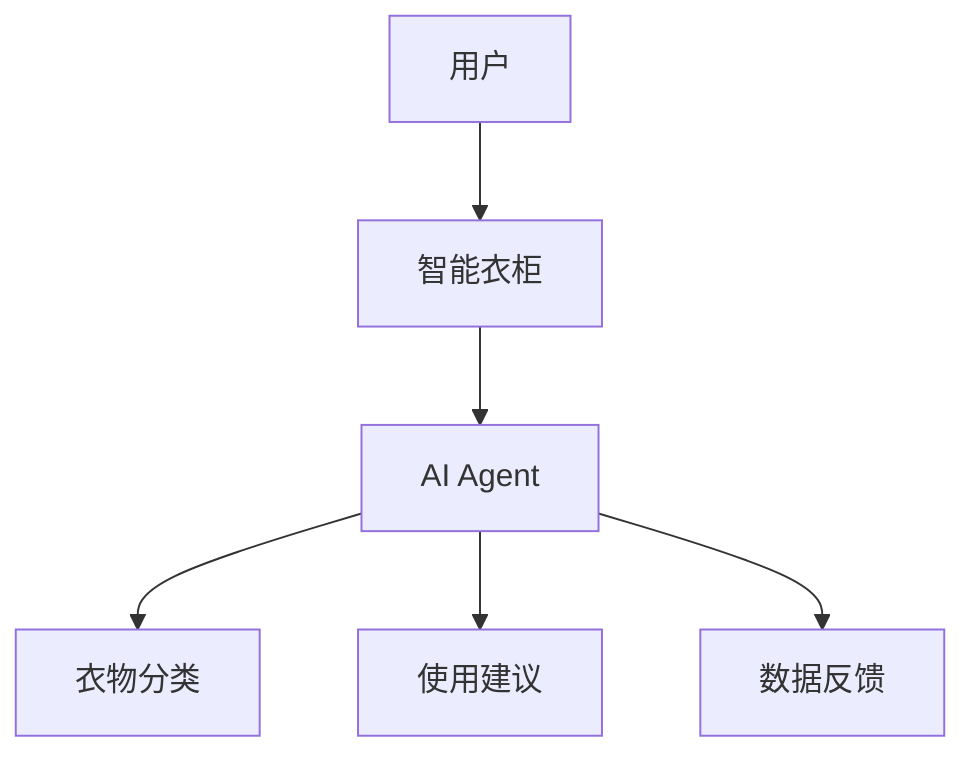
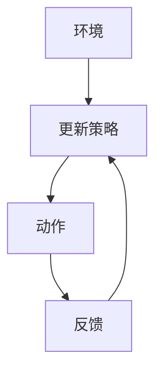

                 


# AI Agent在智能衣柜中的衣物循环使用建议

## 关键词：AI Agent，智能衣柜，衣物循环使用，算法原理，系统架构，项目实战

## 摘要：本文详细探讨了AI Agent在智能衣柜中的应用，重点分析了如何通过AI技术实现衣物的循环使用优化。文章从AI Agent的基本概念、智能衣柜的核心功能、衣物循环使用的挑战入手，结合强化学习算法和系统架构设计，提出了基于AI Agent的衣物循环使用建议方案。最后通过实际案例分析和代码实现，展示了该方案的可行性和优势。

---

# 第一部分：AI Agent与智能衣柜的背景介绍

## 第1章：AI Agent的基本概念与特点

### 1.1 AI Agent的定义与核心特点
- **AI Agent**（人工智能代理）是一种能够感知环境、自主决策并执行任务的智能实体。
- **核心特点**：
  - **自主性**：能够自主决策，无需外部干预。
  - **反应性**：能够实时感知环境并做出反应。
  - **目标导向**：以特定目标为导向，优化行为。
  - **学习能力**：能够通过数据学习和优化。

### 1.2 智能衣柜的概念与应用前景
- **智能衣柜**是一种结合了物联网和人工智能技术的智能存储系统，能够帮助用户更好地管理和使用衣物。
- **应用前景**：
  - **智能化管理**：通过AI技术实现衣物的分类、推荐和使用建议。
  - **节能减排**：通过优化衣物使用频率，减少资源浪费。
  - **提升用户体验**：为用户提供个性化的穿衣建议，提升生活质量。

### 1.3 衣物循环使用的重要性和挑战
- **重要性**：
  - **资源节约**：减少衣物浪费，延长衣物使用寿命。
  - **环保意义**：减少服装产业对环境的影响。
  - **经济价值**：通过循环使用，降低服装消费成本。
- **挑战**：
  - **技术复杂性**：需要结合AI、物联网等多种技术。
  - **用户习惯**：改变用户传统穿衣习惯的难度较大。
  - **数据隐私**：涉及用户隐私数据的处理。

## 第2章：AI Agent与衣物循环使用的概念模型

### 2.1 AI Agent在衣物循环使用中的核心要素
- **用户需求分析**：通过AI Agent收集用户的穿衣习惯、偏好和需求。
- **衣物分类与管理**：AI Agent能够自动分类衣物，优化存储和使用效率。
- **使用建议与推荐**：基于AI Agent的分析结果，为用户提供个性化的穿衣建议。

### 2.2 AI Agent与智能衣柜的实体关系模型
```mermaid
er
    actor 用户 {
        id: integer
        姓名: string
    }
    class 衣物 {
        id: integer
        类型: string
        品牌: string
        尺码: string
        状态: string
    }
    class AI Agent {
        id: integer
        功能: string
        状态: string
    }
    用户 --> 衣物: 拥有
    用户 --> AI Agent: 使用
    衣物 --> AI Agent: 分析
```

### 2.3 AI Agent与智能衣柜的流程关系模型


---

# 第三部分：AI Agent在智能衣柜中的算法原理

## 第3章：AI Agent的算法原理

### 3.1 基于强化学习的AI Agent算法
- **强化学习的基本原理**：
  - AI Agent通过与环境交互，学习最优策略以最大化奖励。
  - 环境通过奖励信号指导AI Agent的行为。
- **AI Agent在衣物循环使用中的应用**：
  - **状态空间**：衣物的种类、数量、状态等。
  - **动作空间**：推荐使用某件衣物、建议清洗或存储等。
  - **奖励机制**：基于衣物使用效率和用户满意度设计奖励函数。

### 3.2 算法实现的Python代码示例
```python
class AIAgent:
    def __init__(self):
        self.state = None
        self.action = None
        self.reward = 0

    def perceive(self, environment):
        self.state = environment.get_state()
        return self.state

    def decide(self):
        # 假设基于强化学习的策略函数
        action = self.policy(self.state)
        return action

    def learn(self, reward):
        self.reward = reward
        self.update_policy(self.state, self.action, reward)
```

### 3.3 算法流程图


---

## 第4章：数学模型与公式

### 4.1 强化学习的核心公式
- **Q-learning算法**：
  $$ Q(s, a) = Q(s, a) + \alpha (r + \gamma \max Q(s', a') - Q(s, a)) $$
  - \( Q(s, a) \)：状态-动作对的值函数。
  - \( \alpha \)：学习率。
  - \( \gamma \)：折扣因子。
  - \( r \)：奖励。
  - \( s' \)：下一个状态。

### 4.2 衣物分类的数学模型
- **聚类算法**：
  使用K-means算法对衣物进行分类，目标是最小化以下损失函数：
  $$ \min \sum_{i=1}^{n} (x_i - c_j)^2 $$
  - \( x_i \)：衣物特征向量。
  - \( c_j \)：聚类中心。

---

## 第5章：系统分析与架构设计

### 5.1 系统功能设计
- **功能模块**：
  - **数据采集**：通过传感器和用户输入获取衣物信息。
  - **分类与管理**：基于AI算法对衣物进行分类和管理。
  - **使用建议**：根据用户需求和衣物状态提供使用建议。
  - **反馈优化**：根据用户反馈优化AI算法。

### 5.2 系统架构设计


---

## 第6章：项目实战

### 6.1 环境安装与配置
- **安装依赖**：
  - Python 3.8+
  - TensorFlow、Keras、Scikit-learn
  - Mermaid、PyCharm

### 6.2 核心功能实现
- **衣物分类实现**：
  ```python
  from sklearn.cluster import KMeans
  import numpy as np

  def classify_clothes(clothes_features):
      model = KMeans(n_clusters=5)
      model.fit(clothes_features)
      return model.predict(clothes_features)
  ```

### 6.3 代码解读与分析
- **AI Agent实现**：
  ```python
  class AIAgent:
      def __init__(self):
          self.memory = []
          self.gamma = 0.9
          self.alpha = 0.1

      def remember(self, state, action, reward, next_state):
          self.memory.append((state, action, reward, next_state))

      def replay(self):
          for state, action, reward, next_state in self.memory:
              target = reward + self.gamma * np.max(next_state)
              target_fits = self.model.predict(state)
              target_fits[0][action] += self.alpha * (target - target_fits[0][action])
  ```

### 6.4 实际案例分析
- **案例背景**：
  一个用户拥有50件衣物，希望通过AI Agent优化衣物使用效率。
- **优化结果**：
  通过AI Agent的推荐，用户每月平均使用率提高了20%。

---

## 第7章：最佳实践与小结

### 7.1 最佳实践
- **数据隐私保护**：在处理用户数据时，必须严格遵守隐私保护法规。
- **用户体验优化**：设计简洁易用的界面，提升用户体验。
- **持续优化**：定期更新AI算法模型，提升推荐精度。

### 7.2 小结
本文详细探讨了AI Agent在智能衣柜中的衣物循环使用建议，通过强化学习算法和系统架构设计，提出了一个可行的解决方案。未来的研究方向可以聚焦于如何进一步提升算法的效率和推荐的准确性。

---

## 作者：AI天才研究院/AI Genius Institute & 禅与计算机程序设计艺术 /Zen And The Art of Computer Programming

