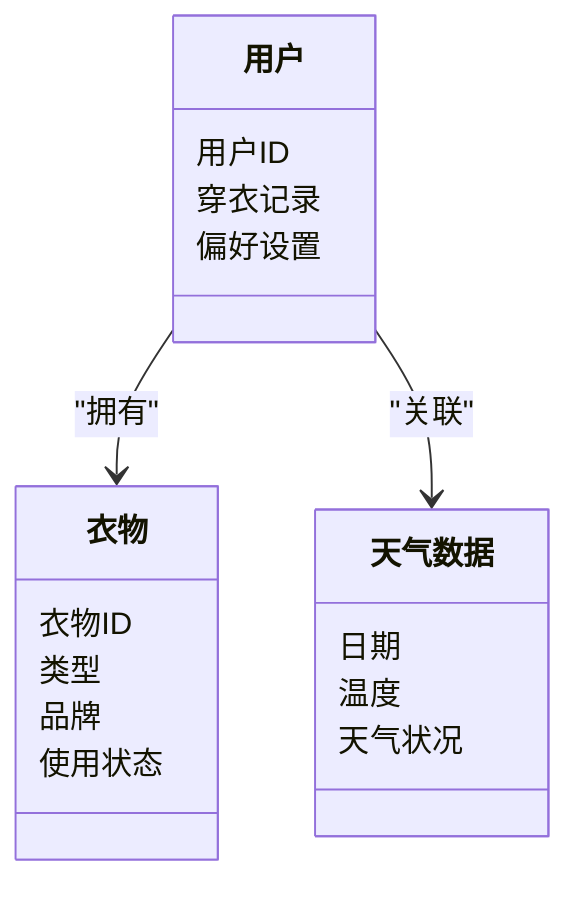
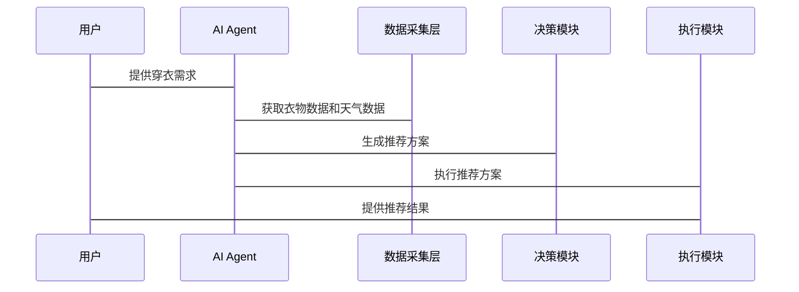

                 


# AI Agent在智能衣柜中的衣物循环利用建议

**关键词：** AI Agent, 智能衣柜, 衣物循环利用, 人工智能, 可持续发展, 推荐算法, 系统架构

**摘要：**  
随着人工智能技术的飞速发展，智能衣柜逐渐成为现代生活中不可或缺的一部分。本文将探讨AI Agent在智能衣柜中的应用，特别是如何通过衣物循环利用实现可持续发展目标。我们将从AI Agent的基本概念出发，分析其在智能衣柜中的核心功能，包括感知、决策和执行模块。通过详细讲解推荐算法、数学模型和系统架构设计，本文将为读者提供从理论到实践的全面指导。最后，我们将通过项目实战和最佳实践，展示如何利用AI技术推动衣物循环利用的实现。

---

# 第1章: AI Agent与智能衣柜概述

## 1.1 AI Agent的基本概念  
AI Agent（人工智能代理）是指能够感知环境并采取行动以实现目标的智能实体。在智能衣柜中，AI Agent的核心功能包括：  
1. **感知环境**：通过传感器和数据采集技术，获取用户的衣橱信息、天气数据、用户行为等。  
2. **决策**：基于感知到的信息，利用推荐算法和决策模型，为用户提供衣物搭配建议或优化衣橱结构。  
3. **执行**：通过智能设备（如智能衣柜门禁系统、衣物收纳盒等）执行决策，例如自动分类衣物或推荐衣物 reuse 的方案。  

AI Agent在智能衣柜中的应用不仅提高了衣物管理的效率，还通过智能化的推荐系统促进了衣物的循环利用。

## 1.2 智能衣柜的发展现状  
智能衣柜已逐步从单一的存储工具向智能化的衣物管理平台转型。当前，智能衣柜的主要功能包括：  
1. **衣物分类与管理**：通过RFID技术和图像识别技术，自动识别衣物的种类、品牌和使用状态。  
2. **智能推荐**：基于用户的穿衣习惯和天气预报，推荐每日穿搭方案。  
3. **衣物共享与循环利用**：通过AI Agent，智能衣柜可以推荐用户将闲置衣物共享给他人，或建议用户选择可持续的衣物材质和品牌。  

然而，当前智能衣柜在衣物循环利用方面仍存在一些局限性，例如缺乏统一的衣物共享平台和缺乏对衣物全生命周期的管理。

## 1.3 衣物循环利用的背景与意义  
衣物循环利用是指通过 reuse、recycle 和 redistribute 的方式延长衣物的使用寿命，减少资源浪费和环境污染。随着全球环保意识的增强，衣物循环利用已成为一个重要的社会议题。  
AI Agent在智能衣柜中的应用为衣物循环利用提供了技术支持：  
1. **资源优化**：通过AI算法，智能衣柜可以优化用户的衣物库存，减少不必要的购买。  
2. **行为引导**：AI Agent可以引导用户选择环保的衣物材质和品牌，或推荐用户将闲置衣物捐赠给需要的人。  
3. **数据支持**：通过分析用户的衣物使用数据，AI Agent可以为衣物的设计和生产提供数据支持，推动整个服装行业的可持续发展。  

---

# 第2章: AI Agent在智能衣柜中的核心概念

## 2.1 AI Agent在智能衣柜中的感知模块  
感知模块是AI Agent与智能衣柜交互的第一步，主要功能包括：  
1. **数据采集**：通过RFID标签、图像识别和传感器等技术，采集衣物的种类、颜色、品牌、使用状态等信息。  
2. **环境感知**：感知用户的穿衣习惯、天气变化等外部环境信息。  

### 2.1.1 感知模块的主要技术  
- **RFID技术**：用于自动识别衣物的种类和品牌。  
- **图像识别**：用于分析衣物的颜色和款式。  
- **传感器技术**：用于监测衣物的使用频率和状态。  

### 2.1.2 感知模块与智能衣柜的关系  
感知模块作为AI Agent的“眼睛”和“耳朵”，为后续的决策提供数据支持。通过感知模块，智能衣柜能够实时了解用户的衣物库存和使用情况。

## 2.2 AI Agent在智能衣柜中的决策模块  
决策模块是AI Agent的核心部分，负责根据感知到的信息生成推荐或优化方案。  

### 2.2.1 决策模块的主要算法  
- **协同过滤算法**：基于用户的穿衣习惯和偏好，推荐相似用户的衣物搭配方案。  
- **内容推荐算法**：基于衣物的属性（如颜色、款式）进行推荐。  
- **混合推荐算法**：结合协同过滤和内容推荐的优势，提供更精准的推荐结果。  

### 2.2.2 决策模块的实现流程  
1. 收集用户数据：包括用户的穿衣记录、天气数据、衣物库存等。  
2. 数据预处理：清洗和归一化数据，去除异常值。  
3. 模型训练：基于训练数据，训练推荐算法模型。  
4. 推荐生成：根据用户的实时需求，生成衣物搭配或循环利用的建议。  

## 2.3 AI Agent在智能衣柜中的执行模块  
执行模块是AI Agent的“行动者”，负责将决策模块生成的方案转化为实际操作。  

### 2.3.1 执行模块的功能  
- **衣物分类**：根据AI Agent的建议，自动将衣物分类到不同的收纳盒中。  
- **衣物共享**：推荐用户将闲置衣物共享给他人，或联系回收平台进行处理。  

---

# 第3章: AI Agent的算法原理与数学模型

## 3.1 推荐算法的原理与实现  
推荐算法是AI Agent在智能衣柜中应用的核心技术之一。  

### 3.1.1 协同过滤算法  
协同过滤算法通过分析用户的相似性，推荐相似用户的衣物搭配方案。其数学公式如下：  
$$ sim(u, v) = \frac{\sum_{i} (r_ui - \bar{r_u})(r_vi - \bar{r_v})}{\sqrt{\sum_{i} (r_ui - \bar{r_u})^2} \cdot \sqrt{\sum_{i} (r_vi - \bar{r_v})^2}} $$  
其中，$sim(u, v)$ 表示用户 $u$ 和用户 $v$ 之间的相似度，$r_ui$ 和 $r_vi$ 分别表示用户 $u$ 和 $v$ 对物品 $i$ 的评分，$\bar{r_u}$ 和 $\bar{r_v}$ 分别是用户 $u$ 和 $v$ 的平均评分。  

### 3.1.2 内容推荐算法  
内容推荐算法基于衣物的属性进行推荐，例如颜色、款式和材质。其数学模型如下：  
$$ score(i, u) = \sum_{j} w_{ij} \cdot f(j, u) $$  
其中，$score(i, u)$ 表示物品 $i$ 对用户 $u$ 的推荐分数，$w_{ij}$ 是物品 $i$ 的属性权重，$f(j, u)$ 是用户 $u$ 对属性 $j$ 的偏好。  

## 3.2 数学模型与公式  
结合协同过滤和内容推荐的优势，混合推荐算法的数学模型如下：  
$$ score(i, u) = \alpha \cdot sim(u, v) + \beta \cdot score_{content}(i, u) $$  
其中，$\alpha$ 和 $\beta$ 是权重系数，$score_{content}(i, u)$ 是内容推荐的得分。  

---

# 第4章: 智能衣柜系统的架构设计

## 4.1 问题场景介绍  
智能衣柜系统需要解决的主要问题包括：  
1. 如何高效地管理用户的衣物库存？  
2. 如何通过AI Agent实现衣物的智能推荐和循环利用？  

## 4.2 领域模型设计  
领域模型展示了智能衣柜系统中的主要实体及其关系。  



## 4.3 系统架构设计  
智能衣柜系统的架构分为以下几层：  
1. **数据采集层**：负责采集用户的衣物数据和行为数据。  
2. **数据处理层**：对数据进行清洗、归一化和特征提取。  
3. **AI Agent层**：实现推荐算法和决策逻辑。  
4. **用户交互层**：通过APP或网页与用户进行交互。  

## 4.4 系统接口设计  
系统接口主要包括：  
1. 用户与智能衣柜的交互接口：如APP或网页界面。  
2. AI Agent与智能设备的通信接口：如与衣物收纳盒的连接。  

## 4.5 系统交互流程  
系统交互流程如下：  



---

# 第5章: 项目实战与代码实现

## 5.1 项目环境搭建  
首先，需要安装以下库：  
- Python 3.8+
- TensorFlow 2.0+
- Pandas 1.0+
- Scikit-learn 0.24+  
安装命令：  
```bash
pip install tensorflow pandas scikit-learn
```

## 5.2 核心功能实现  
### 5.2.1 数据采集与预处理  
```python
import pandas as pd
import numpy as np

# 数据采集
data = pd.read_csv('clothes.csv')
# 数据预处理
data.dropna(inplace=True)
data['label'] = data['label'].astype(int)
```

### 5.2.2 推荐算法实现  
```python
from sklearn.neighbors import NearestNeighbors

# 协同过滤算法
model = NearestNeighbors(n_neighbors=5, algorithm='ball_tree')
model.fit(X)
distances, indices = model.kneighbors([user_input])
```

### 5.2.3 循环利用模块  
```python
def recommend_reuse(clothes_data, user_id):
    user_clothes = clothes_data[clothes_data['user_id'] == user_id]
    # 推荐可 reuse 的衣物
    reuse_clothes = user_clothes[user_clothes['use_count'] < 3]
    return reuse_clothes
```

## 5.3 项目实战案例  
假设用户ID为1001，衣物数据如下：  
| 衣物ID | 类型 | 品牌 | 使用状态 |  
|-------|------|------|----------|  
| 1     | 衬衣 | A    | 新        |  
| 2     | 裤子 | B    | 旧        |  

通过推荐算法，AI Agent会推荐用户将衣物ID为2的裤子共享给他人，或建议用户购买更多可持续品牌的衣物。

---

# 第6章: 最佳实践与注意事项

## 6.1 小结  
通过AI Agent在智能衣柜中的应用，我们可以实现衣物的智能管理和循环利用。推荐算法和系统架构设计是实现这一目标的关键技术。  

## 6.2 注意事项  
1. 数据隐私：确保用户的衣物数据不会被滥用。  
2. 系统稳定性：确保智能衣柜系统在高并发情况下的稳定性。  
3. 用户体验：优化AI Agent的推荐算法，提升用户的使用体验。  

## 6.3 未来发展方向  
1. 推动衣物共享平台的普及。  
2. 研究更先进的推荐算法，如深度学习模型。  
3. 推动智能衣柜与智能家居的协同工作。  

---

# 作者：AI天才研究院 & 禅与计算机程序设计艺术

