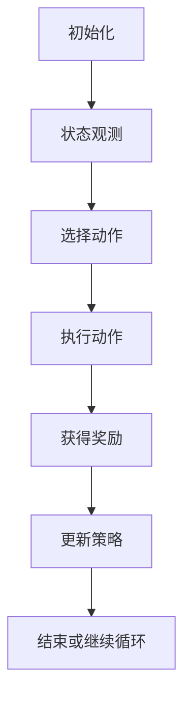
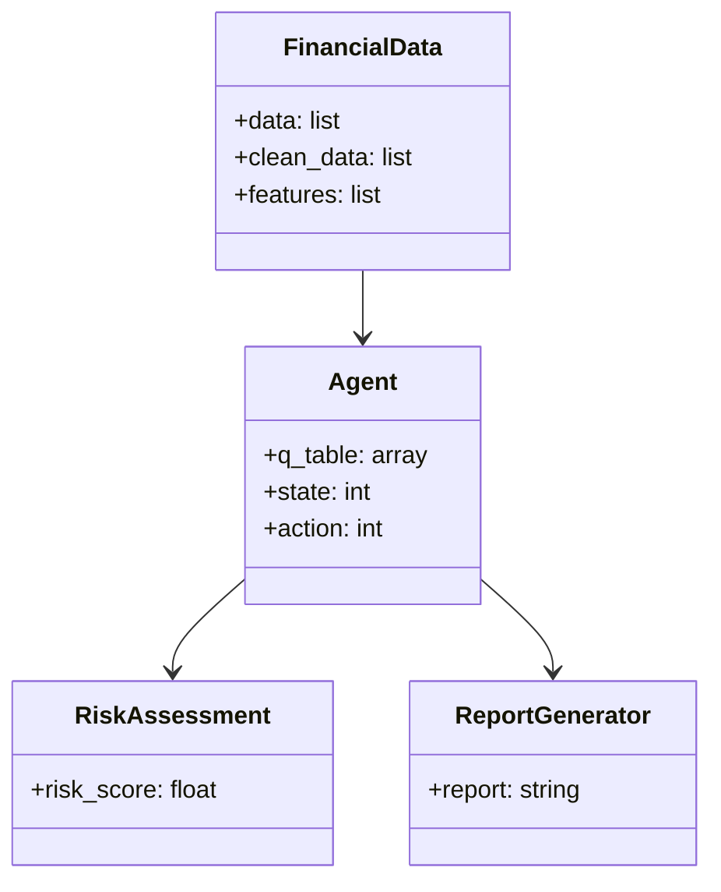
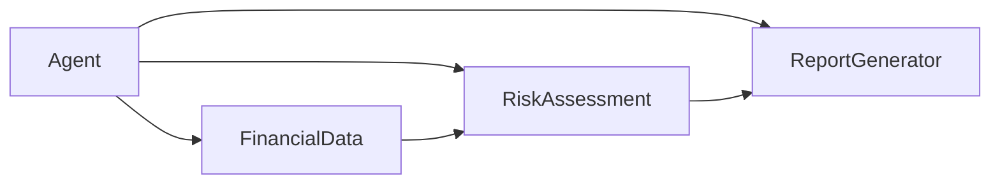
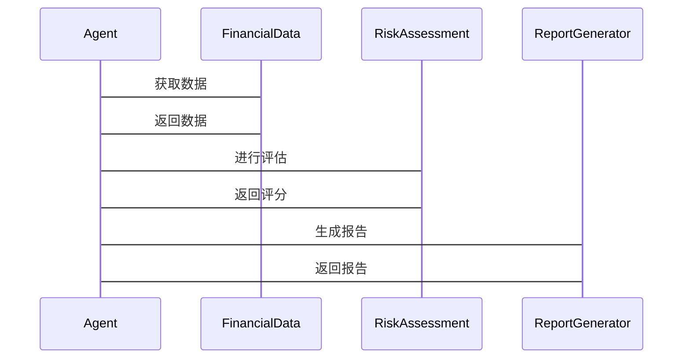

                 


# AI Agent在智能财务分析中的应用

## 关键词：AI Agent、智能财务分析、财务数据挖掘、机器学习、风险管理、数据可视化

## 摘要：本文探讨AI Agent在智能财务分析中的应用，分析其如何通过感知、决策和执行模块提升财务分析效率和准确性。结合数学模型、算法原理和系统架构设计，详细阐述AI Agent在财务数据分析、风险评估和决策优化中的作用，并通过实际案例展示其应用价值。

---

# 第1章: AI Agent与智能财务分析概述

## 1.1 AI Agent的基本概念

### 1.1.1 什么是AI Agent
AI Agent（人工智能代理）是能够感知环境、自主决策并执行任务的智能体。在财务分析中，AI Agent通过数据处理和分析，为用户提供自动化、智能化的决策支持。

### 1.1.2 AI Agent的核心特征
| 特征 | 描述 |
|------|------|
| 感知能力 | 采集和理解财务数据 |
| 自主决策 | 基于数据进行分析和决策 |
| 可解释性 | 决策过程透明，便于审计和优化 |
| 实时性 | 快速响应财务变化 |

### 1.1.3 AI Agent与传统财务分析的对比
| 方面 | 传统财务分析 | AI Agent驱动的财务分析 |
|------|--------------|------------------------|
| 数据处理速度 | 较慢，依赖人工 | 快速，自动化处理 |
| 决策效率 | 低效，依赖经验 | 高效，基于算法优化 |
| 精确度 | 受人工影响较大 | 更高，基于大数据分析 |

---

## 1.2 智能财务分析的背景与需求

### 1.2.1 财务分析的传统方法与局限性
传统财务分析依赖人工处理，存在以下问题：
- 数据量大，处理耗时
- 分析结果受主观因素影响
- 风险预测不够精准

### 1.2.2 数据爆炸与分析效率的需求
随着企业数据量的剧增，传统方法难以满足高效分析的需求。AI Agent通过自动化处理，提升分析效率。

### 1.2.3 AI Agent在财务分析中的应用潜力
AI Agent能够实现：
- 自动化数据处理
- 实时监控与预警
- 智能风险评估

---

## 1.3 AI Agent在智能财务分析中的定位

### 1.3.1 AI Agent在财务分析中的角色
AI Agent作为智能财务分析的核心，负责数据处理、分析和决策执行。

### 1.3.2 AI Agent的核心功能与应用场景
- 数据采集与清洗
- 财务预测与风险评估
- 自动化报告生成

### 1.3.3 AI Agent与财务分析系统的整合
AI Agent与财务系统的结合，实现端到端的智能财务分析流程。

---

## 1.4 本章小结
本章介绍了AI Agent的基本概念、核心特征以及在智能财务分析中的定位，为后续内容奠定了基础。

---

# 第2章: AI Agent的核心概念与原理

## 2.1 AI Agent的感知模块

### 2.1.1 数据采集与预处理
数据采集：从数据库、报表等来源获取财务数据。
预处理：清洗数据，提取特征。

### 2.1.2 自然语言处理在财务文本中的应用
NLP技术用于解析财务报告中的文本信息，提取关键指标。

### 2.1.3 数据清洗与特征提取
- 数据清洗：处理缺失值、异常值。
- 特征提取：使用PCA等方法降维。

---

## 2.2 AI Agent的决策模块

### 2.2.1 基于强化学习的决策机制
强化学习通过奖励机制优化决策策略。

### 2.2.2 决策树与随机森林在财务分析中的应用
- 决策树：用于分类和预测。
- 随机森林：提升模型鲁棒性。

### 2.2.3 财务风险评估模型
- 利用机器学习算法评估企业信用风险。

---

## 2.3 AI Agent的执行模块

### 2.3.1 自动化报告生成
AI Agent自动生成财务分析报告，提升效率。

### 2.3.2 智能预警系统
实时监控财务指标，及时预警潜在风险。

### 2.3.3 自动化财务决策执行
AI Agent根据分析结果自动执行财务操作。

---

## 2.4 AI Agent的算法原理

### 2.4.1 强化学习算法流程图（Mermaid）


### 2.4.2 强化学习算法代码示例
```python
import numpy as np

class AI-Agent:
    def __init__(self, state_space, action_space):
        self.state_space = state_space
        self.action_space = action_space
        self.q_table = np.zeros((state_space, action_space))

    def perceive(self, state):
        # 返回当前状态的动作
        return np.argmax(self.q_table[state])

    def learn(self, state, action, reward):
        # 更新Q表
        self.q_table[state, action] += 0.1 * (reward + 0.9 * np.max(self.q_table[state]) - self.q_table[state, action])
```

### 2.4.3 强化学习算法的数学模型
$$ Q(s,a) = Q(s,a) + \alpha (r + \gamma \max Q(s',a') - Q(s,a)) $$

---

## 2.5 本章小结
本章详细讲解了AI Agent的核心模块及其算法原理，为后续系统设计和应用打下基础。

---

# 第3章: AI Agent在智能财务分析中的数学模型与算法

## 3.1 强化学习算法的数学模型
### 3.1.1 Q-learning算法的数学公式
$$ Q(s,a) = Q(s,a) + \alpha (r + \gamma \max Q(s',a') - Q(s,a)) $$

### 3.1.2 策略梯度算法的数学公式
$$ \nabla \theta \log \pi(a|s) \cdot Q(s,a) $$

---

## 3.2 财务风险评估模型的数学公式
### 3.2.1 线性回归模型
$$ y = \beta_0 + \beta_1x + \epsilon $$

### 3.2.2 支持向量机模型
$$ \text{maximize} \quad \frac{1}{2}||\beta||^2 $$
$$ \text{subject to} \quad y_i - \beta^T x_i \geq 1 - \xi_i, \quad i=1,2,\dots,n $$

---

## 3.3 本章小结
本章通过数学模型和算法原理的分析，展示了AI Agent在智能财务分析中的技术基础。

---

# 第4章: 系统分析与架构设计

## 4.1 问题场景介绍
财务分析系统需要处理海量数据，实时监控，风险预警。

## 4.2 系统功能设计
### 4.2.1 领域模型设计（Mermaid类图）


### 4.2.2 系统架构设计（Mermaid架构图）


### 4.2.3 系统接口设计
- 数据接口：数据获取与清洗
- 分析接口：风险评估与预测
- 报告接口：生成财务报告

### 4.2.4 系统交互流程（Mermaid序列图）


---

## 4.3 本章小结
本章通过系统分析与架构设计，展示了AI Agent在智能财务分析中的实际应用。

---

# 第5章: 项目实战

## 5.1 环境安装与配置
### 5.1.1 安装Python
```bash
python --version
pip install numpy scikit-learn
```

## 5.2 系统核心实现源代码

### 5.2.1 数据处理代码
```python
import pandas as pd

data = pd.read_csv('financial_data.csv')
# 数据清洗
data.dropna(inplace=True)
data['total'] = data['revenue'] + data['expenses']
```

### 5.2.2 风险评估代码
```python
from sklearn.svm import SVC

model = SVC()
model.fit(X_train, y_train)
y_pred = model.predict(X_test)
```

## 5.3 项目小结
通过实际案例分析，展示了AI Agent在智能财务分析中的具体应用。

---

# 第6章: 最佳实践与总结

## 6.1 关键点总结
- 理解AI Agent的基本概念与原理
- 掌握强化学习算法的数学模型
- 熟悉系统设计与架构

## 6.2 注意事项
- 数据隐私与安全
- 算法可解释性
- 系统稳定性

## 6.3 拓展阅读
推荐书籍和论文，进一步深入学习。

---

# 作者：AI天才研究院 & 禅与计算机程序设计艺术

---

通过以上内容，您可以看到AI Agent在智能财务分析中的广泛应用和巨大潜力。希望本文对您有所帮助！

