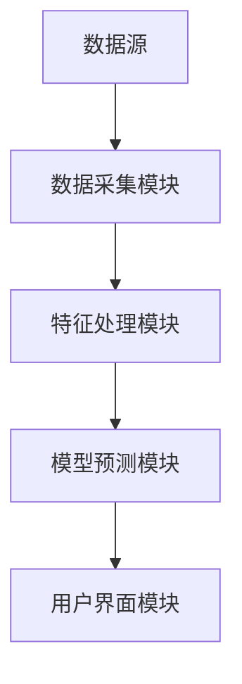

                 


# AI Agent在智能资产定价模型中的应用

**关键词**：AI Agent、智能资产定价、机器学习、资产估值、金融模型

**摘要**：  
本文探讨了AI Agent在智能资产定价模型中的应用，分析了其核心概念、算法原理、系统架构以及实际案例。通过结合数据驱动的方法和机器学习技术，AI Agent能够优化资产定价过程，提高准确性和效率，为金融领域带来新的可能性。

---

## 第1章: AI Agent与智能资产定价模型的背景介绍

### 1.1 AI Agent的基本概念
#### 1.1.1 AI Agent的定义
AI Agent（人工智能代理）是一种能够感知环境、做出决策并采取行动的智能实体。它可以是软件程序、机器人或其他智能系统，旨在通过自动化流程解决问题或执行任务。

#### 1.1.2 AI Agent的核心属性与特征
- **自主性**：能够在没有外部干预的情况下独立运行。
- **反应性**：能够实时感知环境变化并做出反应。
- **目标导向**：基于预设目标或学习目标进行决策。
- **学习能力**：通过数据和经验不断优化自身行为。

#### 1.1.3 AI Agent与传统定价模型的区别
传统定价模型依赖于人工设定的规则和统计方法，而AI Agent能够通过机器学习算法自动发现数据中的模式，并动态调整定价策略。

---

### 1.2 智能资产定价模型的背景
#### 1.2.1 资产定价的传统方法
传统资产定价模型（如CAPM和APT）依赖于假设和统计分析，难以捕捉复杂市场中的非线性关系和新兴风险因素。

#### 1.2.2 传统定价模型的局限性
- **静态性**：难以适应市场环境的快速变化。
- **忽略复杂因素**：无法充分考虑市场情绪、社交网络等非传统因素。
- **计算复杂性**：处理大规模数据时效率较低。

#### 1.2.3 AI Agent在资产定价中的优势
- **数据驱动**：能够处理海量数据，发现传统方法难以察觉的规律。
- **动态调整**：实时更新定价模型，适应市场变化。
- **自动化决策**：通过AI代理自动执行定价和交易策略。

---

## 第2章: AI Agent的核心概念与原理

### 2.1 AI Agent的基本原理
#### 2.1.1 AI Agent的感知与决策机制
AI Agent通过传感器或API接口获取环境数据，利用机器学习模型进行分析，生成决策并执行动作。

#### 2.1.2 基于模型的AI Agent
- **监督学习**：基于标记数据训练模型，如随机森林、神经网络。
- **无监督学习**：通过聚类分析发现数据中的隐含结构。
- **强化学习**：通过试错机制优化决策策略。

#### 2.1.3 基于规则的AI Agent
基于预设规则进行决策，适用于规则清晰的场景，但灵活性较低。

---

### 2.2 智能资产定价模型的核心要素
#### 2.2.1 资产特征的提取与分析
- **特征选择**：从历史价格、市场情绪、宏观经济指标中提取关键特征。
- **特征工程**：通过标准化、PCA等方法优化特征表示。

#### 2.2.2 市场行为的建模与预测
- **时间序列分析**：利用ARIMA、LSTM等模型预测价格走势。
- **行为建模**：分析投资者行为模式，预测市场反应。

#### 2.2.3 风险评估与定价策略
- **风险评估**：通过VaR、CVaR等方法量化资产风险。
- **定价策略**：基于风险评估结果调整定价模型。

---

## 第3章: AI Agent在智能资产定价模型中的技术实现

### 3.1 数据预处理与特征工程
#### 3.1.1 数据收集
- **数据源**：从金融市场数据供应商（如Yahoo Finance、 Bloomberg）获取历史价格、成交量等数据。
- **数据清洗**：处理缺失值、异常值和重复数据。

#### 3.1.2 特征工程
- **特征提取**：从时间序列数据中提取技术指标（如MACD、 RSI）。
- **特征选择**：使用递归特征消除（RFE）或Lasso回归筛选重要特征。

---

### 3.2 模型构建与训练
#### 3.2.1 模型选择
- **回归模型**：用于预测资产价格，如线性回归、岭回归。
- **分类模型**：用于判断资产价格走势，如随机森林、XGBoost。
- **深度学习模型**：如LSTM用于捕捉时间序列中的复杂模式。

#### 3.2.2 模型训练
- **训练数据**：将历史数据分为训练集和验证集。
- **超参数调优**：使用网格搜索或随机搜索优化模型性能。

---

### 3.3 模型优化与部署
#### 3.3.1 模型优化
- **交叉验证**：通过K折交叉验证评估模型泛化能力。
- **模型融合**：结合多个模型的预测结果提高准确性。

#### 3.3.2 模型部署
- **API接口**：将定价模型封装为API，供其他系统调用。
- **实时监控**：监控模型性能，及时调整参数。

---

## 第4章: 系统架构设计与实现

### 4.1 系统功能设计
- **数据采集模块**：实时获取市场数据。
- **特征处理模块**：提取和处理特征。
- **模型预测模块**：生成定价建议。
- **用户界面模块**：展示结果和交互界面。

#### 4.1.1 数据流图


---

### 4.2 系统架构设计


---

## 第5章: 项目实战

### 5.1 环境配置
- **安装Python**：确保安装了Python 3.8或更高版本。
- **安装依赖**：使用pip安装numpy、pandas、scikit-learn、xgboost等库。

### 5.2 核心实现代码
```python
import pandas as pd
from sklearn.ensemble import RandomForestRegressor
from sklearn.metrics import mean_absolute_error
from sklearn.model_selection import train_test_split

# 数据加载
data = pd.read_csv('asset_prices.csv')

# 特征工程
features = data[['open', 'high', 'low', 'volume']]
target = data['close']

# 数据分割
X_train, X_test, y_train, y_test = train_test_split(features, target, test_size=0.2, random_state=42)

# 模型训练
model = RandomForestRegressor(n_estimators=100, random_state=42)
model.fit(X_train, y_train)

# 模型预测
y_pred = model.predict(X_test)

# 模型评估
mae = mean_absolute_error(y_test, y_pred)
print(f"MAE: {mae}")
```

---

### 5.3 案例分析与结果解读
通过上述代码，我们可以训练一个随机森林回归模型，预测资产价格。评估指标MAE越小，模型表现越好。

---

## 第6章: 最佳实践与小结

### 6.1 最佳实践
- **数据质量**：确保数据清洗和特征工程的准确性。
- **模型选择**：根据问题类型选择合适的算法。
- **实时更新**：定期重新训练模型以保持其有效性。

### 6.2 小结
本文详细介绍了AI Agent在智能资产定价中的应用，从理论到实践，展示了如何通过机器学习技术优化资产定价过程。未来，随着技术的进步，AI Agent在金融领域的应用将更加广泛和深入。

---

## 第7章: 未来展望与挑战

### 7.1 未来发展趋势
- **多模态数据融合**：结合文本、图像等多种数据源进行定价。
- **强化学习的应用**：通过强化学习优化投资策略。
- **可解释性增强**：提高AI模型的可解释性，满足监管要求。

### 7.2 挑战与解决方案
- **数据隐私**：采用联邦学习等技术保护数据隐私。
- **模型解释性**：通过可视化工具提高模型的可解释性。

---

## 作者信息

**作者：** AI天才研究院/AI Genius Institute & 禅与计算机程序设计艺术/Zen And The Art of Computer Programming

---

通过以上结构，我们可以系统地探讨AI Agent在智能资产定价模型中的应用，从理论到实践，为读者提供全面而深入的指导。

