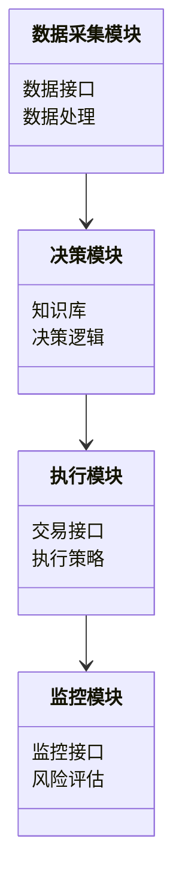
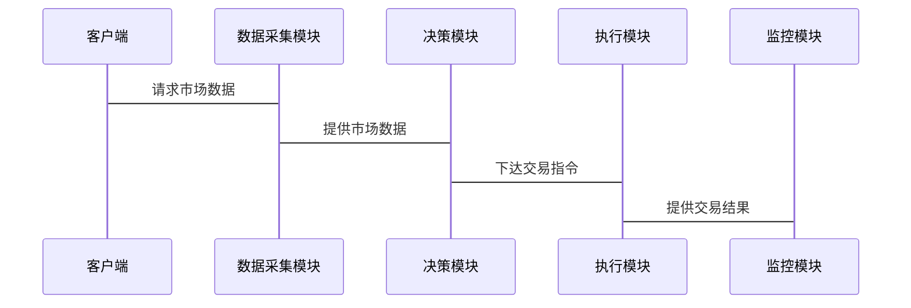

                 


# AI Agent在智能资产管理中的实践

## 关键词：AI Agent, 智能资产管理, 强化学习, 多智能体系统, 资产配置, 风险评估

## 摘要：  
本文系统地探讨了AI Agent在智能资产管理中的实践应用，从AI Agent的基本概念到其在资产管理中的具体应用场景，详细分析了AI Agent的核心技术、算法原理、系统架构以及实际项目中的应用案例。文章通过结合强化学习、监督学习等算法，展示了AI Agent如何帮助实现智能资产配置、风险评估和交易决策等关键任务，为智能资产管理领域提供了新的思路和解决方案。

---

# 第1章: AI Agent与智能资产管理概述

## 1.1 AI Agent的基本概念

### 1.1.1 AI Agent的定义  
AI Agent（人工智能代理）是指能够感知环境、自主决策并执行任务的智能实体。它通过传感器获取信息，利用算法进行分析和推理，并通过执行器与环境交互。AI Agent的核心在于其自主性和智能性，能够适应复杂多变的环境。

### 1.1.2 AI Agent的核心特点  
- **自主性**：能够在没有外部干预的情况下自主运行。  
- **反应性**：能够实时感知环境变化并做出响应。  
- **学习能力**：通过数据和经验不断优化自身的决策能力。  
- **协作性**：能够与其他智能体或系统协同工作，完成复杂任务。  

### 1.1.3 AI Agent与传统算法的区别  
传统算法通常需要明确的规则和固定的执行流程，而AI Agent能够根据环境反馈动态调整行为，具有更强的适应性和灵活性。

---

## 1.2 智能资产管理的背景与现状

### 1.2.1 资产管理的基本概念  
资产管理是指对金融资产（如股票、债券、基金等）进行投资、配置和管理的过程，目的是在风险可控的前提下实现收益最大化。

### 1.2.2 智能资产管理的现状  
随着大数据和人工智能技术的发展，智能资产管理逐渐从传统的基于经验的模式向数据驱动的智能化模式转变。智能资产管理通过算法优化投资组合、实时监控市场变化并做出快速决策。

### 1.2.3 AI Agent在智能资产管理中的应用前景  
AI Agent在智能资产管理中的应用前景广阔，尤其是在资产配置、风险控制和交易决策等领域具有显著优势。

---

## 1.3 AI Agent与智能资产管理的结合

### 1.3.1 AI Agent在资产管理中的优势  
- **高效性**：AI Agent能够快速处理大量数据，提供实时决策支持。  
- **准确性**：通过机器学习算法，AI Agent能够识别数据中的复杂模式，提高决策的准确性。  
- **适应性**：AI Agent能够根据市场变化动态调整策略，适应复杂的市场环境。  

### 1.3.2 AI Agent与智能资产管理的结合方式  
AI Agent可以通过以下方式与智能资产管理结合：  
1. **资产配置**：AI Agent根据市场数据和投资者风险偏好，优化资产配置策略。  
2. **风险评估**：AI Agent实时监控市场风险，提供风险预警和应对方案。  
3. **交易决策**：AI Agent基于市场信号和历史数据，辅助交易决策。  

### 1.3.3 未来发展趋势  
随着AI技术的不断进步，AI Agent在智能资产管理中的应用将更加广泛和深入，尤其是在复杂市场环境下的智能决策和多智能体协作方面。

---

# 第2章: AI Agent的核心概念与技术原理

## 2.1 AI Agent的核心概念

### 2.1.1 知识表示  
知识表示是AI Agent理解和表示环境信息的基础。常见的知识表示方法包括符号表示、概率表示和语义网络等。

### 2.1.2 行为选择  
行为选择是AI Agent根据当前状态和目标选择最优行动的过程。常见的行为选择方法包括基于规则的决策和基于学习的决策。

### 2.1.3 状态感知  
状态感知是AI Agent通过传感器或数据源获取环境信息的过程。常见的状态感知技术包括自然语言处理和计算机视觉。

---

## 2.2 AI Agent的决策机制

### 2.2.1 基于规则的决策  
基于规则的决策是一种简单但有效的决策方法，通过预定义的规则对环境信息进行判断并执行相应的操作。

### 2.2.2 基于学习的决策  
基于学习的决策是通过机器学习算法从历史数据中学习决策策略，常见的算法包括强化学习和监督学习。

### 2.2.3 基于推理的决策  
基于推理的决策是通过逻辑推理和知识推理来做出决策，适用于复杂问题的解决。

---

## 2.3 AI Agent的通信与协作

### 2.3.1 多智能体系统  
多智能体系统是由多个AI Agent组成的协作系统，能够共同完成复杂的任务。

### 2.3.2 智能体之间的通信协议  
智能体之间的通信协议是实现协作的关键，常见的通信协议包括基于消息传递和基于共享内存的通信方式。

### 2.3.3 协作任务分配  
协作任务分配是将任务分配给多个智能体，使其能够协同完成任务。

---

# 第3章: AI Agent在智能资产管理中的应用

## 3.1 资产配置与风险评估

### 3.1.1 基于AI Agent的资产配置策略  
基于AI Agent的资产配置策略是一种动态优化策略，能够根据市场变化实时调整资产配置比例。

### 3.1.2 风险评估与管理  
AI Agent可以通过实时监控市场数据和分析历史数据，评估投资组合的风险并制定相应的风险管理策略。

## 3.2 交易决策与执行

### 3.2.1 基于AI Agent的交易决策  
基于AI Agent的交易决策是一种智能化的交易方式，能够根据市场信号和历史数据做出最优交易决策。

### 3.2.2 交易执行与反馈  
AI Agent在做出交易决策后，通过执行系统完成交易，并根据交易结果和市场反馈不断优化决策模型。

---

# 第4章: AI Agent在智能资产管理中的系统架构

## 4.1 系统功能设计

### 4.1.1 数据采集与处理  
数据采集与处理是系统获取和处理市场数据的关键步骤，常见的数据来源包括股票价格、市场指数等。

### 4.1.2 系统功能模块  
系统功能模块包括数据采集模块、决策模块、执行模块和监控模块等。

### 4.1.3 功能模块之间的关系  
功能模块之间的关系可以通过Mermaid类图表示。



---

## 4.2 系统架构设计

### 4.2.1 系统架构类型  
系统架构类型包括单体架构和微服务架构等。

### 4.2.2 系统架构设计  
系统架构设计可以通过Mermaid架构图表示。


---

## 4.3 系统接口设计

### 4.3.1 接口定义  
接口定义包括数据接口、交易接口和监控接口等。

### 4.3.2 接口实现  
接口实现是通过API实现数据的传递和功能的调用。

---

## 4.4 系统交互流程

### 4.4.1 交互流程设计  
交互流程设计可以通过Mermaid序列图表示。



---

# 第5章: AI Agent在智能资产管理中的项目实战

## 5.1 项目背景与目标

### 5.1.1 项目背景  
项目背景是基于AI Agent实现智能资产管理系统的开发。

### 5.1.2 项目目标  
项目目标包括实现资产配置、风险评估和交易决策等功能。

---

## 5.2 项目实施

### 5.2.1 环境配置  
环境配置包括安装Python、TensorFlow等开发工具和库。

### 5.2.2 核心代码实现  
核心代码实现包括数据采集、决策模块和执行模块的代码实现。

```python
# 数据采集模块
import pandas as pd
import numpy as np

def fetch_data(ticker):
    # 模拟数据获取
    data = pd.DataFrame(np.random.randn(100, 4), columns=[ticker])
    return data

# 决策模块
from tensorflow.keras import models, layers

def build_model(input_dim):
    model = models.Sequential()
    model.add(layers.Dense(64, activation='relu', input_dim=input_dim))
    model.add(layers.Dense(1, activation='sigmoid'))
    model.compile(optimizer='adam', loss='binary_crossentropy', metrics=['accuracy'])
    return model

# 执行模块
def execute_trade(signal):
    # 模拟交易执行
    print(f"执行交易信号：{signal}")
```

---

## 5.3 项目案例分析

### 5.3.1 案例背景  
案例背景是基于AI Agent实现智能资产管理系统的实际应用。

### 5.3.2 数据分析与结果展示  
数据分析与结果展示包括对系统输出的结果进行分析和可视化展示。

### 5.3.3 系统优化与改进  
系统优化与改进包括根据测试结果优化模型和改进系统架构。

---

## 5.4 项目总结

### 5.4.1 项目成果  
项目成果包括实现了一个基于AI Agent的智能资产管理系统。

### 5.4.2 经验与教训  
经验与教训包括在项目实施过程中遇到的问题和解决方法。

### 5.4.3 未来展望  
未来展望包括进一步优化系统和扩展功能。

---

# 第6章: 最佳实践与小结

## 6.1 最佳实践

### 6.1.1 系统设计  
系统设计需要注重模块化和可扩展性。

### 6.1.2 数据处理  
数据处理需要确保数据的准确性和完整性。

### 6.1.3 系统优化  
系统优化需要通过不断测试和反馈进行。

---

## 6.2 小结

### 6.2.1 项目回顾  
项目回顾是对整个项目的总结和反思。

### 6.2.2 关键点总结  
关键点总结包括系统设计、算法选择和数据处理等方面。

### 6.2.3 注意事项  
注意事项包括系统安全、数据隐私和性能优化等。

---

## 6.3 未来展望与推荐

### 6.3.1 未来发展方向  
未来发展方向包括进一步研究和应用AI Agent技术。

### 6.3.2 拓展阅读  
拓展阅读推荐相关领域的书籍和论文。

---

# 作者：AI天才研究院 & 禅与计算机程序设计艺术

