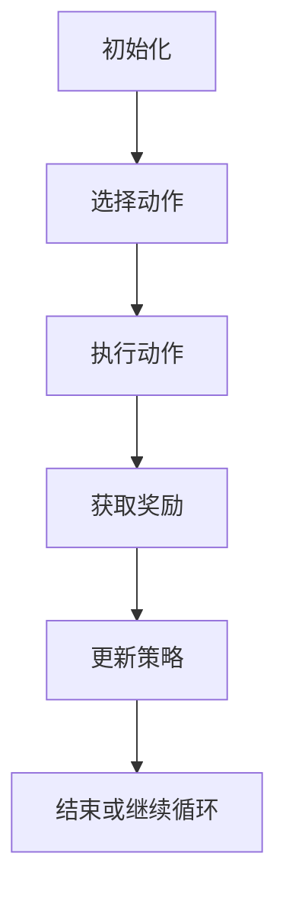
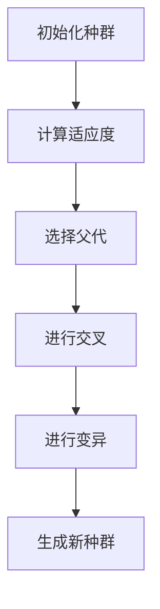
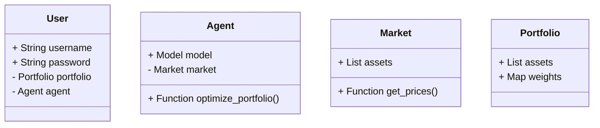

                 


# AI Agent在智能资产组合优化中的应用

## 关键词：AI Agent，资产组合优化，强化学习，金融市场，智能投资

## 摘要：本文探讨AI Agent在智能资产组合优化中的应用，分析其核心概念、算法原理、系统架构，并通过实际案例展示其在金融投资中的潜力。文章结合理论与实践，提供深入的技术解析和实战指导。

---

# 第1章 AI Agent与智能资产组合优化概述

## 1.1 AI Agent的基本概念

### 1.1.1 AI Agent的定义
AI Agent（人工智能代理）是能够感知环境并采取行动以实现目标的智能实体。它通过传感器接收数据，利用算法做出决策，并通过执行器与环境互动。AI Agent的关键特征包括自主性、反应性、目标导向和社会能力。

### 1.1.2 AI Agent的核心特点
- **自主性**：AI Agent能够独立运作，无需外部干预。
- **反应性**：实时感知环境变化并做出响应。
- **目标导向**：基于目标优化决策。
- **学习能力**：通过经验改进性能。

### 1.1.3 AI Agent与传统算法的区别
传统算法依赖预定义规则，而AI Agent具备学习和适应能力，能处理复杂和动态环境。

## 1.2 资产组合优化的定义与特点

### 1.2.1 资产组合优化的定义
资产组合优化是通过优化投资组合的构成和权重，以最大化收益或最小化风险的过程。

### 1.2.2 资产组合优化的核心特点
- **多目标优化**：在收益与风险之间寻求平衡。
- **动态调整**：根据市场变化实时优化。
- **数据驱动**：依赖历史数据和市场信息。

## 1.3 AI Agent在资产组合优化中的作用

### 1.3.1 AI Agent如何提升资产组合优化的效率
AI Agent通过实时数据处理和深度学习模型，快速优化投资组合。

### 1.3.2 AI Agent在复杂市场环境中的优势
AI Agent能处理非线性关系和复杂场景，提供更优的解决方案。

### 1.3.3 AI Agent与人类投资专家的协作潜力
结合人类的经验和AI的数据处理能力，提升投资决策的质量。

## 1.4 当前金融市场中的应用现状

### 1.4.1 传统资产组合优化的局限性
传统方法在复杂市场中表现不佳，且难以处理大数据。

### 1.4.2 AI Agent在金融领域的应用案例
AI Agent用于实时交易决策和风险管理。

### 1.4.3 当前技术与市场的匹配度分析
技术进步和数据量增加使AI Agent在金融中的应用日益广泛。

## 1.5 本章小结
本章介绍了AI Agent和资产组合优化的基本概念，分析了它们在金融中的作用及现状。

---

# 第2章 核心概念原理

## 2.1 AI Agent的原理

### 2.1.1 AI Agent的感知与决策机制
AI Agent通过感知环境数据，利用算法做出决策，并通过执行器采取行动。

### 2.1.2 基于强化学习的AI Agent框架
强化学习框架包括状态、动作、奖励和策略，用于动态调整投资组合。

### 2.1.3 AI Agent的自主学习能力
通过深度学习和强化学习，AI Agent能从经验中学习并改进决策。

## 2.2 资产组合优化的数学模型

### 2.2.1 资产组合优化的目标函数
最大化收益或最小化风险，数学表达为：$$ \max \mu \cdot w - \lambda \cdot w^T \Sigma w $$

### 2.2.2 资产组合优化的约束条件
- 投资权重之和为1：$$ \sum_{i=1}^{n} w_i = 1 $$
- 无卖空约束：$$ w_i \geq 0 $$

### 2.2.3 资产组合优化的评价指标
- **夏普比率**：衡量收益与风险的关系。
- **最大回撤**：评估潜在损失。

## 2.3 AI Agent与资产组合优化的结合点

### 2.3.1 数据驱动的优化策略
AI Agent利用大数据进行预测和优化。

### 2.3.2 动态市场环境下的实时调整
AI Agent能实时响应市场变化，优化投资组合。

### 2.3.3 风险管理与收益最大化之间的平衡
通过AI Agent动态调整风险偏好，平衡收益与风险。

## 2.4 核心概念属性特征对比

| 特性       | AI Agent                 | 传统算法                   |
|------------|--------------------------|---------------------------|
| 自主性      | 高                       | 低                       |
| 反应性      | 高                       | 低                       |
| 学习能力    | 高                       | 无                       |
| 处理复杂性  | 高                       | 低                       |

## 2.5 ER实体关系图

```mermaid
er
actor: 用户
agent: AI Agent
market: 金融市场
portfolio: 资产组合

actor -|> agent: 发出优化指令
agent -|> market: 获取市场数据
agent -|> portfolio: 优化资产组合
```

---

# 第3章 算法原理讲解

## 3.1 强化学习算法

### 3.1.1 算法流程



### 3.1.2 核心代码实现

```python
import numpy as np

class AIAgent:
    def __init__(self, state_space, action_space):
        self.state_space = state_space
        self.action_space = action_space
        self.model = self.build_model()

    def build_model(self):
        # 构建深度学习模型
        pass

    def act(self, state):
        # 根据状态选择动作
        pass

    def learn(self, state, action, reward, next_state):
        # 更新模型参数
        pass
```

## 3.2 遗传算法

### 3.2.1 算法流程



### 3.2.2 核心代码实现

```python
def genetic_algorithm(population_size, generations):
    population = [random.asset_weights() for _ in range(population_size)]
    for _ in range(generations):
        population = evolve_population(population)
    return best_individual(population)
```

## 3.3 数学模型与公式

### 3.3.1 强化学习的数学模型
状态转移概率：$$ P(s'|s,a) $$

价值函数：$$ V(s) = \max_a Q(s,a) $$

---

# 第4章 系统分析与架构设计

## 4.1 问题场景介绍

## 4.2 系统功能设计

### 4.2.1 领域模型



## 4.3 系统架构设计

### 4.3.1 架构图


---

# 第5章 项目实战

## 5.1 环境配置

### 5.1.1 安装必要的库
- Python 3.8+
- NumPy, Pandas, Scikit-learn, TensorFlow

## 5.2 核心代码实现

### 5.2.1 加载数据

```python
import pandas as pd
data = pd.read_csv('market_data.csv')
```

### 5.2.2 训练模型

```python
agent = AIAgent(state_space, action_space)
agent.train(data)
```

## 5.3 实际案例分析

---

# 第6章 总结与展望

## 6.1 本章总结
本文全面探讨了AI Agent在资产组合优化中的应用，分析了其核心原理和实际应用。

## 6.2 未来展望
AI Agent在金融中的应用前景广阔，随着技术进步，其优化能力将更强大。

## 6.3 最佳实践Tips
- 数据质量至关重要
- 模型需定期更新
- 风险管理不可忽视

## 6.4 作者信息
作者：AI天才研究院 & 禅与计算机程序设计艺术

---

# 结语
通过本文的详细讲解，读者可以深入了解AI Agent在智能资产组合优化中的应用，掌握其核心原理和实际操作方法，为未来的投资决策提供有力支持。

