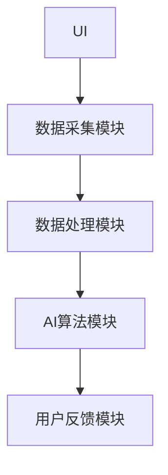

                 


```markdown
# AI Agent在智能跑步鞋中的步态矫正指导

> 关键词：AI Agent，步态矫正，智能跑步鞋，运动科学，算法原理

> 摘要：本文详细探讨了AI Agent在智能跑步鞋中的应用，特别是在步态矫正方面的技术实现。通过分析AI Agent的核心概念、算法原理、系统架构以及实际项目案例，本文为读者提供了一个全面的视角，展示如何利用人工智能技术优化跑步姿势，预防运动损伤，提升跑步效率。

---

## 第一部分: AI Agent与步态矫正的背景介绍

### 第1章: AI Agent与步态矫正的概述

#### 1.1 AI Agent的基本概念
- **1.1.1 AI Agent的定义**
  AI Agent（人工智能代理）是一种能够感知环境、自主决策并执行任务的智能实体。它通过传感器获取信息，利用算法进行分析，并通过执行器实现目标。
  
- **1.1.2 AI Agent的核心特征**
  - **自主性**：无需人工干预，自主完成任务。
  - **反应性**：能够实时感知环境变化并做出反应。
  - **学习能力**：通过数据训练不断提升性能。
  - **社交能力**：能够与其他系统或用户进行交互。

- **1.1.3 AI Agent与传统算法的区别**
  AI Agent不仅仅是算法的执行者，它具备自主决策和适应环境的能力，能够根据实时数据动态调整行为。

#### 1.2 步态矫正的重要性
- **1.2.1 步态问题的常见类型**
  - 膝过伸
  - 踝过度内翻
  - 步频过快或过慢
  - 步幅不均

- **1.2.2 步态问题对跑步者的影响**
  - 易导致运动损伤（如膝盖损伤、足部问题）
  - 影响跑步效率（如能量浪费、速度下降）
  - 加速疲劳累积

- **1.2.3 步态矫正的技术手段**
  - 运动捕捉技术
  - 生物力学分析
  - 人工智能算法

#### 1.3 AI Agent在步态矫正中的应用
- **1.3.1 AI Agent在运动科学中的作用**
  AI Agent可以通过分析跑步数据，识别步态问题，并提供矫正建议。

- **1.3.2 AI Agent如何实现步态矫正**
  - 数据采集：通过传感器获取跑步数据（如步频、步幅、姿态）
  - 数据分析：利用机器学习算法识别步态问题
  - 个性化矫正：根据分析结果提供实时反馈和矫正建议

- **1.3.3 步态矫正的边界与外延**
  - 边界：步态矫正仅针对技术性问题，不涉及体能或力量训练
  - 外延：步态矫正可与其他运动科学领域结合，如营养、康复等

---

## 第2章: AI Agent与智能跑步鞋的结合

### 2.1 智能跑步鞋的功能与特点
- **2.1.1 智能跑步鞋的核心功能**
  - 数据采集：内置传感器采集跑步数据
  - 数据分析：通过AI算法分析步态问题
  - 用户反馈：提供实时矫正建议

- **2.1.2 智能跑步鞋的技术实现**
  - 传感器技术：如加速度计、陀螺仪、压力传感器
  - 无线通信：蓝牙、Wi-Fi
  - 显示界面：LED、震动反馈

- **2.1.3 智能跑步鞋的市场现状**
  - 市场需求：健康意识提升，跑步爱好者增多
  - 技术趋势：AI技术与运动科学的结合

### 2.2 AI Agent在智能跑步鞋中的角色
- **2.2.1 AI Agent在数据采集中的作用**
  - 处理传感器数据，提取关键特征
  - 识别异常步态
  - 实时监测跑步状态

- **2.2.2 AI Agent在数据处理中的作用**
  - 通过机器学习模型分析步态数据
  - 生成个性化矫正方案
  - 提供实时反馈

- **2.2.3 AI Agent在用户反馈中的作用**
  - 通过震动或语音反馈矫正建议
  - 提供历史数据报告
  - 动态调整矫正策略

### 2.3 AI Agent与步态矫正的结合
- **2.3.1 AI Agent如何分析步态数据**
  - 数据采集：步频、步幅、姿态角度、地面反作用力
  - 特征提取：关键时间点、角度变化、能量消耗
  - 数据分类：正常步态、异常步态

- **2.3.2 AI Agent如何优化步态**
  - 实时矫正：通过反馈调整步频、步幅
  - 个性化建议：根据用户特点制定矫正计划
  - 长期跟踪：记录进步，优化策略

- **2.3.3 步态矫正的边界与外延**
  - 边界：仅针对技术性问题，不涉及体能训练
  - 外延：可与其他运动科学领域结合，如营养、康复

---

## 第3章: AI Agent的算法原理与实现

### 3.1 算法原理概述
- 数据采集与预处理
  - 使用传感器采集跑步数据
  - 数据清洗与特征提取

- 机器学习模型训练
  - 使用监督学习分类步态问题
  - 模型优化与调参

- 实时反馈与矫正
  - 基于模型预测结果生成反馈
  - 动态调整矫正策略

### 3.2 算法实现步骤
1. 数据采集：通过传感器获取跑步数据
2. 数据预处理：清洗、归一化
3. 特征提取：提取关键特征（如步频、步幅）
4. 模型训练：训练分类器识别步态问题
5. 实时反馈：根据模型预测结果生成矫正建议

### 3.3 机器学习模型选择
- 分类算法：随机森林、支持向量机、神经网络
- 选择随机森林：高准确性，易于解释

### 3.4 代码实现与流程图
```python
import pandas as pd
from sklearn.ensemble import RandomForestClassifier
from sklearn.metrics import accuracy_score

# 数据加载
data = pd.read_csv('running_data.csv')

# 特征提取
X = data[['step_frequency', 'step_length', 'angle']]
y = data['gait_issue']

# 模型训练
model = RandomForestClassifier()
model.fit(X, y)

# 预测与评估
预测 = model.predict(X)
准确率 = accuracy_score(y, 预测)
print(准确率)
```

### 3.5 数学模型与公式
- 步态矫正的评估模型：
  $$ 步态矫正效果 = \alpha \cdot 步频 + \beta \cdot 步幅 + \gamma \cdot 姿态角度 $$
  其中，$\alpha, \beta, \gamma$ 是通过训练得到的权重。

---

## 第4章: 系统架构与设计

### 4.1 系统功能设计
- 用户界面：显示步态数据、矫正建议
- 数据采集：传感器采集跑步数据
- 数据处理：AI算法分析数据
- 用户反馈：实时反馈矫正建议

### 4.2 系统架构设计


### 4.3 系统接口设计
- 数据接口：传感器数据接口（蓝牙/Wi-Fi）
- 用户接口：APP或智能设备

### 4.4 系统交互流程图
```mermaid
sequenceDiagram
    用户开始跑步
    用户 -> 数据采集模块: 开始采集数据
    数据采集模块 -> 数据处理模块: 传输数据
    数据处理模块 -> AI算法模块: 分析数据
    AI算法模块 -> 用户反馈模块: 生成反馈
    用户反馈模块 -> 用户: 显示矫正建议
```

---

## 第5章: 项目实战与案例分析

### 5.1 环境配置
- 安装Python和相关库（如Pandas、Scikit-learn）
- 安装智能跑步鞋传感器

### 5.2 核心代码实现
```python
import numpy as np
import pandas as pd
from sklearn.ensemble import RandomForestClassifier

# 数据加载
data = pd.read_csv('running_data.csv')

# 特征提取
X = data[['step_frequency', 'step_length', 'angle']]
y = data['gait_issue']

# 模型训练
model = RandomForestClassifier()
model.fit(X, y)

# 预测与评估
预测 = model.predict(X)
准确率 = accuracy_score(y, 预测)
print(f'准确率：{准确率:.2f}')
```

### 5.3 案例分析
- 案例背景：一名跑步爱好者存在膝盖过伸问题
- 系统分析：AI Agent识别问题并提供矫正建议
- 矫正效果：跑步姿势改善，膝盖压力降低

### 5.4 项目小结
- 项目优势：AI Agent实时分析数据，提供个性化矫正建议
- 项目不足：需要大量数据训练模型
- 优化建议：结合更多传感器数据，提升矫正效果

---

## 第6章: 总结与展望

### 6.1 总结
- AI Agent在步态矫正中的应用具有重要意义
- 通过实时数据分析，提供个性化矫正建议
- 有效预防运动损伤，提升跑步效率

### 6.2 未来展望
- 结合更多传感器数据，提升矫正效果
- 引入增强学习，优化矫正策略
- 推动AI Agent在运动科学中的广泛应用

### 6.3 最佳实践 Tips
- 数据隐私保护：确保用户数据安全
- 传感器校准：定期校准传感器，保证数据准确性
- 用户教育：指导用户正确使用系统

---

## 作者：AI天才研究院 & 禅与计算机程序设计艺术

---

通过本文的详细分析，我们展示了AI Agent在智能跑步鞋中的应用，特别是在步态矫正方面的技术实现。通过理论与实践相结合的方式，为读者提供了一个全面的视角，帮助他们理解如何利用人工智能技术优化跑步姿势，提升跑步效率。
```

