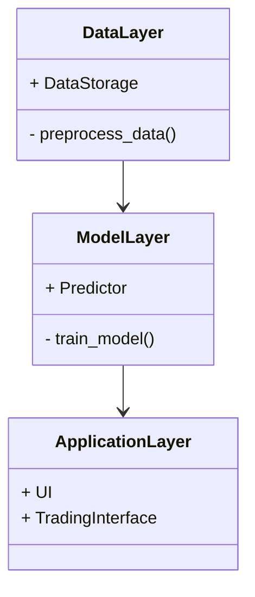

                 


# AI Agent在智能金融市场预测中的应用

**关键词：** AI Agent, 金融市场预测, 智能投资, 算法交易, 机器学习

**摘要：**  
本文深入探讨了AI Agent在智能金融市场预测中的应用，从基本概念到核心算法，再到系统架构和实际案例，全面分析了AI Agent在金融交易中的潜力和挑战。文章首先介绍了AI Agent的定义和核心特征，随后分析了其在金融市场的应用场景，详细讲解了相关的算法原理和技术实现。通过系统架构设计和项目实战，展示了AI Agent的实际应用价值，并提出了未来的发展方向和最佳实践建议。

---

## 第一部分：AI Agent 的基本概念与背景

### 第1章：AI Agent 的定义与核心概念

#### 1.1 AI Agent 的基本定义
AI Agent（人工智能代理）是指能够感知环境、自主决策并执行任务的智能体。在金融市场预测中，AI Agent 可以通过分析历史数据、实时市场动态和外部信息，生成交易策略和预测结果。

#### 1.2 AI Agent 的核心特征
- **自主性**：AI Agent能够独立决策，无需人工干预。
- **反应性**：能够实时感知市场变化并快速响应。
- **学习能力**：通过机器学习算法不断优化预测模型。
- **可解释性**：决策过程需要透明，便于分析和调整。

#### 1.3 AI Agent 在金融领域的应用背景
金融市场数据具有高度的复杂性和不确定性，传统的统计模型和人工分析方法难以应对市场的快速变化。AI Agent 的引入能够提高预测的准确性和交易的效率，尤其是在高频交易和量化投资领域展现出巨大潜力。

---

### 第2章：金融市场预测的现状与挑战

#### 2.1 传统金融市场预测方法的局限性
- **数据维度单一**：传统方法多基于价格和成交量数据，忽略了新闻、社交媒体等非结构化信息。
- **模型泛化能力差**：统计模型在面对市场波动和突发事件时表现不佳。
- **计算效率低**：复杂模型的计算成本较高，难以实时应用。

#### 2.2 AI Agent 在金融市场预测中的优势
- **多源数据处理能力**：能够整合文本、图像等多种数据源，提供更全面的分析。
- **实时决策能力**：通过实时数据处理和快速计算，实现高频交易。
- **自适应能力**：能够根据市场反馈动态调整预测模型。

#### 2.3 当前 AI Agent 技术的发展趋势
- **强化学习的广泛应用**：强化学习在交易策略优化中的应用逐渐增多。
- **跨模态分析**：结合自然语言处理（NLP）和计算机视觉技术，提升信息处理能力。
- **云计算与边缘计算结合**：通过分布式计算提高数据处理效率。

---

## 第二部分：AI Agent 在金融市场的应用场景

### 第3章：AI Agent 的核心算法与技术

#### 3.1 机器学习算法在 AI Agent 中的应用

##### 3.1.1 监督学习
- **线性回归**：用于预测资产价格的变化趋势。
- **支持向量机（SVM）**：适用于分类任务，如判断市场趋势的涨跌。
- **随机森林**：用于特征重要性分析和非线性关系建模。

##### 3.1.2 非监督学习
- **聚类分析**：用于市场分割和客户群体分析。
- **主成分分析（PCA）**：用于降维和特征提取。

##### 3.1.3 强化学习
- **Q-Learning**：通过状态-动作-奖励机制优化交易策略。
- **深度强化学习（DQN）**：利用深度神经网络近似价值函数，实现复杂策略优化。

#### 3.2 自然语言处理在 AI Agent 中的应用

##### 3.2.1 文本数据的处理与分析
- **情感分析**：分析新闻和社交媒体中的市场情绪，预测价格波动。
- **实体识别**：提取公司名称、产品名称等关键信息，用于实时监控。

##### 3.2.2 基于 NLP 的市场情绪分析
- 使用词袋模型（Bag-of-Words）和词嵌入（Word2Vec）分析文本数据，生成市场情绪指标。

##### 3.2.3 跨语言信息提取
- 对多语言文本进行处理，提取跨市场的相关信息。

---

### 第4章：AI Agent 的系统架构与实现

#### 4.1 系统架构设计

##### 4.1.1 分层架构
- **数据层**：负责数据的采集、存储和预处理。
- **计算层**：包括特征提取、模型训练和策略生成。
- **应用层**：提供用户界面和交易执行接口。

##### 4.1.2 微服务架构
- **数据服务**：提供实时数据接口。
- **模型服务**：负责预测和策略生成。
- **交易服务**：执行交易指令。

##### 4.1.3 组件间交互关系
- 数据层通过API向计算层提供数据，计算层生成结果后反馈给应用层。

#### 4.2 数据流与信息处理流程

##### 4.2.1 数据采集与预处理
- 从股票交易所、新闻网站等多源数据中采集信息。
- 对数据进行清洗、标准化和特征工程处理。

##### 4.2.2 特征提取与选择
- 使用主成分分析（PCA）减少特征维度。
- 基于Lasso回归进行特征重要性排序。

##### 4.2.3 模型训练与优化
- 使用交叉验证优化模型参数。
- 通过网格搜索选择最优算法。

---

### 第5章：AI Agent 的数学模型与算法实现

#### 5.1 时间序列分析模型

##### 5.1.1 ARIMA 模型
- **定义**：ARIMA（自回归积分滑动平均模型）用于预测时间序列数据。
- **公式**：ARIMA(p, d, q)，其中p为自回归阶数，d为差分阶数，q为滑动平均阶数。

##### 5.1.2 LSTM 网络
- **定义**：长短期记忆网络，适用于处理长期依赖关系。
- **公式**：通过门控机制（遗忘门、输入门、输出门）实现记忆和遗忘。

##### 5.1.3 GARCH 模型
- **定义**：广义自回归条件异方差模型，用于预测波动性。

#### 5.2 强化学习算法

##### 5.2.1 Q-Learning 算法
- **状态空间**：市场当前的状态（如价格、成交量）。
- **动作空间**：买入、卖出或持有。
- **奖励函数**：基于收益和风险的综合评估。

##### 5.2.2 DQN 算法
- **网络结构**：包括输入层、隐藏层和输出层。
- **损失函数**：均方误差（MSE）或交叉熵损失。

---

## 第三部分：系统分析与架构设计方案

### 第6章：系统分析与架构设计

#### 6.1 项目背景
- 本项目旨在开发一个基于AI Agent的智能金融预测系统，实现自动化交易和风险控制。

#### 6.2 系统功能设计
- **数据采集**：实时获取股票价格、新闻等多源数据。
- **特征提取**：通过NLP和统计方法提取特征。
- **模型训练**：训练机器学习模型并优化参数。
- **策略生成**：基于模型预测生成交易策略。
- **结果展示**：可视化预测结果和交易记录。

#### 6.3 系统架构设计

##### 6.3.1 领域模型类图


##### 6.3.2 系统架构图
```mermaid
client
    client --> API Gateway
    API Gateway --> DataLayer
    DataLayer --> ModelLayer
    ModelLayer --> TradingSystem
```

---

## 第四部分：项目实战

### 第7章：项目实战

#### 7.1 环境安装
- **工具安装**：安装Python、TensorFlow、Keras、Pandas等库。
- **数据源**：使用Yahoo Finance API获取股票数据。

#### 7.2 系统核心实现源代码

##### 7.2.1 数据预处理
```python
import pandas as pd
from sklearn.preprocessing import StandardScaler

# 数据加载
data = pd.read_csv('stock.csv')

# 数据清洗
data.dropna(inplace=True)

# 特征工程
scaler = StandardScaler()
scaled_data = scaler.fit_transform(data[['open', 'high', 'low', 'close']])
```

##### 7.2.2 模型训练
```python
from tensorflow.keras.models import Sequential
from tensorflow.keras.layers import LSTM, Dense

model = Sequential()
model.add(LSTM(64, input_shape=(None, 4)))
model.add(Dense(1))
model.compile(loss='mean_squared_error', optimizer='adam')
model.fit(scaled_data, epochs=100, batch_size=32)
```

##### 7.2.3 策略生成
```python
from backtrader import Strategy

class AI-Agent-Strategy(Strategy):
    def __init__(self):
        self.model = load_model('model.h5')
    
    def next(self):
        data = self.datas[0].get_array()
        prediction = self.model.predict(data)
        if prediction > 0.5:
            self.buy()
        else:
            self.sell()
```

---

### 第8章：总结与展望

#### 8.1 总结
本文详细探讨了AI Agent在智能金融市场预测中的应用，从理论基础到实际应用，全面分析了其在金融交易中的潜力。通过系统架构设计和项目实战，展示了AI Agent的实际价值。

#### 8.2 未来展望
- **多模态分析**：结合图像和文本数据，提升预测精度。
- **边缘计算**：在边缘设备上部署AI Agent，实现低延迟交易。
- **可解释性增强**：优化模型的可解释性，提高用户信任度。

---

**作者：AI天才研究院（AI Genius Institute） & 禅与计算机程序设计艺术（Zen And The Art of Computer Programming）**

