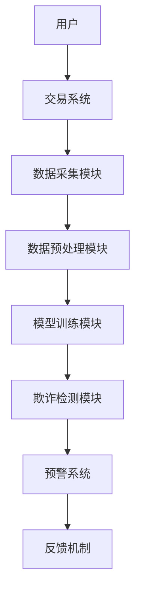
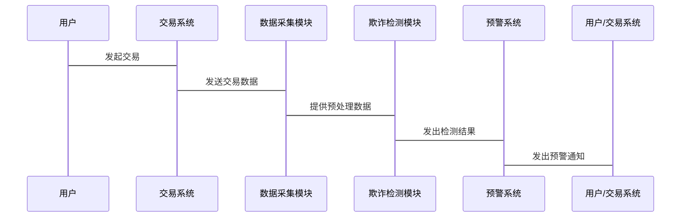

                 


```markdown
# AI Agent在智能金融欺诈检测中的应用

## 关键词：人工智能代理，金融欺诈检测，机器学习，算法原理，系统架构

## 摘要：本文详细探讨了AI Agent在金融欺诈检测中的应用，从背景、概念、算法原理到系统架构和项目实战，全面解析了AI Agent在智能金融欺诈检测中的核心作用及其技术实现。

---

## 第一部分: AI Agent与金融欺诈检测的背景介绍

### 第1章: AI Agent与金融欺诈检测的概述

#### 1.1 AI Agent的基本概念
##### 1.1.1 AI Agent的定义与特点
人工智能代理（AI Agent）是指能够感知环境、做出决策并采取行动的智能实体。其特点包括自主性、反应性、目标导向性和社会性。

##### 1.1.2 AI Agent的核心要素与功能模块
AI Agent的核心要素包括感知模块、决策模块和执行模块。感知模块负责数据采集与处理，决策模块基于感知数据进行推理与决策，执行模块负责执行决策并反馈结果。

##### 1.1.3 AI Agent与传统算法的区别
AI Agent不仅能够处理数据，还能通过与环境的交互不断优化自身行为，具有更强的适应性和主动性，而传统算法通常基于静态规则进行处理。

#### 1.2 金融欺诈检测的现状与挑战
##### 1.2.1 金融欺诈的主要形式与特点
金融欺诈包括信用卡欺诈、网络诈骗、洗钱等多种形式，其特点是隐蔽性、多样性和快速演变。

##### 1.2.2 传统金融欺诈检测方法的局限性
传统方法如规则-based系统和单一机器学习模型在面对复杂欺诈模式时表现有限，难以应对实时性和多样性的挑战。

##### 1.2.3 AI Agent在金融欺诈检测中的优势
AI Agent能够实时感知环境变化，通过强化学习优化决策策略，适应不同场景下的欺诈行为，提高检测准确性和效率。

#### 1.3 AI Agent在金融欺诈检测中的应用前景
##### 1.3.1 金融行业智能化转型的需求
金融机构亟需通过智能化技术提升风险控制能力，降低成本，增强客户信任。

##### 1.3.2 AI Agent在金融欺诈检测中的潜在价值
AI Agent能够实现主动防御，动态调整检测策略，显著提升欺诈检测的准确率和响应速度。

##### 1.3.3 未来发展趋势与研究方向
未来，AI Agent将向多智能体协同、自适应学习和边缘计算方向发展，进一步提升金融欺诈检测的智能化水平。

### 第2章: AI Agent与金融欺诈检测的核心概念

#### 2.1 AI Agent的核心概念与原理
##### 2.1.1 AI Agent的感知、决策与执行模块
感知模块通过传感器或API获取环境数据，决策模块基于强化学习或决策树进行策略选择，执行模块通过API或触发器执行操作。

##### 2.1.2 多智能体系统与分布式计算
AI Agent可以在分布式系统中协同工作，通过通信协议交换信息，共同完成复杂的欺诈检测任务。

##### 2.1.3 强化学习与决策树算法
强化学习通过奖惩机制优化决策策略，决策树算法通过特征提取和分类规则实现精准检测。

#### 2.2 金融欺诈检测的核心要素与属性
##### 2.2.1 欺诈行为的特征提取与分类
通过分析交易频率、金额、地点等特征，结合时间序列分析识别异常行为。

##### 2.2.2 交易数据的实时分析与风险评估
利用流数据处理技术实时监控交易，评估风险等级并触发相应的预警机制。

##### 2.2.3 用户行为模式的建模与分析
基于用户行为序列建模，识别异常行为模式，预测潜在的欺诈行为。

#### 2.3 AI Agent与金融欺诈检测的实体关系图
```mermaid
er
actor: 用户
agent: AI Agent
fraud_pattern: 欺诈模式
transaction: 交易记录
risk_assessment: 风险评估
rules: 检测规则
```

---

## 第二部分: AI Agent的算法原理与数学模型

### 第3章: AI Agent的算法原理

#### 3.1 AI Agent的核心算法
##### 3.1.1 基于强化学习的决策模型
强化学习通过最大化累积奖励来优化决策策略，适用于动态环境下的欺诈检测。

##### 3.1.2 基于监督学习的分类算法
监督学习通过标记数据训练分类器，识别正常与异常交易。

##### 3.1.3 基于无监督学习的异常检测
无监督学习通过聚类分析识别异常模式，适用于未知欺诈行为的发现。

#### 3.2 算法原理的数学模型
##### 3.2.1 强化学习的数学模型
$$ V(s) = \max_{a} [ r(s,a) + V(s') ] $$

##### 3.2.2 决策树算法的分类模型
决策树通过信息增益或基尼指数选择最优特征，构建分类规则。

##### 3.2.3 聚类算法的异常检测模型
$$ 聚类中心为C，异常点为距离C最远的点 $$

#### 3.3 算法实现的代码示例
##### 3.3.1 强化学习算法实现
```python
class AI-Agent:
    def __init__(self):
        self.state = initial_state
        self.reward = 0
        self.done = False

    def perceive(self):
        # 获取环境数据
        return self.env.get_state()

    def decide(self):
        # 基于当前状态选择动作
        action = self.policy.choose_action(self.state)
        return action

    def execute(self, action):
        # 执行动作并获得反馈
        next_state, reward, done = self.env.step(action)
        return next_state, reward, done

    def learn(self):
        # 更新策略
        self.policy.update()
```

##### 3.3.2 决策树算法实现
```python
from sklearn.tree import DecisionTreeClassifier

class Fraud_Detection:
    def __init__(self):
        self.model = DecisionTreeClassifier()

    def train(self, X, y):
        self.model.fit(X, y)

    def predict(self, X):
        return self.model.predict(X)
```

---

## 第三部分: 系统分析与架构设计

### 第4章: 系统分析与架构设计

#### 4.1 问题场景介绍
金融欺诈检测系统需要实时监控交易数据，识别异常行为，及时发出预警。

#### 4.2 系统功能设计
##### 4.2.1 数据采集与预处理
- 数据采集：通过API获取交易数据
- 数据清洗：处理缺失值和异常值
- 数据转换：特征提取与标准化

##### 4.2.2 模型训练与部署
- 训练强化学习模型
- 部署决策树模型
- 配置异常检测规则

##### 4.2.3 系统监控与反馈
- 实时监控交易
- 反馈检测结果
- 调整检测策略

#### 4.3 系统架构设计


#### 4.4 系统接口设计
##### 4.4.1 数据接口
- 输入：交易数据流
- 输出：清洗后的数据

##### 4.4.2 模型接口
- 输入：特征向量
- 输出：预测结果

##### 4.4.3 预警接口
- 输入：检测结果
- 输出：预警通知

#### 4.5 系统交互流程


---

## 第四部分: 项目实战

### 第5章: 项目实战与案例分析

#### 5.1 项目背景与目标
开发一个基于AI Agent的金融欺诈检测系统，实现实时监控和主动防御。

#### 5.2 环境安装与配置
- 安装Python、TensorFlow、Scikit-learn等工具
- 配置数据库和API接口

#### 5.3 系统核心实现
##### 5.3.1 数据采集模块
```python
import requests

class DataCollector:
    def collect_data(self):
        response = requests.get('http://transactionsystem.com/data')
        return response.json()
```

##### 5.3.2 模型训练模块
```python
from sklearn.model_selection import train_test_split
from sklearn.metrics import accuracy_score

class ModelTrainer:
    def train_model(self, X, y):
        X_train, X_test, y_train, y_test = train_test_split(X, y)
        model = DecisionTreeClassifier().fit(X_train, y_train)
        accuracy = accuracy_score(y_test, model.predict(X_test))
        return model, accuracy
```

##### 5.3.3 欺诈检测模块
```python
class FraudDetector:
    def detect_fraud(self, transaction):
        prediction = self.model.predict([transaction])
        return prediction[0]
```

#### 5.4 案例分析与结果解读
通过实际交易数据，展示AI Agent如何识别异常交易并发出预警，分析模型的准确率和召回率。

#### 5.5 项目总结与优化
总结项目的实现效果，分析存在的问题，并提出优化方向，如模型调优、增加特征工程等。

---

## 第五部分: 最佳实践与未来展望

### 第6章: 最佳实践与未来展望

#### 6.1 项目小结
AI Agent在金融欺诈检测中的应用显著提高了检测效率和准确率，但仍需在数据隐私、模型可解释性等方面进行优化。

#### 6.2 实际应用中的注意事项
- 数据隐私保护
- 模型的可解释性
- 系统的实时性和稳定性
- 多模态数据的融合

#### 6.3 未来研究方向
- 多智能体协同优化
- 增强学习在欺诈检测中的应用
- 跨领域知识迁移
- 边缘计算与实时检测

---

## 作者：AI天才研究院/AI Genius Institute & 禅与计算机程序设计艺术 /Zen And The Art of Computer Programming
```

