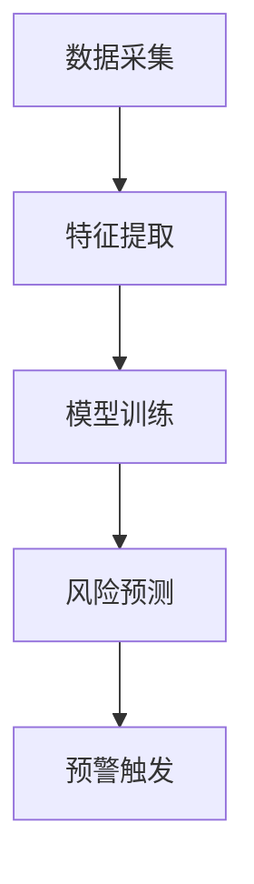
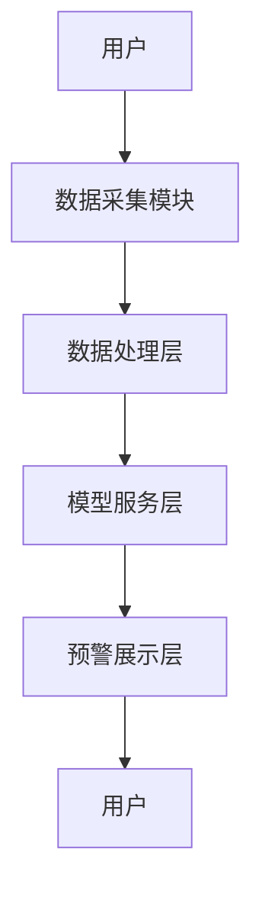

                 


# AI Agent在智能金融风险预警中的应用

> 关键词：AI Agent, 金融风险预警, 智能化, 时间序列分析, 强化学习, 自然语言处理

> 摘要：本文系统阐述了AI Agent在智能金融风险预警中的应用，从基本概念到核心原理，再到系统设计与实际案例，全面解析了AI Agent在金融风险预警中的优势、实现方法与未来发展趋势。

---

## 第一部分: AI Agent与智能金融风险预警概述

### 第1章: AI Agent与金融风险预警概述

#### 1.1 AI Agent的基本概念与定义

AI Agent（人工智能代理）是指能够感知环境、自主决策并执行任务的智能体。在金融领域，AI Agent主要用于处理复杂的数据和信息，帮助识别潜在风险。其核心特征包括：

- **自主性**：无需外部干预即可运行。
- **反应性**：能够实时感知环境变化并做出反应。
- **目标导向**：基于预设目标执行特定任务。

AI Agent在金融风险预警中的应用背景主要源于金融市场的复杂性和不确定性。传统方法依赖人工分析，效率低且容易出错，而AI Agent的智能化优势使其成为金融行业的重要工具。

#### 1.2 AI Agent在金融风险预警中的优势

AI Agent相比传统方法具有显著优势：

- **高效性**：能够快速处理大量数据。
- **准确性**：通过机器学习算法提高预测精度。
- **实时性**：实时监控市场变化，及时发出预警。

#### 1.3 金融风险预警的典型应用场景

AI Agent在以下场景中表现出色：

- **股票市场风险预警**：通过分析市场数据预测股价波动。
- **信贷风险预警**：评估客户的信用风险。
- **市场波动风险预警**：识别市场异常波动。

---

### 第2章: AI Agent的核心原理与技术基础

#### 2.1 AI Agent的核心原理

AI Agent在金融风险预警中的工作流程分为三部分：

1. **感知层**：采集市场数据并提取特征。
2. **决策层**：基于模型预测风险。
3. **执行层**：触发预警并反馈结果。

#### 2.2 AI Agent的关键技术

- **自然语言处理（NLP）**：用于分析新闻和报告。
- **强化学习（Reinforcement Learning）**：用于优化决策策略。
- **时间序列分析**：用于预测市场走势。

#### 2.3 AI Agent的实现流程

1. **数据采集与预处理**：清洗数据，提取特征。
2. **模型训练与优化**：训练模型并调优参数。
3. **系统部署与监控**：实时监控并调整系统。

---

### 第3章: 金融风险预警的数学模型与算法原理

#### 3.1 金融风险预警的数学模型

- **时间序列分析模型**：用于预测市场趋势。
- **风险评估模型**：评估客户或市场的风险等级。
- **联合概率模型**：分析多种因素的联合影响。

#### 3.2 AI Agent的核心算法

- **基于强化学习的决策算法**：通过奖励机制优化决策。
- **基于深度学习的风险预测算法**：使用神经网络预测风险。
- **基于图论的关联分析算法**：识别市场中的关联关系。

#### 3.3 算法流程图



---

### 第4章: 系统架构与设计

#### 4.1 系统整体架构

- **数据源**：包括股票数据、新闻数据等。
- **数据处理层**：负责数据清洗和特征提取。
- **模型服务层**：运行预测模型。
- **预警展示层**：显示预警结果。

#### 4.2 系统功能设计

- **数据采集模块**：从多种来源获取数据。
- **模型训练模块**：训练和优化模型。
- **预警触发模块**：根据模型结果触发预警。

#### 4.3 系统接口设计

- **数据接口**：与数据源对接。
- **预警接口**：向用户展示预警信息。

#### 4.4 系统交互流程图



---

## 第五部分: 项目实战

### 5.1 项目背景与目标

本项目旨在开发一个基于AI Agent的金融风险预警系统，实现对股票市场的实时监控和风险预警。

### 5.2 环境搭建

- **工具安装**：安装Python、TensorFlow、Keras等工具。
- **数据准备**：收集历史股票数据。

### 5.3 核心代码实现

```python
import numpy as np
import pandas as pd
from tensorflow.keras.models import Sequential
from tensorflow.keras.layers import LSTM, Dense

# 数据准备
data = pd.read_csv('stock_data.csv')
X = data.iloc[:, :-1].values
y = data.iloc[:, -1].values

# 模型训练
model = Sequential()
model.add(LSTM(64, input_shape=(timesteps, features)))
model.add(Dense(1))
model.compile(optimizer='adam', loss='mean_squared_error')
model.fit(X, y, epochs=100, batch_size=32)
```

### 5.4 案例分析与解读

通过训练LSTM模型，我们可以实现对股票价格的预测。模型能够捕捉到价格的波动趋势，帮助投资者提前规避风险。

### 5.5 项目总结

本项目展示了AI Agent在金融风险预警中的实际应用，证明了其在提高预警准确性和效率方面的优势。

---

## 第六部分: 总结与展望

### 6.1 总结

AI Agent通过智能化手段显著提升了金融风险预警的效率和准确性。其在股票市场、信贷风险等多个领域的成功应用证明了其价值。

### 6.2 展望

随着技术进步，AI Agent在金融领域的应用将更加广泛，预测模型的精度和系统架构的复杂度将进一步提升。

---

## 第七部分: 注意事项与最佳实践

- **数据质量**：确保数据的准确性和完整性。
- **模型调优**：定期更新模型以适应市场变化。
- **系统监控**：实时监控系统性能和预警效果。

---

## 结语

AI Agent作为一项革命性的技术，正在深刻改变金融行业的运作方式。通过本文的分析，我们相信AI Agent将在未来的金融风险预警中发挥越来越重要的作用。

---

作者：AI天才研究院 & 禅与计算机程序设计艺术

