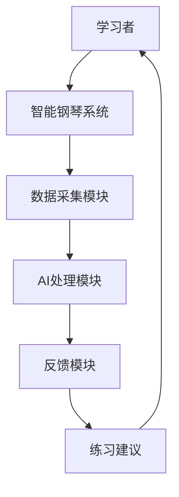
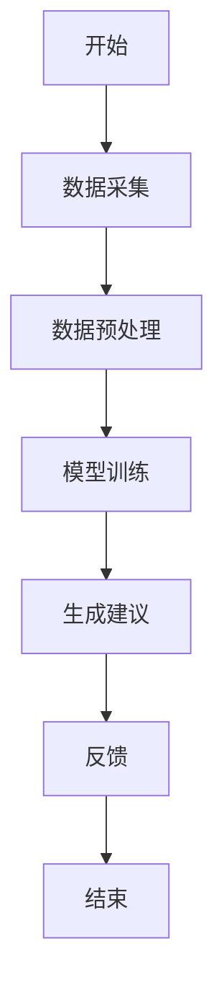
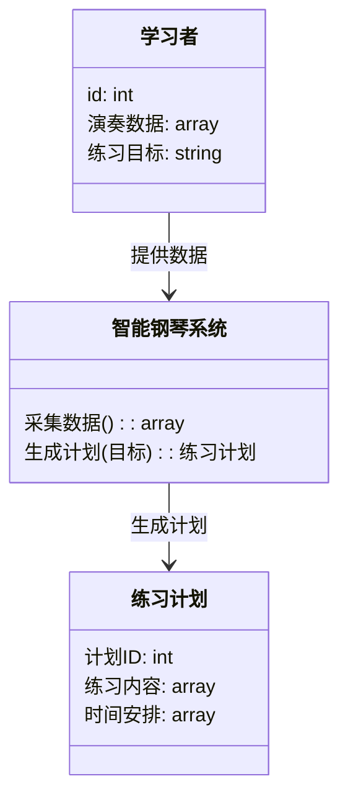

                 


# AI Agent在智能钢琴中的个性化练习计划

> 关键词：AI Agent, 智能钢琴, 个性化练习, 机器学习, 算法, 系统架构

> 摘要：本文详细探讨了AI Agent在智能钢琴中的应用，特别是如何通过个性化练习计划提升学习者的钢琴练习效率。文章首先介绍了AI Agent的基本概念和智能钢琴的发展现状，然后深入分析了AI Agent在个性化练习中的核心算法和系统架构设计。通过实际项目案例，展示了如何实现AI Agent在智能钢琴中的具体应用，并提出了系统的优化建议和未来发展方向。

---

## 第一部分: AI Agent与智能钢琴的背景介绍

### 第1章: AI Agent的基本概念

#### 1.1 AI Agent的定义与特点
AI Agent（人工智能代理）是指能够感知环境并采取行动以实现目标的智能实体。其特点包括自主性、反应性、目标导向和社会能力。

#### 1.2 AI Agent的核心要素与功能模块
- **感知模块**：通过传感器或数据输入感知环境。
- **决策模块**：基于感知信息进行推理和决策。
- **执行模块**：通过执行器对外界采取行动。

#### 1.3 AI Agent在音乐教育中的应用潜力
AI Agent可以通过实时反馈、个性化推荐和自适应学习帮助学习者提高钢琴练习效率。

---

### 第2章: 智能钢琴的发展现状

#### 2.1 智能钢琴的基本概念与技术基础
智能钢琴是一种结合了电子技术、传感器和AI技术的乐器，能够实时捕捉和分析演奏数据。

#### 2.2 智能钢琴的主流技术与应用场景
- **主流技术**：传感器技术、机器学习、自然语言处理。
- **应用场景**：个性化教学、演奏分析、远程教学。

#### 2.3 智能钢琴的用户需求与痛点分析
- **需求**：个性化练习、实时反馈、便捷性。
- **痛点**：传统教学缺乏个性化，效率低。

---

### 第3章: 个性化练习计划的必要性

#### 3.1 学习者个性化需求的分析
每个学习者的音乐基础、学习目标和节奏感不同，需要个性化的练习计划。

#### 3.2 传统钢琴练习计划的局限性
传统练习计划缺乏灵活性，难以满足个体差异。

#### 3.3 AI Agent如何解决个性化练习问题
AI Agent能够根据学习者的特点实时调整练习计划，提供针对性建议。

---

## 第二部分: AI Agent的核心概念与系统架构

### 第4章: AI Agent的核心概念与原理

#### 4.1 AI Agent的基本工作流程
1. **感知环境**：通过传感器获取演奏数据。
2. **分析数据**：使用机器学习模型分析数据。
3. **生成建议**：根据分析结果生成练习建议。
4. **执行反馈**：通过反馈机制优化建议。

#### 4.2 AI Agent的感知、决策与执行模块
- **感知模块**：负责数据采集。
- **决策模块**：负责数据分析和建议生成。
- **执行模块**：负责输出反馈和调整练习计划。

#### 4.3 AI Agent的自适应与学习机制
AI Agent通过不断学习和优化模型，提高建议的准确性和个性化。

---

### 第5章: AI Agent在智能钢琴中的应用架构

#### 5.1 系统的整体架构设计
- **用户界面**：与学习者交互的界面。
- **数据采集模块**：采集演奏数据。
- **AI处理模块**：分析数据并生成建议。
- **反馈模块**：将建议反馈给学习者。

#### 5.2 各功能模块的交互关系
- 数据采集模块将演奏数据传输给AI处理模块。
- AI处理模块分析数据并生成建议，通过反馈模块反馈给学习者。

#### 5.3 系统的输入输出与数据流分析
- **输入**：用户的演奏数据。
- **输出**：个性化的练习建议。

---

### 第6章: AI Agent与智能钢琴的实体关系分析

#### 6.1 实体关系图（ER图）
```mermaid
er
    %%{autoscape:false}%%

    actor 学习者
    actor 教练
    actor 系统管理员
    database 智能钢琴系统
    database 学习者数据
    database 练习计划

    学习者 --> 智能钢琴系统: 提供演奏数据
    智能钢琴系统 --> 练习计划: 生成个性化计划
    练习计划 --> 学习者: 提供反馈
```

#### 6.2 AI Agent的核心流程


---

## 第三部分: 算法原理讲解

### 第7章: AI Agent的算法原理

#### 7.1 算法的基本流程


#### 7.2 算法的数学模型
个性化练习计划的生成基于以下数学模型：
$$
P = f(d, t, s)
$$
其中，P是练习计划，d是演奏数据，t是时间，s是学习者状态。

#### 7.3 算法的Python实现
```python
import numpy as np
from sklearn import linear_model

def generate_plan(data, target):
    model = linear_model.LinearRegression()
    model.fit(data, target)
    return model.predict(new_data)
```

---

## 第四部分: 系统分析与架构设计方案

### 第8章: 问题场景介绍

#### 8.1 系统的功能模块
- **用户界面**：展示演奏数据和练习建议。
- **数据采集模块**：采集用户的演奏数据。
- **AI处理模块**：分析数据并生成练习计划。
- **反馈模块**：将建议反馈给用户。

#### 8.2 领域模型


---

## 第五部分: 项目实战

### 第9章: 项目实战

#### 9.1 环境安装
```bash
pip install numpy scikit-learn matplotlib
```

#### 9.2 核心功能实现

```python
import numpy as np
from sklearn import linear_model

class AIAssistant:
    def __init__(self):
        self.model = linear_model.LinearRegression()
    
    def train(self, X, y):
        self.model.fit(X, y)
    
    def predict(self, X_new):
        return self.model.predict(X_new)
```

#### 9.3 代码解读与分析
- **AIAssistant类**：负责模型训练和预测。
- **train方法**：使用训练数据训练模型。
- **predict方法**：根据新数据生成预测结果。

---

## 第六部分: 总结与展望

### 第10章: 总结与展望

#### 10.1 系统核心内容总结
AI Agent通过实时数据分析和个性化建议，显著提升了钢琴练习的效率和效果。

#### 10.2 系统的优化建议
- 提高模型的自适应能力。
- 优化系统的反馈机制。

#### 10.3 未来的发展方向
- 结合更多AI技术，如强化学习和深度学习。
- 推动智能钢琴在音乐教育中的广泛应用。

---

## 最佳实践 tips

- 在开发AI Agent时，注重数据的准确性和实时性。
- 系统设计时，考虑模块的可扩展性和灵活性。
- 实际应用中，关注用户反馈，不断优化系统。

---

作者：AI天才研究院/AI Genius Institute & 禅与计算机程序设计艺术 /Zen And The Art of Computer Programming

---

这篇博客文章详细介绍了AI Agent在智能钢琴中的应用，从理论到实践，全面分析了个性化练习计划的实现过程。通过系统的架构设计和实际代码示例，帮助读者理解并掌握相关技术。

