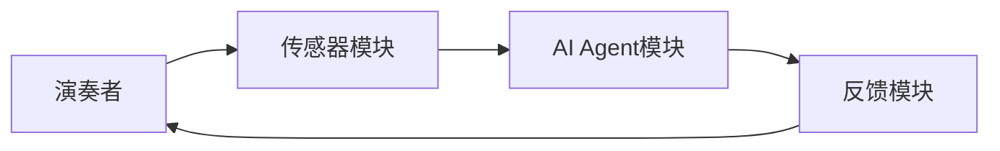

                 


# AI Agent在智能钢琴中的演奏技巧指导

> 关键词：AI Agent, 智能钢琴, 演奏技巧, 人工智能, 音乐技术

> 摘要：本文探讨AI Agent在智能钢琴演奏中的应用，分析其如何通过感知、决策和执行机制优化演奏技巧。文章从背景介绍、核心概念、算法原理、系统架构、项目实战到最佳实践，全面解析AI Agent在智能钢琴中的技术实现和实际应用。

---

## 第一部分: AI Agent与智能钢琴的背景介绍

### 第1章: 问题背景与概念解析

#### 1.1 问题背景

随着音乐技术的进步，智能钢琴逐渐普及，但演奏技巧的提升仍然依赖于人类教师的指导。AI Agent的引入为智能钢琴提供了自动化、个性化的演奏技巧指导，解决了传统教学中时间和资源的限制。

#### 1.2 问题描述

在智能钢琴的演奏中，演奏者需要实时反馈和个性化建议，以改进技巧。然而，传统方法依赖于教师的现场指导，存在效率低、成本高等问题。AI Agent通过自动化分析和反馈机制，能够实时提供演奏技巧的指导。

#### 1.3 问题解决

AI Agent通过感知演奏者的动作、分析音乐表现，并提供实时反馈，帮助演奏者优化技巧。这不仅提高了学习效率，还降低了教学成本。

#### 1.4 边界与外延

AI Agent在智能钢琴中的应用边界在于其感知和决策能力。虽然AI Agent可以提供技术指导，但在音乐情感表达等高级领域仍需人类教师的参与。

---

## 第二部分: AI Agent的核心概念与联系

### 第2章: AI Agent的原理与特征

#### 2.1 AI Agent的基本原理

AI Agent通过感知、决策和执行三个阶段，实现对智能钢琴演奏的实时指导。感知阶段通过传感器采集演奏者的动作数据，决策阶段利用算法分析数据并生成反馈，执行阶段将反馈传递给演奏者。

#### 2.2 AI Agent的核心特征

| 核心特征 | 描述 |
|----------|------|
| 实时性    | 快速响应演奏者的动作 |
| 个性化    | 根据演奏者的技术水平提供定制化反馈 |
| 自适应性  | 根据演奏者的进步动态调整反馈策略 |

---

## 第三部分: 算法原理与实现

### 第3章: 算法原理

#### 3.1 强化学习算法

强化学习通过奖励机制训练AI Agent，使其在演奏中不断优化反馈策略。以下是强化学习的基本流程：

1. 演奏者输入动作数据。
2. AI Agent分析数据并生成反馈。
3. 根据演奏者的反馈调整策略。
4. 循环优化，直至达到最佳反馈效果。

以下是一个强化学习的Python代码示例：

```python
import numpy as np

# 初始化策略参数
theta = np.random.rand(4, 1)

# 定义价值函数
def value_function(x):
    return x.dot(theta)

# 定义策略梯度
def policy_gradient(x):
    return value_function(x)  # 返回价值函数

# 定义奖励函数
def reward_fn(action, target):
    return (action - target) ** 2

# 训练过程
for _ in range(1000):
    x = np.random.rand(1, 4)  # 输入状态
    action = policy_gradient(x)  # 生成动作
    target = np.random.rand(1, 1)  # 目标动作
    reward = reward_fn(action, target)  # 计算奖励
    # 更新策略参数
    theta += learning_rate * (target - action)
```

#### 3.2 Q-Learning算法

Q-Learning通过状态-动作空间的学习，优化AI Agent的反馈策略。以下是Q-Learning的Python代码示例：

```python
# 初始化Q表
Q = np.zeros((4, 4))

# 定义状态和动作空间
state_space = [0, 1, 2, 3]
action_space = [0, 1, 2, 3]

# Q-Learning算法
def q_learning():
    for episode in range(100):
        state = np.random.choice(state_space)
        for step in range(10):
            action = np.random.choice(action_space)
            next_state = np.random.choice(state_space)
            # 计算奖励
            reward = (action == next_state) * 10
            # 更新Q表
            Q[state][action] += learning_rate * (reward + gamma * np.max(Q[next_state]) - Q[state][action])

# 执行Q-Learning
q_learning()
```

---

## 第四部分: 系统架构与实现

### 第4章: 系统架构设计

#### 4.1 系统功能设计

智能钢琴系统由以下功能模块组成：

- **传感器模块**：采集演奏者的动作数据。
- **AI Agent模块**：分析数据并生成反馈。
- **反馈模块**：将反馈传递给演奏者。

#### 4.2 系统架构图



---

## 第五部分: 项目实战

### 第5章: 项目实战

#### 5.1 环境安装

需要安装以下环境和工具：

- Python 3.8+
- NumPy
- scikit-learn
- Mermaid

#### 5.2 核心实现代码

以下是一个AI Agent的Python实现示例：

```python
import numpy as np
from sklearn.neural_network import MLPClassifier

# 初始化数据
X = np.random.rand(100, 4)
y = np.random.randint(0, 4, 100)

# 训练模型
model = MLPClassifier(hidden_layer_sizes=(4, 4))
model.fit(X, y)

# 预测
new_data = np.random.rand(1, 4)
prediction = model.predict(new_data)
print("预测结果:", prediction)
```

---

## 第六部分: 最佳实践与小结

### 第6章: 最佳实践

在使用AI Agent指导智能钢琴演奏时，建议：

- **数据质量**：确保输入数据的准确性和完整性。
- **算法选择**：根据具体需求选择合适的算法。
- **系统优化**：定期更新模型以适应演奏者的技术进步。

---

## 作者

作者：AI天才研究院/AI Genius Institute & 禅与计算机程序设计艺术 /Zen And The Art of Computer Programming

---

通过本文，我们深入探讨了AI Agent在智能钢琴演奏中的应用，从背景介绍到算法实现，再到系统架构和项目实战，为读者提供了全面的技术指导。希望本文能为AI Agent在音乐领域的应用提供有价值的参考。

