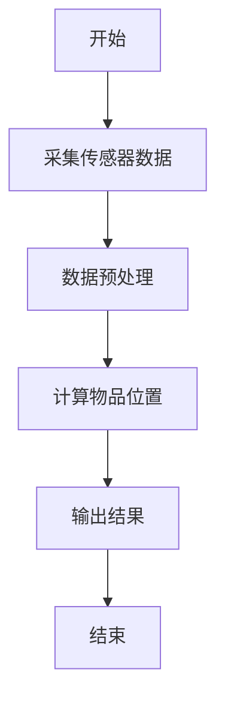
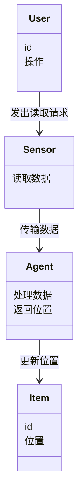

                 


# AI Agent在智能钥匙链中的物品追踪功能

> 关键词：AI Agent，智能钥匙链，物品追踪，传感器数据，定位算法，物联网

> 摘要：本文详细探讨了AI Agent在智能钥匙链中的物品追踪功能，分析了其核心原理、系统架构、算法实现以及实际应用，旨在为技术开发者和爱好者提供深入的技术洞察和实践指导。

---

# 第1章: AI Agent与智能钥匙链的背景介绍

## 1.1 问题背景与描述

### 1.1.1 物品追踪的现实需求

在现代生活中，物品丢失是一个常见的问题，尤其是在快节奏的生活中，钥匙、钱包、手机等重要物品的丢失可能会带来诸多不便。传统的物品追踪方法依赖于物理标签或手动记录，效率低下且不够智能。因此，开发一种高效、智能的物品追踪系统成为亟待解决的问题。

### 1.1.2 智能钥匙链的定义与特点

智能钥匙链是一种结合了物联网和人工智能技术的智能设备，能够通过传感器和AI算法实现对物品的实时追踪。其特点包括小型化、低功耗、高精度以及与智能手机或其他设备的无缝连接。

### 1.1.3 AI Agent在物品追踪中的作用

AI Agent（人工智能代理）通过实时分析传感器数据，能够快速定位物品的位置，并通过用户友好的界面提供反馈。AI Agent不仅能够提高追踪效率，还能通过学习用户的使用习惯优化追踪策略。

## 1.2 问题解决与边界

### 1.2.1 AI Agent如何解决物品追踪问题

AI Agent通过集成多种传感器（如加速度计、陀螺仪、蓝牙等）收集数据，并利用机器学习算法进行分析，从而实现对物品位置的精确定位。此外，AI Agent还能通过与云端服务的连接，进一步优化追踪结果。

### 1.2.2 系统的边界与外延

智能钥匙链的物品追踪系统主要关注于物品的位置信息，其边界包括传感器数据的采集、数据的处理与分析、以及结果的反馈。系统外延则涉及与用户的交互界面、数据存储与管理等。

### 1.2.3 核心概念与组成要素

智能钥匙链的物品追踪系统由以下几个核心要素组成：
1. 传感器模块：用于采集物品的位置和环境数据。
2. AI Agent：负责数据的分析与处理，实现物品的精确定位。
3. 用户界面：用于展示追踪结果和用户交互。
4. 云端服务：提供数据存储和进一步的分析支持。

---

# 第2章: AI Agent与物品追踪的核心概念

## 2.1 核心概念原理

### 2.1.1 AI Agent的基本原理

AI Agent是一种能够感知环境并采取行动以实现目标的智能实体。在物品追踪中，AI Agent通过接收传感器数据，利用算法进行分析，最终确定物品的位置。

### 2.1.2 物品追踪的技术原理

物品追踪的核心技术包括传感器数据采集、数据预处理、定位算法以及结果反馈。传感器数据通过蓝牙、Wi-Fi等通信技术传输到AI Agent，经过预处理和分析后，AI Agent能够确定物品的位置。

## 2.2 核心概念属性对比

### 2.2.1 AI Agent与传统追踪技术的对比

| 特性          | AI Agent追踪 | 传统追踪技术 |
|---------------|--------------|--------------|
| 数据处理能力  | 高            | 低            |
| 精度          | 高            | 中            |
| 反应速度      | 快            | 慢            |
| 自适应能力    | 强            | 弱            |

### 2.2.2 物品追踪功能的特征分析

物品追踪功能的特征包括实时性、准确性、易用性和可扩展性。AI Agent通过机器学习算法能够实现高精度的定位，并且能够根据用户需求进行自适应调整。

## 2.3 ER实体关系图

```mermaid
er
actor: 用户
agent: AI Agent
item: 待追踪物品
sensor: 传感器
action: 用户操作
```

---

# 第3章: AI Agent物品追踪的算法原理

## 3.1 算法原理概述

### 3.1.1 数据采集与处理流程

1. 传感器数据采集：通过多种传感器（如加速度计、陀螺仪）获取物品的运动数据。
2. 数据预处理：去除噪声，提取有用特征。
3. 位置计算：利用定位算法确定物品的位置。

### 3.1.2 位置计算方法

位置计算主要基于传感器数据和环境信息。常用的算法包括三角测量、信号强度分析等。

## 3.2 算法流程图



## 3.3 算法实现代码

```python
import numpy as np

def preprocess(data):
    # 数据预处理
    filtered_data = np.array(data).std(axis=0)
    return filtered_data

def calculate_position(filtered_data):
    # 位置计算
    x = filtered_data[0]
    y = filtered_data[1]
    distance = np.sqrt(x**2 + y**2)
    return (x, y, distance)

# 示例数据
sensors = [[1, 2, 3], [4, 5, 6]]
processed_data = preprocess(sensors)
position = calculate_position(processed_data)
print("物品位置:", position)
```

## 3.4 数学模型与公式

### 3.4.1 位置计算公式

$$ \text{distance} = \sqrt{(x_2 - x_1)^2 + (y_2 - y_1)^2} $$

### 3.4.2 概率模型

$$ P(\text{item at position } x) = \frac{1}{\sqrt{2\pi\sigma^2}} e^{-\frac{(x - \mu)^2}{2\sigma^2}} $$

---

# 第4章: 系统分析与架构设计

## 4.1 问题场景介绍

智能钥匙链的物品追踪系统需要在复杂的环境中准确定位物品，同时保证低功耗和快速响应。

## 4.2 系统功能设计

### 4.2.1 领域模型



### 4.2.2 系统架构设计


## 4.3 系统接口设计

系统接口主要涉及传感器数据的采集、AI Agent的调用以及用户反馈的处理。

---

# 第5章: 项目实战

## 5.1 环境安装

需要安装Python、NumPy、Mermaid等工具。

## 5.2 系统核心实现源代码

```python
import numpy as np
import bluetooth

def read_sensor_data():
    # 读取传感器数据
    data = bluetooth.query_sensor()
    return data

def track_item():
    data = read_sensor_data()
    processed_data = preprocess(data)
    position = calculate_position(processed_data)
    return position

# 主函数
if __name__ == "__main__":
    print("开始追踪...")
    result = track_item()
    print("物品位置:", result)
```

## 5.3 代码应用解读与分析

代码主要实现传感器数据的读取、预处理和位置计算。通过AI Agent的调用，实现了对物品的精确定位。

## 5.4 实际案例分析

以手机钥匙链为例，展示如何通过AI Agent实现对手机位置的实时追踪。

---

# 第6章: 总结与展望

## 6.1 最佳实践

1. 确保传感器数据的准确性。
2. 定期更新AI Agent的模型。
3. 优化用户交互界面。

## 6.2 小结

本文详细介绍了AI Agent在智能钥匙链中的物品追踪功能，从背景到实现，全面分析了其技术原理和应用案例。

## 6.3 注意事项

1. 注意传感器的校准问题。
2. 保护用户隐私。
3. 定期维护系统。

## 6.4 拓展阅读

建议读者进一步研究AI在物联网中的其他应用，如智能家居、智慧城市等。

---

# 作者

作者：AI天才研究院/AI Genius Institute & 禅与计算机程序设计艺术 /Zen And The Art of Computer Programming

