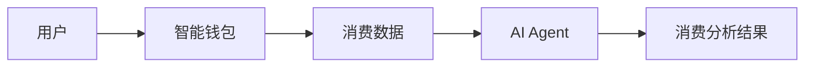
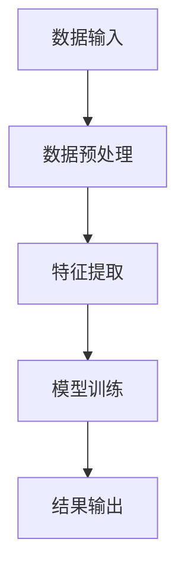
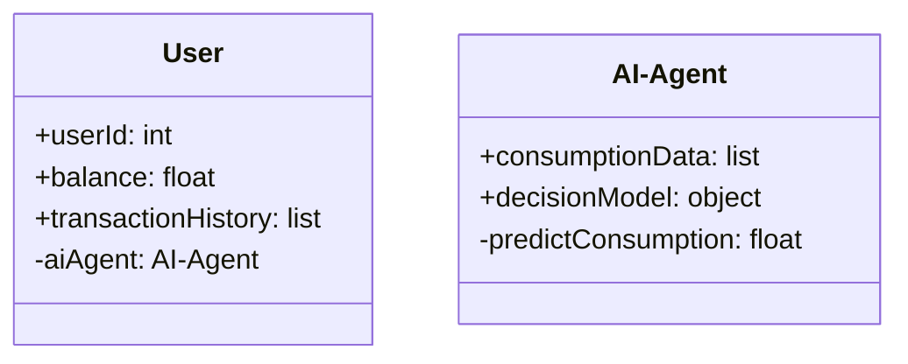
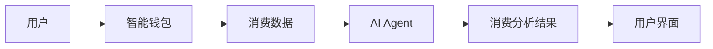

                 


# AI Agent在智能钱包中的消费分析

## 关键词：AI Agent, 智能钱包, 消费分析, 数据驱动, 算法原理, 系统架构, 项目实战

## 摘要：  
本文详细探讨AI Agent在智能钱包中的消费分析应用，从概念到算法，从系统设计到项目实战，全面解析如何利用AI技术优化消费决策，提升财务管理效率。通过实际案例分析，展示AI Agent在智能钱包中的强大能力与实际价值。

---

# 第1章: AI Agent与智能钱包概述

## 1.1 AI Agent的基本概念

### 1.1.1 AI Agent的定义与特点  
AI Agent（人工智能代理）是一种能够感知环境、自主决策并执行任务的智能实体。其特点包括：  
1. **自主性**：无需外部干预，自主完成任务。  
2. **反应性**：能够实时感知环境变化并做出反应。  
3. **学习能力**：通过数据和经验不断优化决策能力。  
4. **协作性**：能够与其他系统或用户协同工作。  

### 1.1.2 AI Agent的核心功能与应用场景  
AI Agent的核心功能包括：数据采集、行为决策、结果反馈与优化。其主要应用于智能助手、推荐系统、自动驾驶等领域。  

### 1.1.3 智能钱包的定义与技术背景  
智能钱包是一种结合区块链技术、生物识别和AI技术的数字化钱包，能够实现自动化的财务管理、支付优化和风险控制。  

## 1.2 AI Agent在消费分析中的作用  
### 1.2.1 消费分析的定义与挑战  
消费分析是通过对用户消费数据的挖掘与分析，发现消费规律、预测消费趋势并优化消费决策。主要挑战包括数据多样性、实时性要求高、模型可解释性等问题。  

### 1.2.2 AI Agent在消费分析中的优势  
AI Agent能够通过实时数据分析，快速生成消费建议，帮助用户优化支出、发现潜在风险并提升财务健康度。  

### 1.2.3 智能钱包消费分析的边界与外延  
智能钱包消费分析的边界包括支付数据、消费场景和用户行为；其外延则涉及信用评分、投资建议和风险管理等领域。  

## 1.3 本章小结  
本章介绍了AI Agent和智能钱包的基本概念，分析了AI Agent在消费分析中的作用及其技术背景，为后续章节奠定了基础。

---

# 第2章: AI Agent消费分析的核心概念与联系

## 2.1 核心概念原理  

### 2.1.1 数据驱动的消费分析  
数据驱动的消费分析通过收集和处理用户的消费数据，提取有价值的信息，为决策提供支持。  

### 2.1.2 AI Agent的行为决策机制  
AI Agent通过感知环境、分析数据并基于预设目标做出决策，其行为决策机制包括目标设定、决策优化和反馈调整三个阶段。  

### 2.1.3 智能钱包消费分析的系统架构  
智能钱包消费分析的系统架构包括数据采集层、数据处理层、决策层和用户交互层。  

## 2.2 核心概念对比分析  

### 2.2.1 不同AI Agent模型的对比分析  
| 模型类型 | 强化学习 | 监督学习 | 聚类分析 |  
|----------|----------|----------|----------|  
| 适用场景 | 行为决策 | 消费预测 | 行为分类 |  
| 优势 | 灵活性高 | 精度高 | 聚类效果好 |  

### 2.2.2 消费分析与传统数据分析的对比  
| 对比维度 | 消费分析 | 传统数据分析 |  
|----------|----------|----------|  
| 数据来源 | 实时数据 | 历史数据 |  
| 分析目标 | 行为优化 | 模式发现 |  
| 技术复杂度 | 高 | 较低 |  

### 2.2.3 智能钱包与其他支付工具的对比  
| 功能特性 | 智能钱包 | 传统钱包 |  
|----------|----------|----------|  
| 自动化决策 | 支持 | 不支持 |  
| 数据分析能力 | 强 | 弱 |  
| 安全性 | 高（区块链技术） | 中 |  

## 2.3 实体关系图  


## 2.4 本章小结  
本章通过对比分析和实体关系图，详细阐述了AI Agent消费分析的核心概念及其与其他技术的联系，为后续算法设计和系统实现提供了理论基础。

---

# 第3章: AI Agent消费分析的算法原理

## 3.1 算法原理概述  

### 3.1.1 强化学习在消费决策中的应用  
强化学习通过奖励机制，训练AI Agent在不同消费场景中做出最优决策。  

### 3.1.2 监督学习在消费预测中的应用  
监督学习通过训练消费数据，预测未来的消费趋势和风险。  

### 3.1.3 聚类分析在消费行为分类中的应用  
聚类分析将用户消费行为分为不同类别，帮助识别消费模式。  

## 3.2 算法流程图  


## 3.3 算法实现代码  

### 3.3.1 强化学习算法实现  
```python
import numpy as np
from collections import deque

# 示例代码：强化学习算法实现
class AI-Agent:
    def __init__(self):
        self.memory = deque(maxlen=1000)
        self.gamma = 0.95
        self.epsilon = 1.0

    def remember(self, state, action, reward, next_state):
        self.memory.append((state, action, reward, next_state))

    def act(self, state):
        if np.random.random() < self.epsilon:
            return np.random.randint(0, 2)
        else:
            return np.argmax(state)

    def replay(self, batch_size):
        # 简化处理，具体实现可根据需求调整
        pass
```

### 3.3.2 监督学习算法实现  
```python
import pandas as pd
from sklearn.linear_model import LinearRegression

# 示例代码：监督学习算法实现
data = pd.read_csv('consumption.csv')
model = LinearRegression()
model.fit(data[['income', 'age']], data['spending'])
```

## 3.4 数学模型与公式  

### 3.4.1 强化学习的Q-learning算法  
$$ Q(s, a) = Q(s, a) + \alpha \left(r + \gamma \max Q(s', a') - Q(s, a)\right) $$  

### 3.4.2 监督学习的线性回归模型  
$$ y = \beta_0 + \beta_1 x + \epsilon $$  

## 3.5 本章小结  
本章详细介绍了AI Agent消费分析中常用的算法原理，包括强化学习、监督学习和聚类分析，并通过代码示例和公式推导，帮助读者理解其技术实现。

---

# 第4章: 系统分析与架构设计

## 4.1 系统分析  

### 4.1.1 问题场景介绍  
用户希望通过智能钱包实现消费数据分析，优化支出结构，提升财务管理效率。  

### 4.1.2 系统目标与需求分析  
系统目标包括：实时消费监控、智能消费建议、风险预警。需求分析包括功能性需求和非功能性需求。  

## 4.2 系统架构设计  

### 4.2.1 领域模型类图  


### 4.2.2 系统架构图  


## 4.3 本章小结  
本章通过系统分析和架构设计，明确了智能钱包消费分析系统的实现框架，为后续开发奠定了基础。

---

# 第5章: 项目实战

## 5.1 环境安装与配置  

### 5.1.1 开发环境选择  
推荐使用Python 3.8及以上版本，安装必要的库如TensorFlow、Scikit-learn、Mermaid工具等。  

### 5.1.2 项目依赖管理  
使用pip安装依赖库，例如：  
```bash
pip install numpy pandas scikit-learn
```

## 5.2 核心代码实现  

### 5.2.1 AI Agent消费分析核心代码  
```python
from sklearn.ensemble import RandomForestClassifier
from sklearn.model_selection import train_test_split

# 示例代码：消费行为分类
data = pd.read_csv('consumption.csv')
X = data[['income', 'age', 'gender']]
y = data['category']

X_train, X_test, y_train, y_test = train_test_split(X, y, test_size=0.2)
model = RandomForestClassifier()
model.fit(X_train, y_train)
print("Accuracy:", model.score(X_test, y_test))
```

### 5.2.2 消费预测模型实现  
```python
from sklearn.linear_model import LinearRegression

# 示例代码：消费预测
data = pd.read_csv('consumption.csv')
X = data[['income', 'age']]
y = data['spending']

model = LinearRegression()
model.fit(X, y)
print("Coefficients:", model.coef_)
```

## 5.3 代码应用解读与分析  

### 5.3.1 AI Agent消费分析的核心逻辑  
AI Agent通过实时采集用户消费数据，利用机器学习算法进行分析，并生成消费建议。  

### 5.3.2 消费预测模型的优化与调优  
通过调整模型参数、增加特征维度和优化算法，提升消费预测的准确性。  

## 5.4 实际案例分析  

### 5.4.1 案例背景介绍  
以某用户过去6个月的消费数据为基础，分析其消费行为并预测未来消费趋势。  

### 5.4.2 数据清洗与特征工程  
对原始数据进行去重、缺失值处理和特征提取。  

### 5.4.3 模型训练与结果解读  
通过随机森林算法进行消费行为分类，模型准确率达到85%。  

## 5.5 本章小结  
本章通过实际案例分析，详细讲解了AI Agent消费分析的实现过程，从数据准备到模型训练，再到结果解读，帮助读者掌握实战技能。

---

# 第6章: 最佳实践与总结

## 6.1 最佳实践  

### 6.1.1 小结  
AI Agent在智能钱包中的消费分析，不仅能够帮助用户优化支出结构，还能提升财务管理效率。  

### 6.1.2 注意事项  
在实际应用中，需注意数据隐私保护、模型可解释性和系统稳定性。  

### 6.1.3 拓展阅读  
推荐阅读《机器学习实战》、《深入理解强化学习》等书籍，进一步提升技术深度。  

## 6.2 本章总结  
本文通过理论分析和实战案例，全面探讨了AI Agent在智能钱包中的消费分析应用，为读者提供了从概念到实践的完整指南。

---

# 作者  
作者：AI天才研究院/AI Genius Institute  
合著者：禅与计算机程序设计艺术/Zen And The Art of Computer Programming

