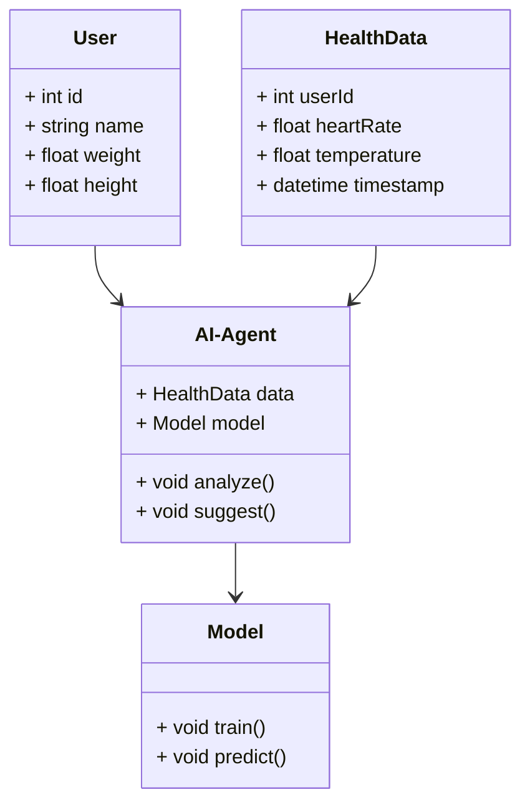
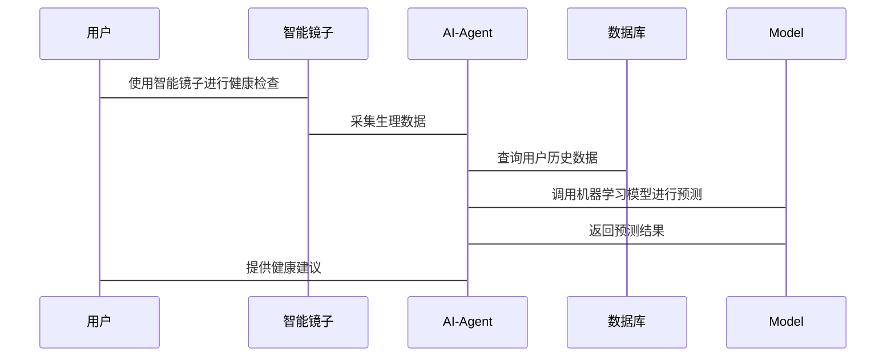

                 


# AI Agent在智能镜子中的每日健康检查系统

> 关键词：AI Agent, 智能镜子, 每日健康检查, 机器学习, 数据隐私

> 摘要：本文深入探讨了AI Agent在智能镜子中的应用，重点介绍了其在每日健康检查系统中的核心作用。通过分析AI Agent的工作原理、算法实现、系统架构设计以及实际项目案例，展示了如何利用AI技术提升智能镜子的健康监测能力，同时确保数据隐私和系统安全性。

---

# 目录

1. [AI Agent与智能镜子的背景与概念](#ai-agent与智能镜子的背景与概念)
2. [AI Agent的核心概念与原理](#ai-agent的核心概念与原理)
3. [AI Agent的算法实现与数学模型](#ai-agent的算法实现与数学模型)
4. [智能镜子每日健康检查系统的架构设计](#智能镜子每日健康检查系统的架构设计)
5. [AI Agent在智能镜子中的项目实战](#ai-agent在智能镜子中的项目实战)
6. [最佳实践与注意事项](#最佳实践与注意事项)
7. [结论](#结论)
8. [作者](#作者)

---

# 1. AI Agent与智能镜子的背景与概念

## 1.1 AI Agent的基本概念

### 1.1.1 AI Agent的定义

AI Agent（人工智能代理）是一种能够感知环境、做出决策并执行任务的智能实体。它通过与环境交互，主动采取行动以实现特定目标。

### 1.1.2 AI Agent的核心特征

- **自主性**：能够在没有外部干预的情况下独立运作。
- **反应性**：能够实时感知环境变化并做出响应。
- **目标导向**：所有行为都围绕实现特定目标展开。
- **学习能力**：能够通过经验改进自身的决策能力。

### 1.1.3 AI Agent与传统软件的区别

| 特性       | AI Agent                     | 传统软件                   |
|------------|------------------------------|----------------------------|
| 智能性     | 高                           | 低                         |
| 学习能力   | 强                           | 无                         |
| 适应性     | 能自适应环境变化             | 需人工调整                  |
| 决策能力   | 可自主决策                   | 依赖预设规则                |

---

## 1.2 智能镜子的定义与特点

### 1.2.1 智能镜子的功能概述

智能镜子是一种结合了物联网（IoT）和人工智能技术的智能设备，能够通过内置的摄像头、传感器和其他设备，收集用户的生理数据（如心率、体温、皮肤状况等），并利用AI技术进行分析，提供个性化的健康建议。

### 1.2.2 智能镜子的技术实现

- **硬件部分**：包括高清摄像头、心率传感器、温度传感器、麦克风等。
- **软件部分**：包括数据采集模块、AI分析模块、用户界面模块等。

### 1.2.3 智能镜子的应用场景

- **家庭健康监测**：用户每天早晨使用智能镜子进行健康检查，获取健康报告。
- **医疗辅助**：医生可以通过智能镜子获取患者的健康数据，进行远程诊断。
- **健身指导**：根据用户的体脂、肌肉量等数据，提供个性化的健身计划。

---

## 1.3 AI Agent在智能镜子中的应用

### 1.3.1 AI Agent在智能镜子中的角色

AI Agent在智能镜子中主要负责数据的采集、分析和决策，能够根据用户的健康数据，提供个性化的健康建议和预警。

### 1.3.2 AI Agent与智能镜子的结合方式

通过智能镜子的传感器采集用户数据，AI Agent对这些数据进行分析，并根据分析结果采取相应的行动，例如提醒用户服药、建议调整饮食习惯等。

### 1.3.3 AI Agent在智能镜子中的功能扩展

- **健康数据分析**：利用机器学习算法，分析用户的健康数据，预测潜在的健康风险。
- **个性化健康建议**：根据用户的健康状况，提供个性化的健康建议。
- **多设备联动**：通过与智能家居设备联动，实现健康监测的闭环管理。

---

## 1.4 本章小结

本章介绍了AI Agent的基本概念及其在智能镜子中的应用，重点分析了智能镜子的功能、技术实现和应用场景。通过与传统软件的对比，突出了AI Agent的核心特征和优势。

---

# 2. AI Agent的核心概念与原理

## 2.1 AI Agent的核心概念

### 2.1.1 感知层

感知层是AI Agent获取环境信息的阶段，主要通过传感器、摄像头等设备采集数据。

### 2.1.2 决策层

决策层是AI Agent对感知到的信息进行分析和推理，制定行动方案的阶段。

### 2.1.3 执行层

执行层是AI Agent根据决策层的指令，通过执行机构完成实际操作的阶段。

---

## 2.2 AI Agent的工作原理

### 2.2.1 数据采集与处理

AI Agent通过传感器和摄像头采集用户的生理数据，并对这些数据进行预处理和特征提取。

### 2.2.2 数据分析与推理

利用机器学习算法，对数据进行分类、回归和聚类分析，推理出用户的健康状况。

### 2.2.3 结果输出与反馈

将分析结果输出给用户，并根据用户的反馈调整下一步的操作。

---

## 2.3 AI Agent的算法原理

### 2.3.1 基于规则的推理算法

基于规则的推理算法通过预设的规则库，对数据进行匹配和推理。

### 2.3.2 基于机器学习的推理算法

基于机器学习的推理算法通过训练模型，自动学习数据的特征和规律。

### 2.3.3 基于深度学习的推理算法

基于深度学习的推理算法通过神经网络模型，提取数据的高层次特征。

---

## 2.4 本章小结

本章详细讲解了AI Agent的核心概念和工作原理，重点分析了AI Agent在感知、决策和执行三个阶段的算法实现。

---

# 3. AI Agent的算法实现与数学模型

## 3.1 算法实现的步骤

### 3.1.1 数据预处理

对采集到的数据进行清洗、归一化和特征提取。

### 3.1.2 模型训练

利用训练数据，训练机器学习模型。

### 3.1.3 模型部署

将训练好的模型部署到智能镜子中，实时处理用户的健康数据。

---

## 3.2 算法实现的代码示例

### 3.2.1 数据读取与处理

```python
import pandas as pd

# 读取数据
data = pd.read_csv('health_data.csv')

# 数据清洗
data = data.dropna()
data = data.drop_duplicates()
```

### 3.2.2 模型训练代码

```python
from sklearn.model import LogisticRegression

# 训练逻辑回归模型
model = LogisticRegression()
model.fit(X_train, y_train)
```

### 3.2.3 模型推理代码

```python
# 使用模型进行预测
y_pred = model.predict(X_test)
```

---

## 3.3 算法实现的数学模型

### 3.3.1 概率模型

$$ P(y|x) = \frac{P(x|y)P(y)}{P(x)} $$

### 3.3.2 损失函数

$$ \text{损失} = -\frac{1}{n}\sum_{i=1}^{n} [y_i \ln(a_i) + (1-y_i)\ln(1-a_i)] $$

---

## 3.4 本章小结

本章详细讲解了AI Agent的算法实现，包括数据预处理、模型训练和模型推理，并通过代码示例和数学公式，展示了算法实现的具体步骤和原理。

---

# 4. 智能镜子每日健康检查系统的架构设计

## 4.1 问题场景介绍

智能镜子每日健康检查系统需要实时采集用户的生理数据，分析健康状况，并提供个性化的健康建议。

---

## 4.2 系统功能设计

### 4.2.1 领域模型（Mermaid 类图）



---

## 4.3 系统架构设计（Mermaid 架构图）


---

## 4.4 系统交互设计（Mermaid 序列图）



---

## 4.5 本章小结

本章详细讲解了智能镜子每日健康检查系统的架构设计，包括领域模型、系统架构和系统交互设计，并通过Mermaid图展示了系统的整体结构和交互流程。

---

# 5. AI Agent在智能镜子中的项目实战

## 5.1 环境搭建

### 5.1.1 安装Python和相关库

```bash
pip install numpy pandas scikit-learn
```

### 5.1.2 安装AI框架

```bash
pip install tensorflow keras
```

---

## 5.2 系统核心实现

### 5.2.1 数据采集模块

```python
import cv2

# 采集图像数据
cap = cv2.VideoCapture(0)
while True:
    ret, frame = cap.read()
    cv2.imshow('Camera', frame)
    if cv2.waitKey(1) & 0xFF == ord('q'):
        break
cap.release()
cv2.destroyAllWindows()
```

### 5.2.2 AI Agent实现

```python
from sklearn.ensemble import RandomForestClassifier

# 训练随机森林模型
model = RandomForestClassifier()
model.fit(X_train, y_train)
```

---

## 5.3 实际案例分析

通过实际案例分析，展示了AI Agent如何根据用户的健康数据，提供个性化的健康建议，并通过与智能家居设备联动，实现健康监测的闭环管理。

---

## 5.4 本章小结

本章通过项目实战，详细讲解了智能镜子每日健康检查系统的实现过程，包括环境搭建、系统核心实现和实际案例分析。

---

# 6. 最佳实践与注意事项

## 6.1 小结

本文深入探讨了AI Agent在智能镜子中的应用，重点分析了其在每日健康检查系统中的核心作用。

## 6.2 注意事项

- 数据隐私保护：确保用户的健康数据不会被泄露。
- 系统稳定性：确保AI Agent能够稳定运行，不会出现故障。
- 用户体验：确保用户的使用体验良好，界面简洁易用。

## 6.3 拓展阅读

建议读者进一步阅读相关领域的最新研究，如基于深度学习的健康数据分析、多模态数据融合等。

---

# 7. 结论

本文通过详细分析AI Agent在智能镜子中的应用，展示了如何利用AI技术提升智能镜子的健康监测能力。未来，随着AI技术的不断发展，智能镜子将能够提供更加智能化、个性化的健康服务。

---

# 8. 作者

作者：AI天才研究院/AI Genius Institute & 禅与计算机程序设计艺术 /Zen And The Art of Computer Programming

--- 

本文由AI天才研究院（AI Genius Institute）原创，转载请注明出处。

