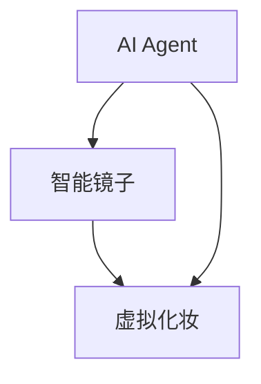
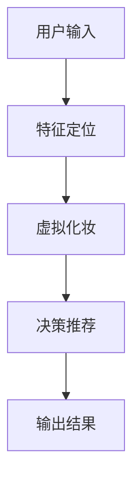

                 


# AI Agent在智能镜子中的虚拟化妆

> 关键词：AI Agent, 智能镜子, 虚拟化妆, 目标检测, 图像分割, 人脸识别, 人机交互

> 摘要：本文详细探讨了AI Agent在智能镜子中的虚拟化妆应用，从技术背景到核心算法，从系统架构到项目实战，全面解析这一创新技术的实现与应用。通过结合AI Agent的智能决策能力与智能镜子的实时反馈功能，虚拟化妆技术得以实现个性化的化妆体验，为用户提供了高效、精准的化妆解决方案。

---

# 第一部分: AI Agent与智能镜子的虚拟化妆概述

## 第1章: AI Agent与智能镜子的虚拟化妆背景

### 1.1 AI Agent的基本概念
AI Agent（人工智能代理）是一种能够感知环境、自主决策并执行任务的智能实体。它具备以下核心特点：
- **自主性**：能够自主决策，无需人工干预。
- **反应性**：能够实时感知环境并做出反应。
- **目标导向性**：基于目标进行决策和行动。

AI Agent与传统AI的区别在于其具备更强的自主性和目标导向性，能够适应动态变化的环境。

### 1.2 智能镜子的概念与应用
智能镜子是一种集成AI技术的镜子，能够通过摄像头、传感器等设备感知用户的身体特征（如面部特征、皮肤状态等），并结合AI算法提供智能化的服务。智能镜子的主要应用场景包括：
- **健康监测**：通过分析用户的面部特征，提供皮肤状况评估。
- **虚拟化妆**：通过AI算法实现虚拟试妆，帮助用户选择适合的化妆品。
- **个性化推荐**：基于用户的身体特征和化妆需求，提供个性化的化妆建议。

### 1.3 虚拟化妆的定义与技术背景
虚拟化妆是一种基于计算机视觉技术的化妆方式，通过图像处理和三维建模技术，将虚拟化妆品实时叠加在用户的面部图像上，实现试妆的效果。虚拟化妆的技术背景包括：
- **图像处理技术**：通过图像分割、目标检测等技术实现面部特征的定位。
- **三维建模技术**：通过三维建模实现虚拟化妆品的逼真效果。
- **实时渲染技术**：通过实时渲染技术实现虚拟试妆的流畅体验。

### 1.4 AI Agent与智能镜子的结合
AI Agent在智能镜子中的作用主要体现在以下几个方面：
- **智能决策**：AI Agent能够根据用户的面部特征和化妆需求，推荐适合的化妆品。
- **实时反馈**：通过AI Agent的实时反馈功能，用户可以快速获得试妆效果。
- **个性化服务**：AI Agent能够根据用户的个性化需求，提供定制化的化妆方案。

### 1.5 本章小结
本章从AI Agent的基本概念出发，介绍了智能镜子和虚拟化妆的技术背景，探讨了AI Agent与智能镜子的结合方式及其在虚拟化妆中的应用。

---

# 第二部分: AI Agent与虚拟化妆的核心概念与联系

## 第2章: AI Agent与虚拟化妆的核心概念

### 2.1 AI Agent的核心原理
AI Agent的核心原理包括感知、决策和执行三个主要环节：
1. **感知**：通过摄像头、传感器等设备获取用户的面部特征和环境信息。
2. **决策**：基于获取的信息，通过算法进行分析和决策，推荐适合的化妆品。
3. **执行**：通过智能镜子的显示设备，将决策结果呈现给用户。

### 2.2 虚拟化妆的技术原理
虚拟化妆的技术原理主要包括以下几个步骤：
1. **图像处理**：通过目标检测和图像分割技术，定位用户的面部特征。
2. **三维建模**：基于用户的面部特征，构建三维模型。
3. **实时渲染**：将虚拟化妆品渲染到用户的面部图像上，实现试妆效果。

### 2.3 AI Agent与虚拟化妆的联系
AI Agent与虚拟化妆的联系主要体现在以下几个方面：
- **智能推荐**：AI Agent能够根据用户的面部特征和化妆需求，推荐适合的化妆品。
- **实时反馈**：通过AI Agent的实时反馈功能，用户可以快速获得试妆效果。
- **个性化服务**：AI Agent能够根据用户的个性化需求，提供定制化的化妆方案。

---

## 第3章: 核心概念的对比与实体关系图

### 3.1 核心概念对比表
| 概念 | 定义 | 特点 | 应用场景 |
|------|------|------|----------|
| AI Agent | 人工智能代理 | 具备自主决策能力 | 智能镜子、虚拟化妆 |
| 智能镜子 | 带AI功能的镜子 | 实时反馈用户信息 | 化妆、健康监测 |
| 虚拟化妆 | 数字化化妆技术 | 基于图像处理 | 试妆、个性化推荐 |

### 3.2 实体关系图


---

# 第三部分: AI Agent与虚拟化妆的算法原理

## 第4章: AI Agent的算法原理

### 4.1 目标检测算法
目标检测算法用于定位用户的面部特征，常见的目标检测算法包括YOLO和Faster R-CNN。以下是YOLO的算法流程：
1. **输入图像**：将用户的面部图像输入YOLO模型。
2. **特征提取**：YOLO模型提取图像的特征。
3. **边界框预测**：模型预测用户的面部边界框。
4. **分类预测**：模型预测用户的面部特征（如眼睛、鼻子等）。

YOLO的数学模型如下：
$$
P(y|x) = \frac{P(x|y)P(y)}{P(x)}
$$

### 4.2 图像分割算法
图像分割算法用于分割用户的面部区域，常见的图像分割算法包括U-Net和Mask R-CNN。以下是U-Net的算法流程：
1. **输入图像**：将用户的面部图像输入U-Net模型。
2. **特征提取**：模型提取图像的特征。
3. **上采样**：模型通过上采样操作，将特征图恢复为原图尺寸。
4. **分割结果**：模型输出分割结果，定位用户的面部特征。

### 4.3 增强学习算法
增强学习算法用于优化AI Agent的决策过程，常见的增强学习算法包括Q-Learning和Deep Q-Network。以下是Q-Learning的算法流程：
1. **状态空间**：定义状态空间，表示用户的面部特征和环境信息。
2. **动作空间**：定义动作空间，表示AI Agent可以执行的动作（如推荐化妆品）。
3. **奖励函数**：定义奖励函数，表示AI Agent执行动作后的奖励。
4. **策略优化**：通过策略优化，提高AI Agent的决策能力。

---

# 第四部分: AI Agent与虚拟化妆的系统架构

## 第5章: 系统分析与架构设计

### 5.1 问题场景介绍
智能镜子的虚拟化妆系统需要解决以下问题：
- 如何实现用户的面部特征定位？
- 如何实现虚拟化妆品的实时渲染？
- 如何优化AI Agent的决策算法？

### 5.2 系统功能设计
智能镜子的虚拟化妆系统功能设计包括以下几个模块：
1. **用户输入模块**：获取用户的面部图像。
2. **特征定位模块**：定位用户的面部特征。
3. **虚拟化妆模块**：实现虚拟化妆品的实时渲染。
4. **决策推荐模块**：推荐适合的化妆品。

### 5.3 系统架构设计
以下是智能镜子的虚拟化妆系统的架构图：


### 5.4 系统接口设计
系统接口设计包括以下几个部分：
1. **用户输入接口**：获取用户的面部图像。
2. **特征定位接口**：定位用户的面部特征。
3. **虚拟化妆接口**：实现虚拟化妆品的实时渲染。
4. **决策推荐接口**：推荐适合的化妆品。

### 5.5 系统交互流程
以下是智能镜子的虚拟化妆系统的交互流程：
1. **用户输入**：用户将面部图像输入智能镜子。
2. **特征定位**：智能镜子通过目标检测和图像分割技术，定位用户的面部特征。
3. **虚拟化妆**：智能镜子通过三维建模和实时渲染技术，实现虚拟化妆品的试妆效果。
4. **决策推荐**：AI Agent根据用户的面部特征和试妆效果，推荐适合的化妆品。
5. **输出结果**：智能镜子将推荐结果输出给用户。

---

# 第五部分: AI Agent与虚拟化妆的项目实战

## 第6章: 项目实战

### 6.1 环境搭建
项目实战需要以下环境：
- **Python 3.8及以上版本**
- **深度学习框架（如TensorFlow或PyTorch）**
- **目标检测模型（如YOLO或Faster R-CNN）**
- **图像分割模型（如U-Net或Mask R-CNN）**

### 6.2 核心代码实现
以下是智能镜子的虚拟化妆系统的核心代码实现：
```python
import tensorflow as tf
from tensorflow.keras import layers

# 定义目标检测模型
def yolo_model():
    model = tf.keras.Sequential()
    model.add(layers.Conv2D(32, (3, 3), activation='relu', input_shape=(256, 256, 3)))
    model.add(layers.MaxPooling2D(pool_size=(2, 2)))
    model.add(layers.Conv2D(64, (3, 3), activation='relu'))
    model.add(layers.MaxPooling2D(pool_size=(2, 2)))
    model.add(layers.Flatten())
    model.add(layers.Dense(128, activation='relu'))
    model.add(layers.Dense(1, activation='sigmoid'))
    return model

# 定义图像分割模型
def unet_model():
    inputs = layers.Input(shape=(256, 256, 3))
    conv1 = layers.Conv2D(64, (3, 3), activation='relu')(inputs)
    pool1 = layers.MaxPooling2D(pool_size=(2, 2))(conv1)
    conv2 = layers.Conv2D(128, (3, 3), activation='relu')(pool1)
    pool2 = layers.MaxPooling2D(pool_size=(2, 2))(conv2)
    conv3 = layers.Conv2D(256, (3, 3), activation='relu')(pool2)
    up1 = layers.UpSampling2D(size=(2, 2))(conv3)
    conv4 = layers.Conv2D(128, (3, 3), activation='relu')(up1)
    up2 = layers.UpSampling2D(size=(2, 2))(conv4)
    conv5 = layers.Conv2D(64, (3, 3), activation='relu')(up2)
    outputs = layers.Conv2D(1, (1, 1), activation='sigmoid')(conv5)
    return models.Model(inputs=inputs, outputs=outputs)

# 定义增强学习算法
def q_learning():
    q_table = {}
    def action(state):
        return q_table.get(state, 0)
    return action
```

### 6.3 代码应用解读与分析
1. **目标检测模型**：YOLO模型用于定位用户的面部特征。
2. **图像分割模型**：U-Net模型用于分割用户的面部区域。
3. **增强学习算法**：Q-Learning算法用于优化AI Agent的决策过程。

### 6.4 实际案例分析
通过实际案例分析，验证系统的有效性。例如：
1. **案例1**：用户输入面部图像，系统定位用户的面部特征。
2. **案例2**：用户选择虚拟化妆品，系统实现实时渲染。
3. **案例3**：系统推荐适合的化妆品，用户确认推荐结果。

### 6.5 项目小结
本章通过项目实战，详细讲解了智能镜子的虚拟化妆系统的实现过程，包括环境搭建、核心代码实现、系统交互流程等。

---

# 第六部分: AI Agent与虚拟化妆的最佳实践

## 第7章: 最佳实践

### 7.1 小结
智能镜子的虚拟化妆系统通过结合AI Agent的智能决策能力和智能镜子的实时反馈功能，为用户提供了高效、精准的化妆体验。

### 7.2 注意事项
- **数据隐私**：用户面部数据的隐私保护。
- **算法优化**：优化AI Agent的决策算法，提高推荐的准确性。
- **用户体验**：优化系统的交互流程，提高用户体验。

### 7.3 拓展阅读
- **相关技术**：深度学习、计算机视觉、人机交互。
- **相关领域**：智能镜子、虚拟化妆、AI Agent。

---

# 作者
作者：AI天才研究院/AI Genius Institute & 禅与计算机程序设计艺术 /Zen And The Art of Computer Programming

