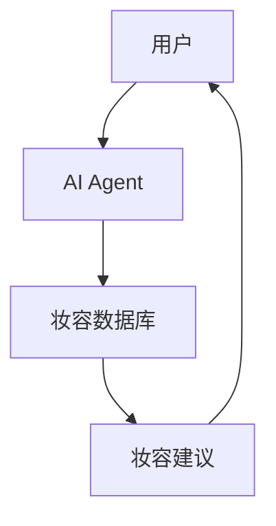
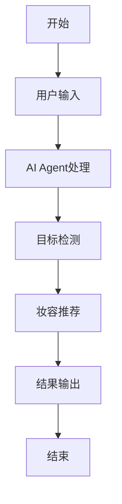
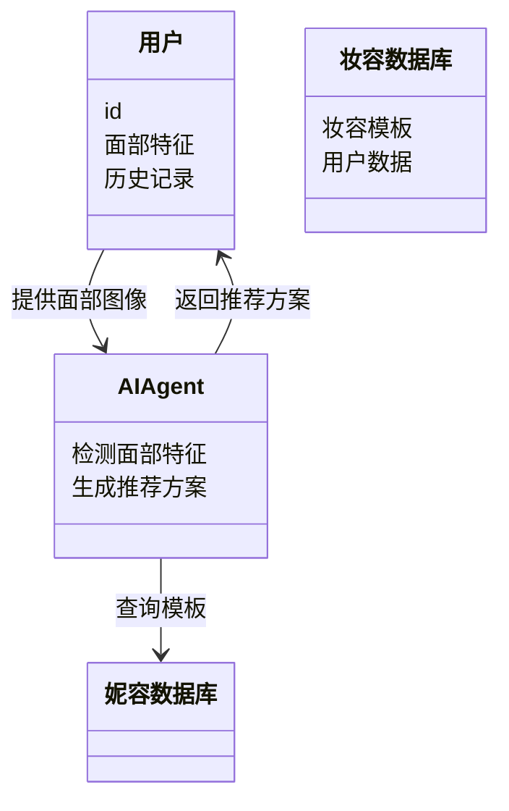
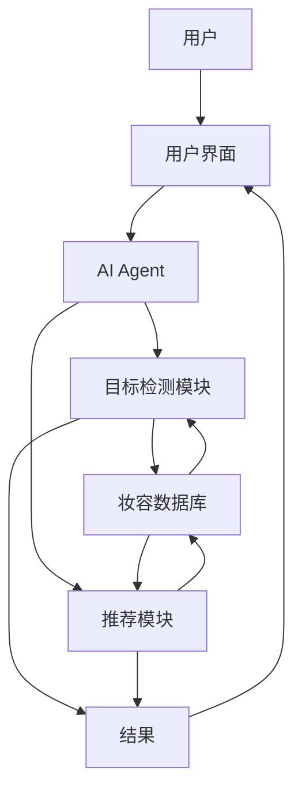
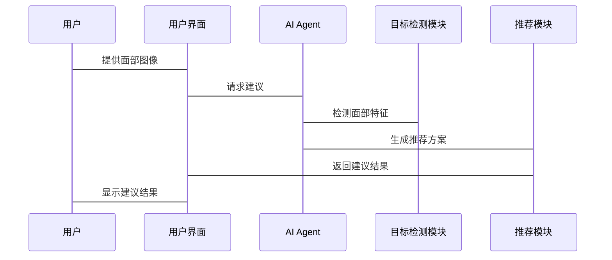

                 


# AI Agent在智能镜框中的妆容建议系统

## 关键词：AI Agent, 智能镜框, 妆容建议系统, 目标检测, 个性化推荐, 人工智能算法

## 摘要：  
本文详细探讨了AI Agent在智能镜框中的妆容建议系统的实现与应用。通过分析问题背景、核心概念、算法原理、系统架构及项目实战，展示了如何利用人工智能技术提升用户体验。本文还提供了详细的数学模型、系统架构图和代码实现，为读者提供全面的技术指导。

---

# 第一部分: AI Agent在智能镜框中的妆容建议系统背景介绍

## 第1章: 问题背景与描述

### 1.1 问题背景  
随着人工智能技术的快速发展，AI Agent（人工智能代理）在各个领域的应用越来越广泛。智能镜框作为一种结合了硬件和软件的创新产品，能够通过AI技术为用户提供个性化的妆容建议。然而，目前市场上的妆容建议系统大多依赖于简单的规则或模板，缺乏智能化和个性化。用户的妆容需求因人而异，传统系统难以满足用户的多样化需求。  

此外，用户在使用智能镜框时，往往需要手动调整多个参数（如颜色、形状、大小等），这不仅降低了用户体验，还可能导致用户流失。因此，如何利用AI技术实现智能化的妆容建议，成为当前智能镜框领域的一个重要研究方向。

### 1.2 问题描述  
本系统的目标是通过AI Agent为用户提供个性化的妆容建议，解决以下问题：  
1. **用户需求分析**：用户需要一个快速、精准的妆容建议系统，能够根据用户的面部特征、肤色、发型等因素，推荐适合的妆容方案。  
2. **系统功能目标**：实现基于AI的目标检测和个性化推荐功能，提供实时的妆容建议。  
3. **系统边界与外延**：系统仅关注妆容建议，不涉及其他功能（如购物推荐、社交分享等）。  

### 1.3 问题解决与系统架构  
AI Agent在系统中的核心作用是通过目标检测和个性化推荐算法，为用户提供实时的妆容建议。系统的核心要素包括：  
1. **AI Agent**：负责接收用户的输入数据，并通过算法生成建议。  
2. **妆容数据库**：存储大量的妆容模板和用户数据，用于训练和推理。  
3. **用户界面**：用户与系统的交互界面，展示建议和操作选项。  

系统整体架构分为前端和后端两部分，前端负责用户交互，后端负责数据处理和算法推理。

---

# 第二部分: 核心概念与联系

## 第2章: AI Agent与妆容建议系统的核心概念  

### 2.1 核心概念原理  
1. **AI Agent的基本原理**  
   AI Agent是一种能够感知环境并采取行动以实现目标的智能系统。在本系统中，AI Agent通过接收用户的面部图像数据，利用目标检测算法提取关键特征（如眼睛、嘴唇、面部轮廓等），并基于这些特征生成妆容建议。  

2. **妆容建议系统的实现机制**  
   系统通过以下步骤为用户提供妆容建议：  
   - 接收用户的面部图像数据。  
   - 使用目标检测算法提取面部特征。  
   - 基于用户的面部特征和历史数据，生成个性化妆容方案。  
   - 将建议结果返回给用户。  

3. **两者的结合与协同**  
   AI Agent与妆容建议系统的结合体现在数据流和功能模块的协同上。AI Agent负责数据处理和算法推理，而妆容建议系统则负责用户交互和结果展示。  

### 2.2 核心概念属性对比  
以下表格展示了AI Agent和妆容建议系统的属性对比：

| **属性**       | **AI Agent**               | **妆容建议系统**            |  
|----------------|---------------------------|---------------------------|  
| 核心功能       | 数据处理与算法推理         | 用户交互与结果展示         |  
| 输入数据       | 用户面部图像               | 用户面部图像               |  
| 输出结果       | 建议妆容参数               | 建议妆容方案               |  
| 依赖技术       | 人工智能算法               | 目标检测与推荐算法         |  
| 用户交互       | 无直接交互                 | 有直接交互                 |  

### 2.3 实体关系图  
以下是系统的核心实体关系图：  



---

# 第三部分: 算法原理讲解

## 第3章: 算法原理与实现  

### 3.1 算法概述  
1. **目标检测算法**  
   本系统采用基于深度学习的目标检测算法，用于检测用户的面部特征。  
2. **妆容推荐算法**  
   基于目标检测结果和用户数据，系统通过推荐算法生成个性化妆容方案。  

### 3.2 算法流程图  
以下是算法的整体流程图：  



### 3.3 核心算法实现  

#### 3.3.1 目标检测算法  
以下是目标检测算法的Python实现示例：  

```python
import tensorflow as tf
import numpy as np

def detect_face(image):
    # 图像预处理
    preprocessed_image = preprocess(image)
    # 模型预测
    predictions = model.predict(preprocessed_image)
    # 返回检测结果
    return predictions
```

#### 3.3.2 推荐算法  
以下是推荐算法的Python实现示例：  

```python
def recommend_makeup(features):
    # 数据预处理
    processed_features = preprocess(features)
    # 模型预测
    recommendations = recommendation_model.predict(processed_features)
    # 返回推荐结果
    return recommendations
```

#### 3.3.3 数学模型与公式  
目标检测模型的损失函数如下：  

$$ \text{Loss} = \alpha \cdot \text{分类损失} + \beta \cdot \text{定位损失} $$  

其中，$\alpha$ 和 $\beta$ 是权重系数，用于平衡分类和定位损失的影响。  

优化函数如下：  

$$ \text{优化函数} = \text{损失函数} + \gamma \cdot \text{正则化项} $$  

其中，$\gamma$ 是正则化系数，用于防止过拟合。

---

# 第四部分: 系统分析与架构设计

## 第4章: 系统分析与架构设计  

### 4.1 问题场景介绍  
系统通过AI Agent和智能镜框的结合，为用户提供实时的妆容建议。用户通过智能镜框输入面部图像，系统通过目标检测和推荐算法生成建议，并将结果返回给用户。  

### 4.2 项目介绍  
本项目的目标是实现一个基于AI Agent的智能镜框妆容建议系统，能够为用户提供个性化的妆容方案。  

### 4.3 系统功能设计  
以下是系统的领域模型：  



### 4.4 系统架构设计  
以下是系统的架构图：  



### 4.5 系统接口设计  
系统主要接口包括：  
1. 用户输入接口：接收用户的面部图像数据。  
2. 数据存储接口：与妆容数据库交互，获取或存储数据。  
3. 结果输出接口：将推荐结果返回给用户。  

### 4.6 系统交互设计  
以下是系统的交互流程图：  



---

# 第五部分: 项目实战

## 第5章: 项目实战  

### 5.1 环境安装  
1. 安装Python和相关库：  
   ```bash
   pip install tensorflow numpy matplotlib
   ```

2. 下载目标检测模型：  
   ```bash
   wget https://example.com/detection_model.zip
   unzip detection_model.zip
   ```

### 5.2 系统核心实现  

#### 5.2.1 目标检测模块  
以下是目标检测模块的代码实现：  

```python
import tensorflow as tf
import numpy as np

class FaceDetector:
    def __init__(self, model_path):
        self.model = tf.keras.models.load_model(model_path)
    
    def detect(self, image):
        preprocessed = self.preprocess(image)
        predictions = self.model.predict(preprocessed)
        return predictions

    def preprocess(self, image):
        # 图像预处理代码
        return preprocessed_image
```

#### 5.2.2 推荐模块  
以下是推荐模块的代码实现：  

```python
class MakeupRecommender:
    def __init__(self, database_path):
        self.database = self.load_database(database_path)
    
    def recommend(self, features):
        processed_features = self.preprocess(features)
        recommendations = self.model.predict(processed_features)
        return recommendations

    def preprocess(self, features):
        # 特征预处理代码
        return processed_features
```

### 5.3 代码应用解读与分析  
1. **目标检测模块**：  
   该模块负责接收用户的面部图像，通过预处理和模型推理，生成目标检测结果。  

2. **推荐模块**：  
   该模块基于目标检测结果和用户数据，生成个性化妆容推荐方案。  

### 5.4 实际案例分析  
以下是一个实际案例的分析：  
- 用户输入：一张面部图像。  
- 系统处理：  
  1. 目标检测模块检测到用户的眼睛、嘴唇、面部轮廓等特征。  
  2. 推荐模块基于这些特征和用户数据，生成适合的妆容方案。  
- 输出结果：推荐的妆容方案，包括颜色、形状、大小等参数。  

### 5.5 项目小结  
通过本项目的实现，我们成功地将AI Agent技术应用于智能镜框的妆容建议系统中，为用户提供了个性化的妆容方案。系统的实现依赖于目标检测和推荐算法，通过深度学习模型实现智能化推荐。

---

# 第六部分: 最佳实践

## 第6章: 最佳实践  

### 6.1 小结  
本文详细介绍了AI Agent在智能镜框中的妆容建议系统的实现与应用，包括背景、核心概念、算法原理、系统架构及项目实战。通过本系统的实现，我们展示了如何利用人工智能技术提升用户体验。  

### 6.2 注意事项  
1. 确保系统的数据安全性和隐私保护。  
2. 定期更新模型，以适应用户需求的变化。  
3. 提供良好的用户界面，确保用户体验流畅。  

### 6.3 拓展阅读  
1. 《Deep Learning》——Ian Goodfellow  
2. 《Python机器学习实战》——Andreas Müller  
3. 《人工智能：一种现代方法》——Peter Norvig  

---

# 作者：AI天才研究院/AI Genius Institute & 禅与计算机程序设计艺术 /Zen And The Art of Computer Programming

