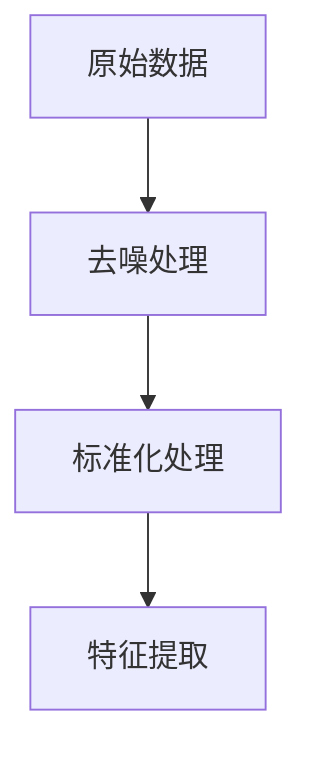
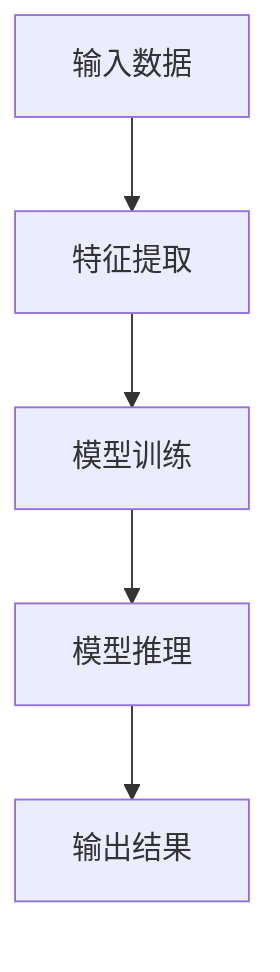
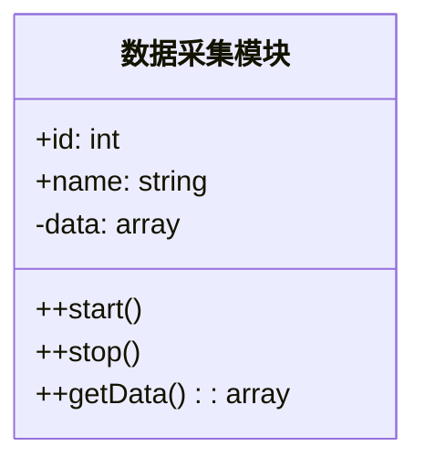
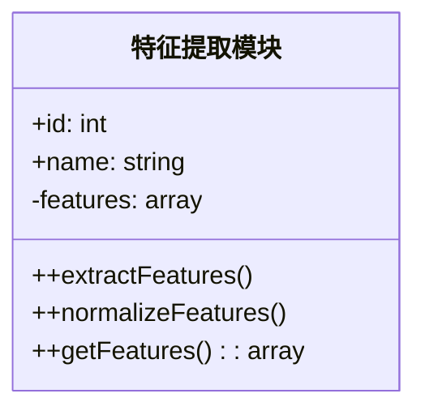
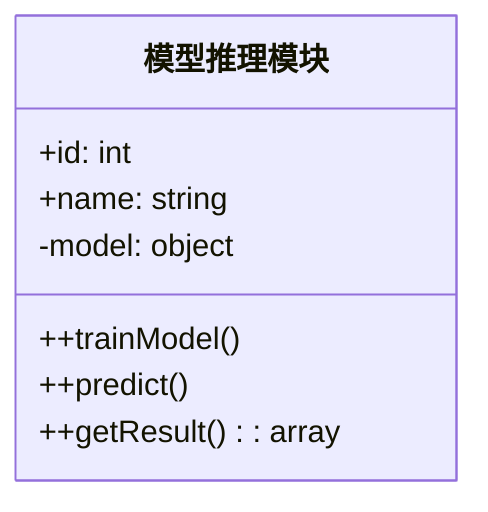

                 


# AI Agent在智能镜框中的心理状态评估

> 关键词：AI Agent, 心理状态评估, 智能镜框, 多模态数据, 机器学习, 深度学习, 系统架构

> 摘要：本文详细探讨了AI Agent在智能镜框中的心理状态评估技术，从背景介绍、核心概念、算法原理、系统架构设计到项目实战，全面解析了AI Agent在心理状态评估中的应用价值与技术实现。文章结合理论与实践，通过丰富的图表和代码示例，深入分析了心理状态评估的多模态数据特征、机器学习与深度学习算法、系统架构设计等关键内容，为读者提供了一套完整的解决方案。

---

## 第一章: 背景介绍与问题定义

### 1.1 心理状态评估的背景与意义

#### 1.1.1 心理状态评估的定义与目标
心理状态评估是通过分析个体的生理数据、行为数据和环境数据，来判断其当前的心理状态（如压力、焦虑、情绪等）的过程。目标是帮助个体更好地了解自己的心理状态，并提供相应的干预措施。

#### 1.1.2 智能镜框的定义与应用场景
智能镜框是一种结合了光学矫正与智能技术的可穿戴设备，能够实时采集用户的生理数据（如心率、皮肤电活动）和行为数据（如眨眼频率、头部姿势）。其应用场景包括心理健康监测、注意力评估、疲劳检测等。

#### 1.1.3 AI Agent在心理状态评估中的作用
AI Agent作为智能镜框的核心技术，负责数据的采集、处理和分析，能够实时评估用户的心理状态，并提供个性化的反馈和建议。

### 1.2 问题背景与技术现状

#### 1.2.1 当前心理状态评估的主要方法
传统心理状态评估方法依赖于问卷调查和人工分析，存在耗时长、主观性强等问题。

#### 1.2.2 AI技术在心理状态评估中的优势
AI技术能够实时采集和分析多模态数据，具有高效性、客观性和个性化的特点。

#### 1.2.3 智能镜框中的AI Agent技术挑战
数据采集的准确性、算法的实时性以及隐私保护是当前面临的主要挑战。

### 1.3 本书的研究意义与目标

#### 1.3.1 研究AI Agent在智能镜框中的应用价值
通过AI Agent实现高效、精准的心理状态评估，为心理健康监测提供技术支持。

#### 1.3.2 本书的核心目标与研究框架
本书旨在探索AI Agent在智能镜框中的实现方法，提出一套完整的解决方案，为相关研究和应用提供参考。

#### 1.3.3 本书的结构安排与内容概述
本书分为五部分，涵盖背景介绍、核心概念、算法原理、系统架构设计和项目实战等内容。

---

## 第二章: AI Agent与心理状态评估的核心概念

### 2.1 AI Agent的基本原理

#### 2.1.1 AI Agent的定义与分类
AI Agent是一种能够感知环境并执行任务的智能体，分为简单反射型、基于模型的反应型和实用推理型三类。

#### 2.1.2 AI Agent的核心功能与特点
- **核心功能**：感知、决策、执行
- **特点**：智能性、自主性、适应性

#### 2.1.3 AI Agent在智能设备中的应用
AI Agent广泛应用于智能家居、自动驾驶、智能医疗等领域。

### 2.2 心理状态评估的理论基础

#### 2.2.1 心理状态的定义与维度分析
心理状态包括情绪状态、认知状态和行为状态三个维度。

#### 2.2.2 常见心理评估指标与模型
- **指标**：压力水平、焦虑程度、情绪稳定性
- **模型**：层次分析模型、因子分析模型

#### 2.2.3 心理状态评估的多模态数据特征
- **数据类型**：生理数据、行为数据、环境数据
- **数据特征**：时间序列性、多模态性、实时性

### 2.3 AI Agent与心理状态评估的关联

#### 2.3.1 AI Agent在心理状态评估中的角色
AI Agent负责数据采集、特征提取和模型推理。

#### 2.3.2 数据流与功能模块的关系
数据流从传感器到AI Agent，经过特征提取、模型推理，最终输出心理状态评估结果。

#### 2.3.3 核心概念的ER实体关系图

```mermaid
er
actor(AI Agent, [id], [name], [function], [status])
actor 心理状态评估系统, [id], [name], [status]
actor 环境传感器, [id], [name]
actor 行为传感器, [id], [name]
```

---

## 第三章: 心理状态评估的算法原理

### 3.1 数据采集与特征提取

#### 3.1.1 多模态数据的采集方法
- **生理数据**：心率、皮肤电活动
- **行为数据**：眨眼频率、头部姿势
- **环境数据**：光照强度、温度

#### 3.1.2 心理状态特征的提取流程
1. 数据预处理：去噪、标准化
2. 特征提取：均值、方差、频域特征

#### 3.1.3 数据预处理与标准化



### 3.2 基于机器学习的评估模型

#### 3.2.1 常见机器学习算法的选择
- **支持向量机（SVM）**：适用于分类任务
- **随机森林（RF）**：适用于特征重要性分析

#### 3.2.2 模型训练与优化策略
- **交叉验证**：防止过拟合
- **网格搜索**：优化模型参数

#### 3.2.3 模型评估与调优方法
- **准确率**：评估模型性能
- **F1分数**：平衡精确率和召回率

### 3.3 基于深度学习的评估模型

#### 3.3.1 深度学习在心理状态评估中的应用
- **卷积神经网络（CNN）**：处理图像数据
- **长短期记忆网络（LSTM）**：处理时间序列数据

#### 3.3.2 神经网络模型的结构设计
- **输入层**：多模态数据输入
- **隐藏层**：特征提取与非线性变换
- **输出层**：心理状态分类

#### 3.3.3 模型训练与推理过程



---

## 第四章: 系统架构与设计方案

### 4.1 系统整体架构设计

#### 4.1.1 系统功能模块划分
- **数据采集模块**：采集生理数据和行为数据
- **特征提取模块**：提取特征并进行预处理
- **模型推理模块**：基于机器学习或深度学习模型进行推理
- **结果输出模块**：输出心理状态评估结果

#### 4.1.2 系统架构的分层设计
- **数据层**：数据采集与存储
- **特征层**：特征提取与处理
- **模型层**：模型训练与推理
- **应用层**：结果展示与反馈

#### 4.1.3 系统架构的可扩展性分析
- **模块化设计**：便于功能扩展
- **接口标准化**：便于与其他系统集成

### 4.2 系统功能设计

#### 4.2.1 数据采集与处理模块



#### 4.2.2 特征提取与预处理模块



#### 4.2.3 模型推理与结果输出模块



---

## 第五章: 项目实战与最佳实践

### 5.1 项目环境配置

#### 5.1.1 开发工具与库的安装
- **开发工具**：Jupyter Notebook、PyCharm
- **库的安装**：numpy、pandas、scikit-learn、tensorflow

#### 5.1.2 数据集的准备
- **数据来源**：公开数据集或自采数据
- **数据格式**：CSV或JSON

### 5.2 核心代码实现

#### 5.2.1 数据采集与处理

```python
import numpy as np
import pandas as pd

# 数据加载
data = pd.read_csv('心理状态数据.csv')

# 数据预处理
data = data.dropna()
data = (data - data.mean()) / data.std()
```

#### 5.2.2 特征提取与建模

```python
from sklearn.svm import SVC
from sklearn.model_selection import train_test_split
from sklearn.metrics import accuracy_score

# 数据分割
X_train, X_test, y_train, y_test = train_test_split(data.drop('label', axis=1), data['label'], test_size=0.2)

# 模型训练
model = SVC()
model.fit(X_train, y_train)

# 模型预测
y_pred = model.predict(X_test)
print('准确率:', accuracy_score(y_test, y_pred))
```

#### 5.2.3 模型优化与调参

```python
from sklearn.model_selection import GridSearchCV

# 参数搜索
param_grid = {'C': [1, 10, 100], 'gamma': [0.1, 0.01, 0.001]}
grid_search = GridSearchCV(SVC(), param_grid, cv=5)
grid_search.fit(X_train, y_train)

# 最佳参数
print(grid_search.best_params_)
```

### 5.3 项目实战与案例分析

#### 5.3.1 实际案例分析
以压力评估为例，展示如何通过AI Agent实时评估用户的心理状态。

#### 5.3.2 代码实现与解读
详细解读上述代码的实现过程，包括数据加载、预处理、模型训练和预测。

### 5.4 最佳实践与注意事项

#### 5.4.1 数据隐私与安全
确保数据的匿名化处理和加密存储。

#### 5.4.2 系统性能优化
通过并行计算和模型压缩优化系统性能。

#### 5.4.3 系统维护与更新
定期更新模型和传感器校准，确保系统长期稳定运行。

---

## 第六章: 总结与展望

### 6.1 本章总结
本文详细探讨了AI Agent在智能镜框中的心理状态评估技术，从理论到实践，全面解析了实现过程和关键点。

### 6.2 未来展望
未来研究方向包括更高效的算法、更精准的传感器和更智能的交互方式。

---

## 作者：AI天才研究院/AI Genius Institute & 禅与计算机程序设计艺术 /Zen And The Art of Computer Programming

