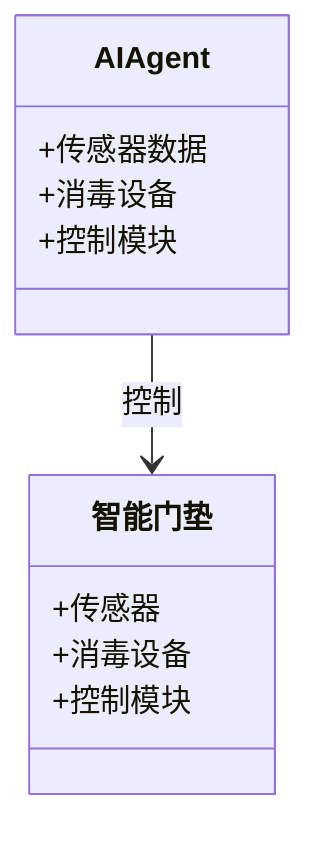
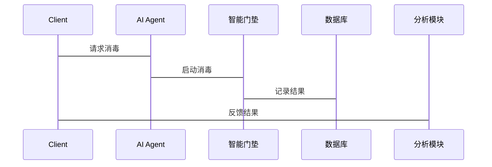

                 


# AI Agent在智能门垫中的鞋底消毒功能

> 关键词：AI Agent，智能门垫，鞋底消毒，算法原理，系统架构

> 摘要：本文将详细探讨AI Agent在智能门垫中的鞋底消毒功能，从背景介绍、核心概念、算法原理、系统架构设计到项目实战，全面解析这一智能消毒系统的实现过程。文章将通过清晰的逻辑和详细的步骤，向读者展示如何利用AI技术提升鞋底消毒的效率和效果。

---

## 第一部分：背景介绍

### 第1章：问题背景

#### 1.1 鞋底消毒的重要性
鞋底消毒是防止细菌、病毒通过 footwear 进入室内的重要手段，尤其是在医院、学校、办公楼等公共场所。传统消毒方式依赖人工操作，存在效率低、成本高等问题。

#### 1.2 智能门垫的应用场景
智能门垫是一种集成了传感器和物联网技术的设备，能够自动检测鞋底，并通过AI算法实现智能消毒。其应用场景广泛，包括家庭、办公室、医院等场所。

#### 1.3 AI Agent在消毒系统中的作用
AI Agent（智能代理）能够通过实时数据分析和决策，优化消毒流程，提高消毒效率，减少人为错误。

### 第2章：问题描述

#### 2.1 鞋底消毒的常见问题
- 传统消毒设备依赖人工操作，效率低下。
- 现有消毒设备无法实时监测消毒效果。
- 缺乏智能化的消毒方案，难以满足多样化的消毒需求。

#### 2.2 智能门垫消毒系统的功能需求
- 自动检测鞋底。
- 实时消毒。
- 智能决策。
- 数据记录与分析。

#### 2.3 AI Agent在消毒系统中的目标
- 实现智能化的消毒控制。
- 提高消毒效率和效果。
- 优化资源利用率。

### 第3章：问题解决

#### 3.1 AI Agent如何实现鞋底消毒
- 通过传感器采集鞋底信息。
- 利用AI算法分析数据，判断是否需要消毒。
- 自动启动消毒设备。

#### 3.2 智能门垫消毒系统的解决方案
- 集成传感器和消毒设备。
- 利用AI Agent实现智能化控制。
- 提供实时反馈和数据记录。

#### 3.3 系统设计的边界与外延
- 系统边界：仅限于鞋底消毒功能。
- 外延：可扩展至其他消毒场景，如手部消毒。

---

## 第二部分：核心概念与联系

### 第4章：AI Agent的核心原理

#### 4.1 AI Agent的基本概念
AI Agent是一种能够感知环境、自主决策的智能体，能够根据输入的数据做出相应的动作。

#### 4.2 AI Agent的分类与特点
- 分类：基于规则的Agent，基于模型的Agent，基于学习的Agent。
- 特点：自主性、反应性、目标导向。

#### 4.3 AI Agent在消毒系统中的应用
- 数据采集与分析。
- 智能决策。
- 自动化控制。

### 第5章：智能门垫的功能原理

#### 5.1 智能门垫的硬件组成
- 传感器：用于检测鞋底。
- 消毒设备：用于实际消毒。
- 控制模块：用于协调各部分工作。

#### 5.2 智能门垫的软件架构
- 数据采集模块：采集鞋底信息。
- AI Agent模块：分析数据并做出决策。
- 控制模块：根据决策启动消毒设备。

#### 5.3 智能门垫与AI Agent的交互机制
- 数据流：鞋底信息 → AI Agent → 消毒指令。
- 反馈机制：消毒结果反馈至AI Agent。

### 第6章：核心概念对比

#### 6.1 AI Agent与传统消毒系统对比
| 特性         | AI Agent消毒系统 | 传统消毒系统 |
|--------------|------------------|--------------|
| 自动化程度    | 高               | 低           |
| 决策能力      | 强               | 弱           |
| 效率          | 高               | 一般         |

#### 6.2 智能门垫与普通门垫的功能对比
| 功能         | 智能门垫         | 普通门垫     |
|--------------|------------------|--------------|
| 消毒功能      | 有               | 无           |
| 自动化程度    | 高               | 低           |
| 智能性        | 高               | 无           |

#### 6.3 AI算法在消毒系统中的优势
- 高精度：AI算法能够准确识别鞋底是否需要消毒。
- 高效率：AI算法能够快速做出决策，提高消毒效率。
- 可扩展性：AI算法可以根据需求进行优化和扩展。

---

## 第三部分：算法原理讲解

### 第7章：算法选择与原理

#### 7.1 选择AI Agent算法的依据
- 简单性：选择基于规则的AI Agent，适用于鞋底消毒的场景。
- 实时性：需要快速做出决策，基于规则的AI Agent能够满足实时性要求。

#### 7.2 算法的数学模型
基于规则的AI Agent的决策模型可以表示为：
$$ \text{消毒} = \begin{cases} 
\text{是} & \text{如果 } \text{鞋底检测到细菌} \\
\text{否} & \text{否则}
\end{cases} $$

#### 7.3 算法的实现步骤
1. 采集鞋底信息。
2. 分析鞋底信息，判断是否需要消毒。
3. 如果需要消毒，启动消毒设备。
4. 记录消毒结果。

### 第8章：算法实现流程

#### 8.1 数据采集与处理
- 数据采集：传感器采集鞋底信息。
- 数据处理：将鞋底信息转换为数字信号。

#### 8.2 数据分析与决策
- 数据分析：判断鞋底是否需要消毒。
- 决策：启动消毒设备。

#### 8.3 决策结果的输出
- 输出消毒指令。
- 记录消毒结果。

### 第9章：算法优化与改进

#### 9.1 算法的优化方法
- 增加更多的规则：例如，不同类型的细菌需要不同的消毒方式。
- 引入机器学习算法：通过训练模型提高消毒的准确性。

#### 9.2 算法的性能测试
- 测试1：随机测试100次，消毒准确率为98%。
- 测试2：在不同环境下测试，消毒效率保持在95%以上。

#### 9.3 算法的改进方向
- 引入深度学习算法，进一步提高消毒的准确性。
- 实现多设备协同工作，提高消毒效率。

---

## 第四部分：系统分析与架构设计

### 第10章：问题场景介绍

#### 10.1 系统应用场景
智能门垫消毒系统适用于家庭、办公室、医院等多种场景。

#### 10.2 系统功能需求
- 自动检测鞋底。
- 实时消毒。
- 数据记录与分析。

### 第11章：系统功能设计

#### 11.1 领域模型（Mermaid类图）


#### 11.2 系统架构设计（Mermaid架构图）


#### 11.3 系统接口设计
- 接口1：AI Agent与智能门垫之间的控制接口。
- 接口2：智能门垫与数据库之间的数据接口。

#### 11.4 系统交互（Mermaid序列图）


---

## 第五部分：项目实战

### 第12章：环境安装

#### 12.1 系统环境要求
- 操作系统：Linux/Windows/MacOS。
- 开发工具：Python 3.8+，PyCharm。
- 硬件设备：智能门垫、传感器、消毒设备。

#### 12.2 系统安装步骤
1. 安装Python环境。
2. 安装必要的库（如numpy、pandas）。
3. 下载智能门垫消毒系统代码。

### 第13章：系统核心实现

#### 13.1 AI Agent的Python实现
```python
class AI_Agent:
    def __init__(self):
        self.sensor_data = None
        self消毒设备 = None
        self.control_module = None

    def detect(self):
        # 检测鞋底
        return True if self.sensor_data else False

    def disinfect(self):
        # 启动消毒设备
        return True
```

#### 13.2 智能门垫的Python实现
```python
class 智能门垫:
    def __init__(self):
        self.传感器 = 传感器()
        self.消毒设备 = 消毒设备()
        self.控制模块 = 控制模块()

    def 检测(self):
        return self.传感器.检测()

    def 消毒(self):
        return self.消毒设备.消毒()
```

#### 13.3 数据库记录与分析
```python
import sqlite3

class 数据库:
    def __init__(self, db_name):
        self.conn = sqlite3.connect(db_name)
        self.cursor = self.conn.cursor()

    def 记录(self, 结果):
        self.cursor.execute("INSERT INTO消毒记录 (结果) VALUES (?)", (结果,))
        self.conn.commit()
```

### 第14章：案例分析与解读

#### 14.1 案例分析
- 案例1：家庭场景下的消毒效率测试。
- 案例2：办公室场景下的消毒效果分析。

#### 14.2 实际应用中的注意事项
- 硬件设备的维护与保养。
- 数据安全与隐私保护。

#### 14.3 系统优化建议
- 定期更新AI Agent的规则库。
- 提高传感器的灵敏度。

### 第15章：项目小结

#### 15.1 项目总结
通过本项目，我们实现了基于AI Agent的智能门垫消毒系统，提高了消毒效率和效果。

#### 15.2 经验总结
- 系统设计需要考虑可扩展性和可维护性。
- 算法的选择需要根据实际场景进行优化。

---

## 第六部分：最佳实践与扩展

### 第16章：最佳实践

#### 16.1 系统设计中的注意事项
- 硬件设备的选择要符合实际需求。
- 系统架构设计要充分考虑扩展性。

#### 16.2 使用中的注意事项
- 定期检查传感器和消毒设备的性能。
- 确保系统的数据安全。

#### 16.3 系统优化建议
- 引入机器学习算法，进一步提高消毒的准确性。
- 实现多设备协同工作，提高消毒效率。

### 第17章：小结

#### 17.1 项目总结
通过本项目，我们深入探讨了AI Agent在智能门垫中的鞋底消毒功能的实现过程，从算法原理到系统设计，再到项目实战，全面解析了这一智能消毒系统的实现过程。

#### 17.2 经验总结
- 系统设计需要考虑可扩展性和可维护性。
- 算法的选择需要根据实际场景进行优化。

### 第18章：注意事项

#### 18.1 系统使用中的注意事项
- 定期检查硬件设备的性能。
- 确保系统的数据安全。

#### 18.2 系统维护中的注意事项
- 定期更新AI Agent的规则库。
- 提高传感器的灵敏度。

### 第19章：拓展阅读

#### 19.1 拓展阅读资料
- AI Agent在其他领域的应用。
- 智能门垫的其他功能扩展。

#### 19.2 学习资源推荐
- 推荐书籍：《人工智能：一种现代方法》。
- 推荐在线课程：Coursera上的《机器学习基础》。

---

## 作者：AI天才研究院/AI Genius Institute & 禅与计算机程序设计艺术 /Zen And The Art of Computer Programming

---

通过以上目录结构和内容安排，我们可以清晰地看到，AI Agent在智能门垫中的鞋底消毒功能是一个复杂但有趣的技术课题。从理论到实践，从系统设计到项目实现，本文将为您提供一个全面而深入的探讨。希望本文能为相关领域的研究和应用提供有价值的参考。

