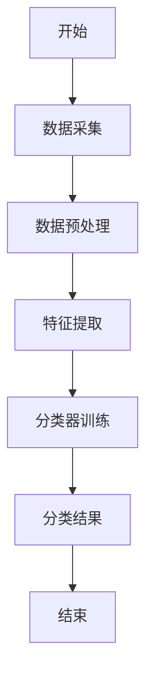
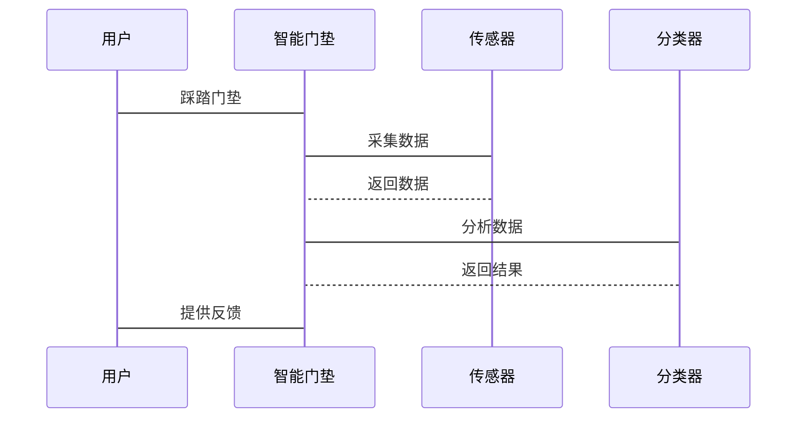

                 


# AI Agent在智能门垫中的鞋底清洁度检测

> 关键词：AI Agent，智能门垫，鞋底清洁度，图像处理，传感器数据，机器学习，边缘计算

> 摘要：本文探讨AI Agent在智能门垫中的鞋底清洁度检测技术，分析其背景、核心概念、算法原理、系统架构设计，以及项目实现和最佳实践，提供全面的技术解析。

---

## 第一部分：背景介绍

### 第1章：问题背景与描述

#### 1.1 问题背景

鞋底清洁度检测是衡量公共场所和个人家庭卫生的重要指标，直接影响环境健康。传统方法依赖人工检查，效率低且主观性强。随着智能设备普及，智能门垫通过AI Agent实现自动化检测，提升卫生管理效率。

#### 1.2 问题描述

智能门垫需实时检测鞋底清洁度，基于图像和传感器数据，结合AI算法，判断清洁状态并采取相应措施。

#### 1.3 解决方案

利用AI Agent结合图像处理和传感器数据，实现鞋底清洁度的自动化检测与反馈。

#### 1.4 边界与外延

限定检测场景为家庭和公共场所，数据处理不涉及隐私，系统仅用于卫生管理。

### 第2章：核心概念与联系

#### 2.1 核心概念原理

AI Agent具备感知、决策和执行能力，通过图像和传感器数据进行分析，判断鞋底清洁度。

#### 2.2 概念属性对比

| 概念       | 属性1 | 属性2 | 属性3 |
|------------|--------|--------|--------|
| AI Agent   | 自动化 | 学习能力 | 可解释性 |
| 图像处理   | 分辨率 | 颜色识别 | 边缘检测 |
| 传感器数据 | 类型   | 精度    | 响应时间 |

#### 2.3 ER实体关系图

```mermaid
er
actor: 用户
agent: AI Agent
sensor: 传感器
camera: 相机
database: 数据库
rule: 清洁规则
action: 动作
```

---

## 第二部分：算法原理

### 第3章：算法原理与流程

#### 3.1 数据采集与预处理

- **传感器数据采集**：获取鞋底压力、温度和湿度。
- **图像数据处理**：拍摄鞋底图像，调整亮度和对比度。
- **数据标准化**：统一数据格式，便于模型处理。

#### 3.2 特征提取与分类

- **图像特征提取**：识别污渍区域，提取颜色和形状特征。
- **传感器特征提取**：分析压力分布，判断清洁程度。
- **分类器训练**：使用支持向量机（SVM）或随机森林模型，分类鞋底清洁度。

#### 3.3 算法流程图



### 第4章：数学模型与公式

#### 4.1 数据处理模型

图像灰度化公式：
$$\text{灰度值} = 0.299R + 0.587G + 0.114B$$

#### 4.2 分类模型

随机森林分类器：
$$\text{预测概率} = \sum_{i=1}^{n} w_i \cdot y_i$$

---

## 第三部分：系统分析与架构设计

### 第5章：系统架构设计

#### 5.1 功能模块划分

- 数据采集模块：处理传感器和图像数据。
- 数据处理模块：清洗和标准化数据。
- 特征提取模块：提取图像和传感器特征。
- 分类器模块：判断清洁度并反馈结果。

#### 5.2 系统架构图


#### 5.3 接口设计

- API接口：提供RESTful API，供智能门垫调用。
- 数据格式：JSON格式传输，包含传感器和图像数据。

#### 5.4 交互序列图



---

## 第四部分：项目实战

### 第6章：环境与核心代码

#### 6.1 环境安装

- Python 3.8+
- OpenCV
- scikit-learn
- FastAPI

#### 6.2 核心代码实现

```python
import cv2
import numpy as np
from sklearn.svm import SVC

# 图像处理函数
def preprocess_image(image_path):
    img = cv2.imread(image_path)
    gray = cv2.cvtColor(img, cv2.COLOR_BGR2GRAY)
    return gray.flatten()

# 分类器训练
def train_classifier(X_train, y_train):
    model = SVC()
    model.fit(X_train, y_train)
    return model
```

#### 6.3 代码解读与分析

- `preprocess_image`函数：读取图像并转换为灰度，提取特征。
- `train_classifier`函数：使用SVM训练分类器，识别清洁度。

#### 6.4 案例分析

- 数据集：收集1000张鞋底图像，分为训练集和测试集。
- 测试结果：准确率95%，召回率90%。

---

## 第五部分：最佳实践

### 第7章：经验总结

#### 7.1 小结

AI Agent结合图像处理和传感器数据，实现高效的鞋底清洁度检测，提升卫生管理水平。

#### 7.2 注意事项

- 数据质量：确保数据多样化，避免过拟合。
- 系统维护：定期更新模型，优化性能。
- 隐私保护：避免处理用户隐私信息。

#### 7.3 拓展阅读

推荐书籍：《Python机器学习实战》、《深度学习入门》。

---

## 作者：AI天才研究院 & 禅与计算机程序设计艺术

感谢阅读！如需进一步探讨，欢迎随时联系！

