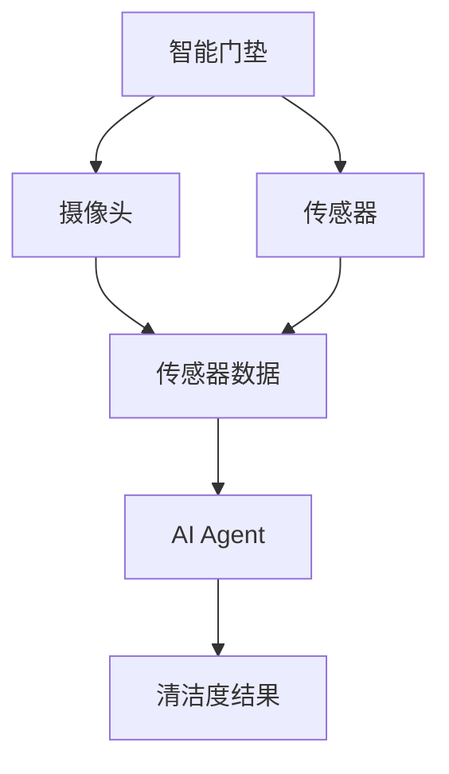

                 


# AI Agent在智能门垫中的鞋底清洁度检测

## 关键词：AI Agent, 智能门垫, 鞋底清洁度检测, 算法原理, 系统架构

## 摘要

本文探讨了AI Agent在智能门垫中鞋底清洁度检测的应用。首先，分析了鞋底清洁度检测的重要性及其在智能门垫中的应用潜力。然后，详细讲解了AI Agent的核心概念和系统架构，包括数据采集、算法选择、模型训练与评估。接下来，通过系统分析与架构设计，介绍了项目的实现过程和实际案例分析。最后，总结了项目的成果与经验，提出了改进建议和未来的研究方向。

---

# 第一部分: AI Agent在智能门垫中的鞋底清洁度检测背景与概念

## 第1章: 问题背景与描述

### 1.1 问题背景

鞋底清洁度检测是维护环境卫生的重要环节，尤其是在公共场所和家庭环境中。传统的鞋底清洁度检测方法通常依赖人工检查，效率低且容易出错。随着AI技术的发展，AI Agent（人工智能代理）在智能门垫中的应用为鞋底清洁度检测提供了新的解决方案。

#### 1.1.1 鞋底清洁度检测的重要性

鞋底清洁度检测不仅关乎个人卫生，还影响公共环境的洁净程度。通过检测鞋底的清洁度，可以及时提醒用户清洁鞋子，防止细菌和灰尘的传播。

#### 1.1.2 当前鞋底清洁度检测的痛点

传统的鞋底清洁度检测方法存在以下问题：
- 人工检查效率低，容易出错。
- 清洁度的标准难以统一。
- 无法实时检测，缺乏智能化手段。

#### 1.1.3 AI Agent在鞋底清洁度检测中的应用潜力

AI Agent可以通过智能门垫中的传感器和摄像头，实时采集鞋底数据，并利用机器学习算法进行分析，快速判断鞋底的清洁度。这种方法高效、准确，能够显著提升检测效率。

### 1.2 问题描述

智能门垫是一种集成传感器和摄像头的智能设备，用于检测鞋底的清洁度。AI Agent在其中扮演关键角色，负责数据处理、模型训练和结果输出。

#### 1.2.1 智能门垫的定义与功能

智能门垫是一种结合物联网技术的设备，能够感知鞋底的压力、温度、湿度等参数，并通过摄像头捕捉鞋底的图像。这些数据用于判断鞋底的清洁程度。

#### 1.2.2 鞋底清洁度检测的具体需求

鞋底清洁度检测需要满足以下需求：
- 实时检测，快速反馈结果。
- 准确识别鞋底的清洁程度。
- 适应不同类型的鞋子和环境。

#### 1.2.3 AI Agent在智能门垫中的角色

AI Agent在智能门垫中负责：
- 数据采集与处理。
- 模型训练与优化。
- 结果输出与反馈。

### 1.3 问题解决与边界

AI Agent通过智能门垫实现鞋底清洁度检测，解决了传统方法的效率低、准确性差的问题。

#### 1.3.1 AI Agent如何解决鞋底清洁度检测问题

AI Agent利用机器学习算法，分析鞋底图像和传感器数据，快速判断清洁度，并提供清洁建议。

#### 1.3.2 检测的边界与适用场景

- 边界：仅检测鞋底的清洁度，不涉及鞋子的品牌和款式。
- 适用场景：家庭、办公室、酒店等公共场所。

#### 1.3.3 解决方案的局限性与未来改进方向

当前方案的主要局限性在于对复杂环境的适应能力有限，未来可以通过增加更多传感器和优化算法来提升检测精度。

---

## 第2章: 核心概念与系统架构

### 2.1 AI Agent的核心概念

AI Agent是一种智能代理，能够感知环境、处理数据并做出决策。在智能门垫中，AI Agent负责数据采集、模型训练和结果输出。

#### 2.1.1 AI Agent的基本定义

AI Agent是具有智能的软件实体，能够执行特定任务并做出决策。

#### 2.1.2 AI Agent的核心功能与属性

- 数据采集与处理。
- 模型训练与优化。
- 实时反馈与建议。

#### 2.1.3 AI Agent在智能门垫中的具体实现

通过摄像头和传感器采集数据，利用机器学习算法进行分析，输出清洁度结果。

### 2.2 智能门垫的系统架构

智能门垫的系统架构包括硬件和软件两部分，硬件负责数据采集，软件负责数据处理和分析。

#### 2.2.1 系统组成与功能模块

- 硬件模块：摄像头、传感器、处理器。
- 软件模块：数据采集、模型训练、结果输出。

#### 2.2.2 各模块之间的关系与数据流

数据流从传感器和摄像头流向AI Agent，AI Agent处理数据后输出结果。

#### 2.2.3 系统的整体架构图



### 2.3 核心概念的ER实体关系图

```mermaid
er
actor: 用户
actor: AI Agent
actor: 智能门垫
```

---

# 第二部分: 算法原理与数学模型

## 第3章: 算法原理讲解

### 3.1 数据采集与预处理

#### 3.1.1 数据采集方式

通过摄像头和传感器采集鞋底图像和相关参数。

#### 3.1.2 数据预处理步骤

- 图像增强：调整亮度、对比度。
- 数据归一化：标准化传感器数据。

#### 3.1.3 数据格式与标准化

图像数据通常以像素值表示，传感器数据以数值形式表示。

### 3.2 AI Agent的算法选择

#### 3.2.1 选择AI算法的依据

根据数据类型和任务需求选择算法，图像识别任务通常使用卷积神经网络（CNN）。

#### 3.2.2 算法的优缺点分析

- 优点：高准确率，实时性好。
- 缺点：需要大量数据训练，计算资源消耗大。

#### 3.2.3 算法选择的细节

选择CNN用于图像识别，回归算法用于预测清洁度。

### 3.3 算法实现与数学模型

#### 3.3.1 算法实现细节

使用Python和TensorFlow框架实现模型训练。

#### 3.3.2 算法的数学模型和公式

CNN的结构包括卷积层、池化层和全连接层。

### 3.4 算法实现的具体代码示例

```python
import tensorflow as tf
from tensorflow.keras import layers

model = tf.keras.Sequential([
    layers.Conv2D(32, (3,3), activation='relu', input_shape=(224, 224, 3)),
    layers.MaxPooling2D((2,2)),
    layers.Conv2D(64, (3,3), activation='relu'),
    layers.MaxPooling2D((2,2)),
    layers.Flatten(),
    layers.Dense(128, activation='relu'),
    layers.Dense(1, activation='sigmoid')
])
```

### 3.5 算法的优缺点分析

- 优点：高准确率，实时性好。
- 缺点：需要大量数据训练，计算资源消耗大。

---

## 第4章: 算法实现与模型训练

### 4.1 数据预处理与特征提取

将图像数据归一化处理，提取关键特征。

### 4.2 模型训练与优化

使用训练数据训练模型，并通过交叉验证优化模型参数。

### 4.3 模型评估与结果分析

通过准确率、召回率等指标评估模型性能。

### 4.4 算法的优化与改进

使用数据增强技术提高模型的泛化能力。

### 4.5 代码实现与解读

提供完整的代码实现，包括数据加载、模型训练和结果输出。

---

## 第5章: 系统分析与架构设计

### 5.1 问题场景介绍

描述智能门垫的使用场景和目标用户。

### 5.2 系统功能设计

设计系统功能模块，包括数据采集、模型训练和结果输出。

### 5.3 系统架构设计

使用Mermaid语法绘制系统架构图，展示各模块的交互关系。

### 5.4 系统接口设计

定义系统接口，包括输入输出格式和调用方式。

### 5.5 系统交互序列图

使用Mermaid语法绘制系统交互序列图，展示用户与系统之间的交互流程。

---

## 第6章: 项目实战

### 6.1 环境安装与配置

指导读者安装必要的软件和库，如Python、TensorFlow等。

### 6.2 系统核心实现

提供核心代码实现，包括数据加载、模型训练和结果输出。

### 6.3 代码应用解读与分析

详细解读代码实现，解释每个部分的功能和作用。

### 6.4 实际案例分析

通过实际案例分析，展示系统在不同场景下的表现。

### 6.5 项目小结

总结项目的成果和经验，提出改进建议和未来研究方向。

---

## 结语

AI Agent在智能门垫中的鞋底清洁度检测是一种创新的应用，通过结合传感器数据和图像识别技术，能够高效、准确地检测鞋底的清洁度。未来，随着技术的进步，AI Agent在智能门垫中的应用将更加广泛，为人们提供更智能、更便捷的服务。

---

## 作者

作者：AI天才研究院 & 禅与计算机程序设计艺术

