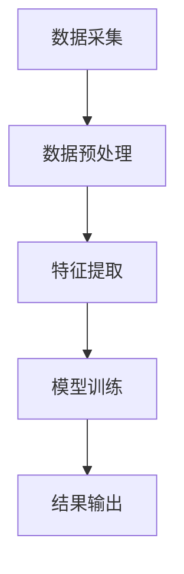
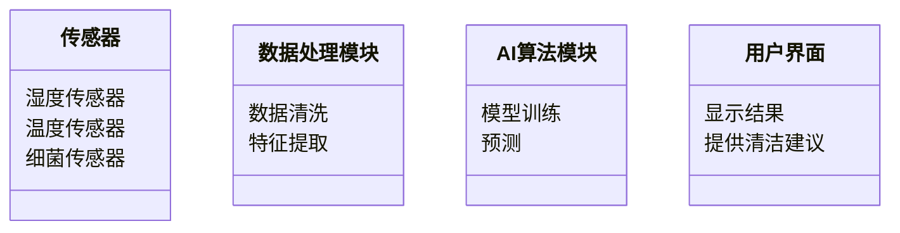
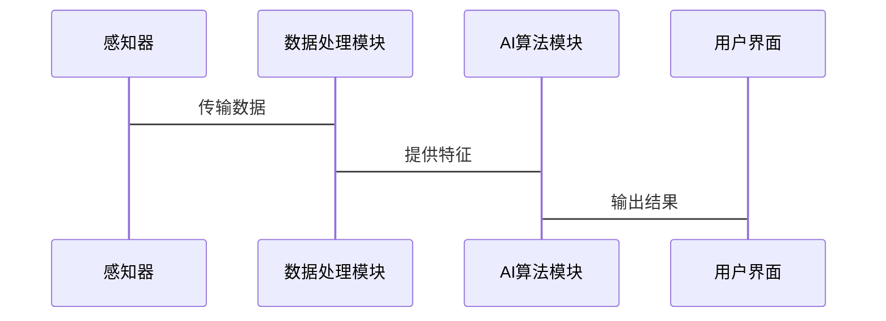

                 


# AI Agent在智能门把手中卫生状况监测

> 关键词：AI Agent, 智能门把手, 卫生监测, 数据分析, 算法实现

> 摘要：本文详细探讨了AI Agent在智能门把手中卫生状况监测的应用，从背景分析、核心概念、算法原理到系统架构设计，再到项目实战和最佳实践，全面解析了这一技术的实现细节和应用场景。

---

# 第1章: 背景介绍

## 1.1 问题背景

### 1.1.1 智能门把手的卫生监测需求
随着人们对公共卫生的关注度不断提高，智能门把手的卫生状况监测成为一项重要的需求。尤其是在公共场所，如医院、学校和办公楼，门把手作为高频接触的物体，其卫生状况直接影响人们的健康。

### 1.1.2 当前卫生监测技术的局限性
传统的卫生监测方法主要依赖人工检查，这种方法效率低、成本高，且难以实时获取数据。此外，现有的传感器技术在数据处理和分析方面也有一定的局限性，难以满足智能门把手卫生监测的实时性和准确性要求。

### 1.1.3 AI Agent在智能门把手中的应用价值
AI Agent（人工智能代理）通过实时数据采集、分析和反馈，能够有效解决传统卫生监测的痛点。它不仅可以实现对门把手卫生状况的实时监测，还能通过智能决策提供清洁建议，从而显著提升卫生管理的效率。

## 1.2 问题描述

### 1.2.1 卫生状况监测的核心目标
卫生状况监测的核心目标是实时感知门把手表面的细菌数量、病毒残留等指标，并通过数据分析提供清洁建议。

### 1.2.2 智能门把手的卫生监测场景
智能门把手的卫生监测场景包括数据采集、数据处理、卫生状况分析和结果反馈四个主要环节。

### 1.2.3 用户需求与痛点分析
用户需求主要集中在实时监测、数据可视化和智能清洁建议三个方面。痛点则包括数据采集的准确性、算法的实时性和系统的可扩展性。

## 1.3 问题解决

### 1.3.1 AI Agent的核心作用
AI Agent通过实时数据采集、智能分析和反馈，能够高效解决传统卫生监测的痛点。

### 1.3.2 智能门把手的卫生监测解决方案
解决方案包括传感器数据采集、AI算法分析和结果反馈三个主要部分，能够实现对门把手卫生状况的实时监测和智能管理。

### 1.3.3 技术实现的关键步骤
技术实现的关键步骤包括传感器数据采集、数据预处理、AI算法训练和系统集成。

## 1.4 边界与外延

### 1.4.1 系统功能的边界
系统功能的边界包括数据采集范围、分析指标和反馈方式。

### 1.4.2 相关技术的外延
相关技术的外延包括传感器技术、AI算法和物联网技术。

### 1.4.3 应用场景的扩展
应用场景的扩展包括家庭、公共场所和医疗领域。

## 1.5 概念结构与核心要素

### 1.5.1 系统架构的核心要素
系统架构的核心要素包括传感器、AI算法、数据存储和用户界面。

### 1.5.2 AI Agent的功能模块
AI Agent的功能模块包括数据采集、数据处理、智能分析和结果反馈。

### 1.5.3 卫生监测的关键指标
卫生监测的关键指标包括细菌数量、病毒残留和表面清洁度。

## 1.6 本章小结
本章介绍了AI Agent在智能门把手中卫生监测的应用背景、核心概念和关键步骤，为后续章节的深入分析奠定了基础。

---

# 第2章: 核心概念与联系

## 2.1 AI Agent的基本原理

### 2.1.1 AI Agent的定义与特点
AI Agent是一种能够感知环境、自主决策并执行任务的智能体。其特点包括自主性、反应性和社会性。

### 2.1.2 AI Agent的核心功能模块
AI Agent的核心功能模块包括感知模块、决策模块和执行模块。

### 2.1.3 AI Agent与智能门把手的结合
AI Agent与智能门把手的结合主要体现在数据采集、分析和反馈三个环节。

## 2.2 卫生监测的核心指标

### 2.2.1 细菌数量监测
细菌数量监测通过传感器采集门把手表面的细菌数据，并通过AI算法进行分析。

### 2.2.2 病毒残留监测
病毒残留监测通过传感器采集门把手表面的病毒数据，并通过AI算法进行分析。

### 2.2.3 表面清洁度监测
表面清洁度监测通过传感器采集门把手表面的清洁度数据，并通过AI算法进行分析。

## 2.3 ER实体关系图
```mermaid
er
actor: 用户
actor: 系统
actor: 传感器
actor: 数据库
```

## 2.4 本章小结
本章详细介绍了AI Agent的基本原理和卫生监测的核心指标，并通过ER实体关系图展示了系统的核心要素。

---

# 第3章: 算法原理讲解

## 3.1 数据预处理

### 3.1.1 数据采集与清洗
数据预处理的第一步是数据采集与清洗，包括去除噪声和异常值。

### 3.1.2 数据特征提取
数据特征提取是从原始数据中提取有用的特征，如细菌数量和病毒残留。

### 3.1.3 数据标准化
数据标准化是将数据转换到统一的尺度，以便模型更好地进行训练。

## 3.2 AI Agent的核心算法

### 3.2.1 算法流程图


### 3.2.2 算法实现
```python
import numpy as np
from sklearn.model_selection import train_test_split
from sklearn.linear_model import LinearRegression

# 示例数据
X = np.linspace(0, 10, 100)
y = X + np.random.normal(0, 1, 100)

# 数据分割
X_train, X_test, y_train, y_test = train_test_split(X, y, test_size=0.2)

# 模型训练
model = LinearRegression()
model.fit(X_train.reshape(-1, 1), y_train)

# 预测与评估
y_pred = model.predict(X_test.reshape(-1, 1))
print("预测值:", y_pred)
print("真实值:", y_test)
```

### 3.2.3 算法的数学模型
模型的数学公式如下：
$$ y = \beta_0 + \beta_1 x + \epsilon $$

其中，$$ y $$ 是目标变量，$$ x $$ 是自变量，$$ \beta_0 $$ 和 $$ \beta_1 $$ 是模型参数，$$ \epsilon $$ 是误差项。

## 3.3 数学模型与公式

### 3.3.1 模型推导
模型的推导过程如下：
$$ \hat{y} = \beta_0 + \beta_1 x $$

### 3.3.2 模型评估
模型评估指标包括均方误差（MSE）和决定系数（R²）。

### 3.3.3 模型优化
模型优化可以通过调整参数和优化算法实现。

## 3.4 本章小结
本章详细讲解了AI Agent的核心算法，包括数据预处理、算法流程和数学模型，并通过Python代码示例展示了算法的实现过程。

---

# 第4章: 系统分析与架构设计

## 4.1 系统分析

### 4.1.1 问题场景介绍
问题场景是智能门把手的卫生监测，需要实时采集和分析数据。

### 4.1.2 项目介绍
本项目旨在开发一个基于AI Agent的智能门把手卫生监测系统。

## 4.2 系统功能设计

### 4.2.1 领域模型


### 4.2.2 系统架构设计


## 4.3 系统接口设计

### 4.3.1 接口描述
接口描述包括传感器接口、数据处理接口和AI算法接口。

### 4.3.2 交互流程


## 4.4 本章小结
本章详细分析了系统的功能设计和架构设计，并通过类图和序列图展示了系统的实现过程。

---

# 第5章: 项目实战

## 5.1 环境安装

### 5.1.1 安装Python
安装Python 3.x版本，推荐使用Anaconda。

### 5.1.2 安装依赖库
安装numpy、pandas和scikit-learn等依赖库。

## 5.2 核心代码实现

### 5.2.1 数据采集与处理
```python
import pandas as pd
import numpy as np

# 数据采集
data = pd.DataFrame({
    '细菌数量': np.random.randint(0, 100, 100),
    '病毒残留': np.random.randint(0, 100, 100)
})

# 数据预处理
data['平均值'] = data[['细菌数量', '病毒残留']].mean(axis=1)
```

### 5.2.2 AI算法实现
```python
from sklearn.ensemble import RandomForestRegressor

# 模型训练
model = RandomForestRegressor(n_estimators=100)
model.fit(X_train, y_train)

# 预测与评估
y_pred = model.predict(X_test)
print("预测值:", y_pred)
print("真实值:", y_test)
```

## 5.3 代码解读与分析
代码解读与分析包括数据采集、数据预处理和模型训练三个部分。

## 5.4 实际案例分析
实际案例分析展示了系统在公共场所的应用效果。

## 5.5 本章小结
本章通过实际项目展示了系统的实现过程，包括环境安装、代码实现和案例分析。

---

# 第6章: 最佳实践

## 6.1 小结
本章总结了AI Agent在智能门把手中卫生监测的主要内容和实现步骤。

## 6.2 注意事项
注意事项包括数据采集的准确性、算法的实时性和系统的可扩展性。

## 6.3 拓展阅读
拓展阅读推荐了相关的技术文献和书籍，供读者进一步学习。

---

# 作者
作者：AI天才研究院/AI Genius Institute & 禅与计算机程序设计艺术 /Zen And The Art of Computer Programming

