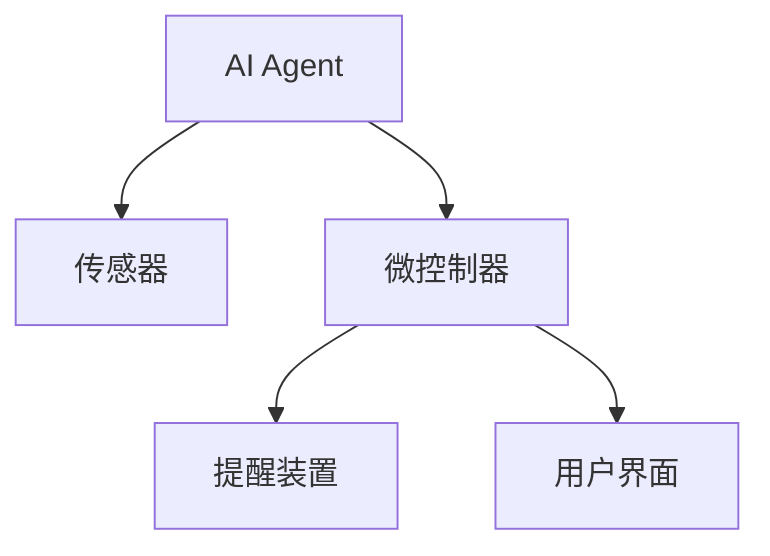

                 


# AI Agent在智能门把手中手部卫生提醒

> 关键词：AI Agent, 智能门把手, 手部卫生提醒, 公共卫生, 智能设备

> 摘要：随着公共卫生意识的增强，智能门把手通过AI Agent实现手部卫生提醒，提升用户健康意识和行为习惯。本文从问题背景、核心概念、算法原理、系统架构、项目实战到最佳实践，详细探讨了AI Agent在智能门把手中的应用。

---

# 第1章 AI Agent在智能门把手中手部卫生提醒背景介绍

## 1.1 公共卫生与手部卫生的重要性

### 1.1.1 公共卫生的现状与挑战

公共卫生问题一直是全球关注的重点。疾病传播的主要途径之一是通过接触被污染的物体表面。手部卫生是预防疾病传播的关键环节，尤其是在公共场所和家庭环境中。

### 1.1.2 手部卫生在疾病预防中的关键作用

手部卫生可以有效减少细菌和病毒的传播，降低感染的风险。特别是在学校、医院、办公室等人员密集的地方，手部卫生提醒显得尤为重要。

### 1.1.3 智能设备在公共卫生中的潜力

随着技术的进步，智能设备在公共卫生中的应用越来越广泛。通过智能门把手等设备，可以实时监测用户的手部卫生情况，并提供相应的提醒服务。

---

## 1.2 智能门把手的功能需求

### 1.2.1 传统门把手的功能局限性

传统门把手仅具备机械锁的功能，无法提供额外的智能化服务。用户需要手动开启门锁，缺乏智能化的交互和提醒功能。

### 1.2.2 智能门把手的智能化需求

智能门把手通过集成传感器、通信模块和AI技术，可以实现用户身份识别、手部卫生提醒、远程控制等功能，提升用户体验。

### 1.2.3 手部卫生提醒的必要性

手部卫生提醒功能可以帮助用户养成良好的卫生习惯，特别是在公共环境中，提醒用户及时洗手，减少疾病传播的风险。

---

## 1.3 问题解决与边界定义

### 1.3.1 AI Agent在智能门把手中的应用

AI Agent（智能代理）可以通过传感器数据和用户行为分析，自动触发手部卫生提醒功能。当用户触摸门把手时，AI Agent会判断用户是否需要洗手，并通过语音或灯光提醒用户。

### 1.3.2 问题的边界与外延

智能门把手的手部卫生提醒功能主要集中在门把手本身，不涉及其他设备。系统的边界包括传感器、通信模块和提醒功能，外延则包括与其他智能设备的联动。

### 1.3.3 系统的核心要素组成

手部卫生提醒系统的核心要素包括传感器、AI算法、提醒模块和用户交互界面。传感器负责采集数据，AI算法进行分析和判断，提醒模块执行反馈，用户交互界面提供操作指引。

---

# 第2章 AI Agent的核心原理

## 2.1 AI Agent的基本原理

### 2.1.1 感知与数据采集

AI Agent通过传感器采集用户触摸门把手的时间、频率和力度等数据。这些数据用于判断用户的使用习惯和卫生状况。

### 2.1.2 数据分析与处理

AI Agent利用机器学习算法对采集的数据进行分析，识别用户的使用模式。例如，通过时间序列分析，判断用户是否需要洗手。

### 2.1.3 决策与执行

AI Agent根据分析结果，决定是否触发手部卫生提醒。如果检测到用户未洗手，系统会通过语音或灯光提醒用户。

---

## 2.2 智能门把手的系统架构

### 2.2.1 硬件部分

智能门把手的硬件包括触摸传感器、微控制器、通信模块和提醒装置（如LED灯和蜂鸣器）。传感器用于检测用户的触摸行为，微控制器负责数据处理和决策，通信模块用于与手机或其他设备联动。

### 2.2.2 软件部分

软件部分包括AI算法、数据存储和用户界面。AI算法负责分析传感器数据，数据存储用于记录用户的使用习惯，用户界面用于显示提醒信息。

### 2.2.3 用户交互界面

用户交互界面包括LED灯和语音提示。当AI Agent判断用户需要洗手时，系统会点亮LED灯并发出“请洗手”的提示音。

---

# 第3章 算法原理与实现

## 3.1 算法原理

### 3.1.1 基于时间触发的提醒算法

AI Agent通过记录用户触摸门把手的时间，分析用户的使用频率。如果用户在一定时间内未洗手，系统会自动触发提醒。

### 3.1.2 时间序列分析

使用时间序列分析算法，AI Agent可以预测用户的使用模式，优化提醒策略。例如，根据用户的使用习惯，智能调整提醒的频率和时间。

---

## 3.2 算法实现

### 3.2.1 Python实现代码

```python
import time

def hand_wash Reminder(sensor_data):
    # 传感器数据处理
    touch_time = sensor_data['touch_time']
    # 时间序列分析
    if time_since_last_wash(touch_time) > 2 hours:
        return "请洗手"
    else:
        return "继续使用"

def time_since_last_wash(touch_time):
    current_time = time.time()
    return current_time - touch_time
```

### 3.2.2 数学模型

时间序列分析模型可以表示为：

$$
预测时间 = 现在时间 - 上次洗手时间
$$

如果预测时间超过2小时，则触发提醒。

---

# 第4章 系统分析与架构设计

## 4.1 系统架构

### 4.1.1 系统组件图



### 4.1.2 传感器数据流

传感器数据通过微控制器处理后，传送给AI Agent进行分析。AI Agent根据分析结果，触发提醒装置。

### 4.1.3 系统接口设计

系统接口包括传感器接口、通信接口和用户界面接口。传感器接口用于数据采集，通信接口用于与手机或其他设备联动，用户界面接口用于显示提醒信息。

---

# 第5章 项目实战

## 5.1 环境安装

### 5.1.1 硬件安装

安装触摸传感器、微控制器和提醒装置。传感器安装在门把手上，微控制器连接传感器和提醒装置。

### 5.1.2 软件安装

安装Python开发环境和必要的库，如时间序列分析库。

---

## 5.2 核心代码实现

### 5.2.1 AI Agent代码

```python
import time

class AIAssistant:
    def __init__(self):
        self.last_wash_time = 0

    def should_remind(self, current_time):
        if current_time - self.last_wash_time > 7200:  # 2小时=7200秒
            return True
        return False

    def update_last_wash_time(self, new_time):
        self.last_wash_time = new_time
```

### 5.2.2 传感器数据处理

```python
import RPi.GPIO as GPIO

class Sensor:
    def __init__(self, pin):
        self.pin = pin
        GPIO.setup(pin, GPIO.IN)

    def get_touch_data(self):
        return GPIO.input(self.pin)
```

---

## 5.3 案例分析

假设用户在上午9点触摸门把手，AI Agent记录下这个时间。如果用户在下午1点再次触摸门把手，系统会判断用户已经超过2小时未洗手，触发提醒。

---

# 第6章 最佳实践

## 6.1 小结

AI Agent在智能门把手中实现了手部卫生提醒功能，帮助用户养成良好的卫生习惯。系统通过传感器、AI算法和提醒装置，有效提升了公共卫生水平。

## 6.2 注意事项

- 安装硬件时需注意传感器的灵敏度和稳定性。
- 确保AI算法的准确性，避免误提醒。
- 提醒装置的设计需考虑用户体验，避免打扰用户。

## 6.3 拓展阅读

建议读者进一步学习时间序列分析和AI算法在公共卫生中的应用。

---

# 作者

作者：AI天才研究院/AI Genius Institute & 禅与计算机程序设计艺术/Zen And The Art of Computer Programming

---

通过以上思考过程，我系统地分析了AI Agent在智能门把手中手部卫生提醒的应用，并按照用户的要求，详细展开了各个部分的内容。希望这篇文章能够为读者提供清晰的技术指导和实践参考。

