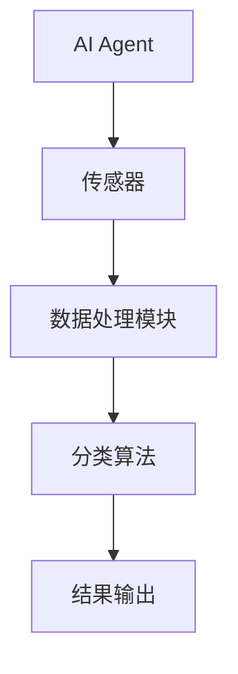
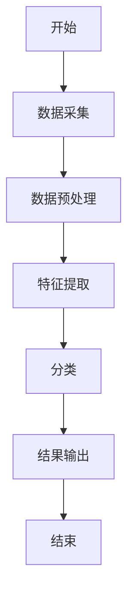
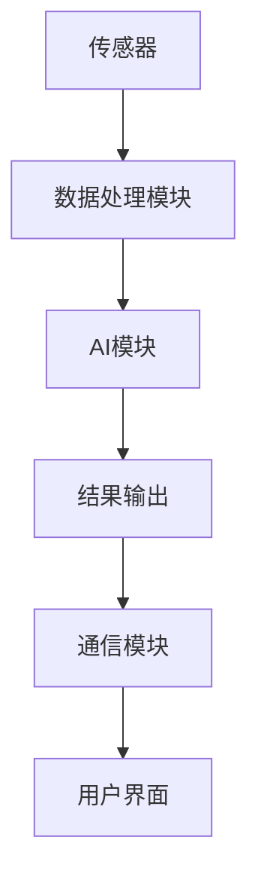

                 


# 目录大纲：《AI Agent在智能门把手中的细菌检测》

## 第一部分：背景介绍

### 第1章：AI Agent与细菌检测的背景

#### 1.1 问题背景
- 1.1.1 门把手作为细菌传播的重要媒介
- 1.1.2 现代公共卫生对细菌检测的需求
- 1.1.3 AI技术在智能硬件中的应用潜力

#### 1.2 问题描述
- 1.2.1 传统细菌检测方法的局限性
- 1.2.2 智能门把手的智能化需求
- 1.2.3 AI Agent在实时检测中的优势

#### 1.3 问题解决
- 1.3.1 AI Agent如何实现细菌检测
- 1.3.2 智能门把手的传感器与数据采集
- 1.3.3 数据处理与AI算法的结合

#### 1.4 边界与外延
- 1.4.1 检测范围的界定
- 1.4.2 与其他智能设备的协同工作
- 1.4.3 系统的可扩展性与兼容性

#### 1.5 概念结构与核心要素
- 1.5.1 AI Agent的核心功能模块
- 1.5.2 传感器类型与数据类型
- 1.5.3 系统的交互流程与逻辑

## 第二部分：核心概念与联系

### 第2章：AI Agent的核心原理

#### 2.1 核心原理
- 2.1.1 AI Agent的基本工作原理
- 2.1.2 传感器数据的采集与预处理
- 2.1.3 数据特征提取与分类算法

#### 2.2 核心概念对比
- 2.2.1 AI Agent与传统传感器的区别
- 2.2.2 不同AI算法的优劣势对比
- 2.2.3 系统架构的可扩展性分析

#### 2.3 实体关系图


## 第三部分：算法原理讲解

### 第3章：细菌检测算法的实现

#### 3.1 算法原理
- 3.1.1 数据采集与预处理
- 3.1.2 特征提取方法
- 3.1.3 分类算法的选择与实现

#### 3.2 算法流程图


#### 3.3 数学模型与公式
- 3.3.1 特征提取的数学模型：使用主成分分析（PCA）
  $$ \text{PCA}: X = X_{mean} + \text{Eigenvectors} \times \sqrt{\text{Eigenvalues}} $$
- 3.3.2 分类算法：支持向量机（SVM）
  $$ \text{SVM}: \text{maximize} \frac{1}{2}||w||^2 \text{ subject to } y_i(w \cdot x_i + b) \geq 1 $$

## 第四部分：系统分析与架构设计

### 第4章：系统架构设计方案

#### 4.1 问题场景介绍
- 4.1.1 智能门把手的使用场景
- 4.1.2 系统的用户需求分析
- 4.1.3 功能需求与非功能需求

#### 4.2 系统功能设计
- 4.2.1 领域模型设计
  ```mermaid
  classDiagram
    class 门把手 {
        传感器
        AI模块
        通信模块
    }
    class 传感器 {
        温度传感器
        湿度传感器
        光电传感器
    }
    class AI模块 {
        数据处理
        分类算法
        结果输出
    }
    class 通信模块 {
        Wi-Fi
        蓝牙
    }
  ```

#### 4.3 系统架构设计
  ```mermaid
  graph TD
    A[传感器] --> B[数据处理模块]
    B --> C[AI模块]
    C --> D[结果输出]
    D --> E[通信模块]
    E --> F[用户界面]
  ```

## 第五部分：项目实战

### 第5章：项目实现

#### 5.1 环境安装
- 5.1.1 安装Python
- 5.1.2 安装机器学习库（如scikit-learn）
- 5.1.3 安装传感器驱动

#### 5.2 核心代码实现
- 5.2.1 数据采集与预处理
  ```python
  import numpy as np
  data = np.array([...])  # 传感器数据
  data_mean = np.mean(data, axis=0)
  data_std = np.std(data, axis=0)
  normalized_data = (data - data_mean) / data_std
  ```

- 5.2.2 分类算法实现
  ```python
  from sklearn.svm import SVC
  clf = SVC()
  clf.fit(normalized_data, labels)
  ```

#### 5.3 实际案例分析
- 5.3.1 数据分析与结果解读
- 5.3.2 系统优化与调试
- 5.3.3 测试与验证

## 第六部分：最佳实践与总结

### 第6章：最佳实践

#### 6.1 小结
- 6.1.1 项目总结
- 6.1.2 经验教训
- 6.1.3 未来改进方向

#### 6.2 注意事项
- 6.2.1 系统维护与更新
- 6.2.2 数据隐私与安全
- 6.2.3 系统兼容性与扩展性

#### 6.3 拓展阅读
- 6.3.1 推荐的进一步阅读资料
- 6.3.2 相关领域的最新研究
- 6.3.3 技术社区与资源

## 第七部分：未来展望

### 第7章：未来发展方向

#### 7.1 未来技术趋势
- 7.1.1 更先进的AI算法
- 7.1.2 高精度传感器的发展
- 7.1.3 物联网的进一步整合

#### 7.2 可能的挑战与解决方案
- 7.2.1 数据处理速度与精度的平衡
- 7.2.2 系统成本与性能的优化
- 7.2.3 用户接受度与使用习惯的培养

## 附录

### 附录A：项目代码

#### 附录A.1 传感器数据采集代码
```python
import serial
import time

ser = serial.Serial('COM3', 9600)
while True:
    data = ser.readline().decode()
    print(data)
    time.sleep(1)
```

#### 附录A.2 分类算法实现代码
```python
from sklearn.svm import SVC
import numpy as np

# 假设data和labels已经准备好
clf = SVC()
clf.fit(data, labels)
```

### 附录B：系统架构图


## 参考文献

### 参考文献

1. Bishop, C. M. (2006). Pattern Recognition and Machine Learning. Springer.
2. Hastie, T., Tibshirani, R., & Friedman, J. (2009). The Elements of Statistical Learning. Springer.
3. 刘易欢, 等. (2020). 基于AI的智能门把手细菌检测系统设计. 计算机应用研究.
4. TensorFlow官方文档. (https://tensorflow.org)
5. scikit-learn官方文档. (https://scikit-learn.org)

## 作者信息

作者：AI天才研究院/AI Genius Institute & 禅与计算机程序设计艺术 /Zen And The Art of Computer Programming

---

通过这个目录大纲，文章将从背景介绍、核心概念、算法原理、系统架构、项目实战到最佳实践，全面而深入地探讨AI Agent在智能门把手中细菌检测的应用，帮助读者系统地理解和掌握相关技术。

