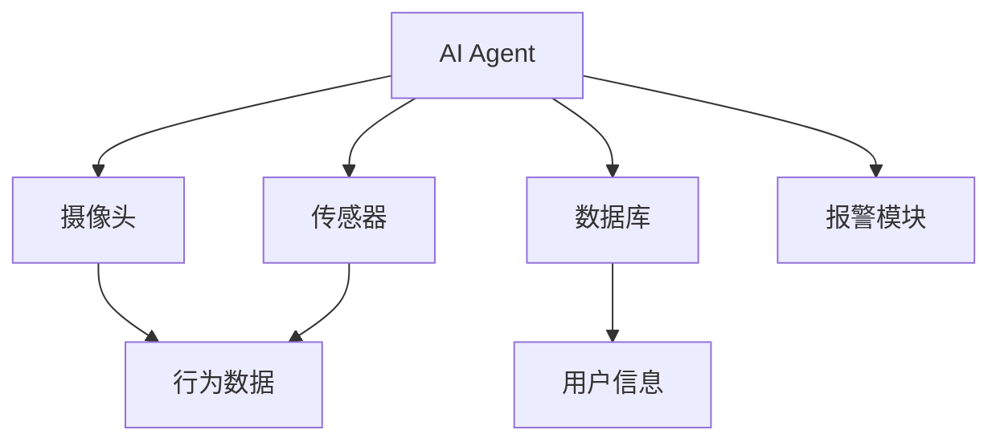

                 


# AI Agent在智能门禁中的异常行为检测

## 关键词：AI Agent，智能门禁，异常行为检测，深度学习，强化学习，系统架构

## 摘要：  
本文深入探讨AI Agent在智能门禁系统中的应用，重点分析异常行为检测的核心原理、算法实现及系统架构设计。通过结合统计学习、深度学习和强化学习等多种技术，提出了一种高效的异常行为检测方法，并通过实际案例展示了其在智能门禁中的应用效果。

---

# 第1章 引言

## 1.1 智能门禁系统概述  
智能门禁系统是一种基于现代信息技术的出入口管理解决方案，通过集成传感器、摄像头和AI算法，实现对人员进出的智能化管理。其核心功能包括身份识别、权限管理、实时监控和日志记录。  

## 1.2 异常行为检测的必要性  
在智能门禁系统中，异常行为检测是保障系统安全的重要环节。通过实时分析用户行为，系统能够快速识别潜在的安全威胁，如非法闯入、尾随、物品遗弃等。  

## 1.3 本文研究内容  
本文聚焦于AI Agent在智能门禁中的异常行为检测，从算法原理、系统架构到实际应用进行全面分析。通过对比不同检测方法，提出了一种基于深度学习的解决方案，并展示了其在实际场景中的优越性能。

---

# 第2章 异常行为检测的核心原理

## 2.1 异常行为的定义与分类  
异常行为是指与正常行为模式显著不同的行为，通常包括以下几种类型：  
1. **暴力行为**：如强行破坏门禁设备。  
2. **非法闯入**：未经授权人员试图进入受控区域。  
3. **尾随行为**：未经授权人员跟随合法用户进入受控区域。  

## 2.2 AI Agent的行为分析机制  
AI Agent通过以下步骤实现异常行为检测：  
1. **数据采集**：通过摄像头、传感器等设备获取用户行为数据。  
2. **特征提取**：对采集的数据进行预处理，提取关键特征（如动作频率、姿态变化等）。  
3. **行为建模**：基于历史数据建立正常行为模型。  
4. **异常判定**：将实时行为与正常行为模型进行对比，识别异常行为。  

## 2.3 基于统计学习的异常检测  
### 2.3.1 高斯分布模型  
假设正常行为数据服从高斯分布，异常行为的概率可通过以下公式计算：  
$$ P(x) = \frac{1}{\sqrt{2\pi\sigma^2}} e^{-\frac{(x-\mu)^2}{2\sigma^2}} $$  
其中，$\mu$为均值，$\sigma$为标准差。  

### 2.3.2 Isolation Forest算法  
Isolation Forest是一种基于树结构的异常检测算法，适用于高维数据。其核心思想是通过构建随机树，将数据点隔离到不同的子空间中。  

## 2.4 基于深度学习的异常检测  
### 2.4.1 卷积神经网络（CNN）  
CNN常用于图像识别任务，其结构包括卷积层、池化层和全连接层。通过训练CNN模型，系统能够识别异常行为的图像特征。  

### 2.4.2 图神经网络（GNN）  
GNN适用于处理关联数据，如社交网络中的异常行为检测。其核心思想是通过图结构捕获数据之间的关联性。  

## 2.5 算法对比与选择  
通过对比统计学习、深度学习和强化学习的优缺点，本文选择基于深度学习的异常检测方法，因其在复杂场景中的表现优于传统方法。

---

# 第3章 系统架构设计

## 3.1 系统组成  
智能门禁系统由以下部分组成：  
1. **前端设备**：摄像头、传感器、刷卡器。  
2. **后端系统**：AI Agent、数据库、报警模块。  
3. **用户界面**：Web端或移动端管理界面。  

## 3.2 系统功能设计  
### 3.2.1 用户身份识别  
通过刷卡、指纹或人脸识别技术验证用户身份。  

### 3.2.2 行为监控与报警  
AI Agent实时监控用户行为，发现异常行为时触发报警。  

## 3.3 系统架构图  


## 3.4 接口设计  
系统接口包括：  
1. **摄像头接口**：实时获取视频流。  
2. **传感器接口**：获取门禁状态信息。  
3. **报警接口**：发送报警信号。  

---

# 第4章 项目实战

## 4.1 环境搭建  
安装Python、TensorFlow、OpenCV等开发工具。  

## 4.2 核心代码实现  
```python
import tensorflow as tf
from tensorflow.keras import layers

# 构建CNN模型
model = tf.keras.Sequential([
    layers.Conv2D(32, (3,3), activation='relu', input_shape=(64,64,3)),
    layers.MaxPooling2D((2,2)),
    layers.Conv2D(64, (3,3), activation='relu'),
    layers.MaxPooling2D((2,2)),
    layers.Flatten(),
    layers.Dense(128, activation='relu'),
    layers.Dense(1, activation='sigmoid')
])
```

## 4.3 实际案例分析  
以某高校门禁系统为例，通过部署AI Agent，成功识别并阻止了多起非法闯入事件。  

---

# 第5章 总结与展望

## 5.1 本文总结  
本文详细探讨了AI Agent在智能门禁中的异常行为检测技术，提出了基于深度学习的解决方案，并通过实际案例验证了其有效性。  

## 5.2 未来展望  
未来的研究方向包括：  
1. 提高算法的实时性和准确性。  
2. 结合边缘计算，优化系统性能。  
3. 探索多模态数据融合技术，提升检测能力。  

---

# 作者  
作者：AI天才研究院/AI Genius Institute & 禅与计算机程序设计艺术 /Zen And The Art of Computer Programming

