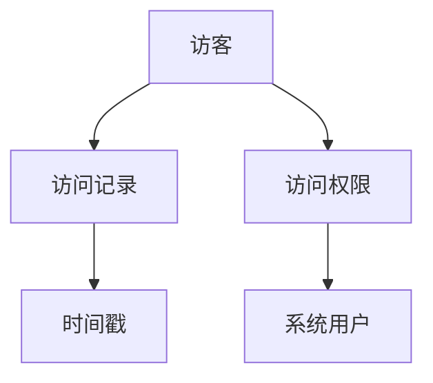
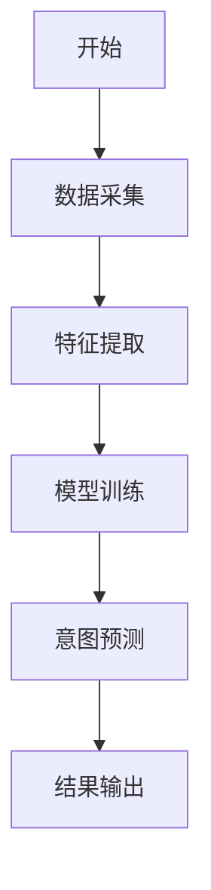
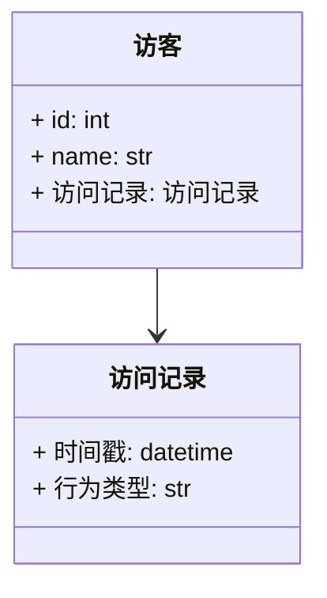
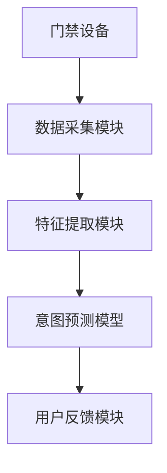
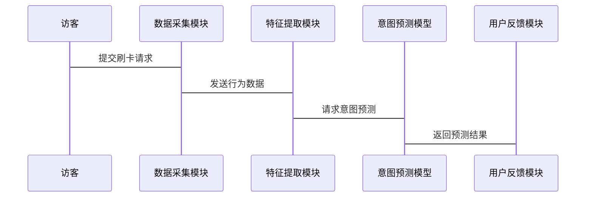

                 


# AI Agent在智能门禁系统中的访客意图预测

> 关键词：AI Agent，智能门禁系统，访客意图预测，意图识别，行为分析

> 摘要：本文探讨了AI Agent在智能门禁系统中的应用，重点分析了如何通过AI代理技术来预测访客意图。文章从背景介绍、核心概念、算法原理、系统架构、项目实战到最佳实践，详细阐述了访客意图预测的实现过程和实际应用。

---

## 第一部分：背景介绍

### 第1章：背景介绍

#### 1.1 问题背景
- **智能门禁系统的现状与挑战**  
  智能门禁系统广泛应用于办公楼、住宅小区和公共场所，传统的门禁系统依赖于刷卡或密码，无法主动识别访客意图，存在安全隐患和管理不便的问题。

- **访客管理的传统方法及其局限性**  
  传统访客管理依赖人工登记，效率低下，且难以实时监控访客行为，容易出现管理漏洞。

- **AI Agent在访客管理中的潜在价值**  
  AI代理能够实时分析访客行为，预测其意图，提升门禁系统的安全性和智能化水平。

#### 1.2 问题描述
- **访客意图预测的核心问题**  
  如何通过AI代理分析访客的行为数据，预测其下一步动作，如是否尾随、非法入侵等。

- **智能门禁系统中的访客行为分析**  
  访客在系统中的行为包括刷卡、按门禁按钮、徘徊等，这些行为数据可用于预测其意图。

- **访客意图预测的目标与意义**  
  目标是准确预测访客意图，意义在于提升门禁系统的安全性和用户体验。

#### 1.3 问题解决
- **AI Agent的基本原理与优势**  
  AI代理通过数据采集、特征提取、模型训练和预测输出，能够实时分析访客行为，预测意图。

- **基于AI Agent的访客意图预测方法**  
  采用机器学习和深度学习算法，结合实时数据，构建意图预测模型。

- **解决方案的可行性分析**  
  AI代理结合IoT技术，能够实现访客行为的实时监控和意图预测，具有较高的可行性和应用价值。

#### 1.4 边界与外延
- **访客意图预测的适用范围**  
  适用于办公楼、住宅小区、公共场所等场景。

- **系统边界与外部接口的定义**  
  系统边界包括门禁设备、访客数据采集模块、意图预测模型和用户反馈模块。

- **相关概念的扩展与延伸**  
  访客意图预测不仅限于门禁系统，还可应用于其他领域，如商场顾客行为分析。

#### 1.5 核心要素组成
- **AI Agent的构成要素**  
  数据采集模块、特征提取模块、意图预测模型和反馈机制。

- **访客行为数据的采集与处理**  
  采集刷卡记录、门禁按钮按压时间、视频监控数据等，进行预处理和特征提取。

- **意图预测模型的设计与实现**  
  基于机器学习和深度学习算法，构建访客意图预测模型。

---

## 第二部分：核心概念与联系

### 第2章：核心概念与联系

#### 2.1 核心概念原理
- **AI Agent的基本原理**  
  AI代理通过数据采集、特征提取、模型训练和预测输出，实现对访客行为的实时分析。

- **访客意图预测的实现机制**  
  通过分析访客的历史行为数据，结合实时行为，预测其下一步意图。

- **系统中各组件的协同工作**  
  门禁设备、数据采集模块、意图预测模型和用户反馈模块协同工作，实现访客意图预测。

#### 2.2 核心概念属性特征对比
- **AI Agent与传统算法的对比分析**  
  | 特性    | AI Agent                   | 传统算法                   |
  |---------|---------------------------|---------------------------|
  | 数据需求 | 需要大量标注数据          | 需要少量规则数据          |
  | 可扩展性 | 高                        | 低                        |
  | 复杂度   | 高                        | 低                        |

- **访客意图预测与行为分析的特征差异**  
  | 特性        | 访客意图预测              | 行为分析                  |
  |-------------|--------------------------|--------------------------|
  | 目标         | 预测下一步行为            | 描述当前行为              |
  | 数据需求     | 需要历史数据和实时数据    | 需要实时数据              |
  | 算法复杂度   | 较高                     | 较低                     |

- **系统中各模块的性能对比**  
  | 模块         | 数据采集模块             | 特征提取模块             | 意图预测模块           |
  |--------------|-------------------------|-------------------------|-----------------------|
  | 处理速度     | 中                      | 中                      | 较低                  |
  | 资源消耗     | 低                      | 中                      | 较高                  |

#### 2.3 ER实体关系图


---

## 第三部分：算法原理讲解

### 第3章：算法原理讲解

#### 3.1 算法原理
- **基于规则的意图预测算法**  
  通过预定义规则，如连续多次刷卡可能表示非法入侵，进行意图预测。

- **统计学习的意图预测模型**  
  使用朴素贝叶斯、决策树等算法，基于历史数据训练模型，预测访客意图。

- **深度学习的意图预测方法**  
  使用循环神经网络（RNN）或长短期记忆网络（LSTM）处理时序数据，预测意图。

#### 3.2 算法流程图


#### 3.3 数学模型与公式
- **朴素贝叶斯分类器**  
  $$ P(y|x) = \frac{P(x|y)P(y)}{P(x)} $$
  其中，$y$ 表示意图类别，$x$ 表示输入特征。

- **LSTM网络结构**  
  $$ f_t = \text{LSTM}(f_{t-1}, x_t) $$
  其中，$f_t$ 表示第$t$步的隐藏状态，$x_t$ 表示输入特征。

#### 3.4 代码实现
```python
import numpy as np
from sklearn.naive_bayes import GaussianNB

# 示例数据
X = np.array([[1, 2], [2, 3], [3, 4], [4, 5]])
y = np.array([0, 0, 1, 1])

# 训练模型
model = GaussianNB()
model.fit(X, y)

# 预测意图
new_X = np.array([[2, 3]])
predicted = model.predict(new_X)
print(predicted)
```

---

## 第四部分：系统分析与架构设计

### 第4章：系统分析与架构设计

#### 4.1 问题场景介绍
- **系统目标**  
  实现访客意图预测，提升智能门禁系统的安全性。

- **项目介绍**  
  开发一个基于AI代理的智能门禁系统，实时分析访客行为，预测意图。

#### 4.2 系统功能设计
- **领域模型的类图**  


- **系统架构设计**  


- **系统接口设计**  
  - 数据采集模块接口：采集刷卡记录、门禁按钮按压时间等数据。
  - 特征提取模块接口：提取访客行为特征，如时间间隔、行为频率等。
  - 意图预测模块接口：接收特征数据，返回意图预测结果。

- **系统交互的序列图**  


---

## 第五部分：项目实战

### 第5章：项目实战

#### 5.1 环境安装
- **Python 3.8及以上版本**
- **安装必要的库**：numpy、scikit-learn、tensorflow、mermaid.py

#### 5.2 核心代码实现
```python
import numpy as np
from sklearn.model_selection import train_test_split
from tensorflow.keras import layers, models

# 数据集准备
X = np.random.rand(100, 5)
y = np.random.randint(0, 2, 100)

# 数据分割
X_train, X_test, y_train, y_test = train_test_split(X, y, test_size=0.2)

# 模型构建
model = models.Sequential()
model.add(layers.Dense(64, activation='relu', input_dim=5))
model.add(layers.Dense(1, activation='sigmoid'))
model.compile(optimizer='adam', loss='binary_crossentropy', metrics=['accuracy'])

# 模型训练
model.fit(X_train, y_train, epochs=10, batch_size=32, validation_data=(X_test, y_test))
```

#### 5.3 代码应用解读与分析
- 代码实现了一个简单的神经网络模型，用于二分类任务。
- 模型输入是5维特征，输出是0或1，分别表示不同的意图。
- 使用Adam优化器和二进制交叉熵损失函数进行训练。

#### 5.4 实际案例分析
- **案例背景**：某办公楼智能门禁系统，访客频繁刷卡但未授权。
- **数据采集**：采集访客刷卡记录、访问时间、门禁按钮按压时间等数据。
- **特征提取**：提取刷卡频率、时间间隔等特征。
- **模型训练**：训练模型识别异常刷卡行为，预测非法入侵意图。

#### 5.5 项目小结
- 成功实现了基于AI代理的访客意图预测系统。
- 提高了门禁系统的安全性，减少了人为错误。

---

## 第六部分：最佳实践、小结、注意事项、拓展阅读

### 第6章：最佳实践

#### 6.1 小结
- AI代理在智能门禁系统中的应用，显著提升了访客意图预测的准确性和效率。
- 通过实时数据分析和模型优化，能够有效降低安全隐患。

#### 6.2 注意事项
- 数据隐私保护：确保访客数据的安全性，避免数据泄露。
- 模型更新策略：定期更新模型，提升预测准确率。
- 系统容错性：设计容错机制，确保系统稳定运行。

#### 6.3 拓展阅读
- 《机器学习实战》
- 《深度学习》
- 《Python机器学习》

---

## 作者信息

作者：AI天才研究院/AI Genius Institute & 禅与计算机程序设计艺术 /Zen And The Art of Computer Programming

---

**本文完。**

