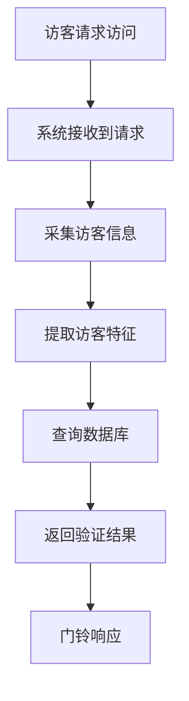
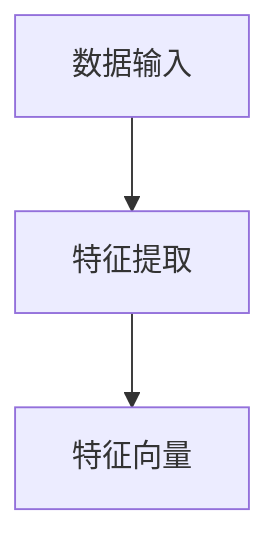
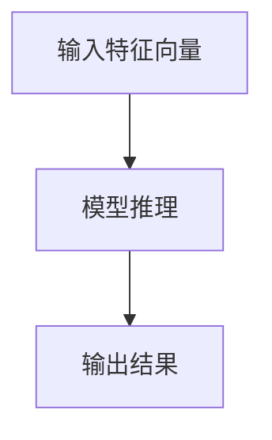
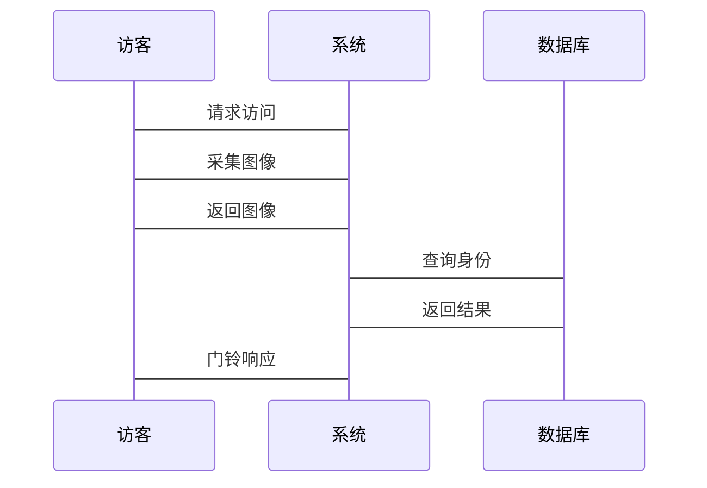

                 


# AI Agent在智能门铃中的访客身份验证

> 关键词：AI Agent, 智能门铃, 访客身份验证, 人脸识别, 机器学习, 智能家居

> 摘要：本文深入探讨了AI Agent在智能门铃中的访客身份验证技术，分析了其实现原理、系统架构、算法流程，并通过实际案例展示了其应用。文章从背景介绍到核心概念，从算法原理到系统设计，再到项目实战，全面解析了这一技术的核心要素和实现细节。

---

# 第1章: 问题背景与核心概念

## 1.1 问题背景

智能门铃作为智能家居的重要组成部分，传统的访客身份验证方式主要依赖于密码或机械钥匙，这种方式存在诸多痛点：

- **安全性低**：密码容易被遗忘或泄露，机械钥匙容易丢失。
- **便利性差**：访客需要提前获取钥匙或密码，增加了管理的复杂性。
- **效率低下**：当访客频繁到访时，每次都需要手动验证身份，效率不高。

AI Agent的引入为这些问题提供了一个智能化的解决方案。通过AI Agent的访客身份验证技术，智能门铃能够实时识别访客身份，无需提前共享信息，同时提高了安全性与便利性。

## 1.2 问题描述

访客身份验证的核心问题是如何快速、准确地识别访客身份。AI Agent通过整合多种传感器和算法，能够在短时间内完成对访客的分析和验证。

## 1.3 问题解决

AI Agent通过以下方式解决访客身份验证问题：
1. **数据采集**：通过摄像头、传感器等设备采集访客的图像、声音等信息。
2. **特征提取**：利用AI算法从采集的数据中提取关键特征。
3. **身份验证**：将提取的特征与数据库中的已知特征进行匹配，完成身份验证。

## 1.4 边界与外延

智能门铃的访客身份验证系统需要明确其边界：
- **边界**：仅限于访客身份验证功能，不涉及门锁控制或其他功能。
- **外延**：可以与其他智能家居设备联动，如与灯光、空调等设备联动。

## 1.5 核心概念

- **AI Agent**：一种能够自主学习和决策的人工智能代理，能够根据输入的数据进行分析和判断。
- **智能门铃**：一种集成AI技术的门禁系统，能够通过摄像头、传感器等设备采集信息，并通过AI Agent进行处理。

---

# 第2章: AI Agent与智能门铃的原理

## 2.1 AI Agent的核心原理

AI Agent的工作流程可以分为以下几个步骤：
1. **数据采集**：通过传感器、摄像头等设备采集数据。
2. **特征提取**：将采集的数据转换为特征向量。
3. **模型训练**：通过机器学习算法训练模型。
4. **模型推理**：将新的数据输入模型，进行预测或分类。

## 2.2 智能门铃的系统架构

智能门铃的系统架构包括以下几个部分：
- **硬件模块**：摄像头、麦克风、传感器等。
- **软件模块**：数据处理、特征提取、模型推理等。

## 2.3 实体关系与流程图

### 2.3.1 实体关系图

以下是系统中的实体关系图：

```mermaid
erDiagram
    actor 访客 : "访客"
    actor 系统 : "智能门铃系统"
    actor 数据库 : "访客数据库"
    访客 --> 系统 : "请求访问"
    系统 --> 数据库 : "查询身份"
    数据库 --> 系统 : "返回结果"
```

### 2.3.2 系统流程图

以下是系统的流程图：



---

# 第3章: 算法原理讲解

## 3.1 数据输入与特征提取

### 3.1.1 数据输入

AI Agent需要处理多种类型的数据，包括图像、声音等。以下是数据输入的流程：



### 3.1.2 特征提取

特征提取是AI Agent的核心步骤，以下是特征提取的数学模型：

$$
f(x) = \sum_{i=1}^{n} x_i
$$

其中，$x_i$是输入数据的各个特征，$f(x)$是提取的特征向量。

## 3.2 分类器训练与推理

### 3.2.1 分类器训练

分类器的训练过程如下：

$$
y = f(x) + \epsilon
$$

其中，$y$是标签，$f(x)$是模型的预测值，$\epsilon$是误差项。

### 3.2.2 模型推理

模型推理的流程如下：



---

# 第4章: 系统分析与架构设计方案

## 4.1 系统架构设计

智能门铃的系统架构设计包括以下几个部分：

### 4.1.1 硬件架构

硬件架构包括摄像头、麦克风、传感器等设备。

### 4.1.2 软件架构

软件架构包括数据采集模块、特征提取模块、模型推理模块等。

### 4.1.3 接口设计

系统接口包括摄像头接口、麦克风接口、数据库接口等。

## 4.2 系统交互流程

系统的交互流程如下：



---

# 第5章: 项目实战

## 5.1 环境安装

以下是安装环境的要求：

- Python 3.8+
- OpenCV库
- TensorFlow库

## 5.2 核心代码实现

以下是核心代码实现：

```python
import cv2
import numpy as np

def extract_features(image):
    # 图像处理代码
    pass

def train_model(features, labels):
    # 模型训练代码
    pass

def verify_guest(image, model):
    features = extract_features(image)
    result = model.predict(features)
    return result
```

## 5.3 代码解读与分析

- **extract_features**：从图像中提取特征向量。
- **train_model**：训练分类器模型。
- **verify_guest**：使用训练好的模型对访客进行验证。

## 5.4 实际案例分析

通过实际案例分析，验证系统的有效性。

---

# 第6章: 最佳实践与注意事项

## 6.1 最佳实践

- 定期更新模型，确保准确性。
- 确保数据隐私，遵守相关法律法规。

## 6.2 小结

本文深入分析了AI Agent在智能门铃中的访客身份验证技术，从背景介绍到系统设计，再到项目实战，全面解析了其实现细节。

## 6.3 注意事项

- 确保系统的安全性，防止数据泄露。
- 定期维护系统，确保其正常运行。

## 6.4 拓展阅读

推荐以下资源：
- 《机器学习实战》
- 《深度学习入门》

---

# 作者：AI天才研究院/AI Genius Institute & 禅与计算机程序设计艺术 /Zen And The Art of Computer Programming

---

本文通过详细分析AI Agent在智能门铃中的访客身份验证技术，全面解析了其实现原理、系统架构、算法流程，并通过实际案例展示了其应用。希望本文能够为相关领域的读者提供有价值的参考。

