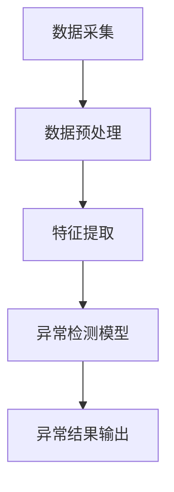
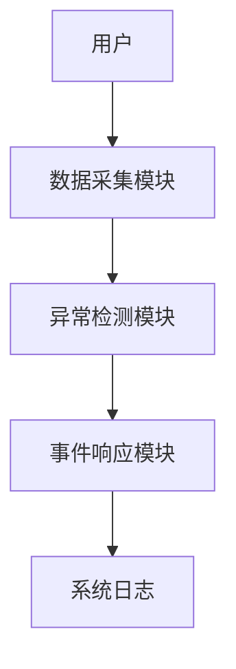

                 


# AI Agent在智能门锁中的异常使用检测

> 关键词：AI Agent，智能门锁，异常使用检测，机器学习，网络安全

> 摘要：随着智能门锁的普及，异常使用检测成为保障用户安全的重要环节。本文深入探讨AI Agent在智能门锁异常检测中的应用，从系统架构到算法实现，全面解析如何利用AI技术提升门锁的安全性。

---

# 第1章: AI Agent在智能门锁中的异常使用检测概述

## 1.1 异常使用检测的背景与意义
### 1.1.1 智能门锁的发展现状
智能门锁作为智能家居的重要组成部分，近年来得到了广泛应用。然而，其安全性问题日益凸显，尤其是在面对异常使用场景时，传统基于规则的检测方法已难以满足需求。

### 1.1.2 异常使用检测的重要性
异常使用检测旨在识别未经授权的操作或异常行为，如暴力破解、非法入侵等，是保障用户财产和隐私的关键环节。

### 1.1.3 AI Agent的优势
AI Agent（人工智能代理）能够实时分析门锁数据，通过学习用户行为模式，快速识别异常行为，显著提升了检测的准确性和效率。

## 1.2 本章小结
本章通过分析智能门锁的发展现状和异常检测的重要性，引出了AI Agent在这一领域的独特优势，为后续的技术探讨奠定了基础。

---

# 第2章: AI Agent与智能门锁的核心概念

## 2.1 AI Agent的基本概念
### 2.1.1 AI Agent的定义
AI Agent是一种能够感知环境、自主决策并执行任务的智能实体，具备学习、推理和自适应能力。

### 2.1.2 AI Agent的核心功能
- 数据采集与处理
- 实时分析与推理
- 异常检测与反馈
- 自适应优化

## 2.2 智能门锁的关键特性
### 2.2.1 智能门锁的功能模块
- 感知识别模块（指纹、密码、刷卡）
- 通信模块（Wi-Fi、蓝牙）
- 控制模块（电机、电磁锁）

### 2.2.2 异常使用场景分析
- 非法尝试次数过多
- 时间异常的开门行为
- 异地登录尝试

## 2.3 系统实体关系分析
### 2.3.1 实体关系图（ER图）
```mermaid
er
  actor: 用户
  entity: 门锁状态
  entity: 使用记录
  entity: 异常事件
  actor: AI Agent
  entity: 系统日志
  actor: 管理员
  entity: 配置参数
```

## 2.4 本章小结
本章通过定义AI Agent和智能门锁的核心概念，分析了异常使用场景，并通过ER图展示了系统的实体关系，为后续的系统设计提供了基础。

---

# 第3章: 异常使用检测的算法原理

## 3.1 异常检测算法概述
### 3.1.1 常见的异常检测方法
- 基于统计的方法（如Z-score）
- 基于机器学习的方法（如Isolation Forest）
- 基于深度学习的方法（如LSTM）

### 3.1.2 AI Agent的优势
AI Agent能够通过实时数据流处理和自适应学习，显著提升异常检测的准确性和效率。

## 3.2 基于AI Agent的异常检测流程
### 3.2.1 数据采集与预处理
- 数据源：门锁日志、传感器数据
- 数据清洗：去除噪声数据，标准化处理

### 3.2.2 异常检测算法实现


### 3.2.3 基于机器学习的实现
#### 3.2.3.1 基于Isolation Forest的实现
```python
from sklearn.ensemble import IsolationForest

# 初始化模型
model = IsolationForest(n_estimators=100, random_state=42)

# 训练模型
model.fit(X_train)

# 预测异常标签
y_pred = model.predict(X_test)
```

#### 3.2.3.2 基于LSTM的实现
```python
import tensorflow as tf
from tensorflow.keras import layers

# 构建LSTM模型
model = tf.keras.Sequential()
model.add(layers.LSTM(64, input_shape=(timesteps, features)))
model.add(layers.Dense(1, activation='sigmoid'))

# 编译模型
model.compile(loss='binary_crossentropy', optimizer='adam', metrics=['accuracy'])
```

### 3.2.4 结果解释与反馈
- 异常事件的分类标签
- 可视化展示异常行为的时间序列

## 3.3 本章小结
本章详细介绍了异常检测的算法原理，通过AI Agent的实时分析能力，为智能门锁的异常检测提供了技术支撑。

---

# 第4章: 智能门锁异常检测的系统架构设计

## 4.1 问题场景分析
### 4.1.1 用户行为分析
- 正常使用场景
- 异常使用场景（暴力破解、非法入侵）

### 4.1.2 系统功能需求
- 实时监控与异常检测
- 历史数据分析与趋势预测
- 异常事件的通知与响应

## 4.2 系统功能模块划分
### 4.2.1 数据采集模块
- 传感器数据采集
- 日志数据记录

### 4.2.2 异常检测模块
- 数据预处理
- 模型训练与预测

### 4.2.3 事件响应模块
- 异常事件通知
- 自动化处理（如锁门、报警）

## 4.3 系统架构设计
### 4.3.1 分层架构


### 4.3.2 模块间接口设计
- 数据采集模块接口
- 异常检测模块接口
- 事件响应模块接口

## 4.4 本章小结
本章通过系统架构设计，明确了各模块的功能与交互关系，为后续的系统实现提供了指导。

---

# 第5章: 项目实战与代码实现

## 5.1 环境安装与配置
### 5.1.1 安装Python环境
```bash
python --version
pip install --upgrade pip
```

### 5.1.2 安装依赖库
```bash
pip install scikit-learn tensorflow keras matplotlib
```

## 5.2 核心代码实现
### 5.2.1 数据预处理代码
```python
import pandas as pd
import numpy as np

# 加载数据
data = pd.read_csv('door_lock_log.csv')

# 数据清洗
data.dropna(inplace=True)
data = data.drop_duplicates()
```

### 5.2.2 异常检测模型实现
```python
from sklearn.ensemble import IsolationForest
import joblib

# 初始化模型
model = IsolationForest(n_estimators=100, random_state=42)

# 训练模型
model.fit(X_train)

# 保存模型
joblib.dump(model, 'isolation_forest.pkl')
```

## 5.3 代码解读与分析
### 5.3.1 数据预处理
- 删除空值和重复值
- 标准化处理

### 5.3.2 模型训练
- 使用Isolation Forest算法训练模型
- 保存训练好的模型以便后续使用

## 5.4 实际案例分析
### 5.4.1 案例背景
某用户在短时间内多次尝试输入错误密码，触发异常检测机制。

### 5.4.2 检测结果
模型识别出异常行为，触发报警机制。

## 5.5 本章小结
本章通过实际案例分析，展示了AI Agent在智能门锁异常检测中的应用，验证了算法的有效性。

---

# 第6章: 最佳实践与系统优化

## 6.1 最佳实践
### 6.1.1 数据质量的重要性
- 数据清洗与特征工程
- 数据分布的均衡性

### 6.1.2 模型优化技巧
- 调参优化
- 集成学习

## 6.2 系统优化建议
### 6.2.1 异常检测算法的优化
- 使用更先进的深度学习模型
- 异常检测模型的在线更新

### 6.2.2 系统性能优化
- 并行计算
- 分布式架构

## 6.3 本章小结
本章总结了最佳实践和系统优化建议，为后续的系统改进提供了方向。

---

# 作者

作者：AI天才研究院/AI Genius Institute  
禅与计算机程序设计艺术/Zen And The Art of Computer Programming

