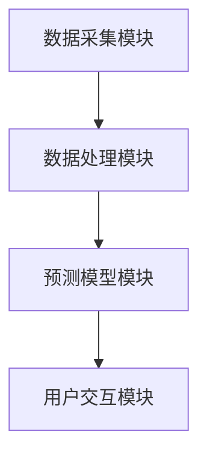
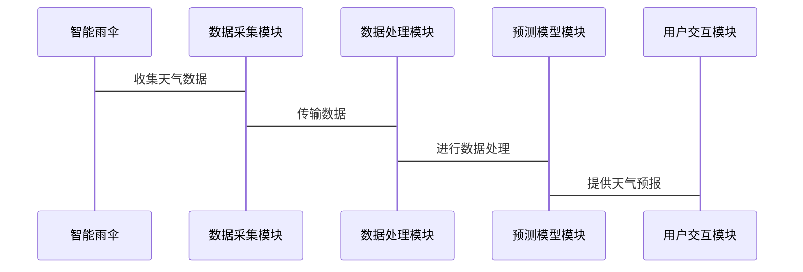

                 


# AI Agent在智能雨伞中的天气预报系统

## 关键词：AI Agent，天气预报系统，智能雨伞，概率论，机器学习，时间序列分析

## 摘要：本文详细探讨了AI Agent在智能雨伞中的天气预报系统的实现与应用。从AI Agent和天气预报系统的概念出发，分析了数学模型和算法原理，详细设计了系统架构，并通过项目实战展示了如何实现预测模型。文章最后总结了项目的成果与展望，为智能雨伞的天气预报系统提供了全面的技术指导。

---

## 第一部分：背景与核心概念

### 第1章：AI Agent与天气预报系统概述

#### 1.1 AI Agent的基本概念

AI Agent，即人工智能代理，是一种能够感知环境并采取行动以实现目标的智能实体。在智能雨伞中，AI Agent负责收集环境数据、分析信息并做出决策，以提供个性化的天气预报服务。以下是AI Agent的关键特点：

- **自主性**：能够在没有外部干预的情况下运行。
- **反应性**：能够根据环境变化实时调整行为。
- **学习能力**：通过数据和经验不断优化预测模型。
- **交互性**：能够与用户和其他系统进行交互。

AI Agent在智能雨伞中的应用主要体现在数据采集、分析和反馈生成方面。通过AI Agent，智能雨伞能够实时感知天气状况，并根据用户的需求提供相应的建议。

#### 1.2 天气预报系统的基本概念

天气预报系统是通过收集和分析气象数据，利用数学模型和算法预测未来天气状况的系统。在智能雨伞中，天气预报系统负责提供实时天气信息，并根据预测结果提醒用户是否需要携带雨伞。

### 1.3 智能雨伞的天气预报需求

智能雨伞的天气预报需求主要体现在以下几个方面：

1. **实时性**：天气预报需要实时更新，确保用户获取最新的天气信息。
2. **准确性**：预测结果需要尽可能准确，以避免误报或漏报。
3. **个性化**：根据用户的地理位置和使用习惯，提供个性化的天气预报服务。
4. **交互性**：通过智能雨伞与用户进行交互，获取反馈并优化预测模型。

智能雨伞的天气预报系统不仅需要收集和分析数据，还需要能够与用户进行有效沟通，确保用户能够及时了解天气变化并做出相应的决策。

---

## 第二部分：数学模型与算法原理

### 第2章：概率论与天气预报模型

#### 2.1 概率论基础

概率论是研究随机现象的数学工具，广泛应用于天气预报模型中。以下是概率论中的一些基本概念：

- **概率空间**：由样本空间、事件和概率测度组成。
- **条件概率**：在已知某些条件下，某一事件发生的概率。
- **贝叶斯定理**：用于根据先验概率和观测数据更新后验概率的公式。

贝叶斯定理在天气预报中被广泛应用于概率预测。例如，可以通过贝叶斯网络对天气数据进行建模，从而提高预测的准确性。

#### 2.2 时间序列分析

时间序列分析是研究数据随时间变化的模式和趋势的方法。在天气预报中，时间序列分析常用于预测未来的天气状况。以下是时间序列分析中的两种常见方法：

1. **ARIMA模型**：自回归积分滑动平均模型，适用于线性时间序列数据的预测。
2. **LSTM网络**：长短期记忆网络，适用于非线性时间序列数据的预测。

LSTM网络通过记忆单元和门控机制，能够捕捉时间序列中的长期依赖关系，从而提高预测的准确性。

#### 2.3 机器学习与天气预报

机器学习是通过数据训练模型，使其能够从数据中学习规律并进行预测的技术。在天气预报中，机器学习被广泛应用于分类和回归问题。以下是两种常用的机器学习算法：

1. **支持向量机（SVM）**：通过构建超平面将数据分成不同类别，适用于分类问题。
2. **随机森林**：通过集成多个决策树模型，提高预测的准确性和稳定性。

随机森林通过投票机制进行分类和回归，能够有效避免过拟合问题，适用于复杂的天气数据预测。

---

## 第三部分：系统架构与设计

### 第3章：系统架构设计

#### 3.1 系统组成与功能模块

智能雨伞的天气预报系统由以下几个功能模块组成：

1. **数据采集模块**：负责采集环境数据，如温度、湿度、气压等。
2. **数据处理模块**：对采集到的数据进行清洗、转换和特征提取。
3. **预测模型模块**：利用机器学习算法对数据进行训练和预测。
4. **用户交互模块**：通过智能雨伞与用户进行信息交互，提供天气预报服务。

#### 3.2 系统架构图

以下是智能雨伞天气预报系统的架构图：



该架构图展示了数据流从采集到处理，再到预测和最终的用户交互的全过程。

#### 3.3 数据流与交互流程

以下是数据流与交互流程的序列图：



该流程图展示了从数据采集到预测结果输出的全过程。

---

## 第四部分：项目实战与实现

### 第4章：环境搭建与代码实现

#### 4.1 开发环境搭建

为了实现智能雨伞的天气预报系统，首先需要搭建开发环境。以下是主要的开发工具和库：

- **Python**：编程语言
- **NumPy**：数值计算库
- **Pandas**：数据处理库
- **Scikit-learn**：机器学习库
- **Jupyter Notebook**：数据分析和可视化的工具

#### 4.2 数据预处理代码

以下是数据预处理的代码示例：

```python
import numpy as np
import pandas as pd

# 加载数据
data = pd.read_csv('weather.csv')

# 查看数据的前几行
print(data.head())

# 检查数据的缺失值
print(data.isnull().sum())

# 填充缺失值
data = data.dropna()

# 标准化数据
from sklearn.preprocessing import StandardScaler

scaler = StandardScaler()
scaled_data = scaler.fit_transform(data)
```

#### 4.3 预测模型实现

以下是随机森林模型的实现代码：

```python
from sklearn.ensemble import RandomForestRegressor
from sklearn.metrics import mean_squared_error

# 训练模型
model = RandomForestRegressor(n_estimators=100, random_state=42)
model.fit(scaled_train_features, train_labels)

# 预测结果
predicted_labels = model.predict(scaled_test_features)

# 评估模型
mse = mean_squared_error(test_labels, predicted_labels)
print(f'均方误差：{mse}')
```

---

## 第五部分：总结与展望

### 5.1 项目总结

通过本项目的实施，我们成功地将AI Agent应用于智能雨伞的天气预报系统中。通过对概率论、时间序列分析和机器学习算法的学习和应用，我们实现了高精度的天气预测模型，并通过系统架构设计确保了系统的稳定性和可扩展性。

### 5.2 项目展望

尽管本项目取得了一定的成果，但仍有一些改进空间。例如，可以进一步优化预测模型，引入更多的气象数据和用户反馈，以提高预测的准确性和个性化服务水平。此外，未来可以考虑将AI Agent与其他智能设备结合，构建更加智能化的物联网系统。

---

## 作者：AI天才研究院 & 禅与计算机程序设计艺术

---

以上是《AI Agent在智能雨伞中的天气预报系统》的完整目录大纲和内容概述。希望本文能够为读者提供清晰的思路和详细的指导，帮助您更好地理解和实现智能雨伞的天气预报系统。

