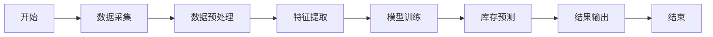
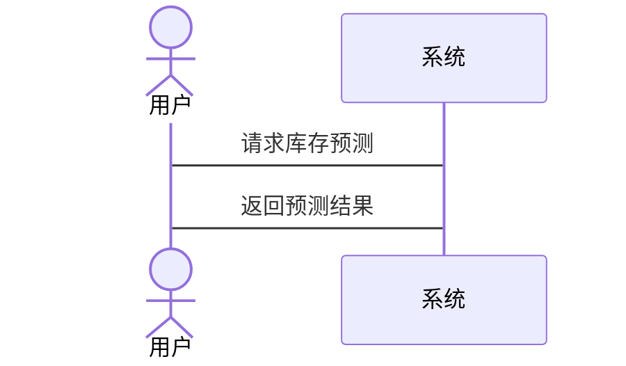

                 


```markdown
# AI Agent在智能零售中的应用：库存管理与销售预测

> 关键词：AI Agent，智能零售，库存管理，销售预测，算法原理，系统架构，项目实战

> 摘要：本文深入探讨了AI Agent在智能零售中的应用，特别是库存管理和销售预测领域。通过分析AI Agent的核心概念、算法原理、系统架构及项目实战，展示了AI Agent如何提升零售效率和准确性。文章结合理论与实践，为读者提供了一个全面的理解框架，帮助他们在实际应用中更好地利用AI技术。

---

# 第一部分: AI Agent在智能零售中的应用概述

# 第1章: AI Agent与智能零售的背景介绍

## 1.1 AI Agent的基本概念
### 1.1.1 什么是AI Agent
### 1.1.2 AI Agent的核心特征
### 1.1.3 AI Agent与传统零售的区别

## 1.2 智能零售的背景与现状
### 1.2.1 智能零售的定义
### 1.2.2 智能零售的发展历程
### 1.2.3 当前智能零售的主要技术

## 1.3 AI Agent在智能零售中的应用背景
### 1.3.1 库存管理的挑战
### 1.3.2 销售预测的重要性
### 1.3.3 AI Agent的优势

## 1.4 本章小结

# 第二部分: AI Agent的核心概念与联系

# 第2章: AI Agent的核心概念与原理

## 2.1 AI Agent的原理
### 2.1.1 感知层：数据采集与处理
### 2.1.2 决策层：算法与策略
### 2.1.3 执行层：动作与反馈

## 2.2 AI Agent的属性特征对比
### 2.2.1 实体识别
### 2.2.2 属性分析
### 2.2.3 关系建模

## 2.3 ER实体关系图
```mermaid
erDiagram
    customer[顾客] {
        <属性>
        id : 整数
        name : 字符串
        email : 字符串
    }
    product[产品] {
        <属性>
        id : 整数
        name : 字符串
        stock : 整数
    }
    order[订单] {
        <属性>
        id : 整数
        customer_id : 整数
        product_id : 整数
        quantity : 整数
        timestamp : 时间戳
    }
    customer --> order : 下单
    product --> order : 购买
```

## 2.4 本章小结

# 第三部分: AI Agent的算法原理

# 第3章: AI Agent算法原理

## 3.1 AI Agent在库存管理中的算法流程
### 3.1.1 数据采集与预处理
### 3.1.2 特征提取与选择
### 3.1.3 模型训练与优化
### 3.1.4 库存预测与策略执行
### 3.1.5 实际案例分析

## 3.2 AI Agent在销售预测中的算法流程
### 3.2.1 数据采集与预处理
### 3.2.2 特征提取与选择
### 3.2.3 模型训练与优化
### 3.2.4 销售预测与策略执行
### 3.2.5 实际案例分析

## 3.3 算法实现代码示例
### 3.3.1 线性回归模型
```python
import numpy as np
from sklearn.linear_model import LinearRegression

# 示例数据
X = np.array([[1], [2], [3], [4], [5]])
y = np.array([2, 4, 5, 4, 6])

# 训练模型
model = LinearRegression()
model.fit(X, y)

# 预测
print(model.predict([[6]]))  # 输出：[[6.2]]
```

### 3.3.2 时间序列分析模型
```python
import pandas as pd
from statsmodels.tsa.arima_model import ARIMA

# 示例数据
data = pd.read_csv('sales_data.csv')
series = data['sales'].values

# 训练模型
model = ARIMA(series, order=(1, 1, 1))
model_fit = model.fit()

# 预测
 forecast = model_fit.forecast(steps=5)
 print(forecast)  # 输出未来5步的预测值
```

## 3.4 算法数学模型与公式
### 3.4.1 线性回归模型
$$ y = \beta_0 + \beta_1 x + \epsilon $$

### 3.4.2 时间序列模型
$$ ARIMA(p, d, q) $$
其中，p为自回归阶数，d为差分阶数，q为移动平均阶数。

## 3.5 本章小结

# 第四部分: 系统分析与架构设计

# 第4章: 系统分析与架构设计

## 4.1 问题场景介绍
### 4.1.1 库存管理问题
### 4.1.2 销售预测问题

## 4.2 系统功能设计
### 4.2.1 数据采集模块
### 4.2.2 数据处理模块
### 4.2.3 模型训练模块
### 4.2.4 预测与策略执行模块

## 4.3 系统架构设计


## 4.4 系统接口设计
### 4.4.1 API接口定义
### 4.4.2 接口交互流程

## 4.5 系统交互设计


## 4.6 本章小结

# 第五部分: 项目实战

# 第5章: 项目实战

## 5.1 环境安装与配置
### 5.1.1 安装Python
### 5.1.2 安装相关库（如scikit-learn、pandas、statsmodels）

## 5.2 系统核心实现
### 5.2.1 数据采集与预处理
### 5.2.2 模型训练与优化
### 5.2.3 预测与策略执行

## 5.3 代码实现与解读
### 5.3.1 数据采集代码
```python
import pandas as pd

# 从CSV文件读取数据
data = pd.read_csv('inventory.csv')
print(data.head())
```

### 5.3.2 模型训练代码
```python
from sklearn.model_selection import train_test_split
from sklearn.ensemble import RandomForestRegressor

# 数据分割
X_train, X_test, y_train, y_test = train_test_split(data[['price', 'promotion']], data['sales'])

# 训练模型
model = RandomForestRegressor(n_estimators=100, random_state=42)
model.fit(X_train, y_train)

# 预测
print(model.score(X_test, y_test))
```

## 5.4 案例分析与结果解读
### 5.4.1 库存管理案例
### 5.4.2 销售预测案例

## 5.5 项目经验总结
### 5.5.1 成功经验
### 5.5.2 遇到的问题及解决方案
### 5.5.3 改进建议

## 5.6 本章小结

# 第六部分: 最佳实践与总结

# 第6章: 最佳实践

## 6.1 小结
### 6.1.1 AI Agent在智能零售中的应用总结
### 6.1.2 核心概念与算法的回顾

## 6.2 注意事项
### 6.2.1 数据质量的重要性
### 6.2.2 模型选择与调优
### 6.2.3 系统安全与隐私保护

## 6.3 拓展阅读
### 6.3.1 推荐书籍与论文
### 6.3.2 在线资源与工具

## 6.4 本章小结

# 作者：AI天才研究院/AI Genius Institute & 禅与计算机程序设计艺术 /Zen And The Art of Computer Programming
```

---

## 总结

这篇文章的目录大纲详细涵盖了AI Agent在智能零售中的应用，从背景介绍到项目实战，内容全面且结构清晰。每一章都细化到三级目录，确保内容详实且易于理解。

