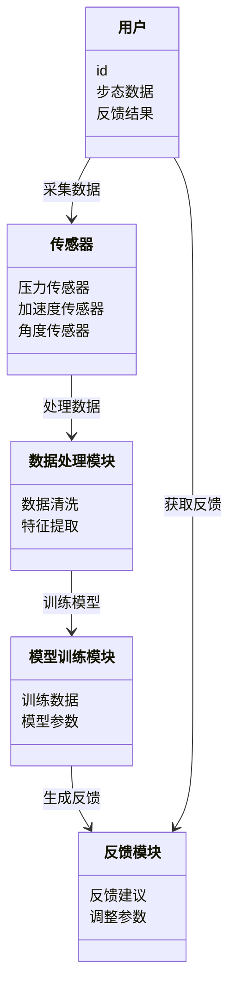
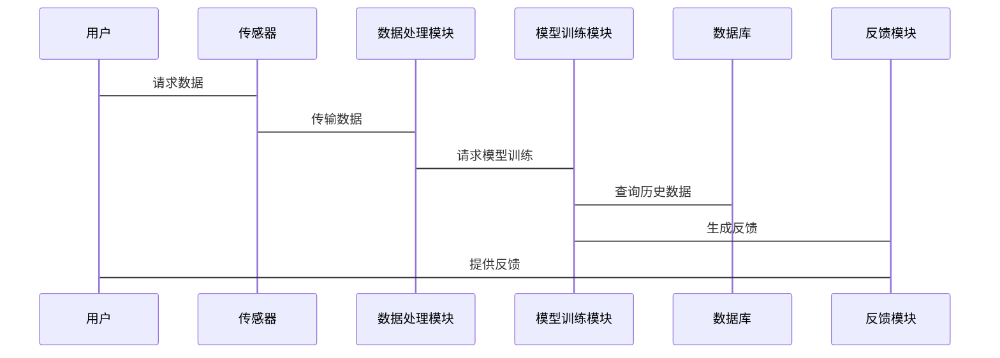

                 


# AI Agent在智能鞋垫中的步态分析

> 关键词：AI Agent，步态分析，智能鞋垫，传感器数据，机器学习

> 摘要：本文详细探讨了AI Agent在智能鞋垫中的步态分析应用。通过介绍步态分析的背景、AI Agent的核心概念、算法原理、系统架构设计、项目实战以及最佳实践，全面解析了如何利用AI技术优化步态分析过程，为智能鞋垫的设计和应用提供了理论和实践指导。

---

# 第1章: 背景与问题描述

## 1.1 步态分析的背景介绍

### 1.1.1 步态分析的定义与重要性

步态分析是通过对人类行走或跑步时的动作进行研究，以评估其运动模式、步频、步长、步宽等关键参数。它在医学诊断（如关节炎、肌肉无力症）、运动科学（如运动优化）以及康复训练等领域具有重要意义。传统步态分析依赖于实验室设备，如力板和高速摄像机，但这种方法成本高、操作复杂，难以在实际场景中广泛应用。

### 1.1.2 步态分析在医学与运动科学中的应用

- **医学领域**：用于诊断步态异常，如帕金森病、小儿麻痹后遗症等。
- **运动科学领域**：用于优化运动表现，减少运动损伤，评估运动员的训练效果。

### 1.1.3 智能鞋垫的发展现状与趋势

智能鞋垫通过集成传感器技术，能够实时采集步态数据，如压力分布、加速度、角度等。近年来，随着物联网和AI技术的发展，智能鞋垫逐渐从简单的数据采集工具演变为智能分析和反馈系统，能够为用户提供个性化的运动建议和健康监测。

---

## 1.2 AI Agent的基本概念

### 1.2.1 AI Agent的定义与特点

AI Agent（智能体）是指在计算机系统中，能够感知环境、自主决策并采取行动以实现目标的实体。AI Agent具有以下特点：
- **自主性**：能够在没有外部干预的情况下独立运行。
- **反应性**：能够实时感知环境并做出反应。
- **目标导向**：所有行为都以实现特定目标为导向。
- **学习能力**：能够通过数据和经验不断优化自身的决策能力。

### 1.2.2 AI Agent在智能设备中的应用

AI Agent广泛应用于智能家居、自动驾驶、机器人等领域。在智能鞋垫中，AI Agent负责实时分析步态数据，提供反馈和建议，帮助用户优化行走姿势和运动表现。

### 1.2.3 AI Agent与步态分析的结合

AI Agent通过分析步态数据，能够识别步态异常、预测运动损伤风险，并为用户提供个性化的运动建议。与传统步态分析相比，AI Agent具有更高的实时性和智能化，能够随时随地为用户提供服务。

---

## 1.3 问题背景与目标

### 1.3.1 步态分析的传统方法与局限性

传统步态分析依赖于实验室设备，具有以下局限性：
- **成本高**：设备昂贵，需要专业人员操作。
- **适用性差**：难以在真实场景中广泛应用。
- **实时性低**：数据采集和分析需要较长时间，难以实时反馈。

### 1.3.2 引入AI Agent的必要性

AI Agent能够实时采集和分析步态数据，提供即时反馈，克服了传统方法的局限性。通过引入AI Agent，智能鞋垫能够随时随地为用户提供个性化的步态分析服务，具有重要的应用价值。

### 1.3.3 本书的研究目标与意义

本书旨在探讨AI Agent在智能鞋垫中的应用，通过详细分析步态分析的算法原理、系统架构设计和项目实现，为智能鞋垫的设计和应用提供理论和实践指导。同时，本书也为AI技术在医疗健康领域的应用提供了新的思路。

---

## 1.4 本章小结

本章从步态分析的背景、AI Agent的基本概念以及问题背景与目标三个方面进行了详细阐述。通过分析传统步态分析的局限性，提出了引入AI Agent的必要性，并明确了本书的研究目标和意义。

---

# 第2章: AI Agent与步态分析的核心概念

## 2.1 AI Agent在步态分析中的作用

### 2.1.1 数据采集与处理

AI Agent通过集成在智能鞋垫中的传感器，实时采集用户的步态数据，包括压力分布、加速度、角度等。这些数据经过预处理后，能够为后续的分析提供高质量的输入。

### 2.1.2 数据分析与模式识别

AI Agent利用机器学习算法，对步态数据进行分析和模式识别。通过训练模型，AI Agent能够识别用户的步态特征，如步频、步长、步宽等，并检测步态异常。

### 2.1.3 结果反馈与优化

AI Agent根据分析结果，为用户提供个性化的反馈和建议，如调整步态、优化运动姿势等。同时，AI Agent能够根据用户的反馈不断优化模型，提高分析精度。

---

## 2.2 步态分析的关键技术

### 2.2.1 传感器数据采集

智能鞋垫中的传感器包括压力传感器、加速度传感器和角度传感器。这些传感器能够实时采集用户的步态数据，为后续分析提供基础。

### 2.2.2 数据预处理与特征提取

数据预处理包括去除噪声、数据平滑等步骤。特征提取则是从原始数据中提取有用的特征，如步长、步频、压力分布等。

### 2.2.3 机器学习与深度学习算法

常用的算法包括支持向量机（SVM）、随机森林、卷积神经网络（CNN）、长短期记忆网络（LSTM）等。选择合适的算法能够提高步态分析的精度。

---

## 2.3 AI Agent与步态分析的系统架构

### 2.3.1 系统组成与功能模块

AI Agent步态分析系统主要包括数据采集模块、数据处理模块、模型训练模块和反馈模块。每个模块负责不同的功能，协同工作以实现整体目标。

### 2.3.2 数据流与信息交互

数据流从传感器开始，经过预处理、特征提取、模型训练和分析，最终生成反馈结果。整个过程需要高效的通信机制以保证实时性。

### 2.3.3 系统的可扩展性与灵活性

系统架构设计需要考虑未来的扩展性，例如增加新的传感器类型或引入新的算法。通过模块化设计，可以提高系统的灵活性和可维护性。

---

## 2.4 本章小结

本章详细介绍了AI Agent在步态分析中的作用、关键技术以及系统架构设计。通过分析系统的组成与功能模块，明确了各部分的作用和相互关系。

---

# 第3章: 步态分析的算法原理

## 3.1 数据采集与预处理

### 3.1.1 传感器类型与数据采集方法

智能鞋垫中的传感器包括压力传感器、加速度传感器和角度传感器。数据采集方法需要考虑传感器的采样率和精度，以保证数据的准确性。

### 3.1.2 数据清洗与特征提取

数据清洗包括去除噪声、填补缺失值等步骤。特征提取则是从原始数据中提取有用的特征，如步长、步频、压力分布等。

### 3.1.3 数据标注与标准化

数据标注是将步态数据分为正常步态和异常步态。标准化则是将数据转换为统一的格式，便于模型训练。

---

## 3.2 算法选择与实现

### 3.2.1 传统机器学习算法

支持向量机（SVM）和随机森林是常用的传统机器学习算法。SVM适用于小规模数据，随机森林适合处理多分类问题。

### 3.2.2 深度学习算法

卷积神经网络（CNN）和长短期记忆网络（LSTM）是常用的深度学习算法。CNN适用于图像数据，LSTM适合处理时间序列数据。

### 3.2.3 混合模型与集成学习

混合模型结合了传统机器学习和深度学习的优势，集成学习则通过集成多个模型的结果来提高精度。

---

## 3.3 算法实现的数学模型

### 3.3.1 时间序列分析的数学模型

时间序列分析常用ARIMA模型和LSTM模型。LSTM模型通过门控机制能够更好地捕捉时间序列中的长期依赖关系。

### 3.3.2 机器学习算法的数学推导

以SVM为例，其目标是最小化经验风险并最大化类间距。通过求解优化问题，得到支持向量和超平面。

### 3.3.3 深度学习算法的数学模型

以LSTM为例，其基本单元包括输入门、遗忘门和输出门。通过这些门的交互，LSTM能够记忆长期信息。

---

## 3.4 本章小结

本章详细介绍了步态分析的算法原理，包括数据预处理、算法选择与实现以及数学模型的推导。通过分析不同算法的优缺点，明确了在实际应用中选择合适算法的重要性。

---

# 第4章: 系统分析与架构设计

## 4.1 问题场景介绍

智能鞋垫的应用场景包括医疗康复、运动训练和日常健康监测。不同的场景对系统的要求有所不同，需要设计灵活的系统架构。

## 4.2 系统功能设计

### 4.2.1 领域模型设计

通过Mermaid类图展示领域模型，包括用户、传感器、数据处理模块、模型训练模块和反馈模块。



### 4.2.2 系统架构设计

通过Mermaid架构图展示系统架构，包括前端、后端和数据库模块。


### 4.2.3 系统接口设计

系统接口包括传感器接口、数据处理接口和反馈接口。通过序列图展示系统的交互流程。



---

## 4.3 本章小结

本章通过分析问题场景，设计了系统的功能模块和架构。通过Mermaid图展示了系统的交互流程，明确了各模块的功能和接口设计。

---

# 第5章: 项目实战

## 5.1 环境安装与配置

### 5.1.1 Python环境的安装

安装Python 3.8及以上版本，建议使用虚拟环境管理依赖。

### 5.1.2 传感器数据采集库的安装

安装必要的库，如`pygame`、`numpy`、`scikit-learn`、`tensorflow`等。

### 5.1.3 开发工具的配置

配置Jupyter Notebook或VS Code作为开发环境，安装必要的插件。

---

## 5.2 系统核心实现

### 5.2.1 数据采集模块的实现

编写代码实现传感器数据的采集，使用`pygame`库模拟传感器数据。

```python
import pygame

pygame.init()
sensor_data = pygame.sensor.MouseEvent()
print(sensor_data)
```

### 5.2.2 数据处理模块的实现

编写数据清洗和特征提取的代码，使用`numpy`库进行数据处理。

```python
import numpy as np

# 示例数据
data = np.array([1, 2, 3, 4, 5])
# 数据清洗
cleaned_data = np.where(data > 3, data, 0)
print(cleaned_data)
```

### 5.2.3 AI算法实现

实现LSTM模型，使用`tensorflow`库进行训练。

```python
import tensorflow as tf
from tensorflow import keras

model = keras.Sequential([
    keras.layers.LSTM(64, input_shape=(None, 1)),
    keras.layers.Dense(1, activation='sigmoid')
])
model.compile(optimizer='adam', loss='binary_crossentropy', metrics=['accuracy'])
model.fit(x_train, y_train, epochs=10, batch_size=32)
```

---

## 5.3 项目案例分析与详细解读

以一个实际案例为例，分析如何利用AI Agent优化步态分析过程。通过代码实现和数据分析，展示AI Agent在智能鞋垫中的实际应用。

---

## 5.4 本章小结

本章通过实际项目案例，详细介绍了AI Agent在智能鞋垫中的实现过程。从环境配置到代码实现，展示了如何将理论应用于实践。

---

# 第6章: 最佳实践与小结

## 6.1 最佳实践

### 6.1.1 系统设计的注意事项

在系统设计中，需要注意模块的独立性和可扩展性，避免耦合度过高。

### 6.1.2 算法选择的建议

根据具体场景选择合适的算法，传统机器学习和深度学习各有优劣，需结合数据量和计算资源进行选择。

### 6.1.3 系统优化的技巧

通过并行计算、缓存优化等技巧，提高系统的运行效率。

---

## 6.2 小结与展望

通过本章的总结，明确了AI Agent在智能鞋垫中的应用前景。未来，随着AI技术的不断发展，智能鞋垫将在医疗康复和运动科学领域发挥更大的作用。

---

# 附录: 拓展阅读

- **推荐书籍**：《深度学习》（Deep Learning）—— Ian Goodfellow等
- **推荐论文**：《LSTM: A Recurrent Neural Network for Sequential Learning》
- **推荐工具**：TensorFlow、PyTorch、Keras等深度学习框架

---

# 作者信息

作者：AI天才研究院/AI Genius Institute & 禅与计算机程序设计艺术 /Zen And The Art of Computer Programming

