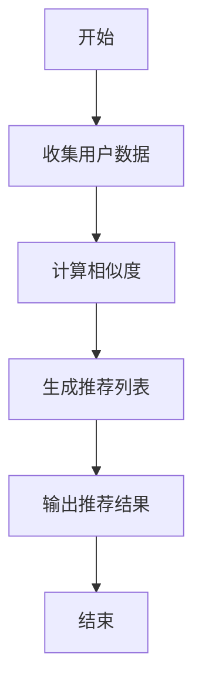
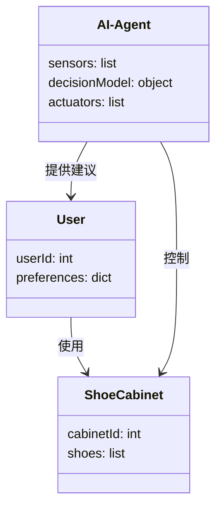
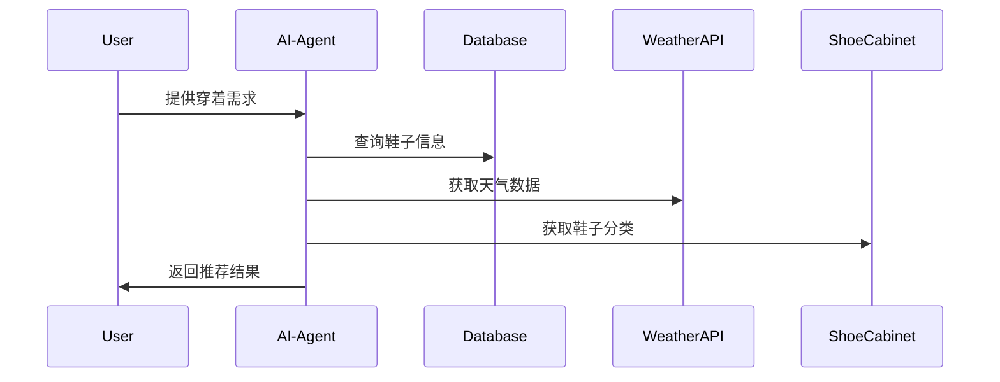

                 


# AI Agent在智能鞋柜中的穿着建议

> 关键词：AI Agent, 智能鞋柜, 穿着建议, 个性化推荐, 人工智能, 时尚科技

> 摘要：本文深入探讨了AI Agent在智能鞋柜中的应用，特别是在穿着建议方面的创新与实践。文章从AI Agent的基本概念出发，分析其在智能鞋柜中的核心原理，详细讲解推荐算法的实现，并通过系统设计与项目实战展示其在实际应用中的价值。最后，本文总结了AI Agent在智能鞋柜中的优势与未来发展方向。

---

# 第1章: AI Agent与智能鞋柜的背景介绍

## 1.1 AI Agent的基本概念

### 1.1.1 人工智能代理（AI Agent）的定义
人工智能代理（AI Agent）是指能够感知环境、自主决策并执行任务的智能实体。它通过传感器获取信息，利用算法进行分析，并通过执行器实现目标。AI Agent的核心在于其智能化和自主性。

### 1.1.2 AI Agent的核心特征
- **感知能力**：通过传感器或数据接口获取环境信息。
- **决策能力**：基于获取的信息进行分析和推理，做出最优决策。
- **执行能力**：通过执行器或接口将决策转化为具体行动。
- **学习能力**：通过机器学习不断优化自身的算法和决策模型。

### 1.1.3 AI Agent与智能鞋柜的关联
AI Agent作为智能鞋柜的核心驱动力，能够根据用户的穿着需求、天气变化、搭配建议等因素，提供个性化的鞋柜管理与穿着建议。

---

## 1.2 智能鞋柜的发展现状

### 1.2.1 智能鞋柜的功能概述
智能鞋柜是一种结合物联网技术的智能存储设备，能够实现鞋子的分类存储、温湿度控制、防盗报警等功能。此外，它还支持通过手机APP远程管理鞋子。

### 1.2.2 当前市场中的智能鞋柜类型
- **家庭版智能鞋柜**：适用于家庭存储，支持语音控制和手机APP远程操作。
- **商业版智能鞋柜**：应用于酒店、健身房等公共场所，提供便捷的鞋子存取服务。
- **智能鞋柜租赁系统**：通过共享模式，为用户提供便捷的鞋子存取服务。

### 1.2.3 智能鞋柜的用户需求分析
- **便捷性**：用户希望快速找到鞋子并进行存取。
- **智能化**：用户希望鞋柜能够自动分类鞋子、提供搭配建议。
- **个性化**：用户希望鞋柜能够根据个人需求定制服务。

---

## 1.3 AI Agent在智能鞋柜中的应用背景

### 1.3.1 个性化穿着建议的需求
随着人们对时尚和舒适的追求，用户希望鞋柜能够根据天气、场合和服装搭配，推荐合适的鞋子。

### 1.3.2 智能化服务的市场趋势
市场对智能化产品的 demand持续增长，AI Agent作为智能化的核心技术，能够为智能鞋柜提供强大的技术支持。

### 1.3.3 AI Agent在鞋柜中的潜在价值
AI Agent能够通过学习用户的穿着习惯、偏好和环境信息，提供个性化的鞋子推荐和搭配建议，提升用户体验。

---

# 第2章: AI Agent的核心概念与联系

## 2.1 AI Agent的核心原理

### 2.1.1 AI Agent的感知模块
AI Agent通过传感器或数据接口获取环境信息，例如天气数据、用户输入的服装搭配需求等。

### 2.1.2 AI Agent的决策模块
AI Agent基于感知模块获取的信息，结合预设的规则和机器学习模型，进行决策。例如，根据天气选择合适的鞋子类型。

### 2.1.3 AI Agent的执行模块
AI Agent通过执行器或接口将决策转化为具体行动，例如将鞋子分类存储或推荐特定的鞋子。

## 2.2 AI Agent与智能鞋柜的关系

### 2.2.1 AI Agent作为智能鞋柜的核心驱动
AI Agent通过分析用户需求和环境信息，优化鞋柜的功能，例如鞋子的分类存储和推荐。

### 2.2.2 智能鞋柜的硬件与AI Agent的协同工作
AI Agent与智能鞋柜的硬件（如传感器、存储模块）协同工作，实现鞋子的智能化管理。

### 2.2.3 AI Agent如何优化鞋柜的功能
AI Agent通过学习用户的穿着习惯，优化鞋子的存储和推荐策略，提升用户体验。

## 2.3 核心概念对比与ER实体关系图

### 2.3.1 AI Agent与传统推荐系统的对比分析
| 对比维度 | AI Agent | 传统推荐系统 |
|----------|-----------|--------------|
| 数据来源 | 多模态数据（天气、用户行为等） | 单一数据源（用户行为或历史记录） |
| 决策能力 | 自主决策并执行 | 仅提供推荐列表 |
| 适应性 | 根据环境变化动态调整 | 固定规则，适应性较弱 |

### 2.3.2 ER实体关系图
```mermaid
erd
  shoe_cabinet
  user
  ai_agent
  shoes
  shoe_type
  weather
  recommendation
```

---

# 第3章: AI Agent的算法原理讲解

## 3.1 推荐算法的原理与实现

### 3.1.1 协同过滤算法
协同过滤是一种基于用户行为或物品属性的推荐算法。它通过分析用户的相似性或物品的相似性，推荐用户可能感兴趣的内容。

### 3.1.2 基于用户的协同过滤算法
1. 计算用户之间的相似度。
2. 根据相似用户的偏好，推荐当前用户可能感兴趣的内容。

### 3.1.3 基于物品的协同过滤算法
1. 计算物品之间的相似度。
2. 根据用户已有的偏好，推荐相似的物品。

### 3.1.4 算法流程图


### 3.1.5 Python代码实现
```python
import numpy as np

# 用户-物品评分矩阵
user_item_matrix = np.array([[4, 3, 2], [3, 2, 1], [5, 1, 0]])

# 计算相似度
similarity = np.corrcoef(user_item_matrix)

# 基于用户的协同过滤推荐
def recommend(user_id, similarity, user_item_matrix):
    scores = similarity[user_id] * (user_item_matrix[user_id] - np.mean(user_item_matrix[user_id]))
    return np.argsort(scores, axis=1)
```

---

## 3.2 数学模型与公式

### 3.2.1 相似度计算公式
$$ \text{相似度} = \frac{\sum (x_i - \mu_x)(y_i - \mu_y)}{\sqrt{\sum (x_i - \mu_x)^2} \cdot \sqrt{\sum (y_i - \mu_y)^2}} $$

### 3.2.2 推荐评分预测公式
$$ \hat{r}_{u,i} = \bar{r}_u + \sum_{k=1}^K b_{u,k}(r_{k,i} - \bar{r}_k) $$

---

# 第4章: 系统分析与架构设计方案

## 4.1 系统功能设计

### 4.1.1 领域模型类图


### 4.1.2 系统架构图


### 4.1.3 接口设计
- **API接口**：提供RESTful API，如`/api/recommend/shoes`用于获取推荐。
- **数据接口**：与天气预报API、用户数据库等进行交互。

### 4.1.4 交互流程图


---

# 第5章: 项目实战

## 5.1 环境安装

### 5.1.1 安装Python环境
```bash
python --version
pip install numpy scikit-learn
```

### 5.1.2 安装其他依赖
```bash
pip install flask
pip install mermaid
```

## 5.2 核心代码实现

### 5.2.1 数据预处理
```python
import pandas as pd

data = pd.read_csv('shoes.csv')
data.head()
```

### 5.2.2 模型训练
```python
from sklearn.neighbors import NearestNeighbors

model = NearestNeighbors(n_neighbors=5, metric='cosine')
model.fit(X)
```

### 5.2.3 推荐接口
```python
def get_recommendations(user_id):
    distances, indices = model.kneighbors(user_id)
    return indices
```

## 5.3 代码解读与分析

### 5.3.1 数据预处理
- 读取数据并进行清洗，确保数据的完整性。

### 5.3.2 模型训练
- 使用协同过滤算法训练模型，生成相似度矩阵。

### 5.3.3 推荐接口
- 根据用户ID获取推荐的鞋子列表。

## 5.4 实际案例分析

### 5.4.1 案例1：天气变化
- 当天气变冷，AI Agent推荐用户穿靴子。

### 5.4.2 案例2：服装搭配
- 根据用户的服装选择，推荐合适的鞋子颜色和款式。

---

# 第6章: 总结与展望

## 6.1 小结
AI Agent通过协同过滤算法和机器学习模型，能够为智能鞋柜提供个性化的鞋子推荐和管理服务。其核心在于感知、决策和执行模块的协同工作。

## 6.2 注意事项
- 数据隐私保护：确保用户的穿着数据安全。
- 算法优化：不断提升推荐的准确性和实时性。

## 6.3 未来发展方向
- **多模态推荐**：结合图像识别技术，提供更精准的鞋子推荐。
- **实时反馈机制**：根据用户的实时需求动态调整推荐策略。

## 6.4 拓展阅读
- 推荐书籍：《机器学习实战》、《人工智能：一种现代方法》
- 推荐博客：[AI Genius Institute](https://www.ai-genius-institute.com)

---

作者：AI天才研究院/AI Genius Institute & 禅与计算机程序设计艺术/Zen And The Art of Computer Programming

