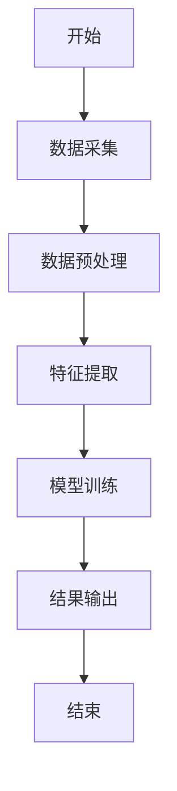
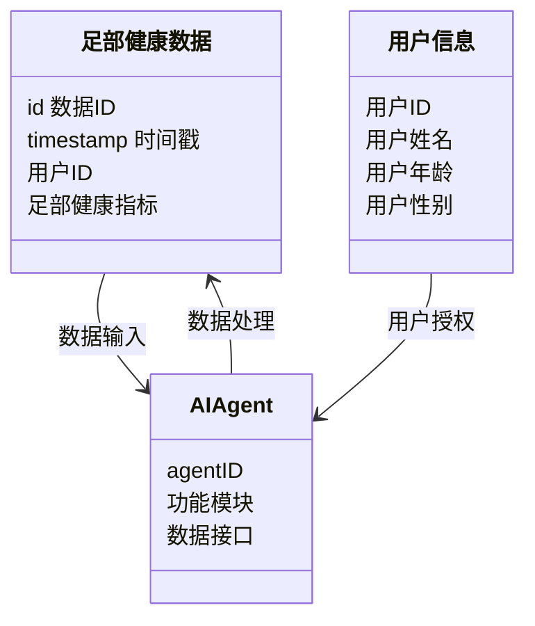
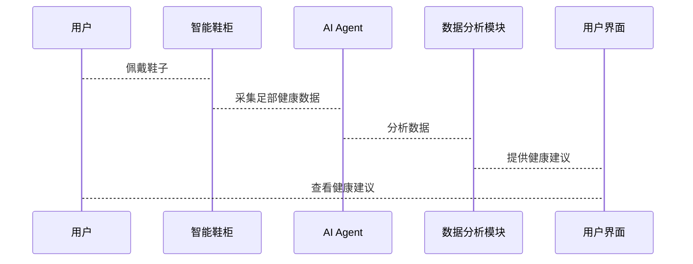

                 


```markdown
# AI Agent在智能鞋柜中的足部健康管理系统

> 关键词：AI Agent, 智能鞋柜, 足部健康, 系统设计, 机器学习, 数据挖掘

> 摘要：本文详细探讨了AI Agent在智能鞋柜中的足部健康管理系统的设计与实现。通过分析足部健康的重要性，介绍了AI Agent的核心算法及其在系统中的应用，结合系统架构设计和项目实战，展示了如何利用AI技术实现足部健康监测和个性化管理。

---

# 第一部分: 背景介绍

## 第1章: 问题背景

### 1.1 足部健康的重要性
足部健康是人体健康的重要组成部分，直接影响行走姿势、运动能力以及整体生活质量。足部问题可能导致疼痛、步态异常甚至更严重的健康问题。因此，足部健康监测对于个人健康管理和疾病预防具有重要意义。

### 1.2 智能鞋柜的发展趋势
智能鞋柜作为一种智能家居设备，不仅提供鞋子的存储功能，还可以通过传感器和AI技术实现对足部健康的数据采集和分析。随着物联网和人工智能技术的快速发展，智能鞋柜的功能正在从单纯的存储向健康监测方向扩展。

### 1.3 AI Agent在足部健康管理中的应用潜力
AI Agent（智能体）是一种能够感知环境、自主决策并执行任务的智能系统。在足部健康管理系统中，AI Agent可以实时采集足部健康数据，分析健康状况，并提供个性化的健康建议。

---

## 第2章: 问题描述

### 2.1 足部健康监测的痛点
传统足部健康监测依赖于医疗设备和专业人员，存在成本高、操作复杂、数据采集不便捷等问题。此外，足部健康数据的实时监测和个性化管理需求尚未得到充分满足。

### 2.2 智能鞋柜的功能局限性
现有的智能鞋柜主要关注鞋子的存储和管理，缺乏对足部健康数据的采集和分析功能。用户无法通过智能鞋柜获得足部健康相关信息，无法实现足部健康监测的智能化管理。

### 2.3 AI Agent在智能鞋柜中的角色定位
AI Agent作为智能鞋柜的核心组件，负责采集足部健康数据，分析健康状况，并提供个性化健康建议。通过AI Agent，智能鞋柜能够实现足部健康监测的智能化、个性化和实时化。

---

## 第3章: 问题解决

### 3.1 AI Agent的核心功能
AI Agent在足部健康管理系统中的核心功能包括：
1. **数据采集**：通过传感器实时采集足部健康数据，如足部压力分布、温度、湿度等。
2. **数据分析**：利用机器学习算法对足部健康数据进行分析，识别健康问题。
3. **个性化建议**：根据分析结果，为用户提供个性化的足部健康建议，如鞋子选择、足部锻炼等。

### 3.2 足部健康数据的采集与分析
足部健康数据的采集需要通过高精度传感器实现，数据包括足部压力、温度、湿度、步态分析等。AI Agent通过机器学习算法对这些数据进行分析，识别足部健康问题。

### 3.3 智能鞋柜与AI Agent的协同工作
智能鞋柜与AI Agent协同工作，通过传感器采集足部健康数据，AI Agent对数据进行分析并提供健康建议。用户可以通过智能鞋柜的交互界面查看健康数据和建议，实现足部健康监测的智能化管理。

---

## 第4章: 边界与外延

### 4.1 系统的边界定义
足部健康管理系统的核心功能包括数据采集、数据分析和个性化建议，系统的边界定义为仅涉及足部健康数据的采集与分析，不涉及其他健康数据的采集。

### 4.2 功能的外延与扩展
AI Agent在足部健康管理系统中的功能可以进一步扩展，例如与医疗系统对接，提供更全面的健康服务。

### 4.3 系统与外部环境的交互
系统通过传感器采集足部健康数据，并通过网络接口与外部系统（如手机APP）进行数据交互，为用户提供实时的健康反馈。

---

## 第5章: 概念结构与核心要素

### 5.1 系统整体架构
足部健康管理系统由以下三个核心模块组成：
1. **数据采集模块**：通过传感器采集足部健康数据。
2. **数据分析模块**：利用机器学习算法分析足部健康数据。
3. **个性化建议模块**：根据分析结果，为用户提供个性化健康建议。

### 5.2 核心要素的组成
核心要素包括：
- **足部健康数据**：包括足部压力、温度、湿度等。
- **AI Agent**：负责数据采集、分析和建议生成。
- **用户交互界面**：用户通过界面查看健康数据和建议。

### 5.3 系统的模块划分
系统模块划分如下：
1. **传感器模块**：负责采集足部健康数据。
2. **数据处理模块**：对采集的数据进行预处理和特征提取。
3. **机器学习模块**：利用算法对数据进行分析，识别足部健康问题。
4. **用户界面模块**：展示健康数据和建议。

---

# 第二部分: 核心概念与联系

## 第6章: 核心概念的属性特征

### 6.1 AI Agent的属性特征
- **智能性**：AI Agent能够自主感知环境并做出决策。
- **实时性**：能够实时采集和分析数据。
- **个性化**：能够根据用户需求提供个性化服务。

### 6.2 足部健康数据的属性特征
- **准确性**：数据采集必须准确无误。
- **实时性**：数据采集和分析需要实时进行。
- **隐私性**：数据需要严格保护用户隐私。

### 6.3 系统功能的属性特征
- **功能性**：系统必须能够实现足部健康数据的采集、分析和建议生成。
- **可靠性**：系统必须稳定可靠，能够长时间运行。
- **易用性**：用户界面必须简洁易用。

---

## 第7章: ER实体关系图

```mermaid
er
    entity 足部健康数据 {
        id 数据ID
        timestamp 时间戳
        用户ID
        足部健康指标
    }
    entity 用户信息 {
        用户ID
        用户姓名
        用户年龄
        用户性别
    }
    entity AI Agent {
        agentID
        功能模块
        数据接口
    }
    relation 足部健康数据 -> AI Agent: 数据输入
    relation AI Agent -> 足部健康数据: 数据处理
    relation 用户信息 -> AI Agent: 用户授权
```

---

# 第三部分: 算法原理讲解

## 第8章: AI Agent的核心算法

### 8.1 机器学习算法
机器学习算法用于足部健康数据的分类和回归分析，例如使用支持向量机（SVM）和随机森林（Random Forest）算法进行健康问题的分类。

### 8.2 自然语言处理算法
自然语言处理算法用于用户健康建议的生成，例如使用文本生成模型（如GPT）生成个性化的健康建议。

### 8.3 数据挖掘算法
数据挖掘算法用于足部健康数据的模式识别和趋势分析，例如使用关联规则挖掘（Association Rule Mining）分析足部健康问题的关联性。

---

## 第9章: 算法流程图



---

## 第10章: 算法实现代码

```python
# 示例代码：数据预处理
import pandas as pd
import numpy as np

def preprocess_data(data):
    # 去除缺失值
    data = data.dropna()
    # 标准化处理
    data[['压力', '温度', '湿度']] = data[['压力', '温度', '湿度']].apply(lambda x: (x - x.mean()) / x.std())
    return data

# 示例代码：机器学习模型训练
from sklearn.svm import SVC
from sklearn.model_selection import train_test_split

X = data[['压力', '温度', '湿度']]
y = data['健康状态']

X_train, X_test, y_train, y_test = train_test_split(X, y, test_size=0.2)
model = SVC()
model.fit(X_train, y_train)
```

---

## 第11章: 数学模型与公式

### 11.1 数据预处理公式
$$
\text{标准化处理：} \quad z = \frac{x - \mu}{\sigma}
$$

其中，$\mu$ 表示数据的均值，$\sigma$ 表示数据的标准差。

### 11.2 健康评估公式
$$
\text{健康评估分数：} \quad S = w_1 \cdot x_1 + w_2 \cdot x_2 + \cdots + w_n \cdot x_n
$$

其中，$w_i$ 表示各健康指标的权重，$x_i$ 表示各健康指标的值。

---

# 第四部分: 系统分析与架构设计

## 第12章: 问题场景介绍

### 12.1 系统目标
系统的目标是通过AI Agent实现足部健康数据的实时采集、分析和个性化管理，为用户提供足部健康监测的智能化服务。

### 12.2 项目介绍
本项目旨在设计和实现一个基于AI Agent的足部健康管理系统，集成智能鞋柜和AI技术，为用户提供便捷的足部健康监测服务。

---

## 第13章: 系统功能设计

### 13.1 领域模型


### 13.2 系统架构设计


### 13.3 系统接口设计
系统接口设计包括：
1. 数据采集接口：用于采集足部健康数据。
2. 数据分析接口：用于对足部健康数据进行分析。
3. 用户交互接口：用于用户查看健康数据和建议。

### 13.4 系统交互设计


---

## 第14章: 项目实战

### 14.1 环境安装
需要安装以下工具和库：
- Python 3.8+
- Pandas
- Scikit-learn
- Mermaid

### 14.2 核心代码实现

```python
# 数据采集模块
import serial
import time

ser = serial.Serial('COM3', 9600)
while True:
    data = ser.readline().decode().strip()
    print(data)
    time.sleep(1)

# 数据分析模块
from sklearn.svm import SVC
from sklearn.model_selection import train_test_split

X = data[['压力', '温度', '湿度']]
y = data['健康状态']

X_train, X_test, y_train, y_test = train_test_split(X, y, test_size=0.2)
model = SVC()
model.fit(X_train, y_train)

# 用户界面模块
import tkinter as tk

root = tk.Tk()
root.title("足部健康管理系统")
root.mainloop()
```

### 14.3 实际案例分析
通过实际案例分析，展示系统的实际应用效果，例如如何通过系统采集足部健康数据并提供个性化健康建议。

---

## 第15章: 总结与展望

### 15.1 总结
本文详细探讨了AI Agent在智能鞋柜中的足部健康管理系统的设计与实现，展示了如何通过AI技术实现足部健康监测的智能化管理。

### 15.2 展望
未来，随着AI技术的不断发展，足部健康管理系统将更加智能化和个性化，能够为用户提供更全面的健康服务。

---

## 第16章: 最佳实践 Tips

### 16.1 小结
通过本文的介绍，读者可以了解AI Agent在足部健康管理系统中的重要作用，以及如何通过系统设计和实现为用户提供智能化的健康服务。

### 16.2 注意事项
在实际应用中，需要注意数据的准确性和系统的稳定性，确保用户数据的安全性和隐私性。

### 16.3 拓展阅读
建议读者进一步阅读相关领域的技术文献，深入了解AI Agent和足部健康监测的最新研究成果。

---

# 作者：AI天才研究院/AI Genius Institute & 禅与计算机程序设计艺术 /Zen And The Art of Computer Programming
```

