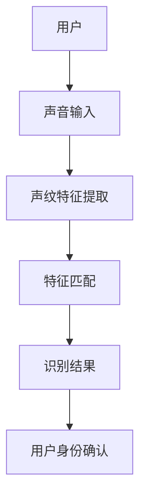
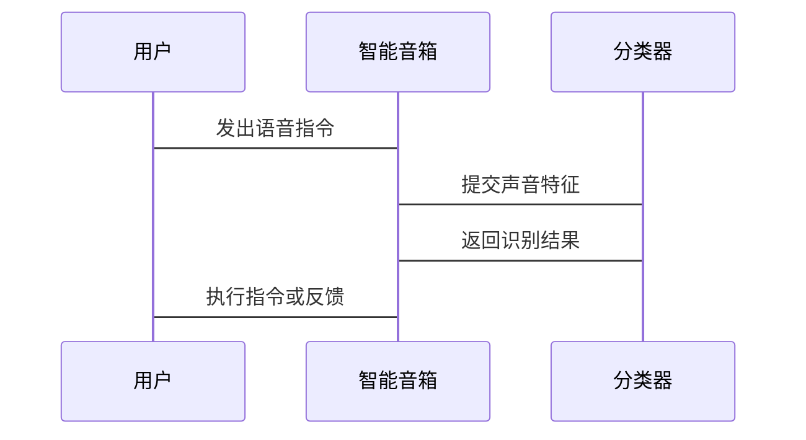

                 


# AI Agent在智能音箱中的声纹识别

## 关键词：
- AI Agent
- 智能音箱
- 声纹识别
- 语音识别
- 智能助手
- 生物识别技术
- 深度学习

## 摘要：
本文深入探讨了AI Agent在智能音箱中的声纹识别技术，从声纹识别的基本概念到其在智能音箱中的具体应用，详细分析了声纹识别的核心算法、系统架构设计以及实际项目实现。通过对比不同特征提取方法，结合数学模型和Python代码示例，本文为读者提供了从理论到实践的全面指导，帮助读者理解AI Agent如何通过声纹识别技术提升智能音箱的用户体验。

---

## 第1章：声纹识别的基本概念与应用

### 1.1 声纹识别的基本概念
声纹识别（Voiceprint Recognition）是一种基于人类声音特征的生物识别技术。每个人的声纹特征，包括音调、音高、音色、语速等，都是独一无二的。通过这些特征，声纹识别技术可以准确地识别和验证用户身份。

#### 1.1.1 声纹识别的定义
声纹识别是通过分析和比对人声的特征来确认身份的一种技术。与指纹识别、虹膜识别等其他生物识别技术相比，声纹识别具有非接触式、易于采集等优点。

#### 1.1.2 声纹识别的核心要素
- **声音信号**：声音的波形、频率、振幅等。
- **声纹特征**：基于声音信号提取的特征，如MFCC（Mel-Frequency Cepstral Coefficients）。
- **识别算法**：基于特征匹配的分类器。

#### 1.1.3 声纹识别的应用场景
- 智能音箱用户身份验证。
- 手机、平板等设备的安全登录。
- 银行、政府机构的身份认证。

### 1.2 AI Agent与智能音箱的结合
AI Agent（智能代理）是智能音箱的核心功能之一，负责接收用户的语音指令并执行相应的操作。

#### 1.2.1 AI Agent的定义与特点
- AI Agent是一种能够理解、推理和执行用户指令的智能程序。
- 具备自然语言处理（NLP）、语音识别（ASR）、声纹识别等多种功能。

#### 1.2.2 智能音箱的功能与发展趋势
- **功能**：播放音乐、查询信息、智能家居控制、语音购物等。
- **发展趋势**：智能化、个性化、多模态交互（结合视觉、触觉等）。

#### 1.2.3 声纹识别在智能音箱中的作用
- **用户身份验证**：通过声纹识别确认用户身份，提供个性化服务。
- **语音指令验证**：确保只有授权用户才能执行敏感操作。

---

## 第2章：声纹识别的核心技术原理

### 2.1 声纹特征提取
特征提取是声纹识别的关键步骤，决定了识别的准确性和效率。

#### 2.1.1 音频信号的基本处理
- **采样**：将连续的声音信号转换为离散的数字信号。
- **预处理**：去除背景噪声、归一化等。

#### 2.1.2 声纹特征提取方法
| 提取方法 | 描述 | 优缺点 |
|----------|------|--------|
| MFCC     | 基于人类听觉系统设计，提取声音的频率特征 | 计算复杂度低，效果较好 |
| 倒谱分析 | 适用于语音特征提取，能够捕捉语音的时频特性 | 对噪声较为敏感 |
| LPC      | 基于线性预测，提取语音的线性特征 | 适用于 voiced sounds |

#### 2.1.3 常见特征提取算法对比
- MFCC是目前应用最广泛的特征提取方法，适用于多种语音识别任务。

### 2.2 模式匹配与识别算法
模式匹配是将提取的声纹特征与模板特征进行比对，确定用户身份。

#### 2.2.1 基于模板匹配的识别方法
- **模板存储**：将用户的声纹特征存储为模板。
- **特征比对**：计算待识别声音特征与模板特征之间的相似度。

#### 2.2.2 基于统计模型的识别方法
- **高斯混合模型（GMM）**：通过概率统计方法建模用户特征分布。
- **隐马尔可夫模型（HMM）**：适用于序列数据的建模。

#### 2.2.3 基于深度学习的识别方法
- **卷积神经网络（CNN）**：通过深度学习提取高层次特征。
- **长短期记忆网络（LSTM）**：适用于时序数据的建模。

### 2.3 声纹识别的实体关系图


---

## 第3章：算法原理

### 3.1 声纹识别的数学模型
声纹识别的核心是特征提取和分类器设计。

#### 3.1.1 基于MFCC的特征提取
MFCC提取步骤如下：
1. 音频预处理：去噪、归一化。
2. 时域分帧：将音频信号分成短时帧。
3. 傅里叶变换：提取每帧的频域特征。
4. 憩息处理：计算对数能量、倒谱等。

#### 3.1.2 分类器设计
- 分类器的输入是MFCC特征向量。
- 使用K-近邻算法（KNN）或支持向量机（SVM）进行分类。

### 3.2 Python代码实现
以下是基于MFCC的声纹识别代码示例：

```python
import numpy as np
from scipy.io import wavfile
from sklearn.neighbors import KNeighborsClassifier

# 加载音频数据
sampling_rate, audio = wavfile.read('input.wav')
audio = audio.astype(np.float32)

# 预处理
def preemphasis(signal, coeff=0.97):
    emphasized = np.zeros_like(signal)
    emphasized[0] = signal[0]
    for i in range(1, len(signal)):
        emphasized[i] = signal[i] + coeff * signal[i-1]
    return emphasized

emphasized = preemphasis(audio)

# 分帧
frame_size = 2048
hop_size = 512
frames = len(emphasized) // hop_size

# 提取MFCC特征
mfccs = []
for i in range(frames):
    start = i * hop_size
    end = start + frame_size
    frame = emphasized[start:end]
    # 计算MFCC特征（简化版）
    # 实际实现中需要使用专业的音频处理库如librosa
    mfcc = np.fft.fft(frame)
    mfcc = np.abs(mfcc)
    mfcc = mfcc[:1024]  # 取前1024个频点
    mfccs.append(mfcc)

# 转换为矩阵形式
mfccs = np.array(mfccs)
mfccs = mfccs.reshape(-1, 1024)

# 训练KNN分类器
knn = KNeighborsClassifier(n_neighbors=3)
knn.fit(mfccs, labels)

# 预测
new_audio = ...  # 新的声音数据
new_mfccs = ...  # 提取MFCC特征
predict = knn.predict(new_mfccs)
print("预测结果：", predict)
```

---

## 第4章：系统分析与架构设计

### 4.1 系统组成
智能音箱声纹识别系统主要由以下几个部分组成：
- **麦克风**：采集用户声音。
- **声纹特征提取模块**：处理音频信号，提取特征。
- **分类器**：基于特征进行用户身份识别。
- **用户数据库**：存储用户模板特征。

### 4.2 系统架构设计


### 4.3 接口设计
- **输入接口**：麦克风音频信号。
- **输出接口**：用户身份确认结果。

### 4.4 交互流程图


---

## 第5章：项目实战

### 5.1 环境安装
- **Python**：3.6+
- **库依赖**：numpy、scipy、scikit-learn、librosa。

### 5.2 核心代码实现
```python
import librosa
import numpy as np
from sklearn.model_selection import train_test_split
from sklearn.metrics import accuracy_score

# 加载音频文件
def load_audio(file_path):
    y, sr = librosa.load(file_path, sr=16000)
    return y, sr

# 提取MFCC特征
def extract_mfcc(y, sr):
    mfccs = librosa.feature.mfcc(y, sr, n_mfcc=13)
    return mfccs.T

# 加载数据集
data = []
labels = []
for user in users:
    for file in user.audio_files:
        audio, _ = load_audio(file)
        mfcc = extract_mfcc(audio, _)
        data.append(mfcc)
        labels.append(user.id)

# 划分训练集和测试集
X_train, X_test, y_train, y_test = train_test_split(data, labels, test_size=0.2)

# 训练模型
from sklearn.svm import SVC
model = SVC()
model.fit(X_train, y_train)

# 测试模型
y_pred = model.predict(X_test)
print("准确率：", accuracy_score(y_test, y_pred))
```

---

## 第6章：总结与展望

### 6.1 总结
本文详细探讨了AI Agent在智能音箱中的声纹识别技术，从理论到实践，全面分析了声纹识别的核心算法、系统架构设计以及实际项目实现。通过对比不同特征提取方法和分类算法，本文为读者提供了从理论到实践的全面指导。

### 6.2 未来展望
随着深度学习技术的不断发展，声纹识别的准确性和鲁棒性将不断提升。未来，声纹识别技术将更加智能化、个性化，与其他生物识别技术结合，为智能音箱提供更安全、更便捷的用户体验。

---

## 小结与注意事项
- **小结**：声纹识别技术在智能音箱中的应用前景广阔，能够显著提升用户体验。
- **注意事项**：
  - 声纹识别需要考虑环境噪声的干扰。
  - 用户隐私保护是声纹识别技术应用中的重要问题。
  - 深度学习模型的计算资源需求较高，需要优化算法和硬件配置。

---

## 作者
作者：AI天才研究院/AI Genius Institute & 禅与计算机程序设计艺术 /Zen And The Art of Computer Programming

