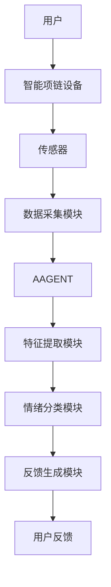
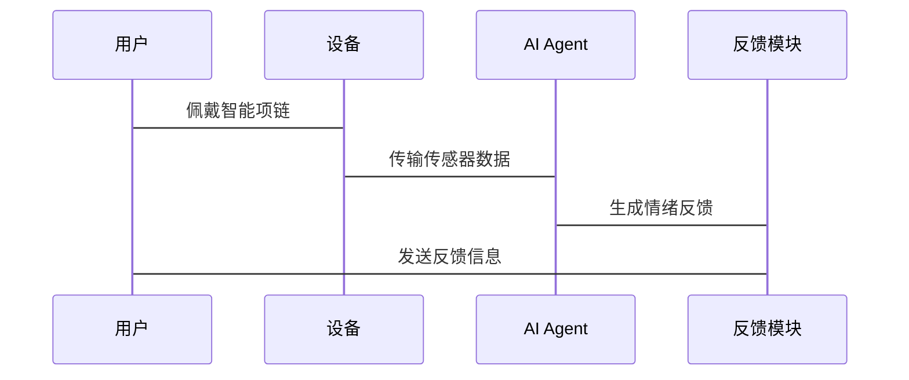

                 


# AI Agent在智能项链中的情绪监测

---

## 关键词：AI Agent, 情绪监测, 智能项链, 情感计算, 可穿戴设备

---

## 摘要：  
本文探讨了AI Agent在智能项链中的情绪监测技术。通过分析情绪监测的核心概念、算法原理、系统架构及实际应用，详细阐述了AI Agent如何通过传感器数据、机器学习算法和情感计算技术实现对佩戴者情绪的实时监测与反馈。文章还结合实际案例，展示了如何通过AI Agent优化智能项链的功能，提升用户体验。

---

# 第1章: 情绪监测与AI Agent概述

## 1.1 情绪监测的重要性

### 1.1.1 情绪监测的定义与应用场景  
情绪监测是一种通过分析个体的生理信号、行为表现和语言表达，来识别和理解其情绪状态的技术。它在医疗健康、教育培训、社交互动等领域具有广泛应用。例如，在医疗领域，情绪监测可以帮助识别抑郁症状；在教育领域，它可以辅助教师更好地理解学生的学习状态。

### 1.1.2 情绪监测在智能设备中的作用  
随着可穿戴设备的普及，情绪监测技术逐渐从实验室走向实际应用。智能设备可以通过收集心率、皮肤电活动等生理数据，结合用户的语言和行为特征，实现对情绪的实时监测。这种技术不仅有助于提升用户体验，还能为设备制造商提供新的数据维度。

### 1.1.3 AI Agent在情绪监测中的角色  
AI Agent作为一种智能代理，能够实时处理和分析数据，帮助设备实现自动化的情绪监测。它不仅可以识别情绪状态，还能根据具体情况提供反馈或建议。例如，在用户情绪低落时，AI Agent可以通过调节音乐或提醒用户进行放松训练来改善情绪。

## 1.2 AI Agent的基本概念

### 1.2.1 AI Agent的定义与特点  
AI Agent是一种能够感知环境、执行任务并做出决策的智能系统。它具有自主性、反应性、目标导向性和社交能力等特点。在情绪监测中，AI Agent能够通过传感器数据和用户输入，实时分析情绪状态并做出相应的反馈。

### 1.2.2 AI Agent的核心功能与优势  
AI Agent的核心功能包括数据采集、特征提取、情绪识别和反馈生成。其优势在于能够实时处理数据、适应动态环境，并通过学习不断提升识别精度。

### 1.2.3 AI Agent与传统算法的区别  
与传统算法相比，AI Agent具有更强的自主性和适应性。它能够根据环境变化动态调整策略，而传统算法通常需要手动调整参数。

## 1.3 智能项链中的情绪监测应用

### 1.3.1 智能项链的功能与技术特点  
智能项链作为一种可穿戴设备，通常集成了多种传感器，如心率监测器、皮肤电活动传感器和加速度传感器。这些传感器能够采集用户的生理数据和行为数据。

### 1.3.2 情绪监测在智能项链中的实现方式  
通过AI Agent，智能项链可以实时分析用户的生理数据和行为数据，识别情绪状态，并通过振动、灯光或语音反馈与用户互动。

### 1.3.3 情绪监测的实际案例  
例如，当用户在佩戴智能项链时，设备可以监测其心率变化和皮肤电活动，识别出用户的情绪状态（如紧张、放松、兴奋等），并根据需要提供相应的反馈。

---

## 1.4 本章小结  
本章介绍了情绪监测的重要性和AI Agent的基本概念，重点阐述了AI Agent在智能项链中的应用。通过分析情绪监测的定义、应用场景和技术实现，为后续章节的深入探讨奠定了基础。

---

# 第2章: 情绪监测的核心概念

## 2.1 情绪监测的关键要素

### 2.1.1 情感计算的基本原理  
情感计算是一种通过分析用户的情感状态来改善人机交互的技术。它通常涉及数据采集、特征提取、情绪识别和反馈生成四个步骤。

### 2.1.2 情绪特征的提取与分析  
情绪特征包括生理信号（如心率变异性）、行为特征（如动作频率）和语言特征（如语调）。AI Agent需要通过算法提取这些特征并进行分析。

### 2.1.3 情绪状态的分类与判定  
情绪状态通常分为正面、负面和中性三类。AI Agent可以通过机器学习算法对情绪进行分类，并根据具体情况做出反馈。

## 2.2 AI Agent与情绪监测的关系

### 2.2.1 AI Agent在情绪监测中的功能模块划分  
AI Agent在情绪监测中的功能模块包括数据采集、特征提取、情绪识别和反馈生成。每个模块都有其独特的功能和作用。

### 2.2.2 AI Agent与传感器数据的交互机制  
AI Agent通过传感器获取数据，并对其进行处理和分析。数据的采集和传输是实现情绪监测的关键步骤。

### 2.2.3 AI Agent在情绪监测中的决策逻辑  
AI Agent通过分析传感器数据和用户行为，识别情绪状态，并根据预设规则生成反馈。这种决策逻辑使得AI Agent能够在复杂环境下做出准确的判断。

## 2.3 情绪监测的核心技术对比

### 2.3.1 基于生理指标的情绪监测方法  
基于生理指标的情绪监测方法通过分析心率、皮肤电活动等生理信号来判断情绪状态。这种方法具有较高的准确性和实时性。

### 2.3.2 基于行为分析的情绪监测方法  
基于行为分析的方法通过观察用户的动作、语言和社交行为来判断情绪状态。这种方法适用于社交场景中的情绪监测。

### 2.3.3 基于语言分析的情绪监测方法  
基于语言分析的方法通过分析用户的语言特征（如语调、语速）来判断情绪状态。这种方法在实际应用中具有较高的灵活性。

## 2.4 本章小结  
本章详细探讨了情绪监测的核心概念和技术原理，分析了AI Agent在情绪监测中的功能模块和决策逻辑。通过对不同情绪监测方法的对比，为后续章节的实现提供了理论基础。

---

# 第3章: 情绪监测的算法原理

## 3.1 情绪监测的算法选择

### 3.1.1 常见的情绪监测算法介绍  
常见的情绪监测算法包括支持向量机（SVM）、随机森林（Random Forest）和卷积神经网络（CNN）。每种算法都有其独特的优缺点。

### 3.1.2 支持向量机（SVM）在情绪监测中的应用  
支持向量机是一种常用的分类算法，具有较高的准确性和鲁棒性。它适用于小规模数据集的情绪分类。

### 3.1.3 随机森林在情绪监测中的应用  
随机森林是一种基于决策树的集成算法，具有较强的抗过拟合能力。它适用于大规模数据集的情绪分类。

## 3.2 情绪监测算法的实现步骤

### 3.2.1 数据预处理与特征提取  
数据预处理包括数据清洗和标准化。特征提取则需要从传感器数据中提取有效的情绪特征。

### 3.2.2 模型训练与优化  
通过训练数据集对模型进行训练，并通过交叉验证优化模型参数。模型训练完成后，可以通过测试数据集验证其性能。

### 3.2.3 模型部署与实时监测  
将训练好的模型部署到智能项链中，实时采集并分析用户的生理数据，识别情绪状态并生成反馈。

## 3.3 情绪监测算法的数学模型

### 3.3.1 支持向量机的数学模型  
支持向量机的目标是最小化 hinge loss 函数，优化目标为：
$$
\min_{w,b,\xi} \frac{1}{2}||w||^2 + C \sum_{i=1}^n \xi_i
$$
其中，$w$ 是权重向量，$b$ 是偏置项，$\xi_i$ 是松弛变量，$C$ 是惩罚系数。

### 3.3.2 随机森林的数学模型  
随机森林是一种基于决策树的集成算法，每个决策树的分类结果通过投票法得到最终的分类结果。

## 3.4 本章小结  
本章详细介绍了情绪监测的算法选择和实现步骤，重点讲解了支持向量机和随机森林的数学模型。通过对不同算法的对比，为后续章节的系统设计提供了理论支持。

---

# 第4章: 情绪监测的系统架构设计

## 4.1 系统功能设计

### 4.1.1 领域模型设计  
领域模型包括用户、设备和数据三个核心实体。用户通过设备佩戴智能项链，设备通过传感器采集数据并传输给AI Agent进行处理。

### 4.1.2 系统功能模块划分  
系统功能模块包括数据采集、特征提取、情绪识别和反馈生成四个部分。

### 4.1.3 系统功能流程  
系统功能流程如下：  
1. 用户佩戴智能项链，设备开始采集生理数据。  
2. AI Agent接收数据并进行特征提取。  
3. 模型对提取的特征进行情绪分类。  
4. 根据情绪状态生成反馈并发送给用户。

## 4.2 系统架构设计

### 4.2.1 系统架构设计图  
以下是系统架构设计的Mermaid图：



### 4.2.2 系统架构的核心组件  
系统架构的核心组件包括传感器、数据采集模块、AI Agent、特征提取模块、情绪分类模块和反馈生成模块。

## 4.3 系统接口设计

### 4.3.1 数据接口设计  
数据接口包括传感器数据接口和用户反馈接口。传感器数据接口用于采集用户的生理数据，用户反馈接口用于接收用户的反馈信息。

### 4.3.2 接口通信协议  
系统采用蓝牙协议进行数据传输，确保数据的实时性和可靠性。

## 4.4 系统交互设计

### 4.4.1 系统交互流程  
系统交互流程如下：  
1. 用户佩戴智能项链，设备开始采集数据。  
2. 数据通过蓝牙传输到AI Agent。  
3. AI Agent分析数据并识别情绪状态。  
4. 根据情绪状态生成反馈并发送给用户。

### 4.4.2 系统交互图  
以下是系统交互的Mermaid图：



## 4.5 本章小结  
本章详细探讨了情绪监测系统的架构设计，包括系统功能设计、架构设计、接口设计和交互设计。通过对系统的全面分析，为后续章节的项目实现奠定了基础。

---

# 第5章: 项目实战——智能项链情绪监测系统实现

## 5.1 环境配置

### 5.1.1 硬件设备  
需要配置智能项链设备、传感器模块和计算机。

### 5.1.2 软件环境  
需要配置Python编程环境、机器学习库（如Scikit-learn）和数据可视化工具（如Matplotlib）。

## 5.2 系统核心实现

### 5.2.1 数据采集模块  
以下是数据采集模块的Python代码：

```python
import numpy as np
import pandas as pd
import heartpy as hp

# 读取心率数据
data = pd.read_csv('heart_rate.csv')
# 提取心率特征
heart_rate = data['heart_rate'].values
# 计算心率变异性
hrv = hp.hrvanalysis(heart_rate)
```

### 5.2.2 情绪分类模块  
以下是情绪分类模块的Python代码：

```python
from sklearn.svm import SVC
from sklearn.metrics import accuracy_score

# 加载训练数据
X_train = pd.read_csv('X_train.csv')
y_train = pd.read_csv('y_train.csv')

# 训练支持向量机模型
model = SVC()
model.fit(X_train, y_train.values.ravel())

# 测试模型
X_test = pd.read_csv('X_test.csv')
y_test = pd.read_csv('y_test.csv')

# 预测情绪状态
y_pred = model.predict(X_test)
# 计算准确率
accuracy = accuracy_score(y_test, y_pred)
print(f'准确率为：{accuracy}')
```

### 5.2.3 反馈生成模块  
以下是反馈生成模块的Python代码：

```python
import numpy as np
import pandas as pd
import heartpy as hp

# 读取心率数据
data = pd.read_csv('heart_rate.csv')
# 提取心率特征
heart_rate = data['heart_rate'].values
# 计算心率变异性
h

