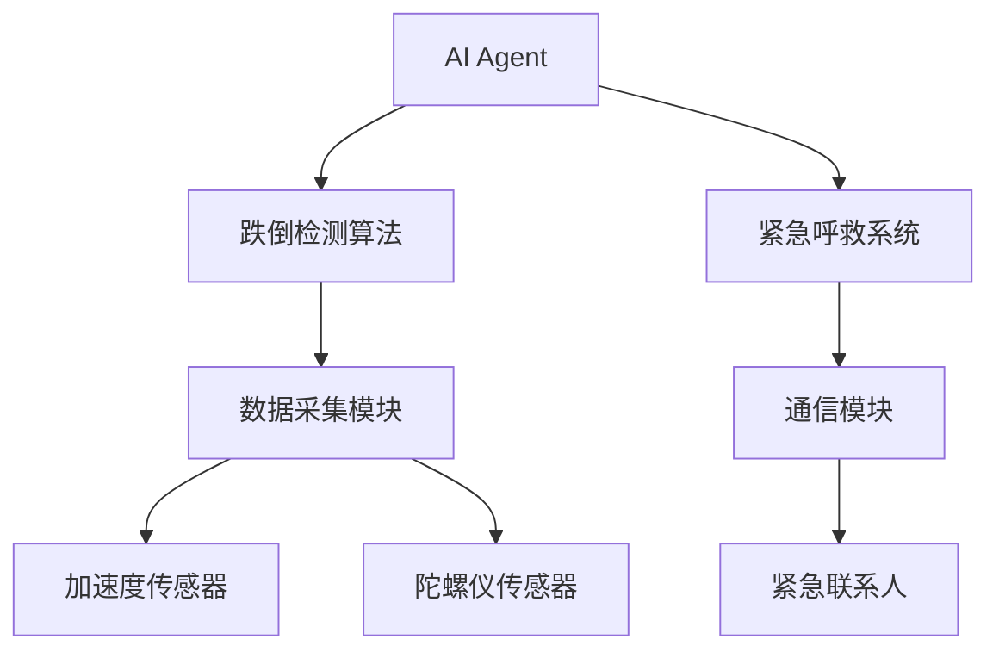
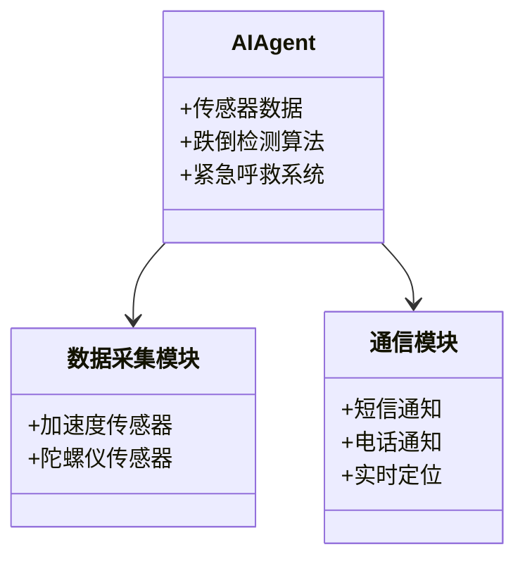

                 


# AI Agent在智能项链中的跌倒检测与紧急呼救

> 关键词：AI Agent, 跌倒检测, 智能项链, 紧急呼救, 可穿戴设备, 机器学习

> 摘要：本文将详细介绍AI Agent在智能项链中的跌倒检测与紧急呼救系统的实现原理、算法设计、系统架构以及实际应用场景。通过逐步分析，本文将深入探讨如何利用AI技术解决实际生活中的跌倒检测问题，并实现紧急呼救功能，为老年人群提供安全保障。

---

# 第一部分: 背景介绍与问题背景

## 第1章: 跌倒检测的背景与意义

### 1.1 跌倒事件的严重性

跌倒是一种常见但严重的健康问题，尤其在老年人群体中。根据世界卫生组织（WHO）的统计，全球每年有数百万人因跌倒导致严重伤害，甚至死亡。跌倒不仅会导致身体伤害，还可能引发心理问题，如焦虑和抑郁。因此，跌倒检测技术的研发具有重要的社会意义。

### 1.2 老龄化社会中的跌倒问题

随着全球人口老龄化的加剧，老年人群体的跌倒问题日益突出。传统的跌倒监测方法，如人工监护或视频监控，存在成本高、隐私保护难等问题。而可穿戴设备的普及为解决这一问题提供了新的思路。智能项链作为一种轻便、易于佩戴的设备，成为跌倒检测的理想选择。

### 1.3 智能设备在跌倒检测中的作用

智能设备，尤其是可穿戴设备，通过集成多种传感器（如加速度传感器、陀螺仪等），可以实时监测佩戴者的运动状态。AI Agent（人工智能代理）通过分析这些传感器数据，能够快速识别跌倒事件，并触发紧急呼救机制，从而为佩戴者提供及时的医疗救助。

---

## 第2章: 智能项链的功能定位

### 2.1 可穿戴设备的发展现状

可穿戴设备近年来发展迅速，涵盖了智能手表、智能手环、智能项链等多种形式。这些设备通过集成传感器、通信模块和计算单元，能够实时监测佩戴者的健康状况和运动状态。智能项链作为一种新兴的可穿戴设备，凭借其便捷性和隐蔽性，受到广泛关注。

### 2.2 智能项链的功能特点

智能项链的功能特点包括：

1. **实时监测**：通过传感器实时采集佩戴者的运动数据。
2. **跌倒检测**：基于AI算法分析数据，识别跌倒事件。
3. **紧急呼救**：在检测到跌倒后，自动触发紧急呼救机制，通知预设的紧急联系人或医疗救援机构。
4. **低功耗设计**：采用先进的低功耗技术，确保设备的续航能力。

### 2.3 跌倒检测与紧急呼救的核心价值

跌倒检测与紧急呼救系统的核心价值在于：

1. **预防二次伤害**：及时发现跌倒事件，避免因跌倒导致的二次伤害。
2. **快速响应**：通过AI Agent的实时分析，快速触发紧急呼救机制，缩短救援响应时间。
3. **提升安全感**：为老年人及其家人提供安全保障，减轻家庭和社会的负担。

---

# 第二部分: 核心概念与系统架构

## 第3章: AI Agent的基本原理

### 3.1 AI Agent的定义与特点

AI Agent（人工智能代理）是一种能够感知环境、自主决策并执行任务的智能实体。AI Agent在智能项链中的作用是通过分析传感器数据，识别跌倒事件，并触发相应的紧急呼救机制。

AI Agent的特点包括：

1. **自主性**：能够在没有人工干预的情况下自主运行。
2. **反应性**：能够实时感知环境变化并做出响应。
3. **学习能力**：通过机器学习算法不断优化自身的识别能力。

### 3.2 AI Agent在智能项链中的角色

在智能项链中，AI Agent主要负责以下任务：

1. **数据采集与处理**：通过传感器获取佩戴者的运动数据，并进行预处理和特征提取。
2. **跌倒识别**：基于机器学习算法，分析数据并识别跌倒事件。
3. **紧急呼救**：在识别到跌倒事件后，触发紧急呼救机制，通知相关机构。

### 3.3 AI Agent与智能设备的交互机制

AI Agent与智能设备的交互机制如下：

1. **数据采集**：智能项链中的传感器（如加速度传感器、陀螺仪）将佩戴者的运动数据实时传输给AI Agent。
2. **数据处理**：AI Agent对采集到的数据进行预处理和特征提取，生成可用于识别跌倒事件的特征向量。
3. **跌倒识别**：AI Agent通过训练好的机器学习模型，对特征向量进行分类，识别是否发生跌倒。
4. **紧急呼救**：如果识别到跌倒事件，AI Agent会触发紧急呼救机制，通过通信模块通知预设的紧急联系人或医疗救援机构。

---

## 第4章: 跌倒检测算法的核心概念

### 4.1 跌倒检测的基本原理

跌倒检测的基本原理是通过分析佩戴者的运动数据，识别其是否发生了跌倒事件。常见的运动数据包括加速度、角速度、姿态等。

### 4.2 数据采集与特征提取

#### 4.2.1 数据采集

智能项链中的传感器（如加速度传感器和陀螺仪）会实时采集佩戴者的运动数据。以下是典型的传感器数据采集代码示例：

```python
import numpy as np
import pandas as pd

# 示例数据采集代码
def collect_data(sensors):
    data = []
    for sensor in sensors:
        data.append(sensor.read_data())
    return np.array(data)
```

#### 4.2.2 数据预处理

数据预处理的目的是消除噪声并提取有用的特征。常见的数据预处理方法包括：

1. **滤波**：使用低通滤波器消除高频噪声。
2. **归一化**：将数据标准化，使其具有相同的尺度。
3. **特征提取**：从原始数据中提取有用的特征，如均方差（MSE）、最大值、最小值等。

#### 4.2.3 特征选择与降维

为了提高分类模型的性能，通常需要对特征进行选择和降维。常见的特征选择方法包括：

1. **方差分析**：选择方差较大的特征。
2. **相关性分析**：去除高度相关的特征。

### 4.3 跌倒判定的数学模型

跌倒判定的数学模型通常基于机器学习算法，如支持向量机（SVM）、随机森林（Random Forest）等。以下是基于SVM的跌倒判定模型的数学表达：

$$
\text{分类结果} = \text{sign}(w \cdot x + b)
$$

其中，\( w \) 是支持向量机的权重向量，\( x \) 是输入的特征向量，\( b \) 是偏置项。

---

## 第5章: 紧急呼救系统的实现机制

### 5.1 紧急呼救的触发条件

紧急呼救的触发条件通常是跌倒检测算法识别到跌倒事件。此外，还可以结合其他条件，如佩戴者的心率变化、位置变化等。

### 5.2 通信模块的工作原理

通信模块负责将跌倒事件通知给预设的紧急联系人或医疗救援机构。常见的通信方式包括：

1. **短信通知**：通过短信将跌倒事件通知给紧急联系人。
2. **电话通知**：通过自动拨号将跌倒事件通知给紧急联系人。
3. **实时定位**：通过GPS定位佩戴者的位置，并将位置信息发送给救援机构。

### 5.3 紧急联系人通知机制

紧急联系人通知机制通常包括以下步骤：

1. **识别跌倒事件**：AI Agent通过传感器数据识别到跌倒事件。
2. **触发通知**：AI Agent通过通信模块将跌倒事件通知给预设的紧急联系人。
3. **记录日志**：将跌倒事件的时间、地点和紧急联系人的联系方式记录到日志中。

---

## 第6章: 系统架构设计

### 6.1 系统架构图（Mermaid）



### 6.2 系统功能设计（Mermaid）



---

## 第7章: 项目实战

### 7.1 环境安装

以下是安装环境的示例代码：

```bash
# 安装必要的Python库
pip install numpy
pip install pandas
pip install scikit-learn
pip install matplotlib
```

### 7.2 代码实现

以下是跌倒检测算法的实现代码：

```python
from sklearn.svm import SVC
from sklearn.metrics import accuracy_score

# 示例特征提取与训练代码
def train_model(X_train, y_train):
    model = SVC()
    model.fit(X_train, y_train)
    return model

# 示例数据集
X_train = [[1, 0], [0, 1], [1, 1], [0, 0]]
y_train = [0, 0, 1, 1]

model = train_model(X_train, y_train)
print("训练完成，准确率为：", accuracy_score(y_train, model.predict(X_train)))
```

### 7.3 功能测试

以下是功能测试的示例代码：

```python
# 功能测试代码
def test_fall_detection(model):
    test_data = [[1, 1], [0, 0]]
    test_labels = [1, 0]
    predictions = model.predict(test_data)
    accuracy = accuracy_score(test_labels, predictions)
    print("测试准确率为：", accuracy)

test_fall_detection(model)
```

### 7.4 案例分析

以下是跌倒检测系统在实际应用中的案例分析：

假设一位老年人佩戴智能项链，传感器采集到以下数据：

| 时间 | 加速度（x轴） | 加速度（y轴） | 陀螺仪（z轴） |
|------|----------------|----------------|----------------|
| 1    | 0.5            | 0.3            | 0.2            |
| 2    | 1.2            | 0.8            | 0.5            |
| 3    | 0.8            | 0.6            | 0.7            |

通过AI Agent分析，识别到佩戴者在时间点2发生了跌倒事件，并触发紧急呼救机制，通知预设的紧急联系人。

---

# 第三部分: 总结与展望

## 第8章: 总结与展望

### 8.1 最佳实践 tips

1. **传感器选择**：选择高精度的传感器，确保数据采集的准确性。
2. **算法优化**：通过不断优化机器学习算法，提高跌倒检测的准确率。
3. **隐私保护**：在数据传输和存储过程中，确保佩戴者的隐私安全。

### 8.2 本章小结

通过本文的详细讲解，我们了解了AI Agent在智能项链中的跌倒检测与紧急呼救系统的实现原理、算法设计、系统架构以及实际应用场景。这一技术不仅为老年人群体提供了安全保障，也为智能设备的研发提供了新的思路。

### 8.3 注意事项

1. **数据隐私**：在实际应用中，需严格遵守数据隐私保护法规，确保佩戴者的隐私安全。
2. **设备维护**：定期检查设备的传感器和通信模块，确保其正常运行。
3. **用户教育**：向佩戴者及其家人普及设备的使用方法和注意事项。

### 8.4 拓展阅读

1. **AI Agent在医疗健康中的应用**
2. **可穿戴设备的智能化发展**
3. **跌倒检测算法的优化与改进**

---

# 作者：AI天才研究院/AI Genius Institute & 禅与计算机程序设计艺术 /Zen And The Art of Computer Programming

