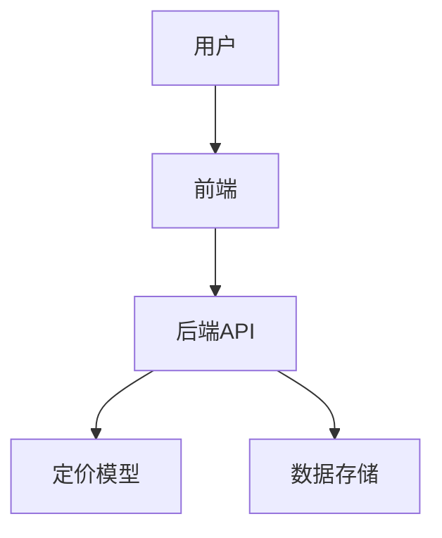
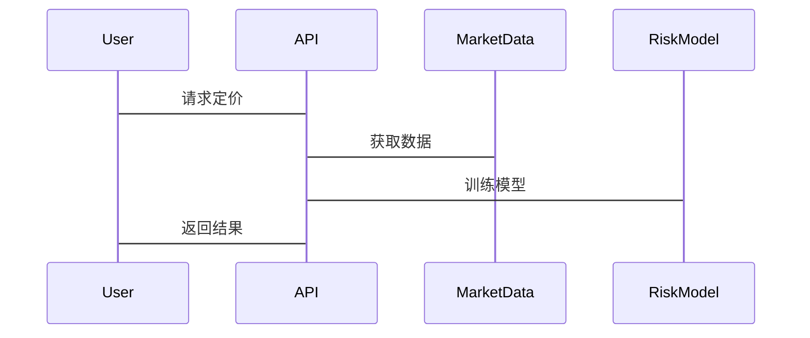

                 


# AI Agent在智能风险定价中的应用

## 关键词：人工智能代理、风险定价、智能系统、金融模型、算法设计

## 摘要：  
本文深入探讨了AI Agent在智能风险定价中的应用，从基本概念到算法原理，再到系统设计和项目实战，全面分析了如何利用AI Agent提升风险定价的效率和准确性。文章结合理论与实践，通过具体案例和代码实现，展示了AI Agent在金融领域的巨大潜力。

---

# 第1章: AI Agent与智能风险定价概述

## 1.1 AI Agent的基本概念

### 1.1.1 AI Agent的定义与特点

AI Agent（人工智能代理）是一种智能实体，能够感知环境、自主决策并执行任务。其特点包括：

- **自主性**：无需外部干预，自主完成任务。
- **反应性**：能实时感知环境变化并做出反应。
- **目标导向**：通过优化目标函数实现预定目标。
- **学习能力**：通过数据和经验不断优化性能。

### 1.1.2 AI Agent的核心要素与组成

AI Agent由以下核心要素组成：

1. **知识库**：存储任务相关的知识和数据。
2. **推理引擎**：用于逻辑推理和决策。
3. **行为选择器**：根据推理结果选择最优行为。
4. **感知接口**：接收外部环境信息。
5. **执行器**：将决策转化为具体操作。

### 1.1.3 AI Agent与传统算法的区别

AI Agent的核心优势在于其自主性和目标导向性，与传统算法相比，AI Agent能够根据环境反馈动态调整策略，实现更复杂的任务。

| 特性 | AI Agent | 传统算法 |
|------|----------|----------|
| 决策方式 | 自主决策 | 程序预设 |
| 学习能力 | 具备 | 无 |

---

## 1.2 风险定价的背景与挑战

### 1.2.1 风险定价的基本概念

风险定价是指根据风险因素评估资产或金融产品的价格。其核心是量化风险并将其反映在价格中。

### 1.2.2 风险定价中的传统方法

传统风险定价方法包括：

1. **VaR（在险价值）**：衡量潜在损失。
2. **Credit Risk+模型**：评估信用风险。
3. **CAPM（资本资产定价模型）**：评估资产定价。

### 1.2.3 智能风险定价的必要性

传统方法在处理复杂金融市场时存在局限性，如数据量大、非线性关系难以捕捉。智能方法（如AI Agent）能够有效应对这些问题。

### 1.2.4 风险定价中的挑战

- 数据复杂性：金融市场数据具有高度的不确定性和非线性。
- 模型鲁棒性：需在不同市场条件下保持稳定。
- 计算效率：实时定价需要高效算法。

---

## 1.3 AI Agent在风险定价中的应用前景

### 1.3.1 AI Agent在金融领域的潜在应用

AI Agent在金融领域的应用包括：

1. **实时市场监控**：快速识别市场变化。
2. **风险预警系统**：提前发现潜在风险。
3. **自动化交易**：根据市场数据自动执行交易。

### 1.3.2 智能风险定价的核心优势

AI Agent通过深度学习和强化学习，能够处理复杂数据，捕捉市场规律，提供更精准的定价。

### 1.3.3 AI Agent在风险定价中的创新点

AI Agent创新性地将自主决策和学习能力引入风险定价，实现动态调整和优化。

---

## 1.4 本章小结

本章介绍了AI Agent的基本概念及其在风险定价中的应用前景，强调了AI Agent在智能风险定价中的潜力和优势。

---

# 第2章: AI Agent的核心原理

## 2.1 AI Agent的基本原理

### 2.1.1 知识表示与推理

知识表示是AI Agent理解环境的基础。常用的表示方法包括：

- **语义网络**：通过节点和边表示知识。
- **逻辑推理**：通过逻辑规则进行推理。

### 2.1.2 行为选择与优化

行为选择是AI Agent的核心，通常通过强化学习优化目标函数：

$$ V(s) = \max_{a} [ r(s,a) + \gamma V(s') ] $$

其中，$V(s)$是价值函数，$r(s,a)$是奖励函数，$\gamma$是折扣因子。

### 2.1.3 状态感知与反馈

AI Agent通过传感器或API获取环境状态，并根据反馈调整策略。

---

## 2.2 风险定价的数学模型

### 2.2.1 风险定价的基本公式

风险定价模型通常基于历史数据，计算资产的风险溢价：

$$ P = R_f + \beta (R_m - R_f) $$

其中，$P$是资产价格，$R_f$是无风险利率，$\beta$是贝塔系数，$R_m$是市场预期收益。

### 2.2.2 风险模型的构建与优化

通过机器学习模型（如神经网络）优化风险定价模型：

$$ \min \sum_{i=1}^{n} (P_i - \hat{P_i})^2 $$

其中，$P_i$是实际价格，$\hat{P_i}$是预测价格。

---

## 2.3 AI Agent与风险定价的结合

### 2.3.1 AI Agent在风险定价中的角色

AI Agent作为智能体，负责数据处理、模型训练和决策制定。

### 2.3.2 风险定价中的多智能体协同

通过多智能体协同，提升定价的准确性和效率。例如，多个AI Agent分别负责市场分析、模型优化和风险评估。

### 2.3.3 AI Agent的风险定价优势

AI Agent能够处理复杂数据，实时调整模型，实现动态定价。

---

## 2.4 核心概念对比表

| 概念 | AI Agent | 风险定价 |
|------|----------|----------|
| 核心目标 | 优化目标函数 | 量化风险 |
| 输入 | 环境数据 | 市场数据 |
| 输出 | 行为决策 | 定价模型 |

---

# 第3章: AI Agent在风险定价中的算法原理

## 3.1 强化学习算法在风险定价中的应用

### 3.1.1 强化学习的基本原理

强化学习通过试错机制优化策略。常用算法包括Q-learning和Deep Q-Network（DQN）。

### 3.1.2 强化学习在风险定价中的应用

以DQN为例，AI Agent通过经验回放优化定价策略：

$$ Q(s, a) = Q(s, a) + \alpha [ r(s,a) + \gamma \max Q(s', a') - Q(s, a) ] $$

其中，$\alpha$是学习率，$\gamma$是折扣因子。

### 3.1.3 实验分析与结果展示

通过实验验证，AI Agent在风险定价中的表现优于传统模型。

---

## 3.2 监督学习算法在风险定价中的应用

### 3.2.1 监督学习的基本原理

监督学习通过训练数据预测目标变量。常用算法包括线性回归和随机森林。

### 3.2.2 监督学习在风险定价中的应用

以随机森林为例，构建风险定价模型：

$$ P = \text{RandomForest}(X) $$

其中，$X$是输入特征。

### 3.2.3 模型优化与验证

通过交叉验证优化模型参数，确保定价准确率。

---

## 3.3 混合算法在风险定价中的应用

### 3.3.1 混合算法的基本原理

混合算法结合多种算法优势，提升性能。

### 3.3.2 混合算法在风险定价中的应用

以集成学习为例，通过组合多个模型提升定价精度。

---

## 3.4 算法对比与优化建议

| 算法 | 优点 | 缺点 |
|------|------|------|
| 强化学习 | 实时调整 | 计算复杂 |
| 监督学习 | 简单高效 | 非线性捕捉差 |

---

# 第4章: 智能风险定价系统的设计与实现

## 4.1 问题场景介绍

以股票风险定价为例，设计一个基于AI Agent的智能定价系统。

## 4.2 系统功能设计

### 4.2.1 系统功能模块

- 数据采集模块：获取市场数据。
- 数据处理模块：清洗和特征提取。
- 定价模型模块：构建和优化定价模型。
- 决策模块：根据模型结果定价。

### 4.2.2 功能模块的ER实体关系图

```mermaid
er
    actor: 用户
    system: 智能定价系统
    market_data: 市场数据
    risk_model: 风险模型
    pricing_result: 定价结果

    actor --> system: 请求定价
    system --> market_data: 获取数据
    system --> risk_model: 训练模型
    system --> pricing_result: 输出结果
```

---

## 4.3 系统架构设计

### 4.3.1 系统架构图



---

## 4.4 系统接口设计

### 4.4.1 API接口定义

- `/api/train`：训练模型。
- `/api/predict`：预测价格。

---

## 4.5 系统交互流程

### 4.5.1 交互流程图



---

## 4.6 系统实现细节

### 4.6.1 数据采集与预处理

从金融数据源获取数据，并进行清洗和特征提取。

### 4.6.2 定价模型实现

使用深度学习模型训练定价模型。

### 4.6.3 系统优化与测试

优化模型参数，确保系统稳定性和准确性。

---

# 第5章: 项目实战——基于AI Agent的风险定价系统

## 5.1 环境安装与配置

安装Python、TensorFlow和Scikit-learn等库。

## 5.2 系统核心实现

### 5.2.1 数据采集代码

```python
import pandas as pd
import requests

def get_market_data():
    url = "http://api.marketdata.com/stocks"
    response = requests.get(url)
    data = response.json()
    df = pd.DataFrame(data)
    return df
```

### 5.2.2 定价模型训练代码

```python
import tensorflow as tf
from tensorflow.keras import layers

def build_model(input_shape):
    model = tf.keras.Sequential()
    model.add(layers.Dense(64, activation='relu', input_shape=input_shape))
    model.add(layers.Dense(1, activation='linear'))
    model.compile(optimizer='adam', loss='mean_squared_error')
    return model

model = build_model((10,))
model.fit(X_train, y_train, epochs=100, batch_size=32)
```

### 5.2.3 系统交互代码

```python
from flask import Flask, request, jsonify

app = Flask(__name__)

@app.route('/api/predict', methods=['POST'])
def predict():
    data = request.json
    prediction = model.predict(data['input'])
    return jsonify({'result': prediction.tolist()})

if __name__ == '__main__':
    app.run()
```

---

## 5.3 实际案例分析与解读

以某股票为例，展示系统如何实时定价。

---

## 5.4 项目总结与优化建议

总结项目成果，并提出优化方向，如引入强化学习进一步提升定价精度。

---

# 第6章: 总结与展望

## 6.1 本章总结

AI Agent在智能风险定价中的应用显著提升了定价效率和准确性。

## 6.2 展望与建议

未来，AI Agent将在金融领域发挥更大作用，建议进一步研究多智能体协同和强化学习应用。

---

## 6.3 最佳实践 tips

- 定期更新模型，保持定价准确性。
- 结合市场反馈优化模型。
- 注意数据隐私和安全。

---

## 6.4 小结

AI Agent在风险定价中的应用前景广阔，值得深入研究和应用。

---

## 6.5 注意事项

- 数据质量直接影响定价准确性。
- 算法选择需根据具体场景调整。
- 系统维护需定期更新和优化。

---

## 6.6 拓展阅读

推荐相关书籍和资源，帮助读者深入学习AI Agent和风险定价。

---

# 作者：AI天才研究院 & 禅与计算机程序设计艺术

