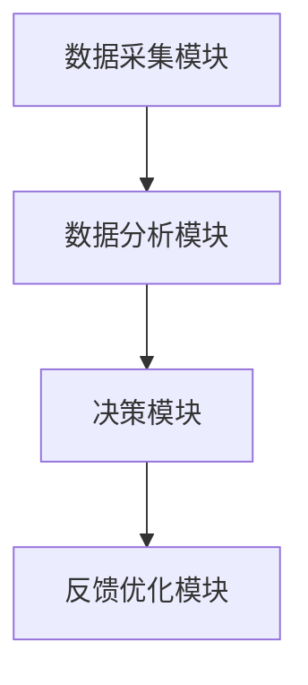

                 


# AI Agent在智能风险投资决策中的应用

> 关键词：AI Agent，智能风险投资，决策树，强化学习，知识图谱

> 摘要：本文探讨了AI Agent在智能风险投资决策中的应用，分析了AI Agent的基本概念、核心原理，以及在风险投资中的具体应用场景。文章结合实际案例，详细讲解了AI Agent的算法原理、系统架构设计，以及实际项目中的实现细节。

---

## 第一部分: AI Agent与智能风险投资决策概述

### 第1章: AI Agent与智能风险投资决策概述

#### 1.1 AI Agent的基本概念与背景

##### 1.1.1 什么是AI Agent
AI Agent（人工智能代理）是指能够感知环境并采取行动以实现目标的智能实体。它可以是一个软件程序、一个机器人，或者是任何能够执行复杂决策任务的智能系统。AI Agent的核心特征包括自主性、反应性、目标导向和学习能力。

##### 1.1.2 AI Agent的核心特征
- **自主性**：AI Agent能够独立执行任务，无需外部干预。
- **反应性**：能够实时感知环境变化并做出响应。
- **目标导向**：所有行动都是为了实现特定目标。
- **学习能力**：通过数据和经验不断优化决策能力。

##### 1.1.3 智能风险投资决策的定义与特点
智能风险投资决策是指利用AI技术进行投资分析、风险评估和决策优化的过程。其特点包括数据驱动、自动化、高精度和高效性。

##### 1.1.4 AI Agent在风险投资中的应用背景
随着金融市场日益复杂，传统的人工决策方式难以应对海量数据和快速变化的市场环境。AI Agent通过自动化分析和决策，为投资者提供了更高效、更精准的投资工具。

---

#### 1.2 AI Agent与风险投资的结合

##### 1.2.1 风险投资决策的复杂性与挑战
风险投资涉及多方面的信息分析，包括市场趋势、企业财务状况、管理团队能力等。传统方法依赖经验丰富的专家，但存在主观性强、效率低下的问题。

##### 1.2.2 AI Agent在风险投资中的优势
- **数据处理能力**：AI Agent能够快速处理海量数据，发现潜在的投资机会。
- **决策优化**：通过强化学习等技术，优化投资组合，降低风险。
- **实时监控**：能够实时跟踪市场动态，及时调整投资策略。

##### 1.2.3 AI Agent与传统投资决策的对比
| 特性         | AI Agent                | 传统投资决策            |
|--------------|-------------------------|--------------------------|
| 数据处理能力 | 强大，可处理多维度数据 | 依赖人工分析，效率较低   |
| 决策速度     | 快速，实时响应          | 较慢，依赖人工判断        |
| 精准度       | 高，基于数据驱动        | 受主观因素影响较大       |

---

#### 1.3 本书的核心目标与结构

##### 1.3.1 本书的核心目标
本文旨在探讨AI Agent在风险投资中的应用，分析其技术原理、系统架构，并通过实际案例展示其在投资决策中的优势。

##### 1.3.2 本书的章节结构
- **第1章**：AI Agent与智能风险投资决策概述
- **第2章**：AI Agent的核心原理
- **第3章**：AI Agent在风险投资中的算法原理
- **第4章**：AI Agent的系统分析与架构设计
- **第5章**：AI Agent在风险投资中的项目实战
- **第6章**：AI Agent的风险投资应用总结与展望

##### 1.3.3 预备知识与读者对象
读者需要具备基本的编程知识和对人工智能技术的了解。本书适合风险投资从业者、数据科学家以及对AI技术感兴趣的读者阅读。

---

## 第二部分: AI Agent的核心原理与技术

### 第2章: AI Agent的核心原理

#### 2.1 多智能体系统

##### 2.1.1 多智能体系统的定义与特点
多智能体系统是由多个相互作用的智能体组成的系统，每个智能体都有自己的目标和决策机制。其特点包括分布式、协作性和自适应性。

##### 2.1.2 多智能体系统中的通信与协作
智能体之间通过消息传递进行通信，协作完成复杂任务。例如，在风险投资中，多个智能体可以分别负责市场分析、财务评估和风险控制。

##### 2.1.3 多智能体系统的应用场景
在风险投资中，多智能体系统可以用于分散投资、组合优化和风险分散。

---

#### 2.2 强化学习与决策树

##### 2.2.1 强化学习的基本原理
强化学习是一种通过试错机制优化决策模型的技术。智能体通过与环境互动，不断调整策略以获得最大化的奖励。

##### 2.2.2 决策树的构建与优化
决策树是一种树状结构，用于表示可能的决策路径。通过强化学习优化决策树，可以提高投资决策的准确性。

##### 2.2.3 强化学习在AI Agent中的应用
通过强化学习，AI Agent可以在复杂环境中做出最优决策。例如，在股票交易中，AI Agent可以根据市场反馈调整买卖策略。

---

#### 2.3 知识图谱与推理

##### 2.3.1 知识图谱的构建方法
知识图谱是将实体及其关系表示为图结构的数据模型。构建知识图谱需要进行数据清洗、实体识别和关系抽取。

##### 2.3.2 知识图谱的推理机制
通过推理算法，可以从已知事实推导出新的知识。例如，在风险评估中，可以通过推理发现潜在的关联风险。

##### 2.3.3 知识图谱在风险投资中的应用
知识图谱可以帮助投资者发现隐藏的关联信息，提高投资决策的准确性。

---

## 第三部分: AI Agent在风险投资中的算法原理

### 第3章: AI Agent的核心算法

#### 3.1 强化学习算法

##### 3.1.1 Q-Learning算法
Q-Learning是一种经典的强化学习算法，通过更新Q值表来优化决策策略。

$$ Q(s, a) = Q(s, a) + \alpha (r + \gamma \max Q(s', a') - Q(s, a)) $$

##### 3.1.2 Deep Q-Networks (DQN) 算法
DQN算法通过深度神经网络近似Q值函数，提高了算法的表达能力和泛化能力。

##### 3.1.3 算法实现与优化
通过神经网络结构优化和经验回放机制，可以进一步提高DQN算法的性能。

##### 3.1.4 算法实现代码
```python
import numpy as np

class DQN:
    def __init__(self, state_space, action_space, learning_rate=0.01):
        self.state_space = state_space
        self.action_space = action_space
        self.learning_rate = learning_rate
        self.q_table = np.zeros((state_space, action_space))
        
    def choose_action(self, state, epsilon=0.1):
        if np.random.random() < epsilon:
            return np.random.randint(self.action_space)
        return np.argmax(self.q_table[state])
    
    def update_q_table(self, current_state, action, reward, next_state):
        target = reward + np.max(self.q_table[next_state])
        self.q_table[current_state, action] += self.learning_rate * (target - self.q_table[current_state, action])
```

---

#### 3.2 贝叶斯网络与概率推理

##### 3.2.1 贝叶斯网络的基本原理
贝叶斯网络是一种基于概率推理的图形模型，用于表示变量之间的依赖关系。

##### 3.2.2 贝叶斯网络在风险评估中的应用
通过贝叶斯网络，可以量化不同风险因素的概率，帮助投资者做出更准确的决策。

##### 3.2.3 算法实现与案例分析
使用贝叶斯网络对某个具体风险因素进行建模，计算其概率分布，并根据数据更新模型。

---

## 第四部分: AI Agent的系统分析与架构设计

### 第4章: AI Agent的系统分析与架构设计

#### 4.1 问题场景介绍
在风险投资中，AI Agent需要处理复杂的市场数据和多变的市场环境。系统需要具备实时数据处理、智能决策和风险控制能力。

#### 4.2 项目介绍
本项目旨在开发一个基于AI Agent的风险投资决策系统，涵盖数据采集、分析、决策和反馈优化等环节。

#### 4.3 系统功能设计

##### 4.3.1 数据采集模块
负责从多个数据源获取市场数据，包括股票价格、财务报表等。

##### 4.3.2 数据分析模块
使用强化学习和贝叶斯网络对数据进行分析，生成投资建议。

##### 4.3.3 决策模块
根据分析结果，生成投资策略，并通过API接口与外部系统交互。

##### 4.3.4 反馈优化模块
根据市场反馈，优化决策模型，提高投资效果。

---

#### 4.4 系统架构设计

##### 4.4.1 微服务架构
采用微服务架构，将系统划分为多个独立的服务模块，包括数据采集、分析、决策和反馈优化。

##### 4.4.2 系统交互设计
通过RESTful API实现模块之间的通信，确保系统的高效性和可扩展性。

##### 4.4.3 系统架构图


---

## 第五部分: AI Agent在风险投资中的项目实战

### 第5章: AI Agent的项目实战

#### 5.1 环境安装
需要安装Python、TensorFlow、Keras等开发工具，以及相关数据接口。

#### 5.2 核心代码实现

##### 5.2.1 数据采集模块
```python
import requests

def get_stock_data(stock_id):
    url = f"http://api.example.com/stock/{stock_id}"
    response = requests.get(url)
    return response.json()
```

##### 5.2.2 数据分析模块
```python
import numpy as np
from tensorflow.keras import models

model = models.load_model("investment_model.h5")
predictions = model.predict(stock_data)
```

##### 5.2.3 决策模块
```python
def make_decision(predictions):
    if predictions[0] > 0.5:
        return "买入"
    else:
        return "卖出"
```

##### 5.2.4 反馈优化模块
```python
def optimize_model(feedback):
    model.fit(new_data, new_labels, epochs=10)
```

---

## 第六部分: AI Agent的风险投资应用总结与展望

### 第6章: AI Agent的风险投资应用总结与展望

#### 6.1 最佳实践 tips
- 数据质量是关键，确保数据来源可靠。
- 模型需要不断优化，结合实时数据进行更新。
- 注重风险控制，避免过度依赖单一模型。

#### 6.2 小结
通过本文的介绍，读者可以了解AI Agent在风险投资中的核心原理和应用场景。AI Agent通过强化学习、知识图谱等技术，为投资者提供了更高效、更精准的投资工具。

#### 6.3 注意事项
- AI Agent不能完全替代人类的决策，需要结合人类的判断。
- 数据隐私和安全问题需要高度重视。

#### 6.4 拓展阅读
- 《强化学习入门》
- 《知识图谱构建与应用》
- 《机器学习在金融中的应用》

---

## 作者

作者：AI天才研究院/AI Genius Institute & 禅与计算机程序设计艺术 /Zen And The Art of Computer Programming

