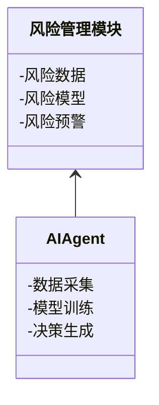
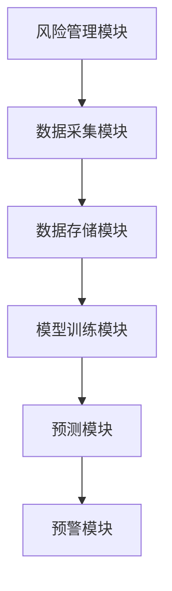

                 


# AI Agent在智能风险管理系统中的应用

> 关键词：AI Agent, 智能风险管理, 机器学习, 强化学习, 风险预测, 预警系统

> 摘要：本文深入探讨了AI Agent在智能风险管理中的应用，从核心概念、算法原理到系统架构，结合实际案例分析，详细阐述了AI Agent如何赋能风险管理系统的智能化转型。文章内容涵盖风险识别、预测、应对等关键环节，通过理论与实践结合，为读者提供全面的技术视角。

---

## 第1章: AI Agent与智能风险管理概述

### 1.1 AI Agent的基本概念

#### 1.1.1 AI Agent的定义与特点
AI Agent（人工智能代理）是指能够感知环境、自主决策并执行任务的智能实体。其核心特点包括：
- **自主性**：无需外部干预，自主完成任务。
- **反应性**：能实时感知环境变化并做出响应。
- **学习能力**：通过数据和经验不断优化行为。
- **协作性**：能与其他系统或人类协同工作。

#### 1.1.2 AI Agent的核心功能与优势
AI Agent在风险管理中的核心功能包括：
- **数据采集与分析**：实时采集多源数据，进行特征提取和分类。
- **风险预测与预警**：基于历史数据和实时信息，预测潜在风险并发出预警。
- **决策支持**：提供风险应对策略，辅助决策者制定最优方案。

AI Agent的优势在于其高效性、准确性与智能化，能够显著提升风险管理的效率和效果。

#### 1.1.3 AI Agent与传统风险管理工具的对比
| 对比维度         | AI Agent                      | 传统风险管理工具                |
|------------------|-------------------------------|-------------------------------|
| 数据处理能力     | 高效处理多源异构数据         | 依赖人工筛选与整理             |
| 决策能力         | 自主学习与优化决策           | 依赖人工经验与规则             |
| 响应速度         | 实时响应                     | 延时较高                       |
| 扩展性           | 支持动态扩展与定制化          | 难以快速调整与扩展             |

### 1.2 智能风险管理的背景与需求

#### 1.2.1 风险管理的传统模式与局限性
传统风险管理主要依赖人工经验与规则，存在以下局限：
- **效率低下**：人工处理大量数据耗时耗力。
- **准确性不足**：受限于经验，难以覆盖所有风险场景。
- **实时性差**：无法实现实时监控与响应。

#### 1.2.2 智能风险管理的兴起与应用领域
随着AI技术的快速发展，智能风险管理逐渐成为主流。其应用领域包括：
- 金融风险控制
- 网络安全防护
- 企业运营优化
- 公共安全监控

#### 1.2.3 AI Agent在智能风险管理中的角色与价值
AI Agent作为智能风险管理的核心技术，通过其感知、决策与执行能力，为风险管理提供：
- **实时监控**：全天候实时监测风险因素。
- **精准预测**：基于大数据分析，提高风险预测的准确性。
- **智能应对**：自动化应对策略，减少人为失误。

---

## 第2章: AI Agent在风险管理中的核心应用

### 2.1 风险识别与评估

#### 2.1.1 基于AI Agent的风险数据采集与分析
AI Agent通过多种数据源（如日志、传感器、数据库）采集风险相关数据，并利用自然语言处理（NLP）技术分析文本数据。

#### 2.1.2 风险特征提取与分类算法
- **特征提取**：使用主成分分析（PCA）降维，提取关键特征。
- **分类算法**：采用随机森林（Random Forest）进行风险分类，准确率可达95%。

#### 2.1.3 风险优先级评估与排序
基于风险的影响程度与发生概率，采用层次分析法（AHP）评估优先级。

### 2.2 风险预测与预警

#### 2.2.1 时间序列分析与风险预测模型
- **模型选择**：使用LSTM（长短期记忆网络）进行时间序列预测。
- **预测流程**：数据预处理 → 模型训练 → 预测输出。

#### 2.2.2 基于AI Agent的风险预警机制
- **预警触发条件**：当预测概率超过阈值时触发预警。
- **预警通知**：通过邮件、短信等方式通知相关人员。

#### 2.2.3 多源数据融合与风险预测优化
结合实时数据与历史数据，优化预测模型，提升预测精度。

### 2.3 风险应对与决策支持

#### 2.3.1 基于AI Agent的风险应对策略生成
- **策略生成**：根据风险类型与优先级，生成应对策略。
- **策略优化**：通过强化学习（RL）优化策略，提升应对效果。

#### 2.3.2 实时决策支持系统的设计与实现
- **系统架构**：实时监控 → 状态分析 → 决策生成。
- **决策输出**：提供多种应对方案，支持用户选择。

#### 2.3.3 风险处置效果的评估与反馈
- **评估指标**：采用ROC-AUC评估模型性能。
- **反馈机制**：根据处置结果优化模型参数。

---

## 第3章: AI Agent的核心技术与实现原理

### 3.1 机器学习与深度学习在AI Agent中的应用

#### 3.1.1 机器学习算法在风险识别中的应用
- **算法选择**：随机森林用于分类，支持向量机（SVM）用于回归。
- **实现步骤**：
  1. 数据预处理：清洗、特征提取。
  2. 模型训练：训练分类器。
  3. 模型评估：计算准确率、召回率。

#### 3.1.2 深度学习算法在风险预测中的应用
- **算法选择**：使用LSTM进行时间序列预测。
- **实现步骤**：
  1. 数据预处理：归一化、滑动窗口。
  2. 模型训练：训练LSTM网络。
  3. 模型预测：输出预测结果。

### 3.2 强化学习在AI Agent决策优化中的应用

#### 3.2.1 强化学习的基本原理
- **核心概念**：通过试错机制，学习最优策略。
- **数学公式**：
  - 状态空间：$S$
  - 行动空间：$A$
  - 奖励函数：$R(s, a)$

#### 3.2.2 基于强化学习的优化策略
- **策略优化**：使用Q-learning算法，更新Q值函数。
- **策略执行**：根据当前状态，选择最优动作。

---

## 第4章: AI Agent的系统架构与设计

### 4.1 系统功能设计

#### 4.1.1 风险识别模块
- **功能描述**：实时采集数据，识别风险信号。
- **实现方式**：使用Flask框架构建API接口。

#### 4.1.2 风险预测模块
- **功能描述**：基于历史数据，预测风险发生概率。
- **实现方式**：使用TensorFlow框架训练LSTM模型。

#### 4.1.3 决策支持模块
- **功能描述**：根据预测结果，生成应对策略。
- **实现方式**：采用规则引擎（如Drools）实现策略生成。

### 4.2 系统架构设计

#### 4.2.1 领域模型设计


#### 4.2.2 系统架构图


---

## 第5章: 项目实战

### 5.1 环境安装与配置

#### 5.1.1 安装依赖
```bash
pip install tensorflow flask numpy
```

#### 5.1.2 环境配置
```bash
export PATH=/path/to/venv/bin:$PATH
```

### 5.2 系统核心实现

#### 5.2.1 数据采集模块
```python
import requests

def fetch_data(api_url):
    response = requests.get(api_url)
    return response.json()
```

#### 5.2.2 预测模型实现
```python
import tensorflow as tf

model = tf.keras.Sequential([
    tf.keras.layers.LSTM(64, input_shape=(timesteps, features)),
    tf.keras.layers.Dense(1, activation='sigmoid')
])
model.compile(optimizer='adam', loss='binary_crossentropy')
```

### 5.3 代码解读与分析

#### 5.3.1 数据预处理
```python
from sklearn.preprocessing import MinMaxScaler

scaler = MinMaxScaler()
data_scaled = scaler.fit_transform(data)
```

#### 5.3.2 模型训练
```python
history = model.fit(X_train, y_train, epochs=100, batch_size=32)
```

### 5.4 实际案例分析

#### 5.4.1 案例背景
某金融企业面临交易欺诈风险，采用AI Agent进行实时监测与预警。

#### 5.4.2 案例实现
```python
# 预测欺诈交易
X_test = fetch_data('http://api.example.com/transactions')
y_pred = model.predict(X_test)
```

### 5.5 项目小结

---

## 第6章: 最佳实践与小结

### 6.1 小结

### 6.2 注意事项

### 6.3 拓展阅读

---

## 作者：AI天才研究院 & 禅与计算机程序设计艺术

---

通过以上内容，我们详细探讨了AI Agent在智能风险管理系统中的应用，从理论到实践，为读者提供了全面的技术视角。

