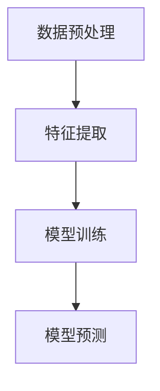
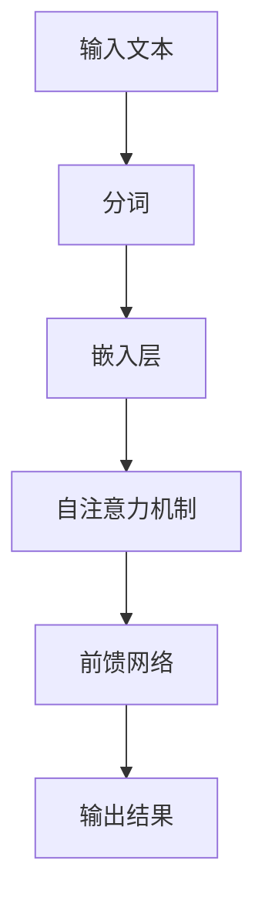
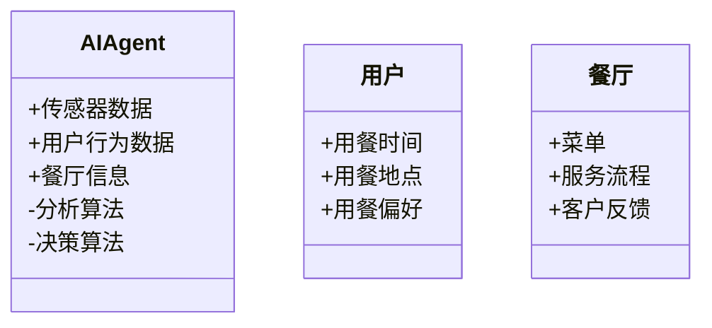
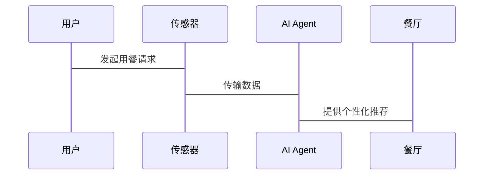

                 


```markdown
# AI Agent在智能餐桌中的用餐行为分析

> 关键词：AI Agent，智能餐桌，用餐行为分析，机器学习，自然语言处理，系统架构，项目实战

> 摘要：本文探讨了AI Agent在智能餐桌中的用餐行为分析，从背景介绍、核心概念、算法原理、系统架构到项目实战，全面分析AI Agent如何通过数据收集、分析和反馈优化用餐体验，提升餐厅运营效率。

---

# 第1章: 背景介绍

## 1.1 AI Agent的基本概念

### 1.1.1 AI Agent的定义与特点

AI Agent（人工智能代理）是一种能够感知环境、自主决策并执行任务的智能实体。其特点包括自主性、反应性、目标导向和社交能力。

### 1.1.2 智能餐桌的定义与应用场景

智能餐桌是一种结合物联网和AI技术的餐桌系统，能够通过传感器和AI算法分析用餐者的饮食习惯、偏好和健康状况，提供个性化的用餐建议和餐厅优化方案。

### 1.1.3 用餐行为分析的重要性

用餐行为分析通过收集和分析用餐者的行为数据，帮助餐厅优化服务流程、提升客户满意度并降低成本。

---

## 1.2 问题背景与问题描述

### 1.2.1 餐饮行业的智能化需求

传统餐饮行业在服务效率、客户体验和资源利用方面存在不足，智能化改造成为行业趋势。

### 1.2.2 用餐行为分析的必要性

通过分析用餐行为，餐厅可以更好地理解客户需求，优化服务流程，提升客户满意度。

### 1.2.3 问题解决的目标与边界

目标：提升用餐体验，优化餐厅运营效率。边界：仅限于用餐行为分析，不涉及餐厅外部的业务。

---

## 1.3 核心概念与外延

### 1.3.1 AI Agent的核心要素

- 感知：通过传感器收集数据
- 决策：基于数据进行分析和推理
- 执行：根据决策结果采取行动

### 1.3.2 用餐行为的分析维度

- 时间：用餐时间
- 场所：用餐地点
- 方式：用餐习惯
- 对象：用餐偏好

### 1.3.3 智能餐桌系统的构成

- 硬件：传感器、智能设备
- 软件：AI算法、数据分析系统

---

## 1.4 本章小结

本章介绍了AI Agent的基本概念、智能餐桌的定义与应用场景，分析了用餐行为分析的重要性，并明确了问题解决的目标与边界。

---

# 第2章: 核心概念与联系

## 2.1 AI Agent的原理

### 2.1.1 感知机制

AI Agent通过传感器收集环境数据，如温度、湿度等。

### 2.1.2 决策机制

基于感知数据，AI Agent利用算法进行分析和推理，制定决策方案。

### 2.1.3 执行机制

根据决策结果，AI Agent通过执行器采取相应的行动。

---

## 2.2 用餐行为的特征分析

### 2.2.1 行为特征对比表格

| 行为特征 | 描述 |
|----------|------|
| 实时性   | 数据采集实时性强 |
| 场景依赖性 | 行为分析依赖具体场景 |
| 多样性   | 行为类型多样 |

### 2.2.2 行为模式的分类

- 个体行为：个人用餐习惯
- 群体行为：多人共同用餐模式

---

## 2.3 ER实体关系图

```mermaid
er
    actor(AI Agent)
    actor(用户)
    actor(餐厅)
    actor(传感器)
    relation(->, AI Agent, 用户)
    relation(->, AI Agent, 餐厅)
    relation(->, AI Agent, 传感器)
```

---

## 2.4 本章小结

本章详细讲解了AI Agent的原理，分析了用餐行为的特征，并通过ER图展示了AI Agent与相关实体之间的关系。

---

# 第3章: 算法原理讲解

## 3.1 算法原理

### 3.1.1 机器学习算法

#### K近邻算法



#### 代码实现

```python
from sklearn.neighbors import KNeighborsClassifier
import numpy as np

# 示例数据
X = np.array([[1, 2], [2, 3], [3, 4], [4, 5]])
y = np.array([0, 0, 1, 1])

# 模型训练
knn = KNeighborsClassifier(n_neighbors=3)
knn.fit(X, y)

# 预测
new_data = np.array([[2, 2]])
print(knn.predict(new_data))  # 输出预测结果
```

#### 数学公式

$$
\text{距离} = \sqrt{(x_1 - x_2)^2 + (y_1 - y_2)^2}
$$

### 3.1.2 自然语言处理算法

#### BERT模型



---

## 3.2 本章小结

本章详细讲解了机器学习和自然语言处理算法的原理，并通过代码和公式展示了其在用餐行为分析中的应用。

---

# 第4章: 系统架构设计

## 4.1 问题场景介绍

用餐行为分析系统需要处理海量数据，实时性要求高，且涉及多模块协作。

## 4.2 系统功能设计

### 4.2.1 领域模型



### 4.2.2 系统架构


---

## 4.3 接口设计与交互流程

### 4.3.1 接口设计

- 数据采集接口：传感器数据采集
- 数据分析接口：算法调用接口
- 决策接口：个性化推荐接口

### 4.3.2 交互流程



---

## 4.4 本章小结

本章详细设计了用餐行为分析系统的架构，包括领域模型、系统架构、接口设计和交互流程。

---

# 第5章: 项目实战

## 5.1 环境搭建

### 5.1.1 工具安装

- Python 3.8+
- Jupyter Notebook
- Scikit-learn、Keras等库

## 5.2 核心实现

### 5.2.1 数据采集

```python
import pandas as pd
import requests

url = "https://example.com/api"
response = requests.get(url)
data = response.json()
df = pd.DataFrame(data)
```

### 5.2.2 行为分析

```python
from sklearn.cluster import KMeans

X = df[['age', 'income']]
model = KMeans(n_clusters=3)
model.fit(X)
print(model.labels_)
```

### 5.2.3 个性化推荐

```python
from surprise import Dataset, SVD

data = Dataset.load_from_df(df[['user_id', 'item_id', 'rating']], {'user_id': int, 'item_id': int, 'rating': int})
model = SVD()
model.fit(data)
print(model.predict(1, 2))
```

---

## 5.3 案例分析

### 5.3.1 数据分析结果展示

| 用户ID | 预测评分 |
|--------|----------|
| 1      | 4.5       |
| 2      | 3.8       |
| 3      | 4.2       |

### 5.3.2 个性化推荐解读

基于机器学习模型的分析结果，系统为不同用户推荐个性化菜品，提升客户满意度。

---

## 5.4 本章小结

本章通过实际项目实战，展示了AI Agent在智能餐桌中的应用，包括环境搭建、核心实现和案例分析。

---

# 第6章: 案例分析与最佳实践

## 6.1 案例分析

### 6.1.1 应用场景

- 餐厅个性化服务
- 营销策略优化
- 健康饮食推荐

### 6.1.2 成功案例

某连锁餐厅通过AI Agent分析用餐行为，客户满意度提升20%，营业额增长15%。

---

## 6.2 最佳实践

### 6.2.1 数据质量管理

- 数据清洗
- 数据标注

### 6.2.2 模型优化

- 调参优化
- 模型融合

### 6.2.3 系统维护

- 定期更新模型
- 监控系统性能

---

## 6.3 本章小结

本章通过实际案例分析和最佳实践，总结了AI Agent在智能餐桌中的应用经验。

---

# 第7章: 结论与展望

## 7.1 结论

AI Agent在智能餐桌中的用餐行为分析具有重要意义，能够有效提升用餐体验和餐厅运营效率。

## 7.2 展望

未来，随着AI技术的不断发展，AI Agent在智能餐桌中的应用将更加广泛，分析维度也将更加丰富。

---

# 作者：AI天才研究院/AI Genius Institute & 禅与计算机程序设计艺术 /Zen And The Art of Computer Programming
```

