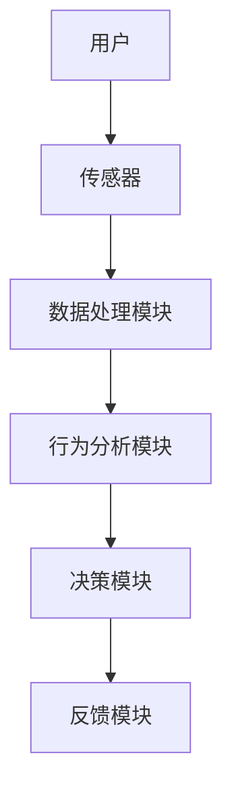
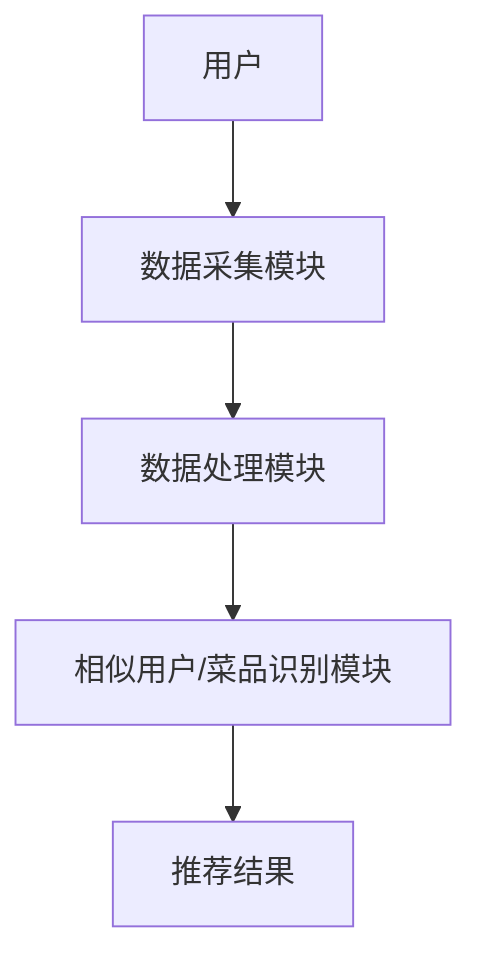
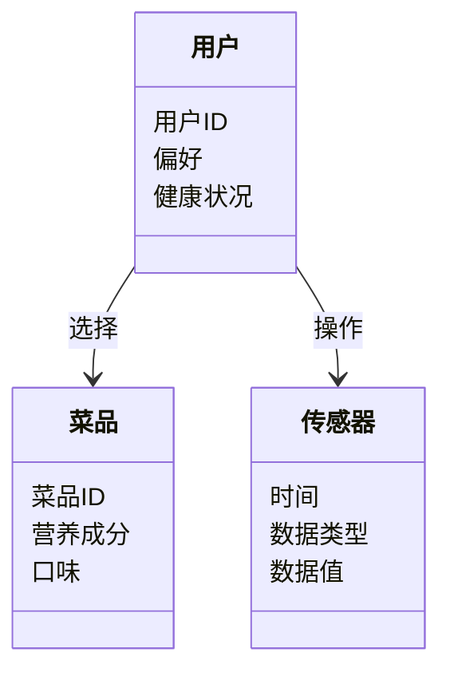
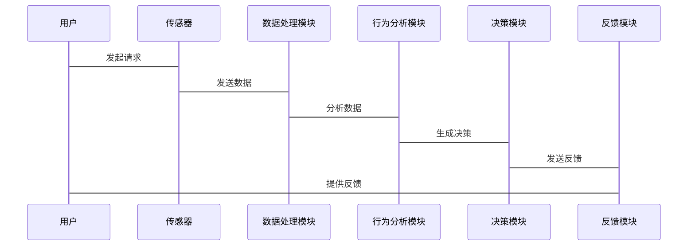

                 


# AI Agent在智能餐桌中的饮食行为分析

> 关键词：AI Agent，智能餐桌，饮食行为分析，机器学习，物联网

> 摘要：本文将探讨AI Agent在智能餐桌中的饮食行为分析，通过详细分析AI Agent的工作原理、核心概念、算法原理、系统架构设计以及项目实战，帮助读者全面理解AI Agent在智能餐桌中的应用及其对饮食行为分析的深远影响。

---

## 第一部分: AI Agent在智能餐桌中的饮食行为分析基础

### 第1章: AI Agent与智能餐桌概述

#### 1.1 AI Agent的基本概念

##### 1.1.1 AI Agent的定义
AI Agent（人工智能代理）是指能够感知环境并采取行动以实现目标的智能实体。在智能餐桌中，AI Agent主要用于分析用户的饮食行为，并提供建议或自动调整环境。

##### 1.1.2 AI Agent的核心特征
AI Agent具有以下核心特征：
- **自主性**：能够在没有外部干预的情况下运行。
- **反应性**：能够实时感知环境并做出反应。
- **目标导向**：具有明确的目标，如优化用户的饮食习惯。

##### 1.1.3 AI Agent与传统AI的区别
AI Agent与传统AI的区别在于，AI Agent具有更强的自主性和目标导向性，能够主动采取行动，而传统AI通常仅限于数据处理和分析。

#### 1.2 智能餐桌的定义与特点

##### 1.2.1 智能餐桌的定义
智能餐桌是指集成了传感器、AI Agent和物联网技术的餐桌，能够感知用户的饮食行为并提供智能化服务。

##### 1.2.2 智能餐桌的核心组成部分
智能餐桌的核心组成部分包括：
- **传感器**：用于感知用户的饮食行为，如饮食量、饮食时间等。
- **AI Agent**：用于分析传感器数据并提供建议或自动调整环境。
- **云端数据处理模块**：用于存储和分析用户的饮食数据，以提供更精准的服务。

##### 1.2.3 智能餐桌与传统餐桌的区别
智能餐桌与传统餐桌的区别在于，智能餐桌能够通过传感器和AI Agent实时感知用户的饮食行为，并提供智能化服务，如饮食建议和环境调整。

#### 1.3 AI Agent在智能餐桌中的应用背景

##### 1.3.1 饮食行为分析的背景
饮食行为分析是指通过分析用户的饮食行为，了解用户的饮食习惯、偏好和健康状况。通过AI Agent和物联网技术，可以实现更精准的饮食行为分析。

##### 1.3.2 AI Agent在饮食行为分析中的作用
AI Agent在饮食行为分析中的作用包括：
- **数据采集与处理**：通过传感器采集用户的饮食数据，并进行初步处理。
- **行为分析与模式识别**：通过机器学习算法分析用户的饮食行为，识别出行为模式和偏好。
- **决策与反馈机制**：根据分析结果，提供饮食建议或自动调整环境。

##### 1.3.3 智能餐桌饮食行为分析的目标
智能餐桌饮食行为分析的目标包括：
- **优化用户的饮食习惯**：通过分析用户的饮食行为，提供个性化的饮食建议。
- **提高用户的健康水平**：通过优化用户的饮食习惯，降低健康风险。
- **提升用户的用餐体验**：通过智能化服务，提升用户的用餐体验。

#### 1.4 本章小结
本章介绍了AI Agent的基本概念、智能餐桌的定义与特点，以及AI Agent在智能餐桌中的应用背景。通过这些内容，读者可以初步了解AI Agent在智能餐桌中的作用及其在饮食行为分析中的重要性。

---

## 第二部分: AI Agent在饮食行为分析中的核心概念与联系

### 第2章: AI Agent与饮食行为分析的核心概念

#### 2.1 AI Agent在饮食行为分析中的工作原理

##### 2.1.1 数据采集与处理
AI Agent通过传感器采集用户的饮食数据，如饮食量、饮食时间和饮食环境等。然后，这些数据被传输到云端进行处理和分析。

##### 2.1.2 行为分析与模式识别
通过机器学习算法，AI Agent对用户的饮食行为进行分析和模式识别，以识别用户的饮食习惯和偏好。

##### 2.1.3 决策与反馈机制
AI Agent根据分析结果，提供个性化的饮食建议或自动调整环境，以优化用户的饮食行为。

#### 2.2 AI Agent与饮食行为分析的核心要素

##### 2.2.1 数据来源与类型
AI Agent的数据来源包括传感器数据和用户输入数据。传感器数据包括饮食量、饮食时间和饮食环境等，用户输入数据包括用户的健康状况和饮食偏好等。

##### 2.2.2 行为特征与模式
行为特征包括用户的饮食频率、饮食量和饮食时间等，模式识别包括识别用户的饮食习惯和偏好。

##### 2.2.3 决策规则与优化
AI Agent通过机器学习算法优化决策规则，以提供更精准的饮食建议和环境调整。

#### 2.3 AI Agent与饮食行为分析的实体关系图



---

## 第三部分: AI Agent在饮食行为分析中的算法原理讲解

### 第3章: AI Agent的算法原理

#### 3.1 协同过滤推荐算法

##### 3.1.1 协同过滤推荐算法的原理
协同过滤推荐算法是一种基于用户行为的推荐算法，通过分析用户的饮食行为，找到与之相似的用户或菜品，从而推荐相似的菜品。

##### 3.1.2 协同过滤推荐算法的流程图



##### 3.1.3 协同过滤推荐算法的数学模型

$$相似度 = \frac{\sum_{i=1}^{n}(x_i - \bar{x})(y_i - \bar{y})}{\sqrt{\sum_{i=1}^{n}(x_i - \bar{x})^2} \sqrt{\sum_{i=1}^{n}(y_i - \bar{y})^2}}$$

其中，$$x_i$$和$$y_i$$分别表示两个用户的饮食行为数据，$$\bar{x}$$和$$\bar{y}$$分别表示两个用户的平均饮食行为数据。

##### 3.1.4 协同过滤推荐算法的Python实现

```python
import numpy as np

def compute_cosine_similarity(user1, user2):
    # 计算用户1和用户2的饮食行为数据的余弦相似度
    numerator = np.sum(user1 * user2)
    denominator = np.sqrt(np.sum(user1 ** 2)) * np.sqrt(np.sum(user2 ** 2))
    return numerator / denominator

# 示例数据
user1 = np.array([1, 2, 3, 4, 5])
user2 = np.array([2, 4, 6, 8, 10])

similarity = compute_cosine_similarity(user1, user2)
print("相似度为:", similarity)
```

---

## 第四部分: 系统分析与架构设计方案

### 第4章: 系统分析与架构设计

#### 4.1 系统功能设计

##### 4.1.1 领域模型



#### 4.2 系统架构设计

##### 4.2.1 系统架构图


#### 4.3 系统接口设计

##### 4.3.1 接口设计
- **传感器接口**：用于与传感器通信，获取用户的饮食数据。
- **用户接口**：用于与用户交互，提供饮食建议和环境调整。

#### 4.4 系统交互设计

##### 4.4.1 交互流程图



---

## 第五部分: 项目实战

### 第5章: 项目实战

#### 5.1 环境安装

##### 5.1.1 安装Python
```bash
# 安装Python
sudo apt-get install python3
```

##### 5.1.2 安装依赖库
```bash
# 安装依赖库
pip install numpy
pip install scikit-learn
pip install mermaid
```

#### 5.2 系统核心实现源代码

##### 5.2.1 数据采集模块

```python
import numpy as np
import pandas as pd

# 读取传感器数据
data = pd.read_csv('饮食数据.csv')
```

##### 5.2.2 行为分析模块

```python
from sklearn.cluster import KMeans

# 数据预处理
X = data[['饮食量', '饮食时间']]
kmeans = KMeans(n_clusters=3)
kmeans.fit(X)
```

##### 5.2.3 决策模块

```python
# 根据聚类结果提供饮食建议
clusters = kmeans.labels_
for cluster in clusters:
    if cluster == 0:
        print("建议减少饮食量")
    elif cluster == 1:
        print("建议调整饮食时间")
    else:
        print("饮食习惯良好")
```

#### 5.3 代码应用解读与分析

##### 5.3.1 代码解读
- **数据采集模块**：读取传感器数据，获取用户的饮食行为数据。
- **行为分析模块**：使用K-Means算法对用户的饮食行为进行聚类分析，识别出不同的饮食模式。
- **决策模块**：根据聚类结果，提供个性化的饮食建议。

##### 5.3.2 代码分析
通过K-Means算法对用户的饮食行为进行聚类分析，可以识别出不同的饮食模式，从而为用户提供个性化的饮食建议。例如，如果用户被归为“减少饮食量”的聚类，系统会建议用户减少饮食量。

#### 5.4 案例分析

##### 5.4.1 案例1：用户A的饮食行为分析
- **数据**：用户A的饮食量为1500卡路里，饮食时间为晚上10点。
- **分析**：通过K-Means算法分析，用户A被归为“减少饮食量”的聚类。
- **建议**：建议用户A减少饮食量。

##### 5.4.2 案例2：用户B的饮食行为分析
- **数据**：用户B的饮食量为2000卡路里，饮食时间为晚上11点。
- **分析**：通过K-Means算法分析，用户B被归为“调整饮食时间”的聚类。
- **建议**：建议用户B调整饮食时间，避免晚上过晚进食。

#### 5.5 项目总结

##### 5.5.1 总结
通过AI Agent和机器学习算法，可以实现智能餐桌中的饮食行为分析，为用户提供个性化的饮食建议和环境调整，从而优化用户的饮食习惯和健康水平。

---

## 第六部分: 最佳实践

### 第6章: 最佳实践

#### 6.1 小结
- AI Agent在智能餐桌中的饮食行为分析，通过传感器和机器学习算法，可以实现个性化的饮食建议和环境调整，从而优化用户的饮食习惯和健康水平。

#### 6.2 注意事项
- **数据隐私**：在采集和处理用户的饮食数据时，需要注意数据隐私保护，确保用户的隐私不被泄露。
- **算法优化**：需要不断优化机器学习算法，以提高饮食行为分析的准确性和个性化程度。
- **用户体验**：在设计智能餐桌时，需要注意用户体验，确保用户能够方便地使用系统，并接受系统的建议和反馈。

#### 6.3 拓展阅读
- **推荐阅读书籍**：《机器学习实战》、《人工智能：一种现代的方法》
- **推荐学习资源**：Coursera上的《机器学习》课程（Andrew Ng）、Kaggle上的机器学习项目

---

## 作者信息

作者：AI天才研究院/AI Genius Institute & 禅与计算机程序设计艺术/Zen And The Art of Computer Programming

---

通过以上结构，文章详细介绍了AI Agent在智能餐桌中的饮食行为分析，从基础概念到算法原理，再到系统设计和项目实战，为读者提供了全面的知识和实践指导。

