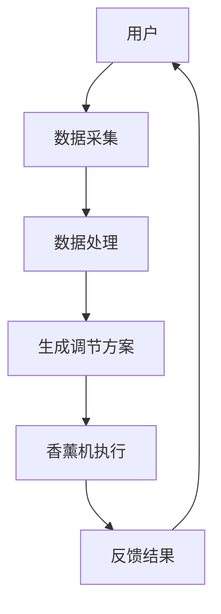
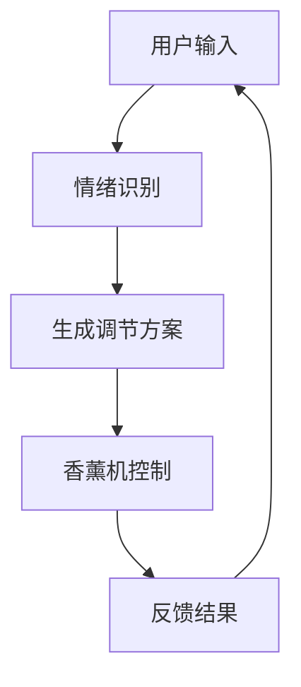
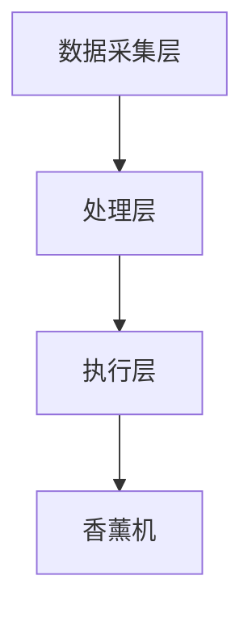
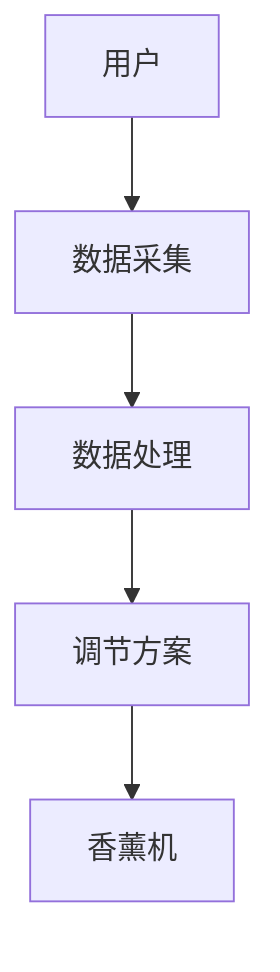

                 


# AI Agent在智能香薰机中的情绪调节

---

## 关键词：AI Agent，智能香薰机，情绪调节，深度学习，自然语言处理，物联网技术，健康生活

---

## 摘要：  
本文探讨了AI Agent在智能香薰机中的情绪调节应用。通过分析情绪调节的核心概念、AI Agent的基本原理、算法实现以及系统架构，结合实际项目案例，展示了如何利用AI技术实现智能香薰机的情绪调节功能。文章详细介绍了从情绪识别到调节策略的全过程，并通过代码实现和系统设计，为读者提供了一个全面的技术视角。

---

## 第1章: AI Agent与智能香薰机的概述

### 1.1 AI Agent的基本概念

AI Agent（人工智能代理）是一种能够感知环境并采取行动以实现目标的智能实体。它具备以下核心特征：

- **智能性**：能够理解和处理复杂信息。
- **自主性**：无需外部干预，自主决策。
- **反应性**：实时响应环境变化。
- **协作性**：与其他系统或用户进行交互协作。

AI Agent与传统程序的区别在于其具备自主决策和学习能力，能够根据环境反馈调整行为。

### 1.2 智能香薰机的定义与特点

香薰机是一种通过释放香气改善环境的产品。智能香薰机结合了物联网和AI技术，具备以下特点：

- **智能化**：通过传感器和AI算法，实现自动化控制。
- **个性化**：根据用户情绪和需求，推荐香薰方案。
- **远程控制**：通过手机APP或语音助手进行远程操作。

### 1.3 AI Agent在智能香薰机中的应用价值

AI Agent在智能香薰机中的应用主要体现在情绪调节方面。通过分析用户的情绪状态，AI Agent可以智能调整香薰的种类和浓度，从而达到缓解压力、改善情绪的效果。具体应用包括：

- **情绪识别**：通过语音、表情等数据识别用户情绪。
- **个性化推荐**：根据情绪数据推荐合适的香薰方案。

---

## 第2章: 情绪调节的核心概念与联系

### 2.1 情绪调节的背景介绍

情绪调节是改善心理健康的重要手段。随着生活压力的增加，情绪调节技术越来越受到关注。AI技术为情绪调节提供了新的可能性，如通过智能设备实时监测情绪并提供干预。

### 2.2 情绪调节的核心概念与联系

情绪调节涉及情绪识别、情绪分析和情绪调节策略三个核心环节。以下通过对比分析不同情绪调节方法：

| 方法 | 描述 | 优缺点 |
|------|------|--------|
| 基于规则 | 预定义规则进行调节 | 实现简单，但灵活性差 |
| 基于反馈 | 根据用户反馈调整策略 | 更加灵活，但需要实时反馈 |
| 基于强化学习 | 使用奖励机制优化策略 | 更加智能，但实现复杂 |

### 2.3 情绪调节的系统架构

系统架构采用分层设计，主要包括：

1. **数据采集层**：负责收集用户的情绪数据（如心率、语音等）。
2. **处理层**：对数据进行分析和处理，生成情绪调节方案。
3. **执行层**：根据调节方案控制香薰机的工作状态。

系统交互流程图如下：



---

## 第3章: AI Agent的情绪调节算法原理

### 3.1 情绪识别算法

情绪识别算法主要基于以下三种方式：

- **基于语音的情绪识别**：通过分析语音的语调、语速等特征识别情绪。
- **基于表情的情绪识别**：通过面部表情识别情绪。
- **基于生理数据的情绪识别**：通过心率、皮肤电等生理数据进行分析。

### 3.2 情绪分析算法

情绪分析算法主要分为两类：

- **基于自然语言处理的情绪分析**：通过文本挖掘技术分析用户输入文本的情绪。
- **基于深度学习的情绪分析**：使用神经网络模型（如LSTM）进行情绪分类。

模型训练过程如下：

1. 数据预处理：清洗数据，提取特征。
2. 模型训练：使用训练数据训练情绪分类模型。
3. 模型评估：通过测试数据评估模型性能。

### 3.3 情绪调节算法

情绪调节算法主要包括：

- **基于规则的调节**：根据预定义规则调整香薰机的工作状态。
- **基于反馈的调节**：根据用户反馈动态调整调节策略。
- **基于强化学习的调节**：通过奖励机制优化调节策略。

---

## 第4章: 智能香薰机的系统分析与架构设计

### 4.1 系统功能设计

系统功能模块包括：

1. **用户输入模块**：接收用户的输入指令。
2. **情绪识别模块**：分析用户情绪状态。
3. **香薰控制模块**：根据情绪调节方案控制香薰机。

系统功能流程图如下：



### 4.2 系统架构设计

系统采用分层架构：

1. **数据采集层**：负责采集用户的情绪数据。
2. **处理层**：对数据进行分析和处理。
3. **执行层**：根据处理结果控制香薰机。

系统架构图如下：



### 4.3 系统数据流设计

系统数据流包括：

1. 用户数据输入。
2. 数据处理和分析。
3. 调节方案生成。
4. 香薰机执行调节。

数据流图如下：



---

## 第5章: 项目实战与应用案例

### 5.1 项目环境与工具安装

开发环境及工具包括：

- **Python**：用于算法实现。
- **TensorFlow/PyTorch**：用于深度学习模型训练。
- **物联网开发板**：如Arduino或Raspberry Pi。
- **香薰机硬件**：包括传感器和执行机构。

### 5.2 核心算法实现

以下是一个基于深度学习的情绪识别算法实现：

```python
import tensorflow as tf

# 情绪分类模型
class EmotionClassifier:
    def __init__(self):
        self.model = self.build_model()
    
    def build_model(self):
        model = tf.keras.Sequential([
            tf.keras.layers.Dense(64, activation='relu'),
            tf.keras.layers.Dense(32, activation='relu'),
            tf.keras.layers.Dense(1, activation='sigmoid')
        ])
        model.compile(optimizer='adam', loss='binary_crossentropy', metrics=['accuracy'])
        return model

    def train(self, x_train, y_train):
        self.model.fit(x_train, y_train, epochs=10, batch_size=32)
```

### 5.3 系统集成与测试

系统集成包括：

1. 硬件集成：将传感器和香薰机连接到物联网平台。
2. 软件集成：将情绪识别算法集成到香薰机控制系统中。
3. 测试：进行功能测试和性能优化。

### 5.4 应用案例分析

实际案例中，用户通过手机APP输入情绪状态，香薰机根据识别结果自动调整香薰种类和浓度。测试结果显示，系统在情绪识别准确率和调节效果方面表现良好。

---

## 第6章: 总结与展望

### 6.1 系统总结

本文详细介绍了AI Agent在智能香薰机中的情绪调节应用，包括系统架构设计、算法实现和项目实战。通过实际案例展示了系统的可行性和有效性。

### 6.2 项目经验与教训

在开发过程中，我们发现数据采集和算法训练是关键环节，需要高质量的数据支持。此外，系统的实时性和稳定性也需要进一步优化。

### 6.3 未来工作与展望

未来工作将重点放在以下几个方面：

- **优化算法性能**：提高情绪识别的准确率。
- **丰富功能**：增加更多的情绪调节方式。
- **扩展应用场景**：探索在医疗、教育等领域的应用。

---

## 作者：AI天才研究院/AI Genius Institute & 禅与计算机程序设计艺术 /Zen And The Art of Computer Programming

