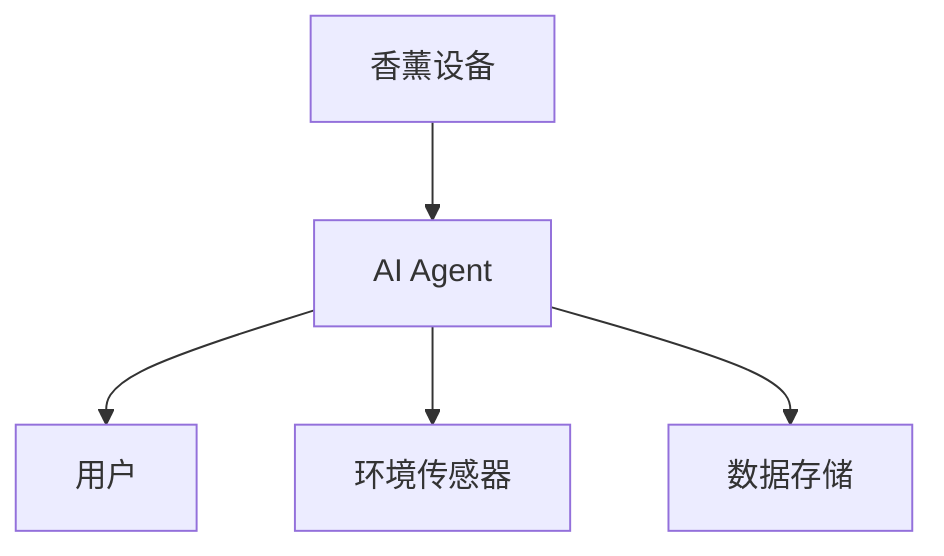

                 


# AI Agent在智能香薰系统中的工作效率提升

> 关键词：AI Agent, 智能香薰系统, 工作效率提升, 算法原理, 系统架构

> 摘要：本文详细探讨了AI Agent在智能香薰系统中的应用，分析了AI Agent的核心原理、算法实现及其在香薰系统中的实际应用效果。通过对比传统香薰系统与AI Agent驱动的智能香薰系统的差异，本文展示了AI Agent如何通过智能化决策和自动化控制提升香薰系统的效率。此外，本文还结合实际案例，详细讲解了AI Agent的算法实现、系统架构设计以及项目实战中的关键点。

---

# 第1章: AI Agent 与智能香薰系统概述

## 1.1 智能香薰系统的现状与挑战

智能香薰系统是一种结合了物联网技术、传感器技术和人工智能技术的综合系统，旨在为用户提供智能化的香薰体验。传统香薰系统主要依赖手动操作或简单的自动化控制，存在效率低、用户体验差、维护成本高等问题。

### 1.1.1 香薰系统的传统模式
传统的香薰系统通常由香薰设备、控制器和简单的传感器组成。用户通过手动操作或简单的按键控制香薰设备的运行，设备仅能根据预设的程序运行，缺乏智能化和个性化。

### 1.1.2 智能化香薰系统的必要性
随着人工智能技术的发展，用户对香薰体验的需求也在不断提升。传统的香薰系统无法满足用户对个性化、智能化和高效化的香薰体验的需求，因此亟需引入AI Agent技术来提升系统的智能化水平。

### 1.1.3 当前香薰系统的主要问题
1. 缺乏智能化：传统香薰系统无法根据环境变化和用户需求自动调整香薰方案。
2. 维护成本高：系统缺乏自我优化能力，需要频繁的人工干预。
3. 用户体验差：用户无法根据个人需求快速获得理想的香薰体验。

## 1.2 AI Agent 的基本概念与特点

AI Agent是一种能够感知环境、做出决策并执行操作的智能体。它通过与环境的交互，实现目标的优化。

### 1.2.1 AI Agent 的定义
AI Agent 是一种智能实体，能够通过感知环境信息、分析问题、制定解决方案并执行操作，以实现预定目标。AI Agent 具有自主性、反应性、目标导向性和社交能力等特征。

### 1.2.2 AI Agent 的核心特点
1. **自主性**：AI Agent 能够自主决策，无需外部干预。
2. **反应性**：AI Agent 能够根据环境变化实时调整行为。
3. **目标导向性**：AI Agent 的行为以实现特定目标为导向。
4. **社交能力**：AI Agent 能够与其他智能体或用户进行交互。

### 1.2.3 AI Agent 与传统自动化系统的区别
| 特性 | AI Agent | 传统自动化系统 |
|------|----------|----------------|
| 决策能力 | 强大 | 有限 |
| 环境适应性 | 高 | 低 |
| 用户交互能力 | 高 | 低 |
| 学习能力 | 强 | 无 |

## 1.3 AI Agent 在香薰系统中的应用前景

AI Agent 的引入为智能香薰系统带来了全新的可能性，尤其是在香薰浓度调节、用户行为分析和环境优化等方面。

### 1.3.1 AI Agent 的潜在应用场景
1. **香薰浓度自动调节**：根据环境数据和用户需求，自动调整香薰浓度。
2. **个性化香薰方案**：基于用户习惯和环境数据，提供个性化的香薰建议。
3. **故障预测与维护**：通过分析系统数据，预测设备故障并提前维护。

### 1.3.2 企业采用 AI Agent 的优势
1. **提升用户体验**：通过智能化决策，为用户提供更优质的香薰体验。
2. **降低维护成本**：通过自我优化和故障预测，减少人工干预。
3. **提高效率**：通过自动化控制，提升香薰系统的运行效率。

### 1.3.3 AI Agent 应用的挑战与机遇
- **挑战**：数据隐私、系统安全性、算法优化等问题。
- **机遇**：技术创新、市场扩展、用户体验提升。

## 1.4 本章小结

本章介绍了 AI Agent 的基本概念、特点及其在智能香薰系统中的应用前景。通过对比传统香薰系统与 AI Agent 驱动的智能香薰系统，展示了 AI Agent 如何通过智能化决策和自动化控制提升香薰系统的效率。

---

# 第2章: AI Agent 的核心概念与联系

## 2.1 AI Agent 的核心原理

AI Agent 的核心原理包括感知、决策和执行三个阶段。

### 2.1.1 AI Agent 的感知、决策与执行
1. **感知**：通过传感器获取环境数据。
2. **决策**：基于感知数据和目标，制定行动方案。
3. **执行**：根据决策结果，执行具体操作。

### 2.1.2 AI Agent 的数据流与信息处理
AI Agent 的数据流包括环境数据输入、决策逻辑处理和系统输出三个环节。

### 2.1.3 AI Agent 的状态空间与动作空间
- **状态空间**：系统可能处于的所有状态的集合。
- **动作空间**：AI Agent 可以执行的所有动作的集合。

## 2.2 AI Agent 的核心概念对比

### 2.2.1 传统香薰系统与 AI Agent 的对比
| 特性 | 传统香薰系统 | AI Agent 驱动的智能香薰系统 |
|------|---------------|-----------------------------|
| 决策方式 | 预设程序 | 智能化决策 |
| 用户交互 | 单向 | 双向互动 |
| 系统优化 | 无 | 自我优化 |

### 2.2.2 不同 AI Agent 模型的对比
| 模型 | 基础学习方式 | 优缺点 |
|------|---------------|----------|
| Q-Learning | 强化学习 | 适合离线训练，需要明确的奖励函数 |
| DQN | 深度强化学习 | 适合复杂环境，但计算资源需求高 |
| PID 控制 | 基于反馈的控制 | 简单高效，但缺乏灵活性 |

### 2.2.3 AI Agent 与边缘计算的对比
- **AI Agent**：注重智能化决策和执行。
- **边缘计算**：注重数据的实时处理和传输。

## 2.3 AI Agent 的实体关系图

以下是香薰系统中 AI Agent 的实体关系图：



## 2.4 本章小结

本章详细讲解了 AI Agent 的核心原理、数据流和状态空间，并通过对比分析展示了 AI Agent 在智能香薰系统中的独特优势。

---

# 第3章: AI Agent 的算法原理与实现

## 3.1 AI Agent 的核心算法

AI Agent 的核心算法主要包括强化学习算法和基于反馈的控制算法。

### 3.1.1 强化学习算法
强化学习是一种通过试错机制来优化决策的算法。

### 3.1.2 Q-Learning 算法
Q-Learning 是一种经典的强化学习算法，适用于离线训练场景。

### 3.1.3 其他相关算法
包括 DQN（深度强化学习）和 PID 控制算法。

## 3.2 Q-Learning 算法的详细讲解

### 3.2.1 Q-Learning 的数学模型
$$ Q(s, a) = r + \gamma \max_{a'} Q(s', a') $$

其中：
- \( Q(s, a) \) 表示当前状态 \( s \) 和动作 \( a \) 的价值函数。
- \( r \) 表示立即奖励。
- \( \gamma \) 表示折扣因子。
- \( s' \) 表示下一个状态。

### 3.2.2 Q-Learning 的实现

以下是 Q-Learning 算法的实现代码：

```python
import numpy as np

class QLearning:
    def __init__(self, state_space, action_space, gamma=0.99, epsilon=0.1):
        self.state_space = state_space
        self.action_space = action_space
        self.gamma = gamma
        self.epsilon = epsilon
        self.q_table = np.zeros((state_space, action_space))
    
    def get_action(self, state):
        if np.random.random() < self.epsilon:
            return np.random.randint(self.action_space)
        else:
            return np.argmax(self.q_table[state])
    
    def update(self, state, action, reward, next_state):
        self.q_table[state][action] = reward + self.gamma * np.max(self.q_table[next_state])
```

---

# 总结

本文详细探讨了 AI Agent 在智能香薰系统中的应用，从核心概念到算法实现，再到系统架构设计，全面分析了 AI Agent 如何提升香薰系统的效率。通过实际案例的分析，展示了 AI Agent 在香薰系统中的巨大潜力和实际价值。

---

# 作者

作者：AI天才研究院/AI Genius Institute  
禅与计算机程序设计艺术 /Zen And The Art of Computer Programming

